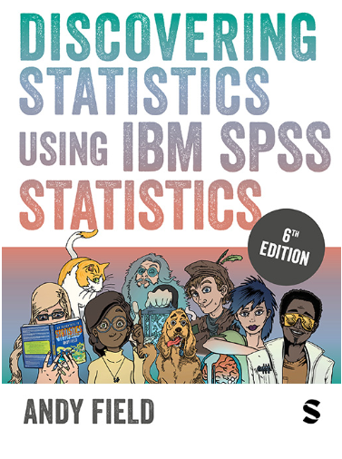
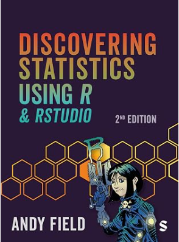
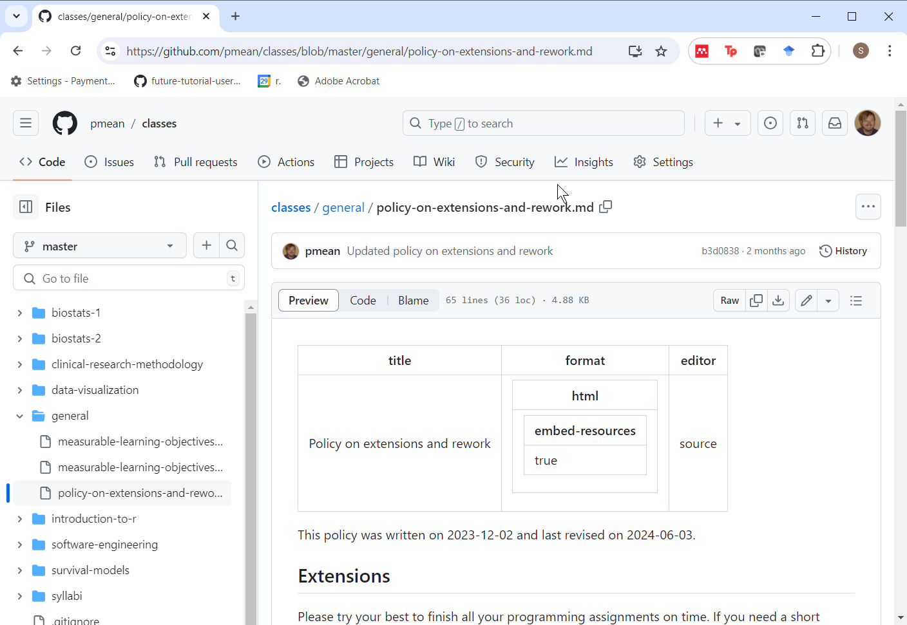

## Welcome to the class

-   Three sections
    -   0001, Synchronous Zoom meetings on Tuesdays
    -   0002, Asynchronous
    -   0003, International students
-   Introductions
    -   Ricardo Moniz
    -   Suman Sahil

::: {.notes}
There are three sections in the class. 

Section 0001 is a synchronous online class with lectures delivered via Zoom on Tuesdays from 1:00pm to 3:45pm. Students in this section are required to attend that class. If you are in this section, you must show up on Tuesday afternoons. Attendance will be taken. Two or more unexcused absences will require a discussion with the instructor and remedial actions may need to be taken.

Section 0002 is an asynchronous online class where you watch videos of the zoom session. Students in this section have the option of attending the Tuesday 1pm Zoom sessions, if their work schedule permits.

Section 0003 is a synchronous online class like section 0001 with the additional requirement of weekly sign-ins. The weekly sign-in meets an important requirement of some international students. Other than the sign-in, the class is identical to the synchronous online class.

All three sections are combined in Canvas to a single site. This makes it easier for me to make announcements, do grading, etc. Just because the Canvas site says "2024FS-MEDB-5501-0001" does not mean that you are in the wrong Canvas site and it does not mean that you are registered for the wrong class. We're all one big family from the perspective of Canvas. Only the attendance requirements differ.
:::
  
## Requirements of all students

-   Attend Tuesday Zoom or watch video of Tuesday Zoom
-   Read book chapter
-   Optional review session on Zoom on Fridays
-   Complete all assignments by Monday at 11:59pm

::: {.notes}
I'll record the Tuesday 1pm meeting and make it available on Canvas by noon on Wednesday for the asynchronous students.

Everyone should also read the appropriate Chapter from the book.

Everyone is invited to an optional review session on Fridays from 10:30am to 11:30am. You can ask questions, or just sit back and listen to questions that others may have. If you have work commitments on Friday mornings, I am still happy to meet with you at any other reasonable time.

The homework assignments, quizzes, and discussion boards are due by 11:59pm on Mondays.
:::

## Attendance

-   Synchronous students
    -   MUST attend Tuesday Zoom sessions.
    -   can also review the recordings
-   Asynchronous students
    -   watch the Tuesday recordings
    -   or attend some of the Tuesday Zoom sessions
    -   or both
-   Failure to attend is a problem

::: {.notes}
Attendance at the Tuesday Zoom sessions is a requirement for all synchronous students. You can also watch part or all of the recordings of the Tuesday Zoom sessions if you like.

Asynchronous students have an option that synchronous students do not.

For synchronous students to attend the Tuesday Zoom sessions is a problem. For asynchronous students, failure to either attend or watch the videos is a problem. If you have work commitments, health issues, or personal issues that prevent you from meeting the attendance requirements, you must contact us, preferably beforehand.
:::

## Encouraging class participation

-   Synchround students have more opportunities
    -   Raised hand icon
    -   Chat window
    -   Just unmute yourself

::: {.notes}
If I had a fault as a teacher, it would be that I talk too much. Not that the stuff I talk about is bad, but it's difficult to get good student interactions.

In a zoom session, it's hard. But certainly those of you who are watching asynchronously to my videos, it's even more difficult. We certainly encourage you to use the discussion boards and there's some interaction there.

But those of you who are live, you have a special opportunity. Anytime something's confusing, raise your hand. There's a little icon where you can raise your hand.

Or post something in the chat box. I have the chat window open.

Or just unmute yourself and start talking.

Uh, I will tell you right now that, uh, a lot of students are bashful and they think, uh, no one cares about my question. And that's almost certainly false, because when someone asks a question, it's usually 2 or 3 other people who have the exact same question, but they haven't figured out how to articulate it, or they're even shyer than you are.

So please, please, if you are here, live, um, ask questions.

Those of you who are listening asynchronously, you can't ask questions during the video, but you can show up at the help sessions on Friday morning.

You can post questions on the discussion board. We always ask for feedback on the discussion board

Or just drop an email if you need to ask a question. I am happy and Suman is happy to meet with you at any time to help you with this class.

My favorite part of the job is interacting with students and you don't get to do that in an asynchronous online class very much.

Even with, uh, those people listening live with zoom--Zoom's different.

When you are talking on Zoom, you can't look around the room, you can't, walk around, you can't make grand gestures. That doesn't work. What's worse is that you miss a lot of the capabilities of reading the room--noticing when students are confused. 

So don't be afraid to ask for help. I hate to say this. The students that I like the best are the ones that struggle the most. Because I get to know them. And I get to interact with them. And it's fun. Helping people through something difficult is something I really enjoy.

The students who are just breezing the class never have any problems, I'm glad for them. But they are total strangers to me.

Okay. So do not be bashful about asking for help.
:::

## Don't be scared about R

-   Almost all computer assignments will use the R programming language
    -   Early examples will be "sppon-fed"
    -   R is easier than you might think.
-   Don't expect miracles by the end of this class
    -   You will not be an expert with R
    -   You will be more comfortable with R

::: {.notes}

I've always get comments about being a little scared about having to run this R program. I've never programed an hour before. 

Suman and I will make it easy.
The first time we tried this I was a little bit worried, but it went smoothly. It is not that hard to learn how to program in R.

The first few assignments go very, very slowly and there's very little that you have to do.

You just  make some minor modifications to an existing program.

Gradually, you will start to make bigger modifications.

At the end of the class, you will not be an expert in R, but you will be more comfortable with it and be able to learn more on your own.
:::

## What about MEDB 5507, Introduction to R?
-   That class places emphasis on data management
-   This class places emphasis on data analysis

::: {.notes}
I teach another class, MEDB 5507, Introduction to R. I want to emphasize that there is not too much overlap in these two classes. MEDB 6607 places the emphasis on programming and data management. MEDB 5501 places the emphasis on data analysis and data interpretation.
:::

## Your book

::: {.notes}
There's a book that we have, written by Andy Field, a real nice guy. The book is written a little bit flippantly and that turned some people off.

I've been told by people who know more than I do that when you write really outrageously and come up with all these bizarre scenarios that it makes things more memorable. Andy Field does outrageous better than anyone.

It's a bit unfortunate because this book shows all the examples in SPSS. There is an earlier edition that uses R. You are welcome to use that book instead. It is organized a bit differently and misses a few topics, but the book is still good enough.

Either edition is very good. I can't take credit for this. The book was the one recommended by the person who used to teach this class, Monica Gaddis.

She liked it because it is very comprehensive. It doesn't cover everything, but it comes a lot closer than just about any other book I have seen. Monica described it as the only statistics book you'll ever need.

And she's not too far from the truth on that. If you are doing something statistical, you're likely to find it in this book.

Now there will be times when I disagree with how Andy Field presents things. He loves effect sizes for example and I hate them. That's okay. His voice is often more mainstream than mine. 

I am not bashful about expressing my opinions, but I will let you know when other experts, especially Andy Field, have a different opinion.
:::

## Stop the presses!!!

::: {.notes}
Stop the presses! When I was getting an image file of the book cover for Andy Field's book, I noticed that there is a brand new version that just came out in July of this year. If you have not yet bought the SPSS version of Andy Field's book, buy this one instead. I don't have a copy yet myself, but it looks like it will be a winner.
:::

## Assignments

-   Due Mondays at 11:59pm
-   Short term exensions are easy.

::: {.notes}
Assignments will include homework submissions, quizzes, and discussion boards
:::

## This class is in transition

-   Taught for many years by Dr. Monica Gaddis
-   My third time teaching this class
-   Major changes
    -   Software agnosticism
        -   In class switch from SPSS to R
    -   Suman Sahil will co-teach and cover programming in R
    -   Discussion boards ask for feedback
    -   Proposed exam questions
  
::: {.notes}
I'm excited at the opportunity to teach this class, but I am also a bit scared. The topics in this class are relatively easy, but teaching them well is not so easy.

This class has been taught for many years by Dr. Monica Gaddis. She is an excellent teacher, but she retired this summer. I have a lot of respect for her and have kept a lot of her material. There are some important differences, however. I am not a wall flower, and I have a few ideas that might supplement an already good class. 

I believe in software agnosticism. You should use whatever software you thing is best for you. Use the software that you expect to use in the real world after you graduate. It's more work for me (and for Suman Sahil, who has to grade the various programs). Nevertheless, I want to make that effort because I should not presume to know what program is best for you and your budding career.

All the classroom examples will use R. If you use another program, expect to spend some time reading the documentation and figuring out how to convert the R code to code for your system. You can ask for assistance by email, during the help session if all the other questions are already answered, or by special appointment. I take great pride in knowing how to do things in a broad range of statistical software and should be able to help with most issues.

If you've never used any statistical software before, I would certainly encourage you to use R.

A second change is that I will include a brief feedback assignment after every module. I want to feedback on what you thought was most important, what you found most confusing, and what you might have liked to learn that wasn't in the lecture.

Don't spend a lot of time on the feedback. You are welcome to say something brief like nothing was confusing. If everything was confusing, that's fine also, but please feel free to show up at the Friday review session or set up a special appointment if this is the case.

You are also welcome to say something like "I agree with" and mention the name of a previous student.

I might make some other small changes over time.

There's a risk in making changes. It may create some inconsistencies between what I am asking you to do and what Dr. Gaddis covered in her videos. Use a bit of common sense, but if you are not quite sure about anything, please ask.
:::

## Why R

-   Faculty consensus
    -   Prepares you better for capstone/thesis work
    -   More likely to be used in your future job
    -   Integrates well with team based tools
-   R is not as difficult as claimed
    -   Work from existing templates
-   Python, SAS, Stata would have also been good choices
    -   You are welcome to use these if you like
    
::: {.notes}
Last year, I taught the class using SPSS and it was an okay choice. But some of the faculty raised concerns about leaving students ill prepared if they needed to do data analysis for a capstone project or thesis. SPSS is okay for introductory statistics, but falls short for the sort of work needed in a thesis.

While some jobs out in the real world will use SPSS, far more will use R. 

Most important, in my opinion, is that R integrates well with team-based tools like version control, cloud-based computing, distributed databases, and other methdologies that are being used more and more with programming teams.

You may have heard that R is a difficult language. R is not as difficult as some people may claim. It is being used successfully at a large number of universities in their Statistics and Data Science program. It is even used extensively in undergraduate classes.

Having said that, I have to admit that R is still not as easy to use as SPSS. I will try to lighten that burden by providing templates that will guide your coding throughout all of the assignments.

Now there are several good alternatives to R. Each has its advantages but also some disadvantages. It is not worth quibbling here. I've chaired a couple of panel discussion sessions at national Statistics conferences on this topic. My recommendation is to use what your boss uses. 

If you want to use something other than R, go for it! You'll have to do a bit of work on your own, but I will provide support as needed. I take great pride in being able to work with a broad range of statistical software systems.
:::

## Student learning objectives, 1 of 3

-   SLO1
    -   The graduate will be able to use statistics to analyze and interpret data.  They will understand the fundamentals of the field in the context of recognizing the effective use of data or information for the specific discipline(s). They will select and apply appropiate statistical procedures to the information. They will be able to analyze and accurately interpret of statistical result.

::: {.notes}
There are five student learning objectives that our department has committed to. We need to demonstrate to the university that anyone who graduates from our department has a particular set of capabilities. This class is one of several that provides you with these capabilities. 

The first student learning objective asks that you are capable of using statistics to analyze and interpret data. This is not the only class where you will develop this capability, of course. The key elements are selecting the statistical procedures, running those procedures, and writing about the statistical procedures, and the ability to run those procedures.

Note: the Student Learning Outcomes spreadsheet has three entries: Select, Write, and Run.
:::

## Student learning objectives, 2 of 3

-   SLO2
    -   The graduate will be able to design a testable research question or hypothesis. They will have adequate background knowledge about biological, biomedical, or population health contexts and problems including common research problems in order to generate a research question or hypothesis. They will be able to relate problems within and across levels of areas of the spectrum to bridge disciplines.

::: {.notes}
The second student learning objective is the ability to design a testable research question or hypothesis.

Note: the Student Learning Outcomes spreadsheet has one entry: Hypothesis.
:::

## Student learning objectives, 3 of 3

-   SLO5
    -   The graduate will be able to communicate scientific outcomes. This includes the ability to convey scientific methods and statistical findings, effectively field questions in an oral presentation format as well as in the preparation of thesis or capstone manuscripts.

::: {.notes}
The third and fourth student learning objectives are developed in other courses. The fifth (and last) learning objective is the ability to convey statistical findings and answer question in an oral presentation. This includes the ability to present your findings in a visual format.

Note: the Student Learning Outcomes spreadsheet has two separate entries: Results Visual and Results Write-up
:::
