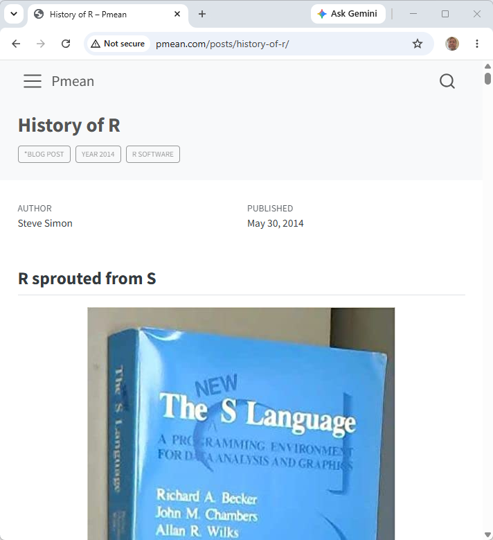

## History of R

::: {.notes}
I want to talk a little bit about the history of R. I think it's probably, a fault of old people. We're so obsessed about history because we live through so much of it. But it is important to understand where R came from or where SAS came from or SPSS or Python. If you understand those things, then you'll understand why they made choices they did and how they fit in today.
:::
