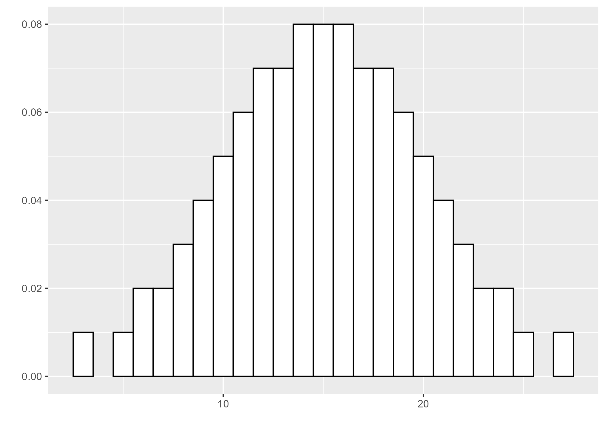
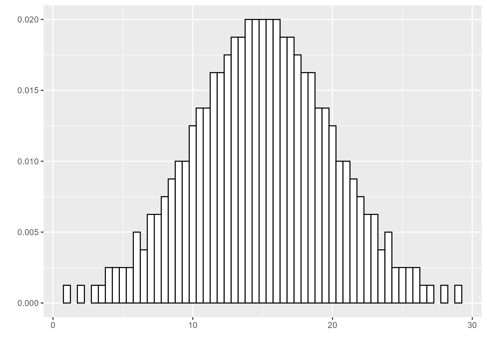
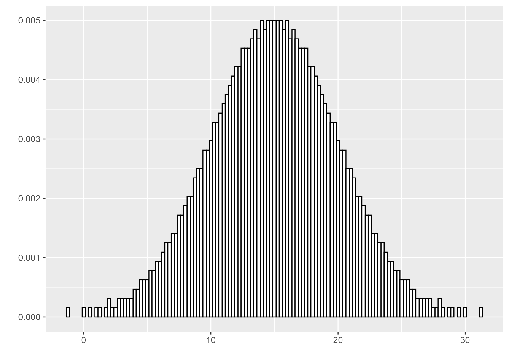
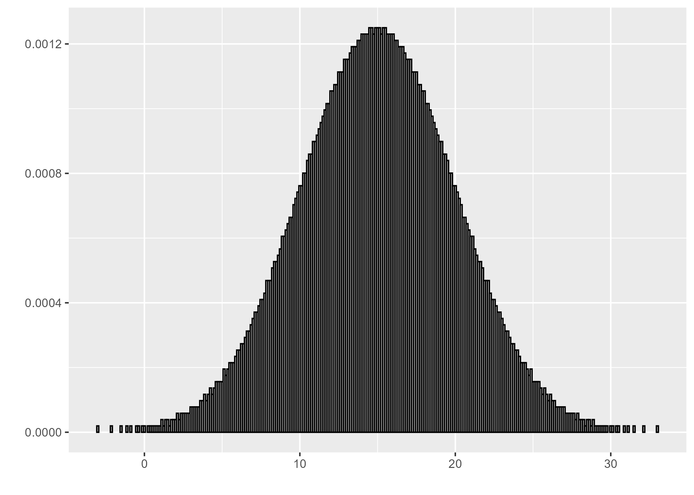
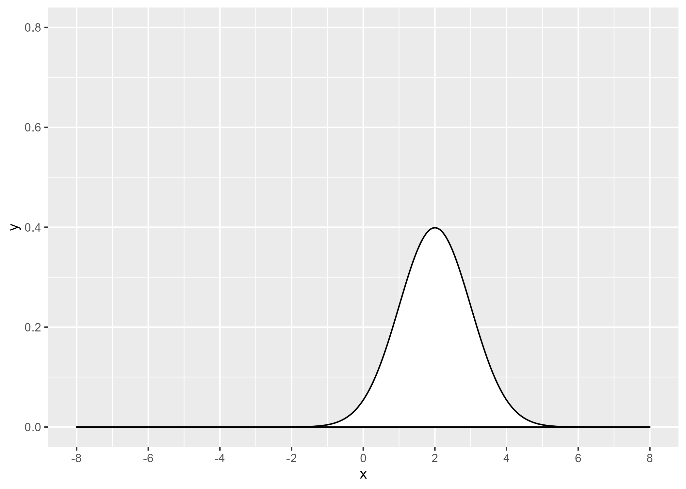
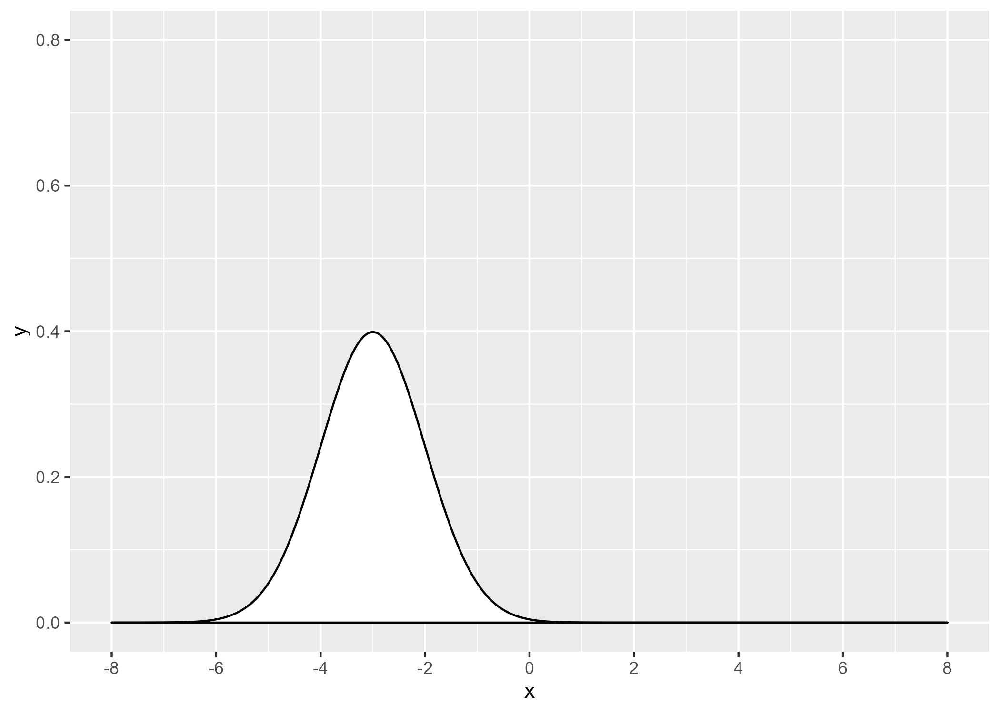
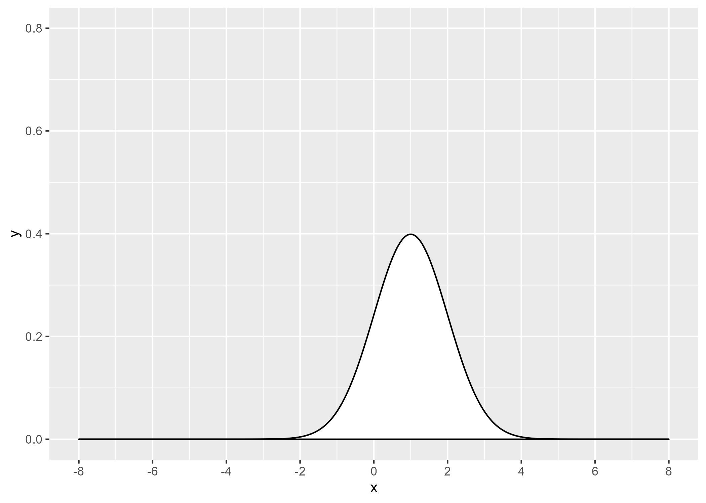
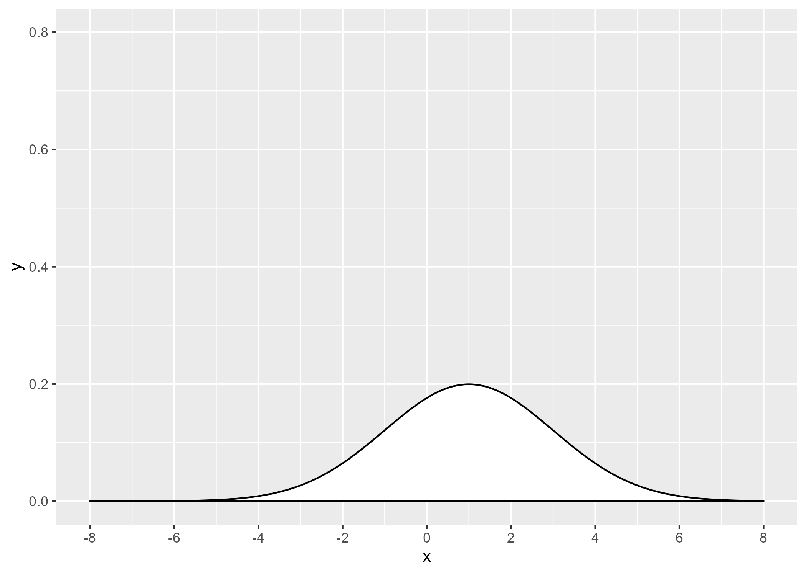
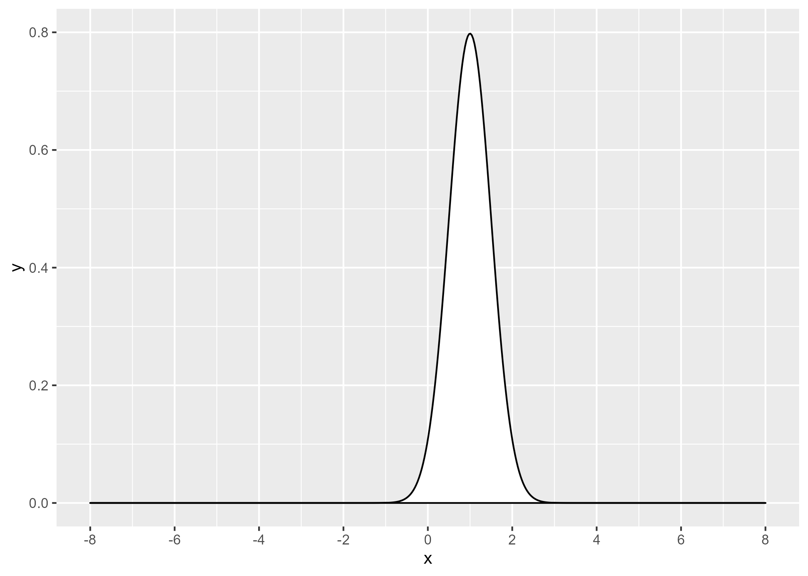
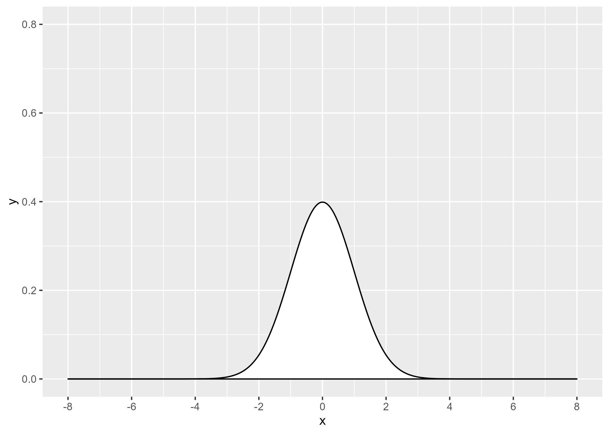

```{r}
#| label: 03-01-setup

library(tidyverse)
```

## The bell shaped curve

-   Does your variation follow a bell shaped curve?
-   Synonyms: normality, normal distribution
    -   Values in the middle are most common
    -   Frequencies taper off away from the center
    -   Symmetry on either side

::: notes
*Speaker notes*

Much variation in the real world follows a bell shaped curve, alternately called a normal distribution. You can assess whether you have a bell shaped curve using a histogram. Look for values in the middle being most common. The frequencies should taper off slowly as you moved away from the middle. The histogram should have symmetry. The left side of the histogram should be roughly equivalent to the right side of the histogram.
:::

## Bell-shaped curve is a limit, 1



## Bell-shaped curve is a limit, 2



## Bell-shaped curve is a limit



## Bell-shaped curve is a limit



## Overview

The normal distribution is an important component of most statistical analyses. The formula for the normal distribution is quite complex, 

$f(x; \mu, \sigma)=\frac{1}{\sigma\sqrt{2\pi}}e^{-\frac{(x-\mu)^2}{2\sigma^2}}$

but the shape is readily recognizable.

```{r setup-2}
#| echo: false
library(tidyverse)
```

```{r normal-bell}
#| echo: false
normal_bell <- function(mu=0, sigma=1) {
  x0 <- seq(-8, 8, length=500)
  y0 <- dnorm(x0, mu, sigma)
  normal <- data.frame(
    x = c(-8, x0, 8),
    y = c(0, y0, 0))
  ggplot(data=normal, aes(x, y)) +
    geom_polygon(
      fill="white",
      color="black") +
    expand_limits(y=c(0, 0.8)) +
    scale_x_continuous(breaks=2*(-4:4))
}
```

## Normal distribution with mu=2, sigma=1



## Normal distribution with mu=-3, sigma=1



## Normal distribution with mu=1, sigma=1



## Normal distribution with mu=1, sigma=2



## Normal distribution with mu=1, sigma=0.5



## Standard normal distribution (mu=0, sigma=1)



## Why concern yourself with the bell shaped curve?

-   You can characterize individual observations
-   You can characterize summary measures
