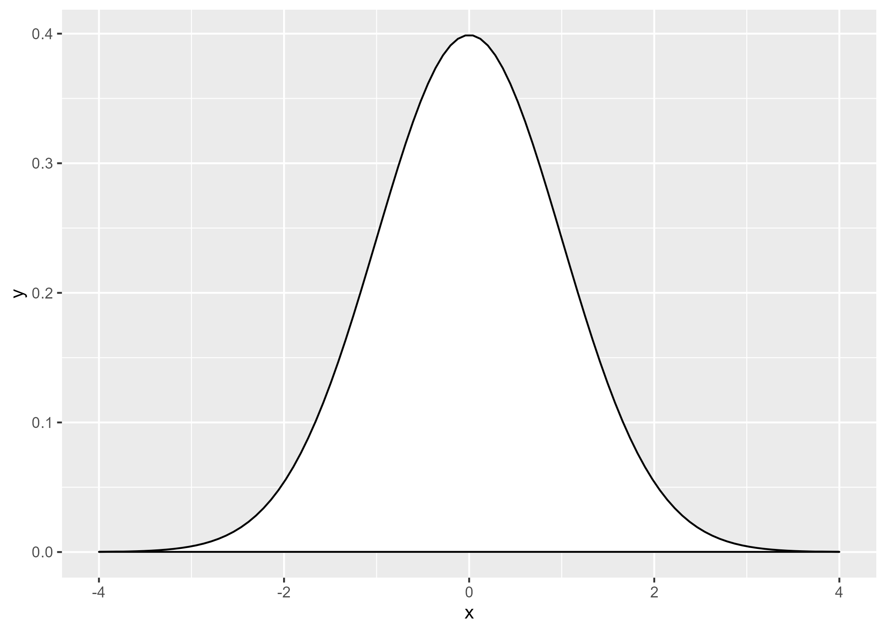
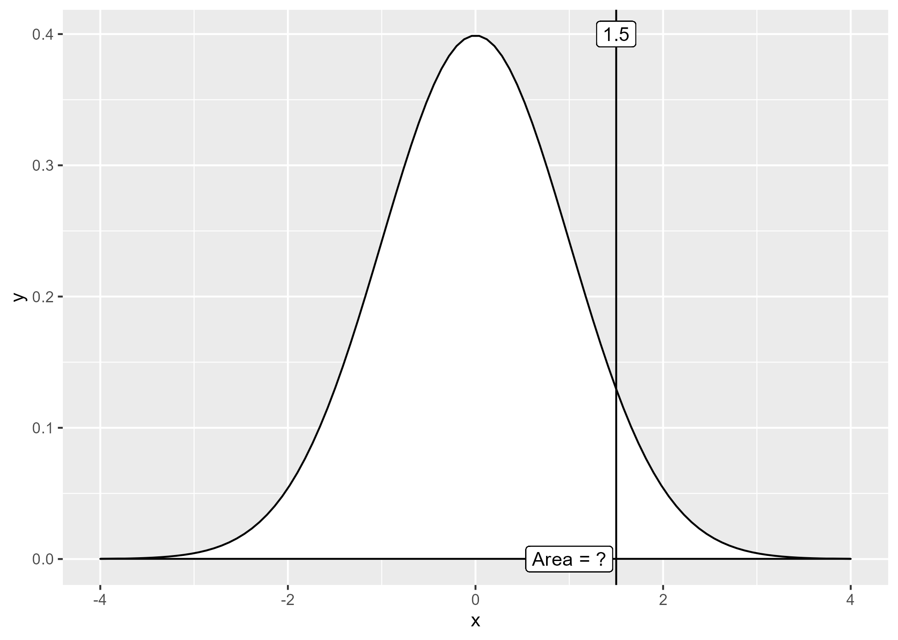
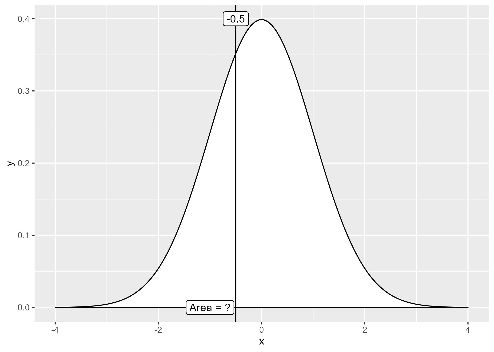
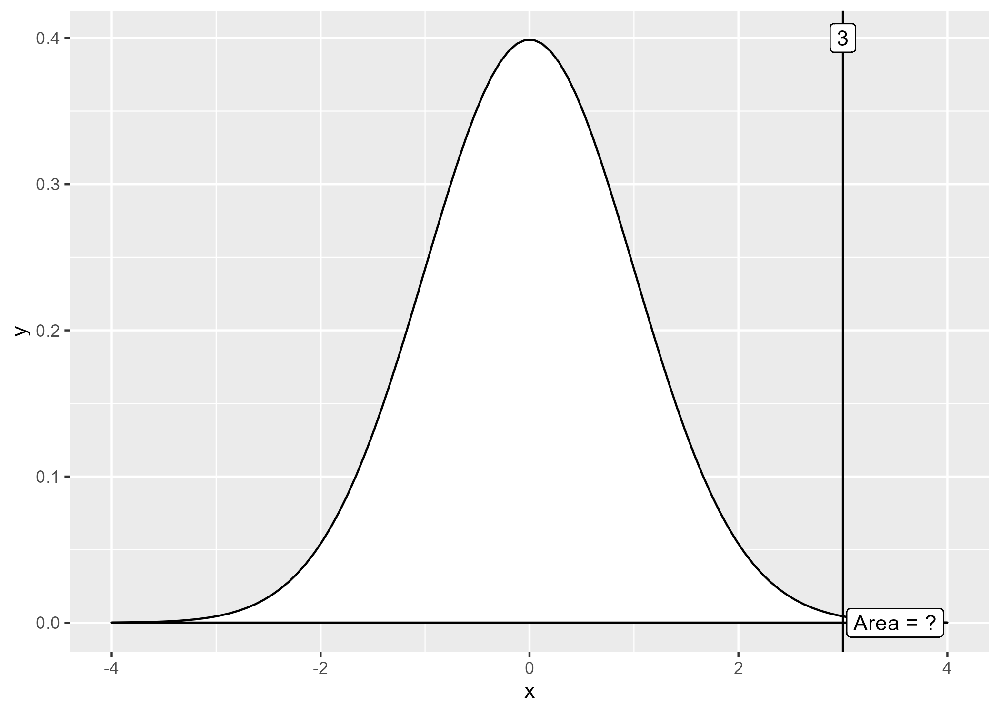
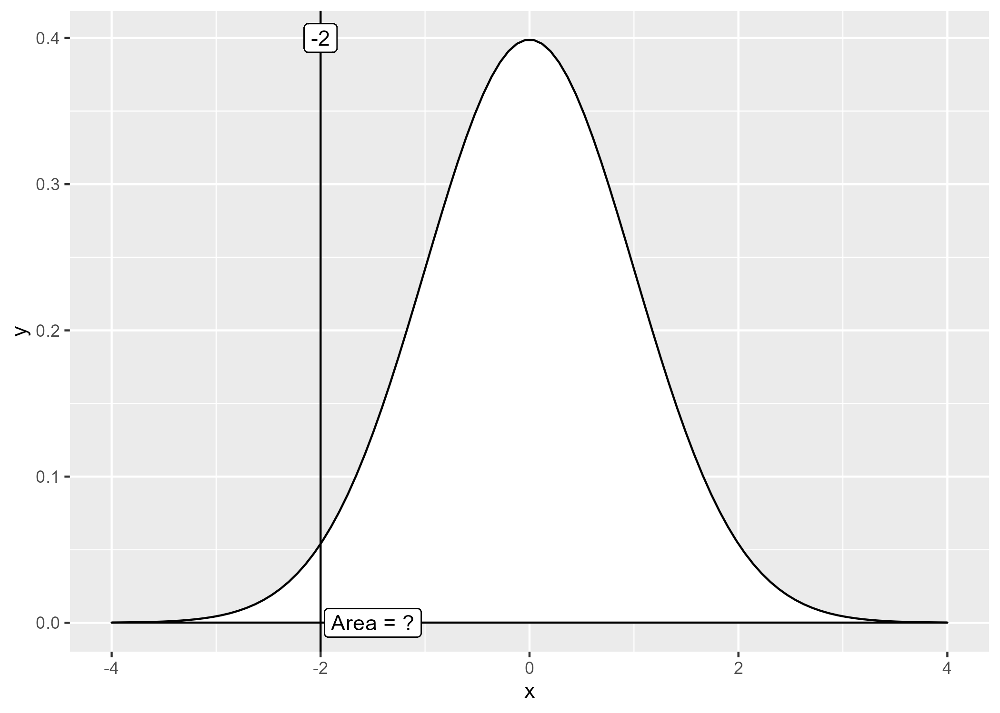
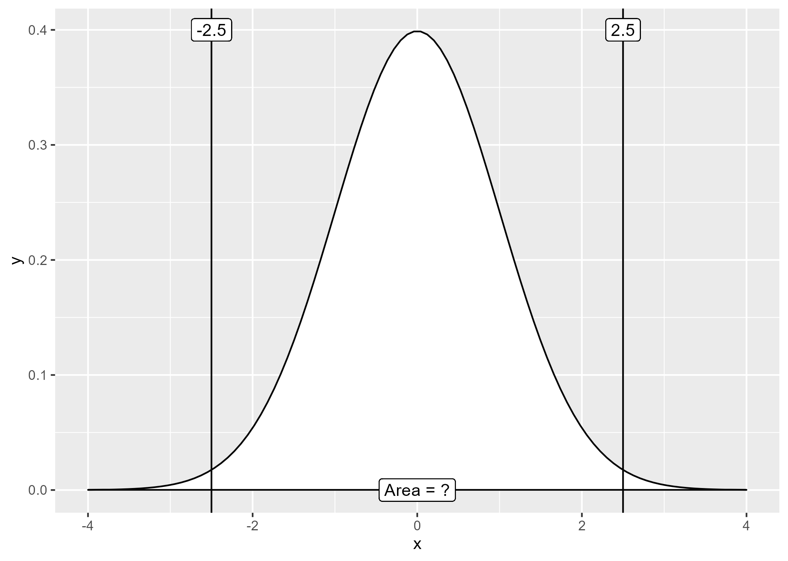
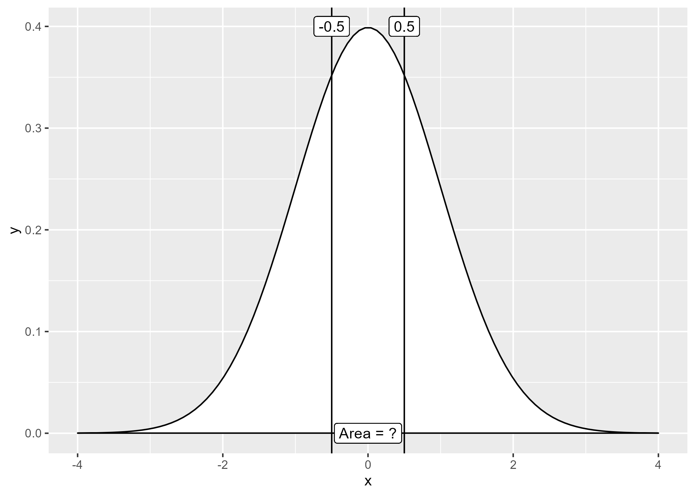
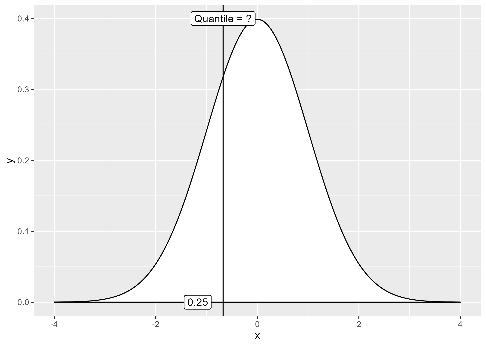
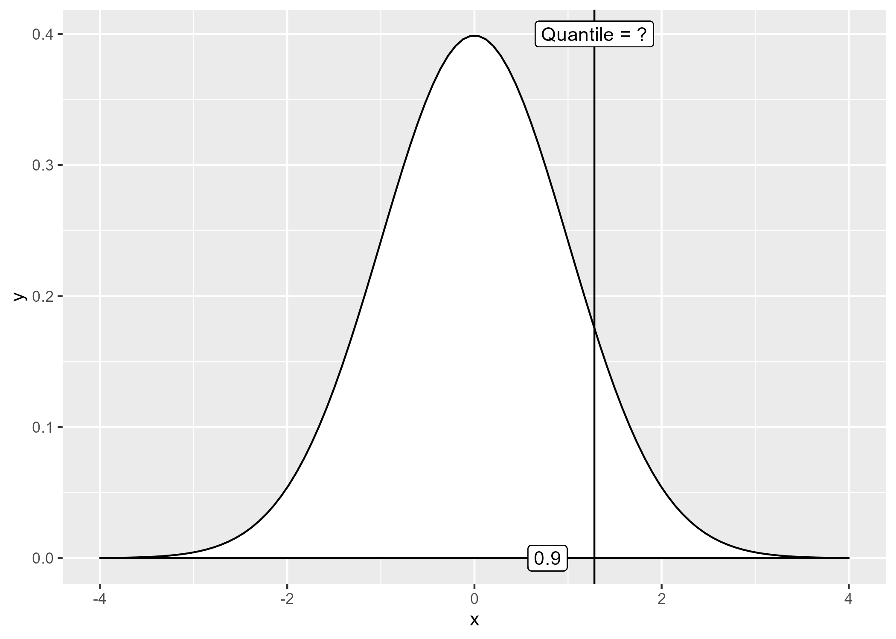
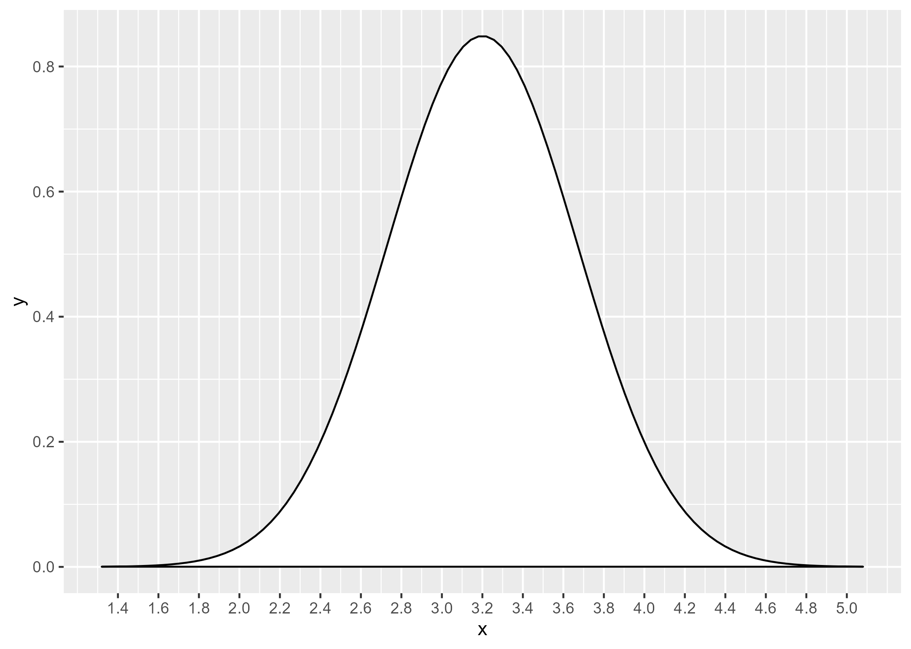

## The standard normal distribution, again



::: {.notes}
This is the standard normal distribution again. I changed the scaling a bit so it fills up most of the range. I want to show how to do some basic calculations for the standard normal distribution using this graph.
:::


## Using calculus to compute probabilities for a normal distribution

$P[a < X < b]=\int_{a}^{b}\big(\frac{1}{\sigma\sqrt{2 \pi}}e^{-\frac{(x-\mu)^2}{2\sigma^2}}\big)dx$

::: {.notes}
For those of you who know calculus, normal probabilities are computed using integration. In simpler terms, probabilities are represented by areas. 
:::

## Illustrating P[Z < 1.5]



::: {.notes}
The probability that a standard normal distribution is less than 1.5 is the area of the standard normal curve that lies to the left of 1.5.
:::

## Calculating P[Z < 1.5]

```{r}
#| label: p1
#| echo: true

pnorm(1.5)
```

::: {.notes}
The probability that a standard normal distribution is less than 1.5 is about 93%.
:::

## Illustrating P[Z < -0.5]



::: {.notes}
The probability that a standard normal distribution is less than -0.5 is the area of the standard normal curve that lies to the left of -0.5.
:::

## Calculating P[Z < -0.5]

```{r}
#| label: p2
#| echo: true

pnorm(-0.5)
```

::: {.notes}
Change the argument in the pnorm function to get the probabilty that a standard normal is less than -0.5.
:::

## Illustrating P[Z > 3]



::: {.notes}
To find a probabilty of being greater than a specific value, you need to compute the area to the right. This image shows what area corresponds to the probability that a standard normal is greater than 3.
:::

```{r}
#| label: p3
#| echo: true

1-pnorm(3)
```

::: {.notes}
The area to the right of 1 plus the area to the left of 1 has to equal the total probability. So the area to the right is 1 - the area to the left. The probability that a standard normal distribution is greater than 3 is about 0.1%.
:::

## Illustrating P[Z > -2]



::: {.notes}
Similarly, the probability for the right of -2 plus the area to the left equals 1. So just subtract the probability to the left from one.
:::

```{r}
#| label: p4
#| echo: true

1-pnorm(-2)
```

::: {.notes}
You calculate the area to the right of -2, subtract pnorm(-2) from 1. The probability that a standard normal is greater than -2 is about 98%.
:::

## Illustrating P[-2.5 < Z < 2.5]



::: {.notes}
The area between -2.5 and 2.5 is the area to the left of 2.5 minus the area to the left of -2.5.
:::

```{r}
#| label: p5
#| echo: true

pnorm(2.5)-pnorm(-2.5)
```

::: {.notes}
To get the probability that a standard normal falls between two number, calculate the difference between two pnorm results. The probability that a standard normal is betwen -2.5 and 2.5 is about 99%.
:::

## Illustrating P[-0.5 < Z < 0.5]



::: {.notes}
The area between -2.5 and 2.5 is the area to the left of 2.5 minus the area to the left of -2.5.
:::

```{r}
#| label: p5
#| echo: true

pnorm(0.5)-pnorm(-0.5)
```

::: {.notes}
To get the probability that a standard normal falls between two number, calculate the difference between two pnorm results. The probability that a standard normal falls between -0.5 and 0.5 is about 38%.
:::

## Illustrating the 25th percentile of a standard normal



::: {.notes}
The 25th percentile is the value such htatn 25% of the area is to the left and 75% is to the right.
:::

```{r}
#| label: p7
#| echo: true

qnorm(0.25)
```

::: {.notes}
To get the percentile, use the qnorm function. The 25th percentile of a standard normal distribution is -0.67.
:::

## Illustrating the 90th percentile of a standard normal



::: {.notes}
The 90th percentile is the value such that 90% of the area is to the left and 10% is to the right.
:::

```{r}
#| label: p8
#| echo: true

qnorm(0.9)
```

::: {.notes}
Compute the 90th percentile using qnorm(0.9). The 90th percentile of a standard normal distribution is 1.28.
:::

## Probabilities and percentiles for other normal distributions

-   If X is $N(\mu,\sigma), then$
    -   $P[X < a] = P[Z < \frac{a-\mu}{\sigma}]$
    -   $X_{p}=\mu+Z_{p}\sigma$

::: {.notes}
If you have a normal distribution with a mean other than 0 and a standard deviation other than 1, the probability that this normal distribution is less than a value "a" is the probability that a standard normal is less than (a minus mu) divided by sigma. Subtracting mu will move shift the value of a to be relative to zero instead of relative to mu. Dividing by sigma will stetch or squeeze the value of a to match a standard deviation of 1 instead of a standard deviation of sigma.

To get the pth percentile of a normal distribution with mean mu and standard deviation sigma, multiply the pth percentile of a standard normal by sigma and add mu. Multiplying by the standard deviation will stretch or squeeze the bell shaped curve, depending on whether the standard deviation is larger than or smaller than 1. Adding the mean shifts the bell shapped curve to the left or right, depending on whether the mean is less than zero or greater than zero.
:::

## Birthweight (kg) is N(\mu=3.2, \sigma=0.5)



## Probability birthweight > 4 kg

```{r}
#| label: bw1
#| echo: true

1-pnorm((4-3.2)/0.5)
```

::: {.notes}
To get the probability that a birthweight is greater than 4 kg, remember that greater than means area to the right and you must use 1-pnorm. You take the 4kg tartget, subtract the mean of 3.2 and divide by the standard deviation of 0.5. The probabilty of a big baby, more than 4 kilographs is about 5%.
:::

## 10th percentile for birthweight

```{r}
#| label: bw2
#| echo: true

4.2+qnorm(0.1)*0.5
```

::: {.notes}
To get the 10th percentile for birthweight, get the 10th percentile for the standard normal using the qnorm function, multiply by the standard deviation and then add the mean. The 10th percentile for birthweight is 3.6 kilograms.
:::
