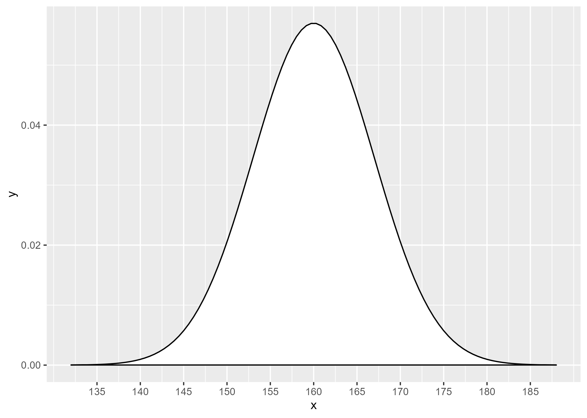

This programming assignment was written by Steve Simon on 2024-09-02 and is placed in the public domain.

"Normal curve for the height of 14 year old girls"

## Download programs

Download 

-   [simon-5501-03-demo.qmd][ref-demo]

[ref-demo]: https://github.com/pmean/classes/blob/master/biostats-1/03/src/simon-5501-03-fev.qmd

and store them in your src folder. Rename the file to use your last name.

## Download data

Also download the data file:

-   [fev.csv][ref-fev-csv]

[sim3]: https://github.com/pmean/data/blob/main/files/fev.csv

and store it in your data folder. You may wish to review the data dictionary

-   [fev.yaml][ref-fev-yaml]

[ref-fev-yaml]: https://github.com/pmean/data/blob/main/files/fev.yaml

## Question #1

The heights of 14 year old girls in centimeters, according to the World Health Organization, is normally distributed with a mean of 160 and a standard deviation of 7. This distirbution is shown below.

Calculate the 90th percentile for height. Provide a brief interpretation of this number that rounds the result and mentions the unit of measurment.

## Question #2

Use the fev dataset to assess the normality of ht. Draw two histograms--one with a small number of bars and another with a large number of narrow bars. Note that the binwidth valuess will not be the same those used for fev. Is your interpretation similar for both histograms?

## Question #3

Draw a normal probability plot for ht. Interpret this plot.

## Your submission

-   Save the output in html format
-   Convert it to pdf format.
-   Make sure that the pdf file includes
    -   Your last name
    -   The number of this course
    -   The number of this module
-   Upload the file

## If it doesn't work

Please review the [suggestions if you encounter an error page][sim3].

[sim3]: https://github.com/pmean/classes/blob/master/general/suggestions-if-you-encounter-an-error.md

