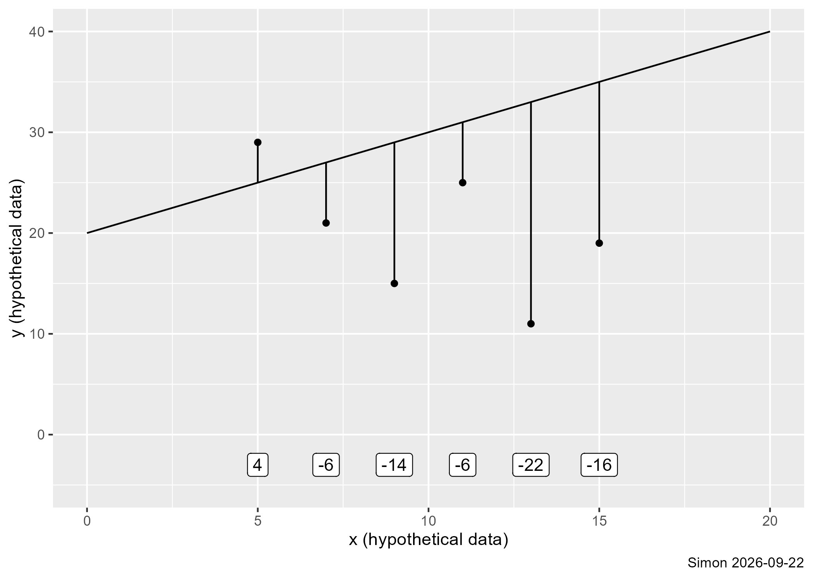
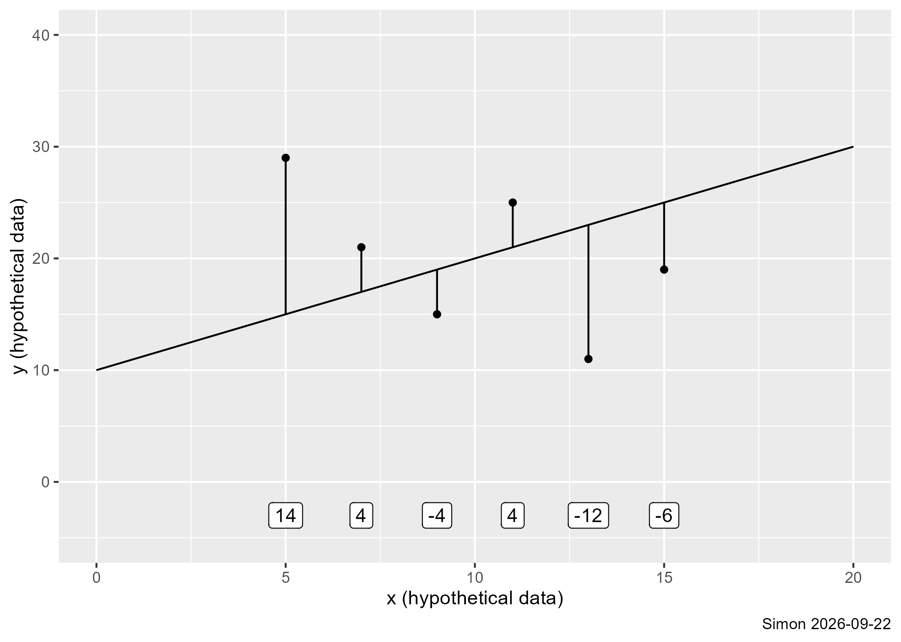
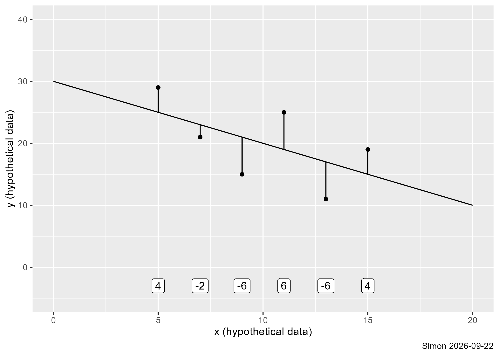

## The population model

-   $Y_i=\beta_0+\beta_1 X_i + \epsilon_i,\ i=1,...,N$
    -   $\epsilon_i$ is an unknown random variable
        -    Mean 0, standard deviation, $\sigma$
        -    Often assumed to be normal
    -   $\beta_0$ and $\beta_1$ are unknown parameters
    -   $b_0$ and $b_1$ are estimates from the sample
    
::: notes
The previous video was a video from Tuesday, where Suman did a nice demonstration of how you compute linear regression in R. Uh, by the way, we had a lot of trouble with missing values, which is… did not affect your program. The program code was fine.

But the code that I used to create some of the graphs and some of the tables in some of the tables in the first video were wrong, alright? And the numbers were just slightly off. So that's one reason I was re-recording.

I'm going to talk about the least squares principle. This is a very important principle. It's a little bit of theory.

The population model says that Y i equals beta 0 plus beta 1 time X i plus epsilon i, and i equals 1 through n. And you notice a couple subtle things about this formula.

First thing is the capital N. Capital N means that it's a population. As opposed to a sample, we use lowercase int to represent the size of a sample.

Beta 0 is the intercept that we would have, if We had access to the entire population. Beta 1 is the slope from the entire population now.

And then epsilon represents for the ith individual in the population how much that ith individual deviates from the population regression line.

We're using Greek letters here. Beta 0, beta 1 are unknown constants. Epsilon i is an unknown random variable. We're going to assume that epsilon i is a mean of 0 and a standard deviation sigma.

In this class, we do a lot of emphasis on this idea of a population model and estimates from a sample. And it's based on a reasonable definition of statistics, maybe a little bit too narrow, but not by much that says statistics is the use of information from a sample to draw inferences about a population. And the population, of course, has such a large sample size that we do not have the time, energy, or money to collect all of those values.d value.
:::

## Least squares principle, 1

-   Collect a sample
    -   $(X_1,Y_1),\ (X_2,Y_2),\ ...\ (X_n,Y_n)$
-   Compute residuals
    -   $e_i=Y_i-(b_0+b_1*X_i)$
    -   Choose b_0 and b_1 to minimize $\Sigma e_i^2$
    
:::notes
So we're going to try to minimize the sum of the e i squareds. What this does is it's going to try to find values of B0 and B1 that are reasonably close to y sub i when you compute the fitted value.
:::

## Least squares principle, 2

:::notes
Here's one possible choice for the regression line, an intercept of 20 and a slope of 1. It does an okay job for the leftmost two datapoints, but really overpredicts for the rest of the data.
:::

## Least squares principle, 3

:::notes
Here's an improvement, using an intercept of 10 instead of 20. You can see that there might still be some room for improvement, if we could get the line a bit closer to the first and the fifth data points.
:::

## Least squares principle, 4

:::notes
Twist the line so the slope is -1 instead of +1 and shift the intercept all the way up to 30. This does even better than the first two lines.

It turns out that you can't do any better than this. You might be the line to be a bit closer to one of the data points, but you'd do a lot worse across all of the other data points.
:::

## Least squares principle, 5

-   General solution
    -   $b_1=\frac{\Sigma(X_i-\bar{X})(Y_i-\bar{Y})}{\Sigma(X_i-\bar{X})^2}$
    -   $b_0=\bar{Y}-b_1\bar{X}$
-   Notice the similarity between $b_1$ and r
    -   $b_1=r\frac{S_Y}{S_X}$
    
:::notes
Now, if you look at this formula, it's really close to the formula that we gave when we talked about correlations previous week. It turns out that there is a relationship between the slope, b1, and the correlation, r. If you take r times the standard deviation of Y, and divide by the standard deviation of X, you get b1.

The correlation is unitless, but the estimated slope has the units of Y divided by the units of X. This is often described using the word "per". As in miles per gallon. 

The estimated slope in the linear regression model looking at mother's age versus duration of breastfeeding was 0.389. We'll call it 0.4.

That 0.4 is weeks of duration divided by years of mother's age. So the units are weeks per year.
:::
    
## Relationship to the correlation coefficient

-   Recall from the previous module
    -   $Cov(X,Y)=\frac{1}{n-1}\Sigma(X_i-\bar{X})(Y_i-\bar{Y})$
    -   $r_{XY}=\frac{Cov(X,Y)}{S_X S_Y}$
-   This implies that
    -   $b_1=r_{XY}\frac{S_Y}{S_X}$

:::notes

:::

## Important implications

-   $r_{XY}$ is unitless, $b_1$ is Y units per X units
-   $r_{XY}>0$ implies $b_1>0$
-   $r_{XY}=0$ implies $b_1=0$
-   $r_{XY}<0$ implies $b_1<0$
    -   and vice versa

:::notes
If the correlation is positive, the slope is positive. If the correlation is zero, the slope is zero. If the correlation is negative, the slope is negative. Okay? And vice versa. A positive slope means a positive correlation. A negative slope means a negative correlation.

:::

## Some properties of the residuals

-   Recall that $e_i$ is unexplained portion of $Y_i$
-   Minimizing $\Sigma e_i^2$ implies that
    -   $\Sigma e_i = 0$
    -   Corr($e_i$, $X_i$) = 0
    -   Corr($e_i$, $\hat{Y}_i$) = 0
    
:::notes
Some other important properties. Recall that e i is the unexplained portion of y i, and minimizing the sum of the ei squares implies several things

First, the sum of the e's is equal to 0.

This is important. The sum of the residuals is always equal to zero, meaning that the average residual is also zero. The reason for this is if the sum were positive then you could slide the regression line up a bit until the positive residuals balanced out the negative residuals.

You can also show that there is no correlation between the e's and the X's. A correlation tells you that there is room to get a bit closer overall by adjusting the slope.

The is also a zero correlation between the residuals and the fitted values. 

So the residuals sum to zero, they're uncorrelated with your independent variable and they're uncorrelated with the predicted value.

We're going to talk more about residuals throughout this class, but especially next week.
:::
