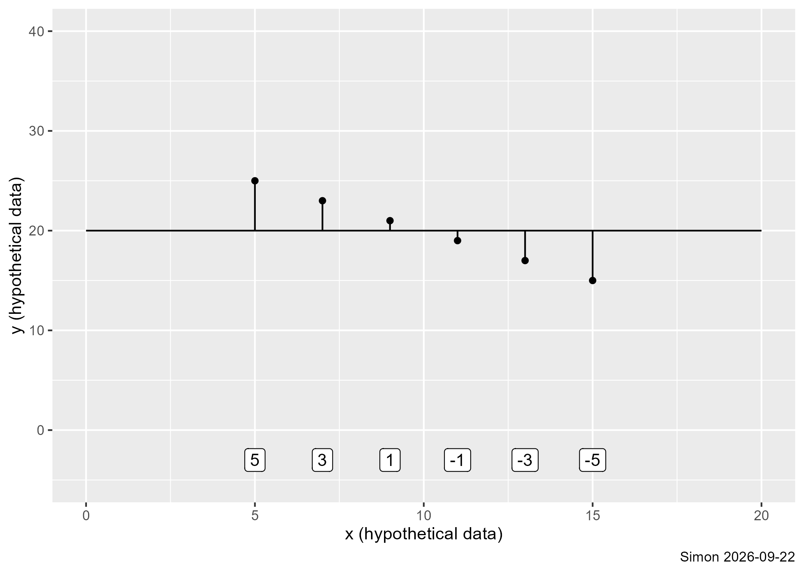
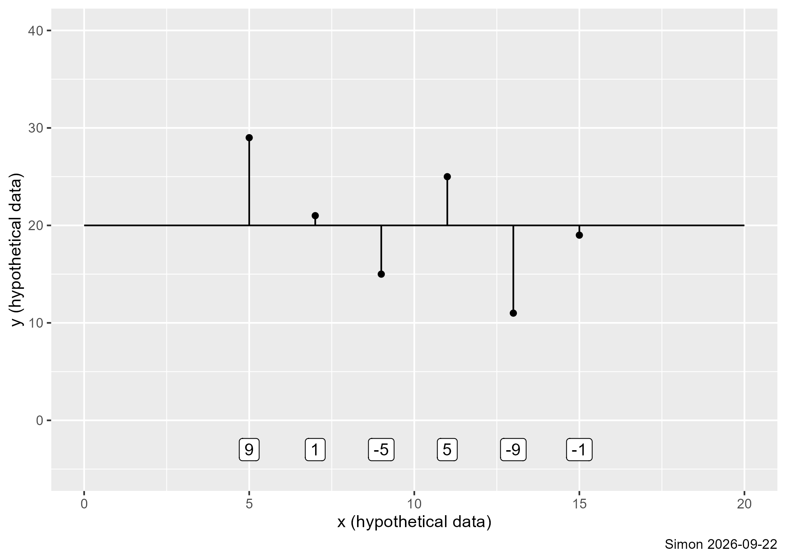
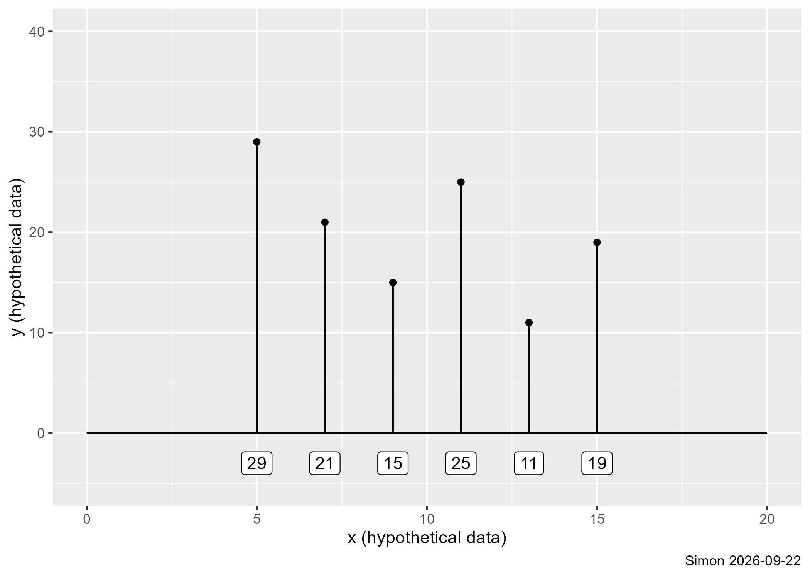

```{r setup-3}
#| message: false
#| warning: false
library(broom)
library(tidyverse)
load("../data/module05.RData")
```


## Sum of squares regression, 1

-   Variation in the predicted values
    -   $SS_{regression} = \Sigma(\hat{Y}_i - \bar{Y})^2$
    -   Sometimes abbreviated as SSR

## Sum of squares regression, 2



## Sum of squares error, 1

-   Variation in the residuals values
    -   $SS_{error} = \Sigma(\hat{Y}_i - Y_i)^2$
    -   Sometimes called $SS_{residual}$
    -   Sometimes abbreviated as SSE

## Sum of squares error, 2


## Sum of squares total / corrected total, 1

-   Variation in the predicted values
    -   $SS_{total} = \Sigma(Y_i - \bar{Y})^2$
    -   Sometimes abbreviated as SST

## Sum of squares total / corrected total, 2



## Sum of squares total (uncorrected), 1

-   Variation in the predicted values
    -   $SS_{uncorrected total} = \Sigma Y_i^2$

## Sum of squares total (uncorrected), 2



## ANOVA table for linear regression

```{=tex}
\begin{matrix}
            &  SS &  df &                  MS &           F-ratio \\
 Regression & SSR &   1 &   MSR=\frac{SSR}{1} & F=\frac{MSR}{MSE} \\
 Error      & SSE & n-2 & MSE=\frac{SSE}{n-2} &                   \\
 Total      & SST & n-1 &                     &
\end{matrix}
```

## Analysis of variance table in R

```{r anova}
load("../data/module05.RData")
anova(m1)
```

:::notes
The analysis of variance table looks different in different software programs and it differs from publication to publication. Notice for example that R does not include a row for total. SPSS, in contrast includes both a corrected total and an uncorrected total.
:::

## R-squared

-   SST, total variation, is split into
    -    SSR, explained variation, and
    -    SSE, unexplained variation
-   $R^2=\frac{SSR}{SST}=1-\frac{SSE}{SST}$
    -    $0 < R^2 < 1$
    -    Proportion of explained variation
         -   $R^2 > 0.5$ strong
         -   $0.1 < R^2 < 0.5$ weak
-   $R^2 = r^2$


:::notes
You can compare the three sources of variation. SSR is explained variation, variation in the predicted values. SSE is unexplained variation. These add up to total variation. Either explained variation divided by total variation or 1 minus unexplained variation divided by total variation is a measure of the strength of the relationship. If you can explain half of the variation (R2=0.5), that's evidence of a strong relationship. Anything between 10% and 50% is evidence of a weak relationship.

There is a simple mathematical relationship. Square the correlation between X and Y to get R-squared.
:::


## F-ratio

-   $F = \frac{MSR}{MSE}$

:::notes
The F-ratio, MSR divided by MSE. If this value is close to 1, you would accept the null hypothesis. The signal (MSR) is comparable to the noise (MSE). If you see a large positive ratio, that implies that the signal is much stronger than the noise. A large positive ratio would cause you to reject the null hypothesis.

Alternately look at the p-value. If the p-value is large, you should accept the null hypothesis.

I'll talk a lot more about p-values in several of the upcoming modules.
:::