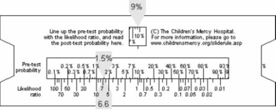
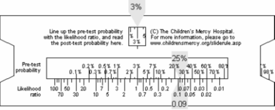
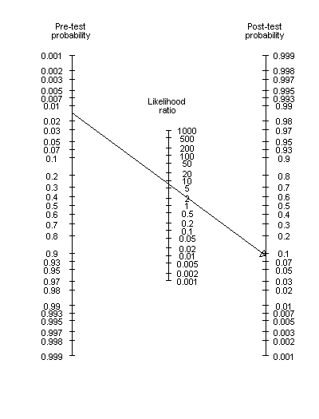

## The positive likelihood ratio

-   LR+ = Sn / (1 - Sp)
    -   Increase in odds of disease after positive test
-   SpPIn

::: notes

You can summarize information about the diagnostic test itself using a measure called the likelihood ratio. The likelihood ratio combines information about the sensitivity and specificity. It tells you how much a positive or negative result changes the likelihood that a patient would have the disease. The likelihood ratio incorporates both the sensitivity and specificity of the test and provides a direct estimate of how much a test result will change the odds of having a disease (see the appendix for an explanation of odds). The likelihood ratio for a positive result (LR+) tells you how much the odds of the disease increase when a test is positive. The likelihood ratio for a negative result (LR-) tells you how much the odds of the disease decrease when a test is negative.

The positive likelihood ratio is  

LR+ = Sn / (1 - Sp). 

You want to see a large value for LR+. This can occur if the numerator of the fraction is large, or the denominator is small. Since it is impossible to get the numerator any larger than one, the only practical way to get a large value for LR+ is to make the denominator small. This occurs when Sp is close to one. This is consistent with the David Sackett acronym SpPIn (if the specificity of test is large, then a positive test will help rule in the diagnosis. 

:::

## The negative likelihood ratio

-   LR- = (1 - Sn) / Sp
    -   Decrease in odds of disease after a negative test
-   SnNOut

::: notes

The negative likelihood ratio is LR- = (1 - Sn) / Sp. You want to see a small value for LR-. This can occur when the numerator of the fraction is small or the denominator is small. Since the denominator cannot get any larger than one, the only practical way to to get a small value is to make the numerator small. This occurs when Sn is close to 1. This isconsistent with the David Sackett acronym SnNOut (if the sensitivity of a test is large, then a negative test will help rule out the diagnosis).

:::

## What is a good value

-   LR+ 
		-   Less than 2 is worthless
		-   Around 10 is good
		-   Around 50 is excellent
-   LR- 
		-   more than 0.5 is worthless
		-   Around 0.1 is good
		-   Around 0.02 is excellent

::: notes

What's a good value for a likelihood ratio? There are no absolute boundaries, but here are some general rules. For a positive likelihood ratio, anything less than 2 is worthless. A good likelihood ratio should be 10 or higher. Anything bigger than 50 represents an excellent diagnostic test. For a negative likelihood ratio (LR-), the corresponding boundaries are 0.5 (1/2), 0.1 (1/10), and 0.02 (1/50). Some diagnostic tests will have a good LR+, but a poor LR-. This might be entirely appropriate if the cost of a false positive is far greater than the cost of a false negative. In a setting where a false negative is a bigger concern, a mediocre LR+ might be acceptable if combined with a robust LR-. 

:::

## How do you assess pre-test odds

-   Pre-test odds
    -   Prevalence of the disease
    -   Characteristics of your patient pool
    -   Information on THIS patient

::: notes

If you want to quantify the effect of a diagnostic test, you have to first provide information about the patient. You need to specify the pre-test odds: the likelihood that the patient would have a specific disease prior to testing. The pre-test odds are usually related to the prevalence of the disease, though you might adjust it upwards or downwards depending on characteristics of your overall patient pool or of the individual patient. This process of specifying pre-test odds is very important because you have to adapt the diagnostic test to the patient rather than the patient to the diagnostic test. 

:::

## A simple example

-   Test for developmental dysplasia
    -   Sn = 92%, Sp = 86%
-   LR+ = Sn / (1 - Sp) = 0.92/0.14 = 6.6
-   LR- = (1 - Sn) / Sp = 0.08/0.86 = 0.09

::: notes

An early test for developmental dysplasia of the hip. The test has 92% sensitivity and 86% specificity in boys (AJPH 1998; 88(2): 285-288). This paper does not compute likelihood ratios, so you have to do a few calculations yourself. LR+ = Sn / (1 - Sp) = 0.92/0.14 = 6.6. LR- = (1 - Sn) / Sp = 0.08/0.86 = 0.09. 

:::

## Positive result with no special risk factors

-   Prevalence = 1.5%
-   Prob / (1 - Prob) = Odds
    -   0.015 / (1-0.015) = 0.015 (about 1 to 66)
-   LR+ times pre-test odds = post-test odds
    -   6.6 times 1/66 = 1/10
-   Odds / (1 + Odds) = Prob
    -   0.1 / (1 + 0.1) = 0.09

::: notes

Suppose one of our patients is a boy with no special risk factors. The diagnostic test is positive. What can we say about the chances that this boy will develop hip dysplasia? The prevalence of this condition is 1.5% in boys. This corresponds to an odds of one to 66. Multiply the odds by the likelihood ratio, you get 6.6 to 66 or roughly 1 to 10. The post test odds of having the disease is 1 to 10 which corresponds to a probability of 9%.

:::

### Negative result with family history

-   Prevalence = 25%
-   Prob / (1 - Prob) = Odds
    -   0.25 / (1-0.25) = 0.33 (about 1 to 3)
-   LR+ times pre-test odds = post-test odds
    -   0.09 times 0.33 = 0.03
-   Odds / (1 + Odds) = Prob
    -   0.03 / (1 + 0.03) = 0.029

::: notes

Suppose we had a negative result, but it was with a boy who had a family history of hip dysplasia. Suppose the family history would change the pre-test probability to 25%. How likely is hip dysplasia, factoring in both the family history and the negative test result? A probability of 25% corresponds to an odds of 1 to 3. The likelihood ratio for a negative result is 0.09 or 1/11. So the post-test odds would be roughly 1 to 33, which corresponds to a probability of 3%.

:::

## Likelihood ratio slide rule, 1

::: notes

The use of likelihood ratios requires a bit of tedious calculations. I have developed a simple slide rule that will do likelihood ratio calculations for you. Slide the insert up or down until the pre-test probability in the left window lines up with the likelihood ratio. Read the post-test probability in the right window. Let’s show how the slide rule would work for the hip dysplasia example. The prevalence of this condition is 1.5%, and since there are no unusual risk factors, we will use this as the pre-test probability. Line up this with the value for LR+ (6.6) and read a post-test probability of 9%.

:::

## Likelihood ratio slide rule, 2

::: notes

Suppose that instead the patient had a family history that raised the pre-test probability to 25%. The test, thankfully, is negative. For this test, you line up the 25% pre-test probability with the value of LR- (0.09) to get a post-test probability of 3%. 

Notice that the change is more dramatic for the second case rather than the first case. There are two things that account for this. First, a diagnostic test is most useful and shows the largest change in disease probability when that probability is in the middle (somewhere between 20% and 80%). When the pre-test probability is very close to 0% or very close to 100%, it is hard to move the probabilities very much. The second factor at work here is that this test was already slightly better at ruling out a diagnosis than ruling it in since LR- (0.09 or 1/11) is more extreme than LR+ (6.6). 

:::

## Fagan nomogram, 1

::: notes

The likelihood ratio slide rule that I developed was inspired by the Fagan nomogram (Fagan 1975). It is a bit more complex to make, but it calculates more rapidly, and it is small enough to fit in your shirt pocket.

Here's an illsutration of the Fagan nomogram for the positive test result shown earlier.

:::
