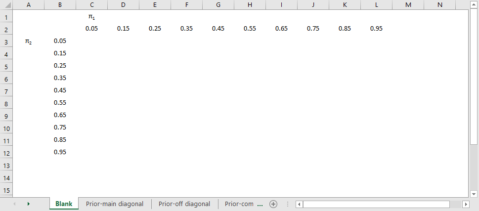
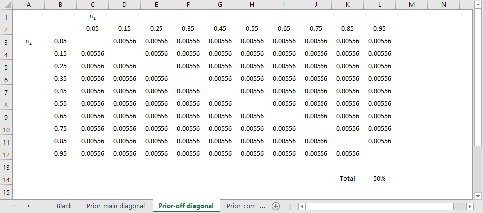
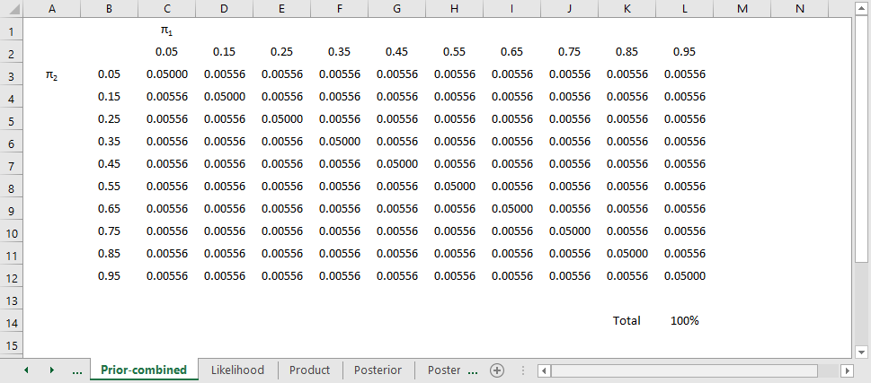
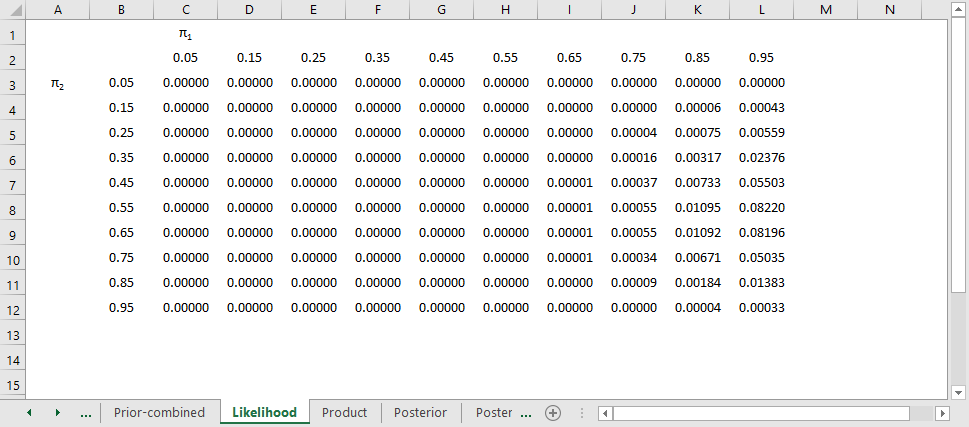
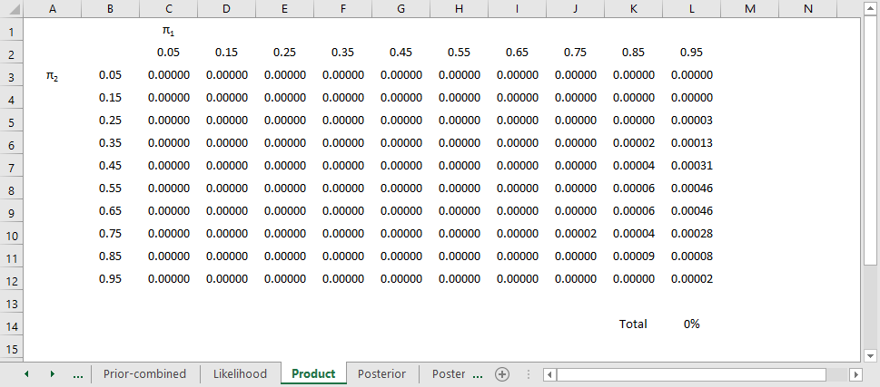
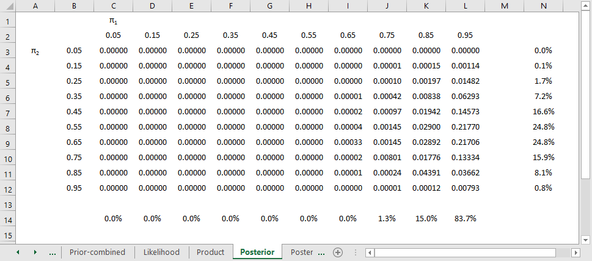
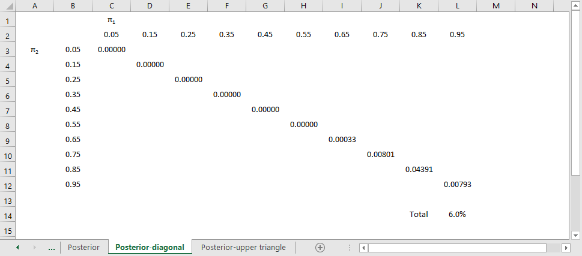
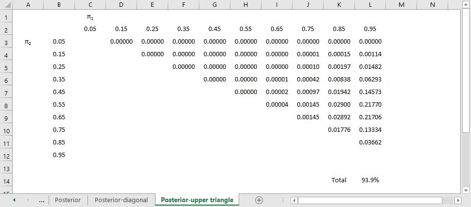

## A simple example of Bayesian data analysis.

* ECMO study
* Treatment versus control, mortality endpoint
    -   Treatment: 28 of 29 babies survived
    -   Control: 6 of 10 babies survived
    -   Source: Jim Albert in the Journal of Statistics Education (1995, vol. 3 no. 3) which is available on the web at www.amstat.org/publications/jse/v3n3/albert.html.

::: notes

Bayesian data analysis seems hard, and it is. Even for me, I struggle with understanding Bayesian data analysis. In fairness, I must admit that much of my discomfort is just lack of experience with Bayesian methods. In fact, I've found that in some ways, Bayesian data analysis is simpler than classical data analysis. You, too, can understand Bayesian data analysis, even if you'll never be an expert at it. There's a wonderful example of Bayesian data analysis at work that is simple and fun. It's taken directly from an article by Jim Albert in the Journal of Statistics Education (1995, vol. 3 no. 3) which is available on the web at www.amstat.org/publications/jse/v3n3/albert.html.

I want to use his second example, involving a comparison of ECMO to conventional therapy in the treatment of babies with severe respiratory failure. In this study, 28 of 29 babies assigned to ECMO survived and 6 of 10 babies assigned to conventional therapy survived. Refer to the Albert article for the source of the original data. Before I show how Jim Albert tackled a Bayesian analysis of this data, let me review the general paradigm of Bayesian data analysis.

:::

## Wikipedia introduction

* P(H|E) = P(E|H) P(H) / P(E)
    -   H = hypothesis
    -   E = evidence
    -   P(H) = prior
    -   P(E|H) = likelihood
    -   P(H|E) = posterior
  
::: notes

Wikipedia gives a nice general introduction to the concept of Bayesian data analysis with the following formula:

P(H|E) = P(E|H) P(H) / P(E)

where H represents a particular hypothesis, and E represents evidence (data). P, of course, stands for probability.

:::

## Prior distribution

* Degree of belief
    -   Based on previous studies
    -   Subjective opinion (!?!)
* Examples of subjective opinions
    -   Simpler is better
    -   Be cautious about subgroup analysis
    -   Biological mechanism adds evidence
* Flat or non-informative prior

::: notes

The first step is to specify P(H), which is called the prior probability. Specifying the prior probability is probably the one aspect of Bayesian data analysis that causes the most controversy. The prior probability represents the degree of belief that you have in a particular hypothesis prior to collection of your data. The prior distribution can incorporate data from previous related studies or it can incorporate subjective impressions of the researcher. What!?! you're saying right now. Aren't statistics supposed to remove the need for subjective opinions? There is a lot that can be written about this, but I would just like to note a few things.

First, it is impossible to totally remove subjective opinion from a data analysis. You can't do research without adopting some informal rules. These rules may be reasonable, they may be supported to some extent by empirical data, but they are still applied in a largely subjective fashion. Here are some of the subjective beliefs that I use in my work:

You should always prefer a simple model to a complex model if both predict the data with the same level of precision.

You should be cautious about any subgroup finding that was not pre-specified in the research protocol.

if you can find a plausible biological mechanism, that adds credibility to your results.

Advocates of Bayesian data analysis will point out that use of prior distributions will force you to explicitly state some of the subjective opinions that you bring with you to the data analysis.

Second, the use of a range of prior distributions can help resolve controversies involving conflicting beliefs. For example, an important research question is whether a research finding should "close the book" to further research. If data indicates a negative result, and this result is negative even using an optimistic prior probability, then all researchers, even those with the most optimistic hopes for the therapy, should move on. Similarly, if the data indicates a positive result, and this result is positive even using a pessimistic prior probability, then it's time for everyone to adopt the new therapy. Now, you shouldn't let the research agenda be held hostage by extremely optimistic or pessimistic priors, but if any reasonable prior indicates the same final result, then any reasonable person should close the book on this research area.

Third, while Bayesian data analysis allows you to incorporate subjective opinions into your prior probability, it does not require you to incorporate subjectivity. Many Bayesian data analyses use what it called a diffuse or non-informative prior distribution. This is a prior distribution that is neither optimistic nor pessimistic, but spreads the probability more or less evenly across all hypotheses.

:::

## Lay out the parameters

::: notes

Here's an example of a very simple Bayesian analysis. The columns, pi1, represent the population proportion of infants on ECMO who survive. We hope that the results will be on the right hand side, but we don't know until we run the experiment.

The rows represent the population proportion of infants in the control group who survive. We'd like to see the values near the bottom rather than the top, but in a population of very premature births, this is not guaranteed.

:::

## Place half the probability on the diagonal

::: notes

We don't know if ECMO is better or worse, so let's start out by placing half the probability along the diagonal. The diagonal here represents all the cases where the survival probability on ECMO equals the survival probability in the control group. There are ten diagonal cells, so it seems fair to divide the 50% probability into ten pieces of 5% each.

:::

## Difuse prior

::: notes

Now spread out the remaining 50% of the probability across the remainder of the table. There are 90 cells remaining, so when you divide 50% by 90, you get 0.56%. Notice that the upper triangle gets just as much probability as the lower triangle. if the parameter were found in the upper triangle, that would represent cases where ECMO has a higher survival rate than the control group.

:::

## Difuse prior

::: notes

Put these two together and check that the total probability is 100%. These represents your prior belief, and since this study was run before there was much research, it makes sense to spread the probability more or less evenly across the table, but also splitting the data so that the probability on the diagonal, the probability of the null hypothesis, is the same as the probability off the diagonal, the probability of the alternative hypothesis.

Now if the thought of assigning probabilities to hypotheses prior to collecting data makes you feel queasy, you are in good company. But bear with me for a moment.

:::

## Likelihood

::: notes

The second step in a Bayesian data analysis is to calculate P(E | H), the probability of the observed data under each hypothesis. If the ECMO survival rate is 90% and the conventional therapy survival rate is 60%, then the probability of observed 28 out of 29 survivors in the ECMO group is 152 out of one thousand, the probability of observing 6 out of 10 survivors in the conventional therapy group is 251 out of one thousand. The product of those two probabilities is 38,152 out of one million which we can round to 38 out of one thousand. If you've forgotten how to calculate probabilities like this, that's okay. It involves the binomial distribution, and there are functions in many programs that will produce this calculation for you. In Microsoft Excel, for example, you can use the following formula.

binomdist(28,29,0.95FALSE)*binomdist(6,10,0.65,FALSE)

The table above shows the binomial probabilities under each of the 100 different hypotheses.  Many of the probabilities are much smaller than one out of one thousand. The likelihood of seeing 28 survivals out of 29 babies in the ECMO survivals is very small when the hypothesized survival rate is 15%, 35%, or even 55%. Very small probabilities are represented by zeros.

:::

## Multiply

::: notes

Now multiply the prior probability of each hypothesis by the likelihood of the data under each hypothesis. For ECMO=0.9, conventional therapy=0.6, this product is 5 out of a thousand times 38 out of a thousand, which equals 190 out of a million (actually it is 173 out of a million when you don't round the data so much). For ECMO=conventional=0.8, the product is 45 out of a thousand times 1 out of a thousand, or 45 out of a million.

This table shows the product of the prior probabilities and the likelihoods. We're almost done, but there is one catch. These numbers do not add up to 1 (they add up to 794 out of a million), so we need to rescale them. We divide by P(E) which is defined in the Wikipedia article as

P(E) = P(E|H1) P(H1) + P(E|H2) P(H2) + ...

In the example shown here, this calculation is pretty easy: add up the 121 cells to get 794 out of a million and then divide each cell by that sum. For more complex setting, this calculation requires some calculus, which should put some fear and dread into most of you. It turns out that even experts in Calculus will find it impossible to get an answer for some data analysis settings, so often Bayesian data analysis requires computer simulations at this point.

:::

## Standardize

::: notes

Here's the table after standardizing all the terms so they add up to 1.

This table is the posterior probabilities, P(H | E). You can calculate the probability that ECMO is exactly 10% better than conventional therapy (0+0+...+1+13+84+0 = 98 out of a thousand), that ECMO is exactly 20% better (0+0+...+13+218+0 = 231 out of a thousand), exactly 30% better (0+0+...+7+178+0 = 185 out of a thousand), and so forth.

Here's something fun that Dr. Albert didn't show. You could take each of the cells in the table, compute a ratio of survival rates and then calculate the median of these ratios as 1.5 (see above for details). You might argue that 1.33 is a "better" median because 448 is closer to 500 than 666, and I wouldn't argue too much with you about that choice.

:::

## Posterior

::: notes

You can combine and manipulate these posterior probabilities far more easily than classical statistics would allow. For example, how likely are we to believe the hypothesis that ECMO and conventional therapy have the same survival rates? Just add the cells along the diagonal to get 6.0%. Prior to collecting the data, we placed the probability that the two rates were equal at 500 out of a thousand, so the data has greatly (but not completely) dissuaded us from this belief. 

:::

## Posterior

::: notes

The probability of the upper triangle is 93.9%. That's pretty strong evidence that ECMO is superior. There's a lot more you can do with this data, but I just wanted to give you a small taste of how a Bayesian analysis works. First, you lay out the possible values for the population parameters. Then specify probabilities for these parameters. If you do not have a strong prior belief, or if you do not want to incorporate your prior beliefs into the analysis, spread out the probabilities in a more or less uniform fashion. Then calculate the likelihood of the data for each set of population parameters. In a survival setting, this is just a binomial distribution. Multiply the prior times the likelihood and standardize. The resulting matrix is a set of probabilities that you can sum up or manipulate in other ways. 

:::
