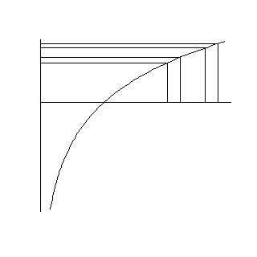
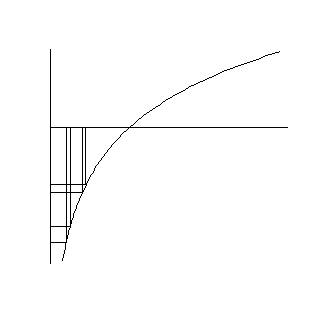
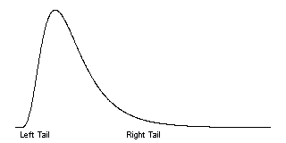
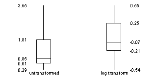
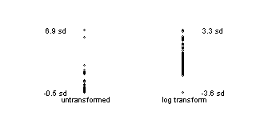
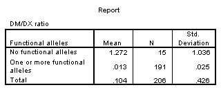
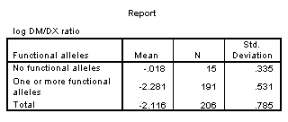

## Data transformations

-   Ideally selected a priori
    -   Sometimes based on precedent
    -   Sometimes motivated by theory
    -   Sometimes based on empirical findings
-   Don't bother if your range is narrow
    -   max/min <= 3
-   Log transformation

::: notes

For some of your continuous variables, you may want to consider transformations. This is the use of a common mathematical function like the square root or the logarithm, to improve some of the properties of your variable. Sometimes this is based on precedent. A transformation has been found to be helpful for this sort of data in the past and has come into common use. Sometimes, you can derive a transformation from an understanding of the theory behind the measurement. Most often, though, transformations are justified on the basis of empirical findings associated with your own data set.

Generally, transformations are used most often for data that is bounded below by zero and with no obvious upper bound. This lower bound constrains the data on the low end, leading to skewness, unequal variances, and other problems.

You should not bother with transformations if your variable has a narrow range (if the maximum divided by the minimum is less than 3). It is the nonlinear features of the transformation, the stretching and squeezing of data in certain regions, that has the possbility of benefit, and a narrow range means that there is not sufficient stretching versus squeezing to have any important impact.

The log transformation is a commonly used transformation that has several interesting features.

:::

## Log transformation

::: notes

The logarithm function squeezes together big data values (anything larger than 1). The bigger the data value, the more the squeezing. The graph shown here illustrates this effect. The first two values are 2.0 and 2.2. Their logarithms, 0.69 and 0.79 are much closer. The second two values, 2.6 and 2.8, are squeezed even more. Their logarithms are 0.96 and 1.03.

:::

## Log transformation

::: notes

The logarithm also stretches small values apart (values less than 1). The smaller the values the more the stretching. The values of 0.4 and 0.45 have logarithms (-0.92 and -0.80) that are further apart. The values of 0.20 and 0.25 are stretched even further. Their logarithms are -1.61 and -1.39, respectively.

:::

## Log transformation

::: notes

If your data are skewed to the right, a log transformation can sometimes produce a data set that is closer to symmetric. Recall that in a skewed right distribution, the left tail (the smaller values) is tightly packed together and the right tail (the larger values) is widely spread apart. The logarithm will squeeze the right tail of the distribution and stretch the left tail, which produces a greater degree of symmetry. If the data are symmetric or skewed to the left, a log transformation could actually make things worse. Also, a log transformation is unlikely to be effective if the data has a narrow range (if the largest value is not more than three times bigger than the smallest value).

:::

## Log transformation fixes

-   Skewness
-   Outliers
-   Unequal variation
-   Multiplicative models
    -   log(ab) = log(a)+log(b)

::: notes

Outliers: If your data has outliers on the high end, a log transformation can sometimes help. The squeezing of large values might pull that outlier back in closer to the rest of the data. If your data has outliers on the low end, the log transformation might actually make the outlier worse, since it stretches small values.

Unequal variation: Many statistical procedures require that all of your subject groups have comparable variation. If you data has unequal variation, then the some of your tests and confidence intervals may be invalid. A log transformation can help with certain types of unequal variation.

A common pattern of unequal variation is when the groups with the large means also tend to have large standard deviations. Consider housing prices in several different neighborhoods. In one part of town, houses might be cheap, and sell for 60 to 80 thousand dollars. In a different neighborhood, houses might sell for 120 to 180 thousand dollars. And in the snooty part of town, houses might sell for 400 to 600 thousand dollars. Notice that as the neighborhoods got more expensive, the range of prices got wider. This is an example of data where groups with large means tend to have large standard deviations.

With this pattern of variation, the log transformation can equalize the variation. The log transformation will squeeze the groups with the larger standard deviations more than it will squeeze the groups with the smaller standard deviations. The log transformation is especially effective when the size of a group's standard deviation is directly proportional to the size of its mean.

Multiplicative models

There are two common statistical models, additive and multiplicative. An additive model assumes that factors that change your outcome measure, change it by addition or subtraction. An example of an additive model would when we increase the number of mail order catalogs sent out by 1,000, and that adds an extra $5,000 in sales.

A multiplicative model assumes that factors that change your outcome measure, change it by multiplication or division. An example of a multiplicative model woud be when an inch of rain takes half of the pollen out of the air.

In an additive model, the changes that we see are the same size, regardless of whether we are on the high end or the low end of the scale. Extra catalogs add the same amount to our sales regardless of whether our sales are big or small. In a multiplicative model, the changes we see are bigger at the high end of the scale than at the low end. An inch of rain takes a lot of pollen out on a high pollen day but proportionately less pollen out on a low pollen day.

If you remember your high school algebra, you'll recall that the logarithm of a product is equal to the sum of the logarithms.

Therefore, a logarithm converts multiplication/division into addition/subtraction. Another way to think about this in a multiplicative model, large values imply large changes and small values imply small changes. The stretching and squeezing of the logarithm levels out the changes.

When should you consider a log transformation?

:::

## When should you use the log transformation?

-   Data bounded below by zero.
    -   Mean < Standard deviation
-   Ratio data
-   Max > 3*Min

::: notes

There are several situations where a log transformation should be given special consideration.

Is your data bounded below by zero? When your data are bounded below by zero, you often have problems with skewness. The bound of zero prevents outliers on the low end, and constrains the left tail of the distribution to be tightly packed. Also groups with means close to zero are more constrained (hence less variable) than groups with means far away from zero.

It does matter how close you are to zero. If your mean is within a standard deviation or two of zero, then expect some skewness. After all the bell shaped curve which speads out about three standard deviations on either side would crash into zero and cause a traffic jam in the left tail.

Is your data defined as a ratio? Ratios tend to be skewed by their very nature. They also tend to have models that are multiplicative.

Is the largest value in your data more than three times larger than the smallest value? The relative stretching and squeezing of the logarithm only has an impact if your data has a wide range. If the maximum of your data is not at least three times as big as your minimum, then the logarithm can't squeeze and stretch your data enough to have any useful impact.

:::

## Log transformation

::: notes

The boxplots below show the original (untransformed) data for the 15 patients with no functional alleles. The graph also shows the log transformed data. Notice that the untransformed data shows quite a bit of skewness. The lower whisker and the lower half of the box are much packed tightly, while the upper whisker and the upper half of the box are spread widely.

The log transformed data, while not perfectly symmetric, does tend to have a better balance between the lower half and the upper half of the distribution.

:::

## Log transformation

::: notes

Here's some data where the left hand side represents the original data. Even though it doesn't look that extreme the largest value is 6.9 standard deviations above the mean. That's because most of the data are scrunched together at the bottom. They deviate very little, keeping the standard deviation small.

On the right hand side, you have the log transformed data. It is not perfect, and perhaps there is now an outlier on the low end. Nevertheless, the worst outlier is still within 4 standard deviations of the mean. The influence of outliers is much less extreme with the log transformed data.

:::

## Standard deviations, untransformed

::: notes

When we compute standard deviations for the patients with no functional alleles and the patients with one or more functional alleles, we see that the former group has a much larger standard deviation. This is not too surprising. The patients with no functional alleles are further from the lower bound and thus have much more room to vary.

:::

## Standard deviations, log transformed

::: notes

After a log transformation, the standard deviations are much closer.

:::

## Log transformation, summary
-   Removes skewness
-   Removes outliers
-   Stabilizes variances
-   Does not always work
-   Best when
    -   Data bounded below by zero
    -   Mean < Standard deviation
    -   Max/Min > 3
  
::: notes

This is important, so it is worth reviewing. The log transformation is a miracle transformation. It stretches the small values and squeezes the large value. This can sometimes remove the impact of skewness and outliers. It can sometimes stablize your variances. But it doesn't always work, and can sometimes cause more problems than it can solve.

The log transformation is best when your data is bounded below by zero, your mean is smaller than your standard deviation, and the relative range (the maximum value in your data set divided by the minimum value) is greater than 3.

:::

