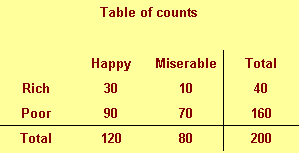
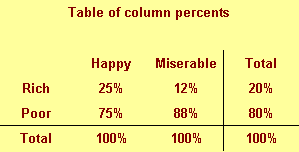
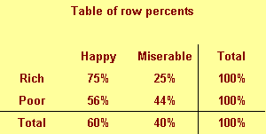
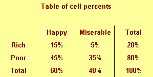
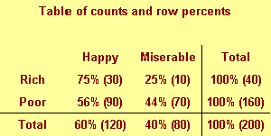
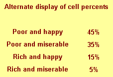
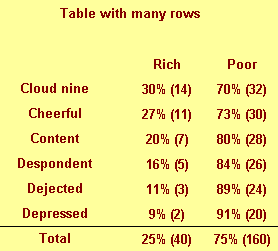

## Descriptive statistics

-   Part of every quantitative study
-   Table 1, overall summaries
    -   Outcomes and covariates
    -   Means and standard deviations for normal data
    -   Median and interquartile range for skewed data
    -   Percentages (always show denominator)
-   Key subgroup comparisons
    -   Crosstabulations
    -   Means/standard deviations by subgroup

::: notes

Your descriptive statistics should be a part of any research study. This is done in almost every research paper and it almost always appears as the first table in your paper. So we sometimes call these "Table 1 statistics."

Your descriptive statistics should include your outcome variables, most certainly, but also your covariates. Covariates are variables that are not of direct interest but which can potentially influence your outcome anyway. This includes, in any human study, things like age and gender.

if your data are continuous (interval or ratio scale), summarize your data with a mean and standard deviation. Some people advocate a different summary if your data is skewed, using the median and the range, for example, instead of the mean and standard deviation. There is no consensus on how much the data has to be skewed, or even if you need to switch at all. I, for one, see the mean and standard deviation as useful summaries, even for skewed data, but I am in a minority on this.

For categorical outcomes summarize using a percentage. Always show what your numerator and denominator would be if you report percentages.

If you want to compare across key demographic groups, use crosstabulations for categorical outcomes and means/standard deviations by subgroup for continuous outcomes.

Let me talk a bit about crosstabulations because these are almost always done poorly.

:::

## Rules for crosstabulations

-   Never display multiple statistics
-   Place treatment/exposure categories in the rows
-   Summarize using row percentages
-   Many rows, not many columns
-   Round liberally.

::: notes

When you are deciding how to display two by two (or larger) tables, you have a variety of ways to do this. No way is correct all the time, and some of choices reflect subjective judgment. But here are some rules I use.

Never display more than one type of number in a table. Statistical software like SPSS can produce counts, row percents, column percents, cell percents, expected counts, residuals, and/or cell contribution to chi-squared values. At one time or another you might want to use each of these statistics, but never all at one time. Two or more numbers in a table causes confusion and makes your tables harder to interpret.

Present a single summary statistic in the table if at all possible. If you need to display two summary statistics (for example, both counts and row percentages), then place the counts in one table and the row percentages in a different table. If you have to fit them in the same table, place the two numbers side by side with the less important number appearing second and in parentheses For example, 54% (257).

Row percentages are usually best. Row percentages are the percentages you compute by dividing each count by the row total. Row percentages place the comparison between two numbers within a single column, so that one number is directly beneath the number you want to compare it to. This is usually better than column percents, where the numbers you want to compare are side by side. If you find that column percentages make more sense. Consider swapping the rows and columns.

If you find that cell percentages make the most sense, consider creating composite categories that combine the row and column categories. Cell percentages are the percentages that you get when you divide each cell count by the overall total. When cell percents are interesting, it usually means that you are interested in the four distinct categories in your two by two table. For example, you are interested in seeing what fraction of job candidates are white males, rather than seeing how the probability of being male influences the probability of being white. For this type of data, treat it as a single categorical variable with four levels (white males, white females, black males, black females) rather than two categorical variables with each having two levels (black/white, male/female).

Place the treatment/exposure variable as rows and outcome variable as columns. This relates to the above item. You usually are interested in the probability of an outcome like death or disease, and you are interested in how this probability changes when the treatment or exposure changes. Arranging the table thusly and using row percents usually gets you the comparison you are interested in.

If one variable has a lot more levels than the other variable, place that variable in rows. A table that is tall and thin is usually easier to read than a table that is short and wide. It is easier to scroll up and down rather than left and right. For a really large number of levels, you might have to print your table on two or more pages. Usually it is a lot easier to align these pages if the table is tall and thin. A short wide table that is split on two or more pages is often a disaster.

Whenever you report percentages, always round. A change on the order of tenths of a percent are almost never interesting or important. Displaying that tenth of a percent makes it harder to manipulate the numbers to see the big picture.

Don't worry about whether your percentages add up to 99% or 101%. First of all, it can't happen with a two by two table unless you round incorrectly. For a larger table, it can happen, but your audience is sophisticated enough to understand why this is the case. No one, for example, is going to be upset when 33% plus 33% plus 33% adds up to less than 100%.

When in doubt, write out your table several different ways. Pick out the one that gives the clearest picture of what is really happening. Don't rely on the first draft of your table, just like you would never rely on the first draft of your writing.

:::
## Table of percentages

::: notes

A simple fictitious example will help illustrate these points.

We classify people by their income (rich/poor) and also by their attitude (happy/miserable). The first row shows 30 rich happy people and 10 rich miserable people, for a total of 40 rich people in our sample. The second row shows 90 poor happy people and 70 poor miserable people, for a toal of 160 poor people. The third row shows a total of 120 happy people and 80 miserable people. The last number in the lower right hand corner of the table is 200 the total across everyone rich and poor, happy and miserable.

:::
  
## Table of column percentages

::: notes

This figure shows column percentages. We compute this by dividing each number by the column total.

We see for example in the first column that only 25% of all happy people are rich. The remaining 75% of happy people are poor. The total percentage is 100% in the first column (and in every other column). That's how you can tell that these numbers are column percentages. The second column shows that 12% of all miserable people are rich, 88% are poor, adding to a column total of 100%. The last column shows that 20% of our sample is rich, irregardless of their mood and the 80% of our sample is poor. 

:::
  
## Table of row percentages

::: notes

This figure shows row percentages. We compute this by dividing each number by the row total.

We see, for example that 75% of rich people are happy and only 25% are miserable. This is a different conditional probability, the probability of being happy given that you are rich.

Notice the distinction between the two probabilities. Only a few happy people are rich, but most rich people are happy.

Row percentages are percentages that add up to 100 within each row.

:::
  
## Table of cell percentages

::: notes

This figure shows cell percentages. We compute this by dividing each number by the grand total. Each percentage represents the probability of having two conditions. The first row tells us that there is a 15% chance of being rich and happy and a 5% probability of being rich and poor. There is a 45% chance that someone is poor and happy and a 35% chance that someone is poor and miserable.

The total percentages don't add up until you get to the lower right hand corner. That's how you can tell that these are cell percentages.

:::
  
## Combining two numbers

::: notes

The table above shows a good format for combining two numbers in a single table. Put the more important number first (and the more important number is almost always a percentage) and the less important number goes to the right and in parentheses.

:::
  
## Table of percentages

::: notes

This is an alternate way of displaying cell percentages.

:::
  
## Table of percentages

::: notes

If we had a six categories for attitude rather than just two, we might arrange the table differently.

Notice that this table would not require any sideways scrolling.

:::

## Rules for crosstabulations

-   Never display multiple statistics
-   Place treatment/exposure categories in the rows
-   Summarize using row percentages
-   Many rows, not many columns
-   Round liberally.

::: notes

This is imporant, so here are those rules again.

Never display more than one type of number in a table.

Place the treatment/exposure variable as rows and outcome variable as columns.

Row percentages are usually best.

If one variable has a lot more levels than the other variable, place that variable in rows.

Whenever you report percentages, always round.

Don't worry about whether your percentages add up to 99% or 101%.

When in doubt, write out your table several different ways.

:::

