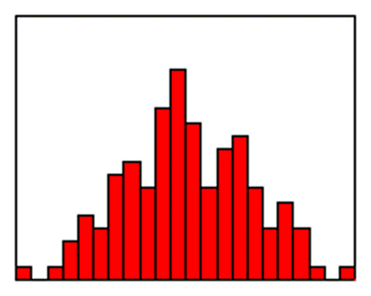
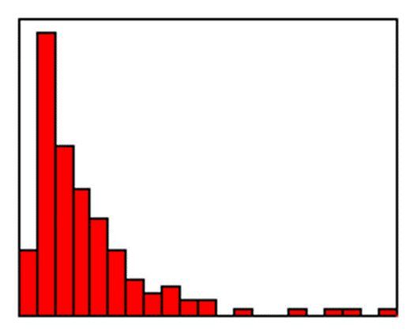
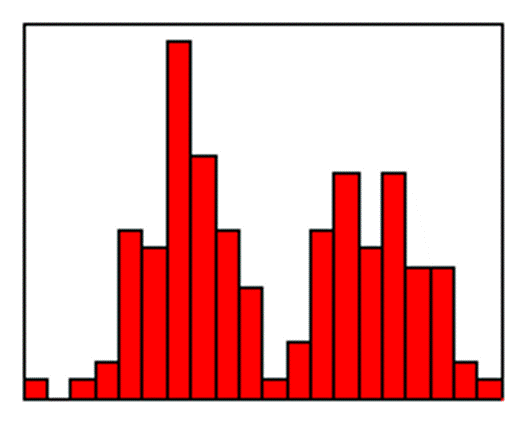
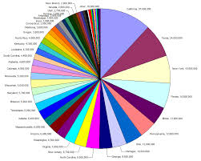
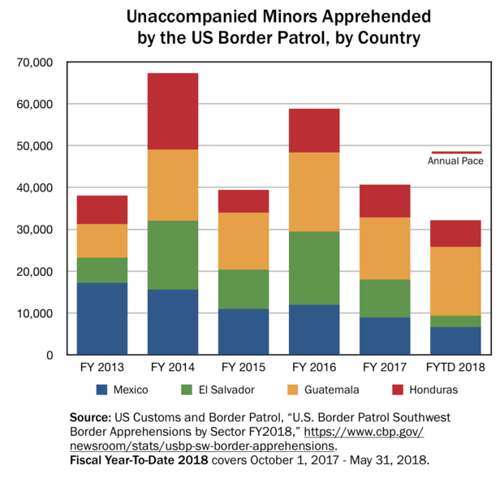
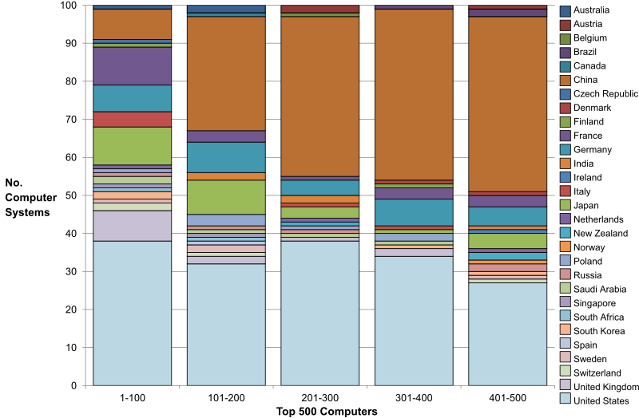
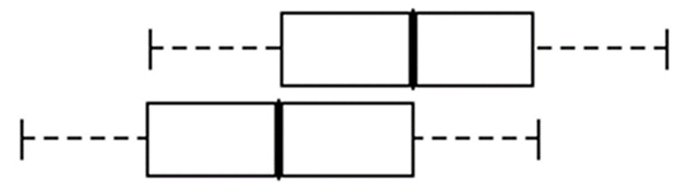
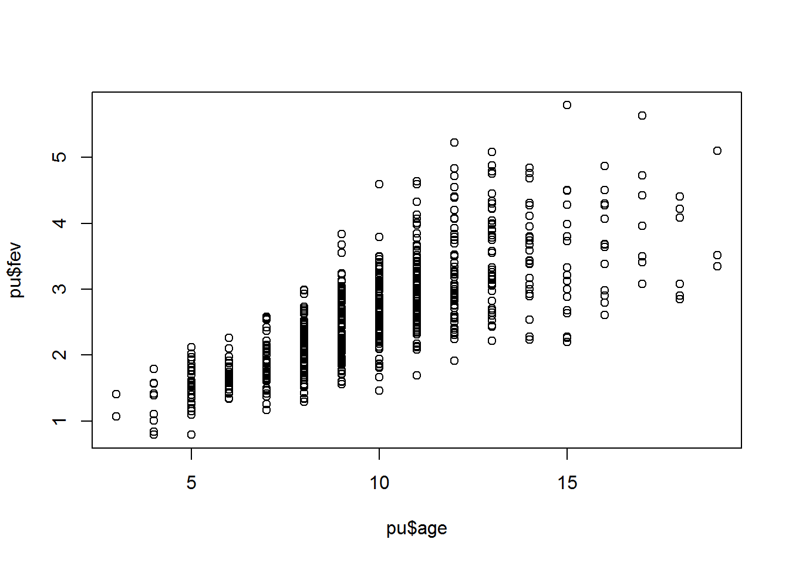

## Graphs

-   Overall summaries
    -   Histograms for continuous data
    -   Bar/pie charts for categorical data
-   Assessing relationships
    -   Side by side pie/bar charts
    -   Boxplots
    -   Scatterplots
  
::: notes

There are a gazillion different graphs that you can present in a descriptive analysis, but here are the most common choices.

To display information about a single variable, use a histogram for anything continuous and a bar or pie chart for anything categorical.

If you want to display the relationship between two variables, use side by side pie or bar charts if both variables are categorical, boxplots if you have a mix, and scatterplots if both variables are continuous.

:::
  
## Histogram examples (1 of 3)

::: notes

I shouldn't have to describe this to you, but here is an example of a histrogram for data that roughly follows a bell shaped curve pattern.

:::

## Histogram examples (2 of 3)

::: notes

Here is a histogram for data that is skewed to the right.

:::

## Histogram examples (3 of 3)

::: notes

Here is a histogram for data that is bimodal.

:::

## Side by side pie/bar charts

-   Pies and bars only work well for 2 or 3 categories
    -   Pacman charts
-   No good graphs for more categories
-   Avoid cheap 3D effects

::: notes

:::

## A very busy pie chart

::: notes

This image was found on Wikimedia Commons and has been placed in the public domain.

:::

## A bar chart

::: notes

Here's a bar chart showing the number of unaccompanied minors apprehended by the US Border Patrol for each year from 2013 through 2018/ The bar is highest in 2014 and almost as high in 2016. The bar is divided into four colors representing the country of origin: Mexico, El Salvador, Guatemala, and Honduras. The relative share of minors from Mexico has declined over time. 

This bar chart is not terribly bad. I'd rather see a table, personally, but I can't complain.

This image was found on Wikimedia Commons and has been placed in the public domain.

:::

## A very busy bar chart

::: notes

This bar chart, however, is almost impossible to read. It would help if they did just two or three countries and then an "other" category.

This image was found on Wikimedia Commons and has is licensed under the creative commons share alike license. It is available at https://commons.wikimedia.org/wiki/File:Top_500_Computers_Chart.svg

:::

## Boxplot

::: notes

The box plot is a graphical display of a five number summary. Sometimes the box plot is also known as a box and whiskers plot. It is very useful for examining relationships between a categorical variable and a continuous variable.

Here are the four steps you follow to draw a boxplot.

Draw a box from the 25th to the 75th percentile.

Split the box with a line at the median.

Draw a thin lines (whisker) from the 75th percentile up to the maximum value.

Draw another thin line from the 25th percentile down to the minimum value.

The length of the box in a box plot, i.e., the distance between the 25th and 75th percentiles, is known as the interquartile range. You can use this box length to detect outliers. If any whisker is more than 1.5 times as long as the length of the box, then we have evidence of outliers. A common variation on the box plot is to draw the whisker to the value which is just shy of 1.5 box lengths away, and highlight each individual data point more than 1.5 box lengths away.

The boxplot is useful for comparing the distributions of two different groups. If the median in one box exceeds the end of the box of the other group, that is evidence of a "large" discrepancy between the two groups. What passes as the median for one group would actually be the 25th or 75th percentile of the other group.

Just about any statistical software program (SAS, SPSS, Stata, R, etc.) can produce boxplots and you can find code to produce boxplots in many programming languages.

Notice that these boxplots are horizontal rather than vertical. The main reason to turn these 90 degrees is if your labels and axes fit better this way.

:::

## Scatterplot

::: notes

This is a scatterplot, a useful way to summarize the association between two continuous variables.

Often a trend line or a smoothing curve helps. This seems to be the case when you have a lot of data, meaning a lot of overprinting, and the data is fairly noisy.

:::

