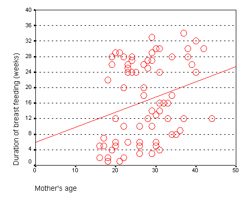
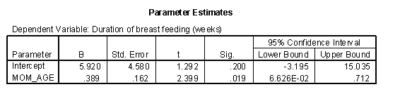
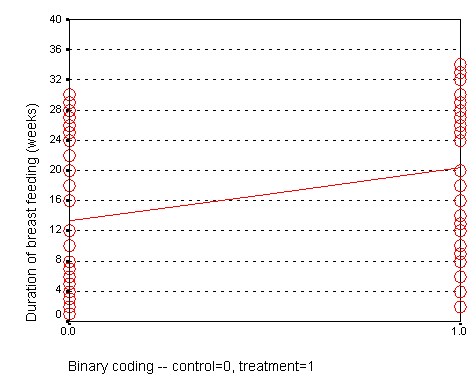
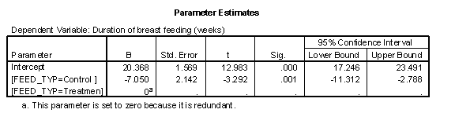
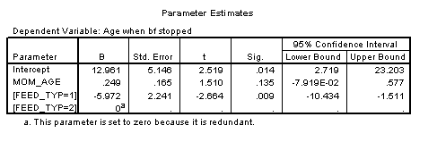

## Linear regression (1/2)

-   Continuous outcome variable
-   Very flexible
    -   Either categorical or continuous independent variables
    -   Multiple variables (risk adjustment)
    -   Interactions
-   Alternatives
    -   t-test
    -   Analysis of variance

::: notes

The linear regression model is one of the best statistical models out there to test a hypothesis involving continuous outcome variables.
The linear regression model is useful for a hypothesis involving a continuous outcome variable. Continuous means interval or ratio scale. Some people use linear regression for an ordinal outcome, and I'm fine with that, but you will get a big fight at peer review time if you try this.

The linear regression model is very flexible. It can accommodate either a categorical or a continuous independent variable. You can use multiple independent variables, which allows you to do risk adjustments and it also lets you examine interactions.

I'll talk about two other approaches used commonly, the t-test and analysis of variance.

:::

## Linear regression (2/2)

-   High school algebra
    -   Y = m X + b
    -   m = Δy / Δx
-   The slope represents the estimated average change in Y when X increases by one unit.
-   The intercept represents the estimated average value of Y when X equals zero.

::: notes

When I ask most people to remember their high school algebra class, I get a mixture of reactions. Most recoil in horror. About one in every four people say they liked that class. Personally, I thought that algebra, and all the other math classes I took were great because they didn't require writing a term paper.

One formula in algebra that most people can recall is the formula for a straight line. Actually, there are several different formulas, but the one that most people cite is

Y = m X + b

where m represents the slope, and b represents the y-intercept (we'll call it just the intercept here). They can also sometimes remember the formula for the slope:

m = Δy / Δx

In English, we would say that this is the change in y divided by the change in x.

In linear regression, we use a straight linear to estimate a trend in data. We can't always draw a straight line that passes through every data point, but we can find a line that "comes close" to most of the data. This line is an estimate, and we interpret the slope and the intercept of this line as follows:

The slope represents the estimated average change in Y when X increases by one unit.

The intercept represents the estimated average value of Y when X equals zero.

Be cautious with your interpretation of the intercept. Sometimes the value X=0 is impossible, implausible, or represents a dangerous extrapolation outside the range of the data.

:::

## Age vs duration - graph

::: notes

The graph shown below represents the relationship between mother's age and the duration of breast feeding in a research study on breast feeding in pre-term infants.

:::

## Age vs duration - output

::: notes

The regression coefficients are shown here. The intercept, 6, is represented the estimated average duration of breast feeding for a mother that is zero years old. This is an impossible value, so the interpretation is not useful. What is useful, is the interpretation of the slope.

Notice that a 20 year old mother has a duration of 13 weeks. A 40 year old mother has a duration of 21 weeks.

Calculate 21-13 divided by 40-20 equals 8 divided by 20 equals 0.4. The estimated average duration of breast feeding increases by 0.4 weeks for every extra year in the mother's age.

:::

## Treatment vs duration

::: notes

When X is categorical, the interpretation changes somewhat. Let's look at the simplest situation, a binary variable. A binary variable can have only two possible categories. Some examples are live/dead, treatment/control, diseased/healthy, male/female. We need to assign number codes to the categories. Most people assign the codes 1 and 2, but it is actually better to assign the codes 0 and 1.

In a study of breast feeding, we have a treatment group and a control group. Let us label the treatment group as 1 and the control group as 0. The outcome variable is the age when breast feeding stopped.

:::

## Treatment vs duration

::: notes

In this situation, the intercept, 13, represents the average duration for the control group. 

Calculate 20-13 divided by 1-0.

The slope is 7, which is the change in the average duration when we move from the control group to the treatment group.

When we represent a binary variable using 0-1 coding, the slope represents the estimated average change in Y when you switch from one group to the other.

The intercept represents the estimated average value of Y for the group coded as zero. 

The intercept represents the average duration of breast feeding for the NG tube group. We see that the average duration is 20 weeks for the NG tube group. The (FEED_TYP=1) term is an estimate of how much the average duration changes when we move from the NG tube group to the bottle group. We see that the bottle group has an average duration that is 7 weeks shorter.

Shown below is a table of means from the general linear model.

We see that the difference between the two means is roughly 7 weeks, which confirms the results shown previously.

The previous model was a crude model. We see a seven week difference between the two groups, but could some of all of this difference be due to the fact that the NG tube group had older mothers? To answer this, we need to fit an adjusted model.

:::

## Adjusted model

-   Crude model
    -   One independent variable
-   Adjusted model
    -   More than one independent variable
-   Interpretation of slope
    -   Estimated average change in Y
    -   When X1 changes by one unit
    -   And X2 is held  contant.

::: notes

There are two types of models, crude models and adjusted models. A crude model looks at how a single factor affects your outcome measure and ignores potential covariates. An adjusted model incorporates these potential covariaties. Start with a crude model. It's simpler and it helps you to get a quick overview of how things are panning out. Then continue by making adjustments for important confounders.

The adjusted model includes two or more independent variables. The interpretation of the slope changes when you have a second independent variable.

It still represents the estimated average change in Y when X (in this case X1) increases by one unit. But there is an extra provision. It is the estimated change when X2 is held constant.

:::

## Adjusted model

::: notes

The p-value for feeding group is .009, which is still significant, even after adjusting for the effect of mother's age.

This table shows that the effect of bottle feeding is to decrease duration of breast feeding by about six weeks, after adjusting for mother's age. Each year that a mother is older increase the duration of breast feeding by a quarter of a week.

A previous descriptive analysis of this data revealed that the average age for mothers in the treatment group is 29 years and the average age for mothers in the control group is 25 years. When you see a discrepancy like this in an important covariate, you need to assess whether the four year gap in average ages could account for part or all of the effect of the treatment group.

This analysis shows that the four year gap only accounts for a small portion of the difference. Since each year of age changes the duration by a quarter week, this means that the difference between mother's ages acounts for just one week in the 7 week difference we saw in the crude model.

:::

## Some alternatives

-   t-test (two sample t-test)
    -   Continuous outcome
    -   Catregorical independent variable with two levels
-   Disadvantages of the t-test
    -   No risk adjustment or interactions
-   Analysis of variance
    -   Continuous outcome
    -   Categorical independent variable with three or more levels
    -   Can use more than one categorical independent variable
-   Analysis of covariance
    -   Second indepdent variable is continuous
  
::: notes

Some people prefer an alternative to the linear regression model in certain special cases. If you have a continuous outcome variable and a single indepdent variable with exactly two levels, you can select the t-test as your statistical model. 

The t-test does not generalize well. It can't do risk adjustments and it can not model an interaction of two independent variables.

If you have three or more levels, use analysis of variance instead. It allows for adjustment for second or third categorical independent variable, and can estimate interactions.

if you want to add a second independent variable and that variable is continuous, you would be using an analysis of covariance instead.

:::

## Continuous outcomes - summary

-   Linear regression
    -   Continuous outcome
    -   Can provide risk adjustments
-   Two-sample t-test
-   Analysis of variance
-   Analysis of covariance

::: notes

In summary, the linear regression model is used with a continuous outcome variable. It provides risk adjustments, and I showed a simple example. It can also model the interaction of two or more independent variables.

Some alternatives you might consider with a continuous independent variable are the t-test, analysis of variance, and analysis of covariance.

:::

