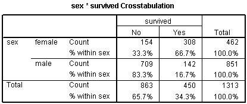
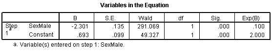

## Logistic regression

-   Binary outcome variable
-   Either categorical or continuous independent variables
-   Multiple variables (risk adjustment)
-   Interactions

::: notes

The logistic regression model is a model that uses a binary (two possible values) outcome variable. Examples of a binary variable are mortality (live/dead), and morbidity (healthy/diseased). Sometimes you might take a continuous outcome and convert it into a binary outcome. For example, you might be interested in the length of stay in the hospital for mothers during an unremarkable delivery. A binary outcome might compare mothers who were discharged within 48 hours versus mothers discharged more than 48 hours.

The covariates in a logistic regression model represent variables that might be associated with the outcome variable. Covariates can be either continuous or categorical variables.

For binary outcomes, you might find it helpful to code the variable using indicator variables. An indicator variable equals either zero or one. Use the value of one to represent the presence of a condition and zero to represent absence of that condition. As an example, let 1=diseased, 0=healthy.

Indicator variables have many nice mathematical properties. One simple property is that the average of an indicator variable equals the observed probability in your data of the specific condition for that variable.

A logistic regression model examines the relationship between one or more independent variable and the log odds of your binary outcome variable. Log odds seem like a complex way to describe your data, but when you are dealing with probabilities, this approach leads to the simplest description of your data that is consistent with the rules of probability.

:::

## A linear (additive) model for probability (1/4)

```{r}
#| label:  13-07-linear-1

data.frame(ga=28:34, pct_bf=4+2*(28:34))
```

::: notes

Let's consider an artificial data example where we collect data on the gestational age of infants (GA), which is a continuous variable, and the probability that these infants will be breast feeding at discharge from the hospital (BF), which is a binary variable. We expect an increasing trend in the probability of BF as GA increases. Premature infants are usually sicker and they have to stay in the hospital longer. Both of these present obstacles to BF.

A linear model for probability

A linear model would presume that the probability of BF increases as a linear function of GA. You can represent a linear function algebraically as

prob BF = a + b*GA

This means that each unit increase in GA would add b percentage points to the probability of BF. The table shown below gives an example of a linear function.

This table represents the linear function

prob BF = 4 + 2*GA

which means that you can get the probability of BF by doubling GA and adding 4. So an infant with a gestational age of 30 would have a probability of 4+2*30 = 64.

A simple interpretation of this model is that each additional week of GA adds an extra 2% to the probability of BF. We could call this an additive probability model.

:::

## A linear (additive) model for probability (2/4)

```{r}
#| label: 13.07-linear-2

data.frame(ga=28:34, pct_bf=4+2*(28:34)) %>%
  ggplot(aes(ga, pct_bf)) +
    geom_point() +
    expand_limits(x=c(27, 35)) +
    expand_limits(y=c(0, 100)) +
    geom_segment(x=27, y=58, xend=35, yend=74)
```

## A linear (additive) model for probability (3/4)

```{r}
#| label:  13-07-linear-3

data.frame(ga=28:34, pct_bf=4+2*(28:34)) %>%
  ggplot(aes(ga, pct_bf)) +
    geom_point() +
    expand_limits(x=0) +
    expand_limits(y=c(0, 100)) +
    geom_segment(x=0, y=4, xend=35, yend=74)
```


## A linear (additive) model for probability (4/4)

```{r}
#| label: 13-07-linear-4

data.frame(ga=28:34, pct_bf=4+3*(28:34))
```

::: notes

I'm not an expert on BF; what little experience I've had with the topic occurred over 40 years ago. But I do know that an additive probability model tends to have problems when you get probabilities close to 0% or 100%. Let's change the linear model slightly to the following:

prob BF = 4 + 3*GA

This model would produce the following table of probabilities.

You may find it difficult to explain what a probability of 106% means. This is a reason to avoid using a additive model for estimating probabilities. In particular, try to avoid using an additive model unless you have good reason to expect that all of your estimated probabilities will be between 20% and 80%.

:::

## A multiplicative model for probability (1/3)

```{r}
#| label: 13-07-multiplicative-1

data.frame(ga=28:34, pct_bf=0.01*3^(0:6))
```

::: notes

It's worthwhile to consider a different model here, a multiplicative model for probability, even though it suffers from the same problems as the additive model.

In a multiplicative model, you change the probabilities by multiplying rather than adding. Here's a simple example.

In this example, each extra week of GA produces a tripling in the probability of BF. Contrast this to the linear models shown above, where each extra week of GA adds 2% or 3% to the probability of BF.

A multiplicative model can't produce any probabilities less than 0%, but it's pretty easy to get a probability bigger than 100%. A multiplicative model for probability is actually quite attractive, as long as you have good reason to expect that all of the probabilities are small, say less than 20%.

:::

## A multiplicative model for probability (2/3)

```{r}
#| label: 13-07-multiplicative-2

data.frame(ga=28:34, pct_bf=0.01*3^(0:6)) %>%
  ggplot(aes(ga, pct_bf)) +
    geom_point() +
    geom_line()
```

## A multiplicative model for probability (3/3)

```{r}
#| label: 13-07-multiplicative-3

data.frame(ga=28:34, pct_bf=0.01*5^(0:6))
```

## The relationship between odds and probability

-   Usually only seen in gambling contexts
-   Sometimes ambiguous
    -   Odds in favor versus odds against
-   Prob = Odds / (1+Odds)
-   Odds = Prob / (1-Prob)
-   Examples
    -   3 to 1 odds in favor of winning
        -   Prob = 3 / (3+1) = 0.75
    -   20% chance of winning
        -   Odds = 0.2 / 0.8 = 1 / 4
        -   Odds of 4 to 1 against
    
::: notes

Another approach is to try to model the odds rather than the probability of BF. You see odds mentioned quite frequently in gambling contexts. If the odds are three to one in favor of your favorite football team, that means you would expect a win to occur about three times as often as a loss. If the odds are four to one against your team, you would expect a loss to occur about four times as often as a win.

You need to be careful with odds. Sometimes the odds represent the odds in favor of winning and sometimes they represent the odds against winning. Usually it is pretty clear from the context. When you are told that your odds of winning the lottery are a million to one, you know that this means that you would expect to having a losing ticket about a million times more often than you would expect to hit the jackpot.

It's easy to convert odds into probabilities and vice versa. With odds of three to one in favor, you would expect to see roughly three wins and only one loss out of every four attempts. In other words, your probability for winning is 0.75.

If you expect the probability of winning to be 20%, you would expect to see roughly one win and four losses out of every five attempts. In other words, your odds are 4 to 1 against.

The formulas for conversion are

odds = prob / (1-prob)

and

prob = odds / (1+odds).

In medicine and epidemiology, when an event is less likely to happen and more likely not to happen, we represent the odds as a value less than one. So odds of four to one against an event would be represented by the fraction 1/4 or 0.25. When an event is more likely to happen than not, we represent the odds as a value greater than one. So odds of three to one in favor of an event would be represented simply as an odds of 3. With this convention, odds are bounded below by zero, but have no upper bound.

:::

## A multiplicative odds model

```{r}
#| label: 13-07-multiplicative-odds-1

odds_bf <- round(3^(-3:3), 3)
n <- c(1, 1, 1, 1, 3, 9, 27)
interpretation <- paste0(rev(n), " to ", n)
data.frame(ga=28:34, odds_bf, interpretation)
```

::: notes

Let's consider a multiplicative model for the odds (not the probability) of BF.

This model implies that each additional week of GA triples the odds of BF. A multiplicative model for odds is nice because it can't produce any meaningless estimates.

It's interesting to look at how the logarithm of the odds behave.

Notice that an extra week of GA adds 1.1 units to the log odds. So you can describe this model as linear (additive) in the log odds. When you run a logistic regression model in SPSS or other statistical software, it uses a model just like this, a model that is linear on the log odds scale. This may not seem too important now, but when you look at the output, you need to remember that SPSS presents all of the results in terms of log odds. If you want to see results in terms of probabilities instead of logs, you have to transform your results.

Let's look at how the probabilities behave in this model.

Notice that even when the odds get as large as 27 to 1, the probability still stays below 100%. Also notice that the probabilities change in neither an additive nor a multiplicative fashion.

:::

## Linear (additive) on log-odds scale

```{r}
#| label: 13-07-log-odds-1
#| echo: false

data.frame(ga=28:34, odds_bf, log_odds=round(log(odds_bf), 2))
```


::: notes

If you take a logarithm of these odds, you will notice an interesting pattern. Each year of gestational age adds 1.1 to the log odds. The geeks will explain this as saying that a logistic regression is linear on the log odds scale.

:::

## The S-shaped logistic curve (1/2)

```{r}
#| label: 13-07-s-shape-1

prob_bf <- round(odds_bf/(1+odds_bf), 3)
data.frame(ga=28:34, odds_bf, prob_bf)
```

::: notes

You can also convert the odds into probabilities. Remember the formula? The probability of an events is the odds divided by 1 plus the odds.

The probabilities follow an S-shaped curve that is characteristic of all logistic regression models. The curve levels off at zero on one side and at one on the other side. This curve ensures that the estimated probabilities are always between 0% and 100%.

:::

## The S-shaped logistic curve (2/2)

```{r}
#| label: 13-07-s-shape-2

ga_extended <- seq(-4, 4, length=1001)
odds_extended <- 3^ga_extended
prob_extended <- odds_extended/(1+odds_extended)
data.frame(ga=ga_extended, prob_bf=prob_extended) %>%
  ggplot(aes(ga_extended, prob_bf)) +
    geom_line() +
    geom_point(
      data=data.frame(ga=-3:3, prob_bf),
      aes(ga, prob_bf))
```

## An example of a log odds model with real data (1/2)

```{r real-ga-data}
bf <- c(2, 2, 7, 7, 16, 14)
no <- c(4, 3, 2, 2,  4,  1)
df <- data.frame(
  ga=c(28:33,28:33),
  n=rep(1:0, each=6),
  w=c(bf, no))
glm(n~ga, family=binomial(), data=df, weights=w)
glm(n~ga, family=binomial(), data=df, weights=w) %>%
  tidy %>%
  select(term, estimate) %>%
  mutate(estimate=round(estimate, 2)) %>%
  data.frame -> m1
```

::: notes

Here are the results of a logistic regresion model with real data.

The output does not fit on a single slide, but the important things to note at the intercept and slope. The intercept and slope help you predict on the log odds scale.

I've simplified this data set by removing some of the extreme gestational ages. The estimated logistic regression model is

log odds = -16.72 + 0.58*GA

:::

##  Predicted log odds

```{r}
#| label: 13-07-predicted-log-odds

b0 <- round(m1[1, 2], 2)
b1 <- round(m1[2, 2], 2)
b0 %>%
  paste0("+") %>%
  paste0(b1) %>%
  paste0("*") %>%
  paste0(28:33) %>%
  data.frame %>%
  set_names("calculations") -> calculations
data.frame(ga=28:33) %>%
  bind_cols(calculations) %>%
  mutate(log_odds=b0+b1*(28:33)) %>%
  mutate(odds=round(exp(log_odds), 2)) %>%
  mutate(prob=round(odds/(1+odds), 2)) -> predictions
predictions %>%
  select(ga, calculations, log_odds)
```

## Predicted probabilities

```{r}
#| label: 13-07-predicted-probs

predictions %>%
  select(ga, log_odds, odds, prob)
```

## Plot of predicted probabilities

```{r}
#| label: 13-07-predicted-probs-plot

predictions %>%
  mutate(p=bf/(bf+no)) %>%
  ggplot(aes(ga, p)) +
    geom_point() +
    geom_line(aes(y=prob)) + 
    expand_limits(y=0:1)
```

## Predicted odds and odds ratios

```{r}
#| label: 13-07-predicted-odds

predictions$odds[-1] %>%
  paste0("/") %>%
  paste0(predictions$odds[-6]) %>%
  append("", after=0) %>%
  data.frame %>%
  set_names("calculations") -> calculations
predictions$odds[-1] %>%
  divide_by(predictions$odds[-6]) %>%
  round(2) %>%
  append("", after=0) %>%
  data.frame() %>%
  set_names("or") -> or
predictions %>%
  select(ga, log_odds, odds) %>%
  bind_cols(calculations) %>%
  bind_cols(or)
```

::: notes

The table below shows the predicted log odds, and the calculations needed to compute the predicted log odds.

You might also want to take note of the predicted odds. Notice that the ratio of any odds to the odds in the next row is 1.78. For example,

3.20/1.80 = 1.78

5.70/3.20 = 1.78

It's not a coincidence that you get the same value when you exponentiate the slope term in the log odds equation.

exp(0.59) = 1.78

This is a general property of the logistic model. The slope term in a logistic regression model represents the log of the odds ratio representing the increase (decrease) in risk as the independent variable increases by one unit.

It's not a coincidence that you get the same value when you exponentiate the slope term in the log odds equation.

exp(0.59) = 1.78

This is a general property of the logistic model. The slope term in a logistic regression model represents the log of the odds ratio representing the increase (decrease) in risk as the independent variable increases by one unit.

:::

## Interpretation of slope in logistic regression

-   Slope in logistic regression
    -   log odds ratio
        -   for one unit change in x
    -   exponentiate to get odds ratio
  
```{r}
#| label: 13-07-odds-ratio-calculation
#| echo: true

exp(0.58)
```

  
## Categorical variables in a logistic regression (1/2)



::: notes

You treat categorical variables in much the same way as you would in a linear regression model. Let's start with some data that listed survival outcomes on the Titanic. That ship was struck by an iceberg and 863 passengers died out of a total of 1,313. This happened during an era where there was a strong belief in "women and children" first.

You can see this in the crosstabulation shown above. Among females, the odds of dying were 2-1 against, because the number of survivors (308) was twice as big as the number who died (154). Among males, the odds of dying were almost 5 to 1 in favor (actually 4.993 to 1), since the number who survived (142) was about one-fifth the number who died (709).

The odds ratio is either 0.1 or 10 depending on whether you look at mortality versus survival and whether the odds for men are in the numerator or the denominator.

:::

## Categorical variables in a logistic regression (2/2)



::: notes

Let's start with the CONSTANT row of the data. This has an interpretation similar to the intercept in the linear regression model. the B column represents the estimated log odds when SexMale=0. Above, you saw that the odds for dying were 2 to 1 against for females, and the natural logarithm of 2 is 0.693. The last column, EXP(B) represents the odds, or 2.000. You need to be careful with this interpretation, because sometimes SPSS will report the odds in favor of an event and sometimes it will report the odds against an event. You have to look at the crosstabulation to be sure which it is.

The SexMale row has an interpretation similar to the slope term in a linear regression model. The B column represents the estimated change in the log odds when SexMale increases by one unit. This is effectively the log odds ratio. We computed the odds ratio above, and -2.301 is the natural logarithm of 0.1. The last column, EXP(B) provides you with the odds ratio (0.100).

Coding is very important here. Suppose you had chosen the coding for SexFemale where1=female and 0=male. You would get an odds ratio of 10 (actually 9.986) instead of 0.1.

:::

## Alternatives to logistic regresion

-   Test of two proportions
    -   Only for a binary independent variable
    -   No risk adjustments or interactions
-   Chisquare test
    -   Only for a categorical independent variable
    -   Either two or more than two levels
  
## What if your outcomes is categorical but not binary?

-   Three of more levels
    -   Chi-square test
    -   Multinomial logistic regression
-   Ordinal outcome variable
    -   Nonparametric tests
    -   Ordinal logistic regression

## Categorical outcomes -- summary

-   Logistic regression
    -   Binary outcome variable
    -   Both categorical and continuous independent variables
    -   Risk adjustments and interactions possible
-   Alternative methods
    -   Test of two proportions
    -   Chi-square test
    -   Multinomial logistic regression.
    -   Nonparametric tests
    -   Ordinal logistic regression
  
::: notes

We spent a lot of time on logistic regression. It was worth it because logistic regression is useful in many research settings. We'll go a bit faster for the remaining models.

:::

