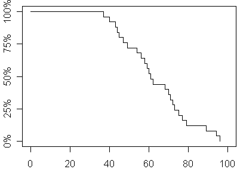
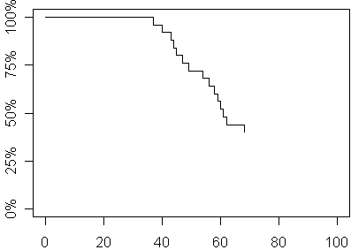
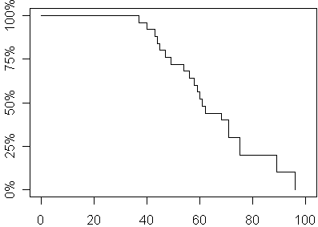
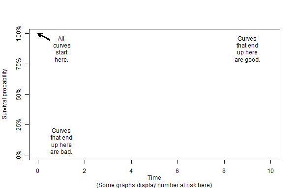
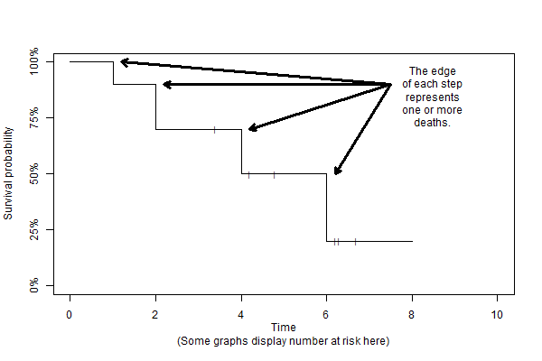
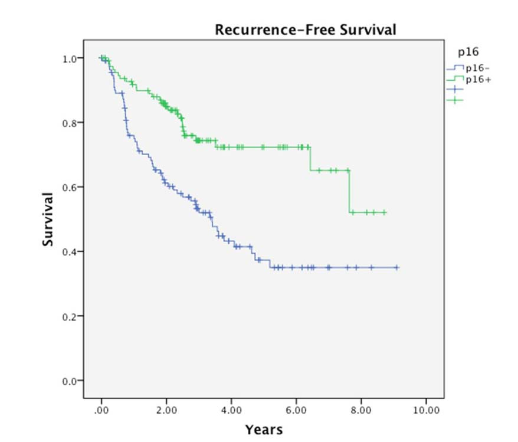
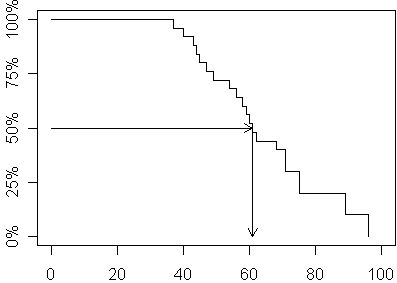
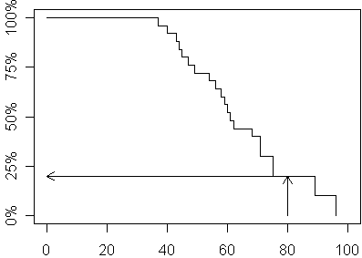
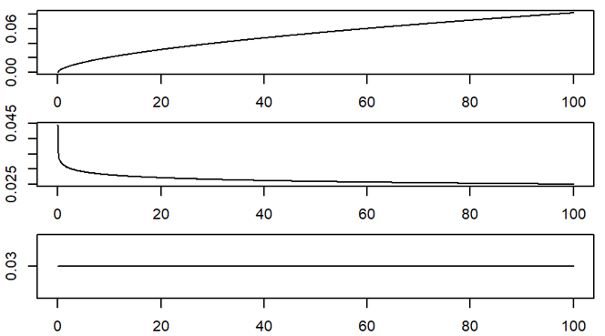

## Time to event outcomes

-   Special type of ratio scale outcome
    -   Non-negative
    -   Usually skewed
-   Censoring
    -   Partial information on some subjects
    -   Not the same as missing data
  
::: notes

Survival data models provide interpretation of data representing the time until an event occurs. In many situations, the event is death, but it can also represent the time to other bad events such as cancer relapse or failure of a medical device. It can also be used to denote time to positive events such as pregnancy.

Survival data models also incorporate one of the complexities of "time to event" data, the fact that not all patients experience the event during the time frame of the study. So, if we are doing a five year mortality study, we have the problem of those stubborn patients who refuse to die during the study period. Other patients may move out of town halfway through the study and are lost to follow-up. In a study of medical devices, sometimes the device continues to work up to a certain time, but then has to be removed, not because the device failed, but because the patient got healthier and no longer needed the device.

These observations are called censored observations. With censored observations, the actual time of the event is unknown but we do know that it would not be any earlier than the time that the last evaluation or follow-up visit was done. These censored observations provide partial information. They influence our estimates of survival probability up to the last evaluation or follow-up, but do not provide any information about survival probabilities beyond that point. To disregard this information is dangerous and could seriously bias your results.

:::
  
## Fruit fly experiment - the data

```{}
Day      Day      Day      Day     
 37       40       43       44    
 45       47       49       54    
 56       58       59       60    
 61       62       68       70    
 71       72       73       75    
 77       79       89       94    
 96    
```

::: notes

The following data represents survival time for a group of fruit flies and is a subset of a larger data set found at the Data and Story Library (DASL). The data set has been slightly modified to simplify some of these explanations.

There are 25 flies in the sample, with the first fly dying on day 37 and the last fly dying on day 96.

:::

## Fruit fly experiment - survival probabilities

```{}
Day Prob Day Prob Day Prob Day Prob
 37 96%   40 92%   43 88%   44 84%
 45 80%   47 76%   49 72%   54 68%
 56 64%   58 60%   59 56%   60 52%
 61 48%   62 44%   68 40%   70 36%
 71 32%   72 28%   73 24%   75 20%
 77 16%   79 12%   89  8%   94  4%
 96  0%
```

::: notes

If you wanted to estimate the survival probability for this data, you would draw a curve that decreases by 4% (1/25) every time a fly dies.

:::

## Here's a graph of these probabilities over time.



::: notes

By tradition and for some rather technical reasons, you should use a stair step pattern rather than a diagonal line to connect adjacent survival probabilities.

Now let's alter the experiment. Suppose that totally by accident, a technician leaves the screen cover open on day 70 and all the flies escape. This includes the fly who was going to die on the afternoon of the 70th day anyway. Oh the sadness of it all; the poor fly has the briefest of tastes of freedom then ends up shriveled up on a window sill.

You're probably worried that the whole experiment has been ruined. But don't be so pessimistic. You still have complete information on survival of the fruit flies up to their 70th day of life. Here's how you would present the data and estimate the survival probabilities.

:::

## The data, round 2

```{}
Day Prob  Day Prob  Day Prob  Day Prob
 37 96%    40 92%    43 88%    44 84%
 45 80%    47 76%    49 72%    54 68%
 56 64%    58 60%    59 56%    60 52%
 61 48%    62 44%    68 40%    70+ ?
 70+ ?     70+ ?     70+ ?     70+ ?
 70+ ?     70+ ?     70+ ?     70+ ?
 70+ ?
```

## The graph, round 2



::: notes

We clearly have enough data to make several important statements about survival probability. For example, the median survival time is 61 days because roughly half of the flies had died before this day.

Here is a graph of the survival probabilities of the second experiment. This graph is identical to the graph in the first experiment up to day 70 after which you can no longer estimate survival probabilities.

By the way, you might be tempted to ignore the ten flies who escaped. But that would seriously bias your results. All of these flies were tough and hardy flies who lived well beyond the median day of death. If you pretended that they didn't exist, you would seriously underestimate the survival probabilities. The median survival time, for example, of the 15 flies who did not escape, for example, is only 54 days which is much smaller than the actual median.

Let's look at a third experiment, where the screen cover is left open and all but four of the remaining flies escape. It turns out that those four remaining flies who didn't bug out will allow us to still get reasonable estimates of survival probabilities beyond 70 days. Here is the data and the survival probabilities.

:::

## The data, round 3

```{}
Day Prob  Day Prob  Day Prob  Day Prob
 37 96%    40 92%    43 88%    44 84%
 45 80%    47 76%    49 72%    54 68%
 56 64%    58 60%    59 56%    60 52%
 61 48%    62 44%    68 40%    70+ ?
 71 30%    70+ ?     70+ ?     75 20%
 70+ ?     70+ ?     89 10%    70+ ?
 96  0%
```

## The graph, round 3



::: notes

What you do with the six escaped flies is to allocate their survival probabilities equally among the four flies who didn't bug out. This places a great responsibility among each of those four remaining flies since each one is now responsible for 10% of the remaining survival probability, their original 4% plus 6% more which represents a fourth of the 24% survival probability that was lost with the six escaping flies.

Another way of looking at this is that the six flies who escaped influence the denominator of the survival probabilities up to day 70 and then totally drop out of the calculations for any further survival probabilities. Because the denominator has been reduced, the jumps at each remaining death are much larger.

Here is a graph of the survival probability estimates from the third experiment.

These survival probabilities differ only slightly from the survival probabilities in the original experiment. This works out because the mechanism that caused us to lose information on six of the fruit flies was independent of their ultimate survival.

If the censoring mechanism were somehow related to survival prognosis, then you would have the possibility of serious bias in your estimates. Suppose for example, that only the toughest of flies (those with the most days left in their short lives) would have been able to escape. The flies destined to die on days 70, 71, 72, and 73, were already on their deathbeds and unable to fly at all, much les make a difficult escape. Then these censored values would not be randomly interspersed among the remaining survival times, but would constitute some of the larger values. But since these larger values would remain unobserved, you would underestimate survival probabilities beyond the 70th day.

This is known as informative censoring, and it happens more often that you might expect. Suppose someone drops out of a cancer mortality study because they are abandoning the drugs being studied in favor of laetrile treatments down in Mexico. Usually, this is a sign that the current drugs are not working well, so a censored observation here might represent a patient with a poorer prognosis. Excluding these patients would lead to an overestimate of survival probabilities.

:::

## Happy and sad corners for the Kaplan-Meier curve



::: notes

Let's also talk about the happy and sad regions of a Kaplan-Meier graph.

Normally the Kaplan-Meier curve starts in the upper left corner of the graph. At time = 0, everyone has survived. Now there are two possibilities. Everyone could die very quickly and the curve drops rapidly to the lower left region. This is the unhappy region. Most people are dead in a very short time.

If the curve is not very steep and extends in the upper right corner, that means that most people are still alive after a long amount of time. Hooray! This is the happy corner for the Kaplan-Meier curve. 

:::

## Cox regression



::: notes

The sudden drops in a Kaplan-Meier curve occur at any event. The size of the drops is a rough indication of the sample size. A small sample size has big drops, and a large sample size, where you divide up the mortality probability among a larger number of people, has smaller drops.

Because of censoring, the size of the drops will increase over time. Sometimes this is barely noticeable. But if you get from a region with small drops to a region with large drops, this represents a loss of precision because many of your patients dropped out before they could contribute to the mortality probability at the later time points.

:::

## Cox regression



::: notes

Here's a nice pair of Kaplan-Meier curves. The outcome is a composite: recurrence-free survival. An event is either death or cancer recurrence. p16 is a genetic marker. The vertical lines represent censored observations. The survival probability does not change when a patient drops out, only when they die or have a recurrence.

Notice that the green curve, p16+, is closer to the happy upper right hand corner. The blue curve, p16-, is closer to the sad lower left hand corner. The drops get pretty big after 6 years indicating that we have not so much precision this far out in time.

:::

## Estimating the median and other percentiles



::: notes

When you see a survival curve in a research paper, there are two ways to interpret it. First, you can get an estimate of the median (or other percentiles) by projecting horizontally until you intersect with the survival curve and then head down to get your estimate. In the survival curve we have just looked at, you would estimate the median survival as slightly more than 60 days.

:::

## Estimating a fixed time survival probability



::: notes

You can also estimate probabilities for survival at any given time by projecting up from the time and then moving to the left to estimate the probability. In the example below, you can see that the 80 day survival probability is a little bit less than 25%.

:::

## Cox regression



::: notes

The Cox regression model is written in terms of the hazard function. The hazard function is the short term rate of death adjusted for the number of people still alive and still in the study. These graphs show an increasing, decreasing, and constant hazard.

The math for hazard functions gets a bit messy, so I only want to talk about hazard functions in a conceptual sense.

An increasing hazard means that the older you get, the higher the probability that you will experience the event. This is the most common pattern and it shows a deterioration with age.

Once in a while you see the reverse pattern, though. A decreasing hazard means that the older you get, the tougher you get. You are at greater risk of dying early in your life. This actually does happen in the neonatology ward. The most dangerous day in your lifetime was the very first day of your life.

An even more unusual pattern is the constant hazard. This is a Peter Pan model. Your short term risk of dying never changes. You don't get weaker over time, and you don't get stronger. The Grim Reaper gets us all eventually, but he doesn't spend most of his time at the old folks home.

These last two examples occur more frequently in Engineering applications than in medicine.

:::

## Alternatives to Cox regression

-   Log rank test
    -   Single categorical indpendent variable
    -   Any number of levels
-   Parametric survival models
    -   Requires much stronger assumptions
    -   Exponential, Weibull, or other distribution
    -   Can extrapolare beyond the range of the data
  
::: notes

The Cox regression model is very flexible, but for simple cases, a single categorical independent variable, the log rank test is sometimes used instead. There are also some parametric survival models where you assume that the survival times follow an exponential, Weibull, or other distribution. These have an advantage in that you can extrapolate beyond the range of the data, but please do this carefully.

:::

## Cox regression - summary

-   Time-to-event outcome
-   Continuous or categorical independent variables
-   Mutiple independent variables
    -   Risk adjustment
    -   Interactions
-   Alternatives
    -   Log rank test
    -   Parametric models
  
::: notes

The time to event outcomes use a Cox regression model. We didn't have time for a lot of examples, but the Cox regression model can handle continuous or categorical independent variables, multiple independent variables, risk adjustment, and interactions.

In some simpler setting with just a single independent variable and a categorical one, to boot, you can use the log rank test. Another alternative you might see is a parametric survival model.

:::
  
## Summary - the big four models
-   Linear regression
-   Logistic regression
-   Poisson regression
-   Cox regression
-   All very flexible
    -   Allow categorical and continuous independent variables
    -   Allow for risk adjustments and interactions

::: notes

I tend to choose almost exclusively from these four regression models because they are all very flexible. It doesn;t matter whether your independent variable is categorical or continuous. You can have multiple independent variables, risk adjustment, and interactions.

There are lots of alternatives, but they typically have lots of limitations or can only accept certain types of independent variables.

:::

