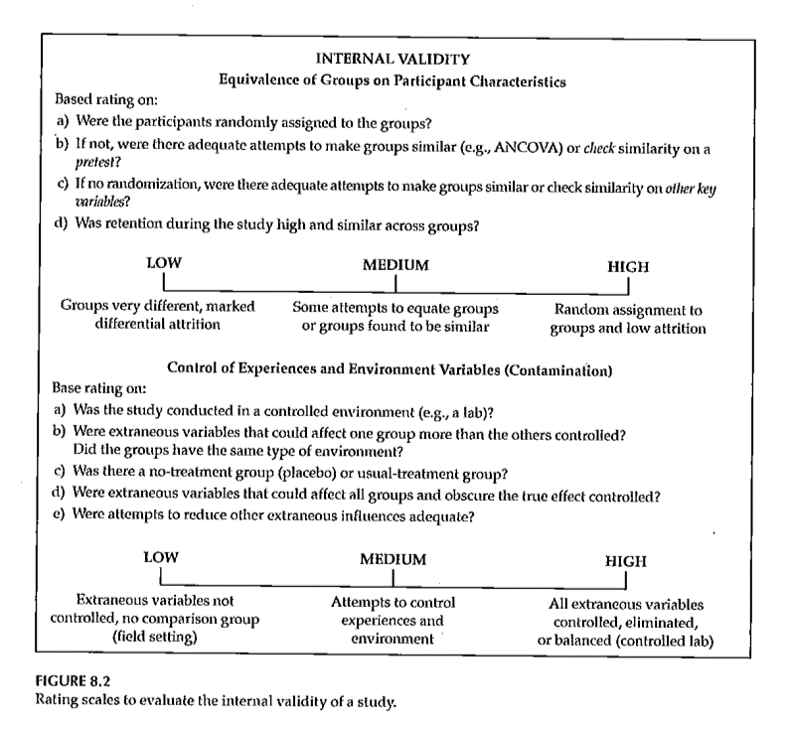
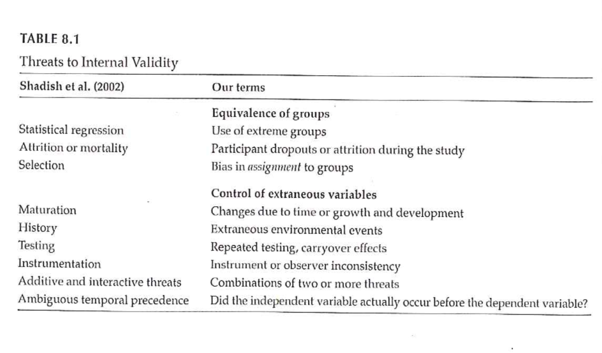
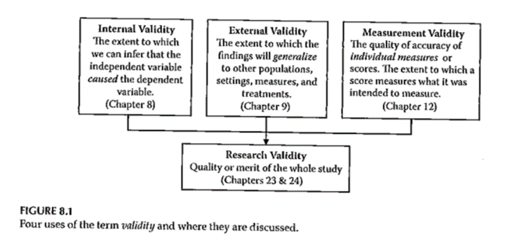
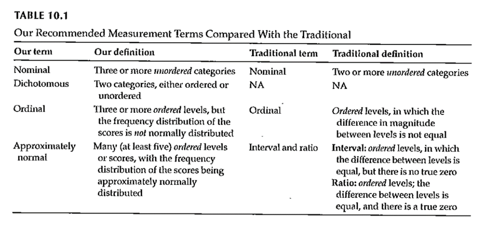
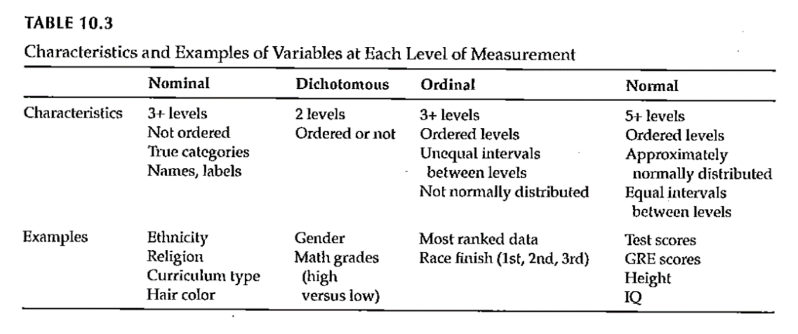
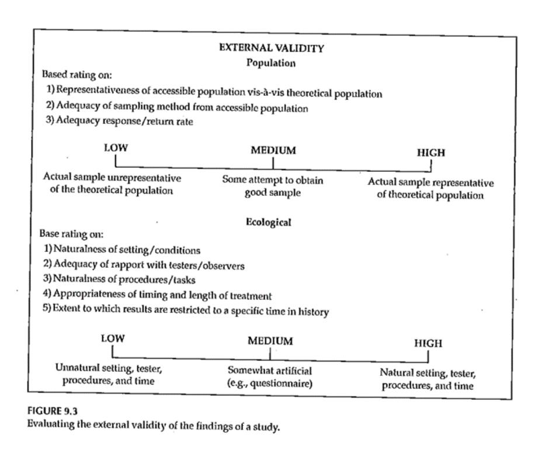
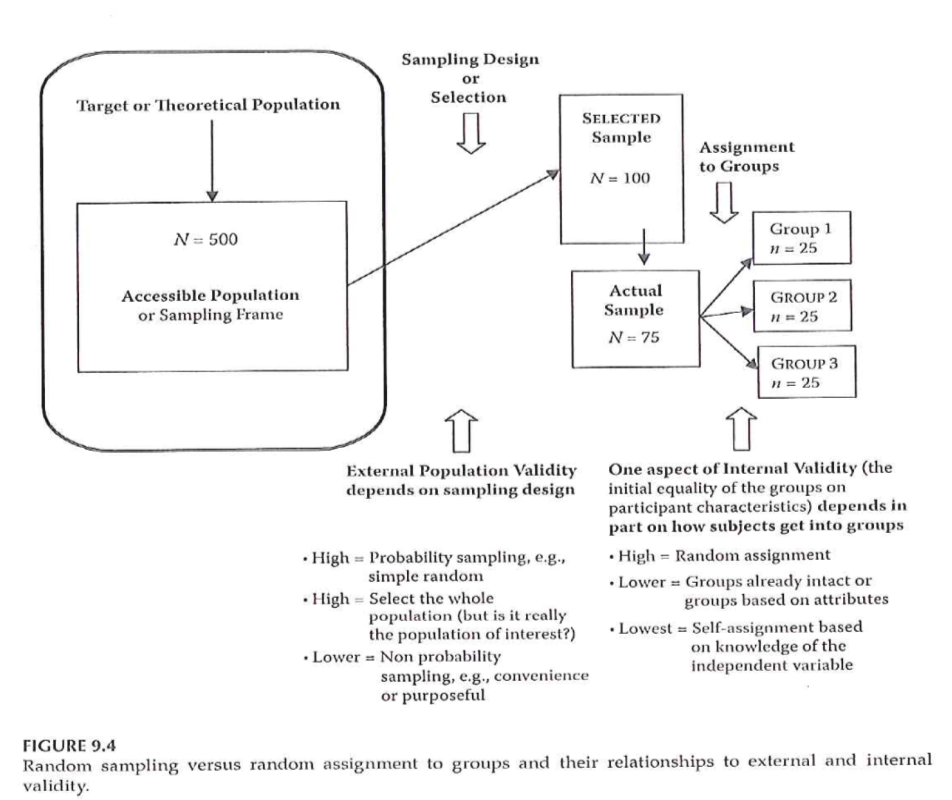

```{r echo=FALSE}
source("prelims.R", echo=FALSE)
```

### Sampling 

+ Sample size
	+ General rules
		+ Representativeness vs number
		+ Impact of having very large sample sizes
	+ Generally –
		+ Need sample to be large enough so you don’t miss important findings
		+ If very large sample, need to distinguish statistical significance vs clinically important

<div class="notes">

How many people do I need. This best done using a power analysis. Take account of the measures being used and what you expect to see. Information from previous research or other kinds of things.

Representativeness is more important than the absolute size of the sample.

Large enough so you don't miss important findings.

In cases with really large sample sizes where you get statistical significance without practical significance. Effects.

</div>


### Internal Validity 

+ “The extent to which we can infer that the independent variable *caused* the dependent variable.”
	+ For non-experimental studies –
		+ How “well designed and conducted” was the study?
+ Three criteria for causality

<div class="notes">

It's really only randomized trials that can establish causality. But even in quasi-experimental and non-experimental studies, you can still talk about internal validity.

The cause has to precede the effect, it must be connected to the effect, and there must be no other variables that could explain why the cause is related to the effect.

</div>

***
### Internal Validity 

+ “The extent to which we can infer that the independent variable *caused* the dependent variable.”
+ Three criteria for causality
	+ IV *must precede* the outcome variable
	+ IV *must be related* to the outcome
	+ There must be no other variables that could explain why the IV is related to the outcome

<div class="notes">


</div>

***
### Internal Validity 

+ Three criteria for causality –
	+ IV *must precede* the outcome variable
	+ IV *must be related* to the outcome
	+ There must be no other variables that could explain why the IV is related to the outcome
+ By Research Approach –
	+ Randomized Exp
	+ Quasi- Exp
	+ Comparative
	+ Associational
	+ Descriptive

<div class="notes">


</div>

***
### Internal Validity 

```{r tbl5, echo = FALSE, eval=FALSE}
tbl5 <- tibble::tribble(
~`Criteria for Causality`, ~`Randomized Exp`, ~`Quasi-Exp`, ~`Comparative`, ~`Associational`, ~`Descriptive`,
"IV must precede the outcome variable","Met","Often met","Sometimes met, but order might not be clear","Sometimes met, but order might not be clear","NA",
"IV must be related to the outcome","Met","Usually met","Usually met","Usually met","NA",
"There must be no other variables that could explain why the IV is related to the outcome","Met","Met in the strongest designs","Not possible","Not possible","NA"
)

kableExtra::kable_styling(knitr::kable(tbl5), font_size = 18)
```

<div class="notes">

For randomized designs, the cause precedes the effect, the cause is related to the outcome and there are no other variables that could explain the relationship.

</div>

***
### Internal Validity 

+ Meeting the 3 causality criteria based on –
	+ Strength of the research design
	+ Internal validity

<div class="notes">

The strength of the research design and the internal validity determine whether you can claim causality. Try to design the study to maximize internal validity. 

</div>

***
### Internal Validity 

+ Internal validity -
	+ Most often discussed with reference to randomized experimental and quasi-experimental designs
	+ Can also be applied to non-experimental studies

<div class="notes">


</div>

***
### Internal Validity 

+ Evaluating the internal validity of a study –
	+ Equivalence of the groups on participant characteristics
	+ Control of extraneous experiences and environmental variables

<div class="notes">

There are two aspects of internal validity, equivalence and control.

</div>

***
### Internal Validity 

+ Equivalence of the groups on participant characteristics –
	+ Are groups equivalent prior to introduction of IV?
		+ Randomized experimental design –
			+ Random assignment
		+ Quasi-experimental design –
			+ Random assignment of treatments
			+ Matching
			+ Checking pretest scores

<div class="notes">

Random assignment assures equivalence of the two groups on average. A rule of thumb is 30 people assigned to each group should give you confidence that random assignment will assure equivalence. If you are using random assignment, you should not need to test for baseline equivalence. We feel that random assignment is the best way to achieve equivalence.

In quasi-experimental design, you don't have random assignment, but you can randomly assign between the two groups. You can also use matching to achieve equivalence. Finally, you can check baseline scores for equivalence.

</div>

***
### Internal Validity 

+ Equivalence of the groups on participant characteristics –
	+ Are groups equivalent prior to introduction of IV?
		+ Comparative design –
			+ Statistical adjustment (ANCOVA) to adjust DV scores to make groups more nearly equivalent
			+ Matching participants on variables other than the primary IV
				+ E.g. Case-control study
			+ Check after the study for comparability

<div class="notes">

Since non-randomized trials have an attribute variable, you need to rely on statistical adjustment or matching. You can also check after the study for comparability.

</div>

***
### Internal Validity 

+ Equivalence of the groups on participant characteristics –
	+ Are groups equivalent prior to introduction of IV?
		+ Associational design –
			+ Only 1 group
			+ Not able to provide evidence of causation
			+ “Equivalence” – “… whether those who score high on the IV … are similar to those … who score low in terms of other attributes that may be related to the DV.”
			+ May be able to provide some statistical control

<div class="notes">

Equivalence when you have a continuous independent variable means that those who score high on the variable are similar to those who score low.

</div>

***
### Internal Validity 

+ Control of extraneous experiences and environmental variables –
	+ Extraneous variables – variables other than the IV and DV
	+ Environmental variables – conditions/variables that occur during the study
	+ Contamination
	+ Issue – Is one group affected more than the other(s)?
	+ Less of an issue with a more controlled research setting

<div class="notes">

Your study could be contaminated by other variables. These variables might be out of your control but which can influence the outcome.

Contamination: people in the intervention group are friends with the control group and share information.

The key issue is whether one group is more affected by extraneous variables.

In a controlled setting, there are fewer extraneous variables, but this changes in a field setting.

</div>

***
### Internal Validity 

+ Rating the dimensions of internal validity
	+ Figure 8.2
	+ Evaluating Research Validity framework
	+ “Good” study – moderate to high internal validity on both dimensions

<div class="notes">

Internal validity is measured by whether the two dimensions are addressed.

</div>

***
### Internal Validity 



<div class="notes">

Figure 8.2. 

</div>

***
### Threats to Internal Validity 



<div class="notes">

Table 8.1 relates statistical terminology to identify threats to internal validity. This table tries to take those technical terms and express them 

Extreme groups have issues with regression to the mean. Even without any intervention, the extremities will tend to lessen.

Dropouts or attrition means that you've designed a setting that is so difficult that no one can stay in. Differential attrition is especially troublesome.

Bias in assignment occurs when patients or their physicians directly or indirectly influence the assignment. Random assignment eliminates this bias.

Cook and Campbell.

</div>

***
### Threats to Internal Validity 

+ Equivalence of Groups
	+ Use of extreme groups
	+ Participant dropouts or attrition during the study
	+ Bias in assignment to groups

<div class="notes">


</div>

***
### Threats to Internal Validity 

+ Control of extraneous/environmental variables
	+ Changes due to time or growth and development
	+ Extraneous environmental events
	+ Repeated testing, carryover effects
	+ Instrument or observer inconsistency
	+ Combinations of two or more threats
	+ Did the IV actually occur before the DV?

<div class="notes">

Here are some of the sources of extraneous variables. 

Maturation.

History. Something that occurs between the pre and post measurements that is independent of the intervention but which can influence the outcome.

Worry about sensitization to the issue in the baseline measurement that causes people to go out and find more.

Long studies have problems with instrumentation or observers (e.g., because of turnover).

There are also combinations of these events where one magnifies the other.

Temporal order of the variables. If you can't assure that the independent variable occurs before the dependent variable, you can't establish causation.

</div>

***
### Threats to Internal Validity 

+ Other threats
	+ Effects of being in the control group
	+ Expectation effect
		+ Control for expectation
	+ Observer / experimenter bias

<div class="notes">

Control group contamination. Demoralization.

Hawthorne effect.

Blinding helps control for expectation effects and observer bias.

</div>

***
### Validity 


<div class="notes">

Here is figure 8.1 again. The next part of this lecture talks about sampling and external validity.

</div>

***
### Validity 



<div class="notes">

Here is figure 8.1 again. The extent to which results will generalize.

</div>

***

### Measurement 

+ What do we mean “ measurement ” ?
	+ assignment of numbers or symbols to the different levels or values of variables according to rules. ” 

<div class="notes">

We are talking about measurement this week. You are either taking stats or have taken it in the past. This is not a statistics class. Think about what type of variables you will collect and propose what statistical analysis.

Your book defines it as the assignment of numbers or symbols. Notice that this takes a quantitative approach. But even in a qualitative study, you still going to want to summarize information like demographics of your sample. Describe the quality or quantity of a variable.

There are qualitative or quantitative ways to measure things like pain.

We can also use measurements to make absolute decisions. Establish a cut-point. 

Conditions, distinctions.

</div>

***
### Measurement 

+ Assigning a number to represent …
	+ Continuous value
	+ Discrete value
+ Precision of measurement
	+ Continuous variable …
	+ Discrete variable …

<div class="notes">

Value that is assigned can take on any value. Preciseness is dependent on the device used to collect the measurement. It could be the precision of a laser versus a cruder measure. Precision should be appropriate to what you are trying to get at. Lack precision does not mean that your results are not continuous. If you round to the nearest inch, you still are measuring an underlying construct that can take on more precision. Example is blood pressure, interbeat interval, where rounding is done but it still represents a continuous variable.

Discrete values because of rounding, using counts, or a limited number of categories. As long as it represents an underlying construct, consider it as continuous.

</div>

***
### Measurement 

+ What is the measurement representing?
	+ Actual measurement …
		+ Length, time, …
	+ Indirect measurement
		+ Constructs
+ Whatever you are trying to measure ..
	+ Must be able to define it!

<div class="notes">

A survey or scale to get at depression, pain, those kind of things. These are abstract variables.

Bottom line is to define and operationalize how you measure something. It's easy to say something like quality of life but you have to pin this down and establish measurement validity. Consistency is important to avoid measurement bias.

Even for pretty obvious values like blood pressure, there are different ways to measure and you need to choose a single method for consistency and careful control, and when there are multiple methods, chose the method that is optimal for your needs. Blood pressure, for example, can be influenced by whether you are sitting or standing and whether you are talking while the measurement is being done.

Formalizing the rules for measurement helps reduce bias. This is a real concern when you have a variety of people doing the same measurements. How are new hires trained? Can you verify that they are trained to the standard that you have promised.

</div>

***
### Measurement 

+ Traditional levels (scales) of measurement
	+ Nominal
	+ Ordinal
	+ Interval
	+ Ratio

<div class="notes">

Nominal means names, classification, or categorical assignment. Names are mutually exclusive and exhaustive. Value that is shown is a number code or a text word. 

Ordinal is similar to nominal plus some orderliness as to what those responses mean. Example five point scale.

There is no true zero point. Can't perform arithmetic operatitons on ordinal variables.

You can talk about the direction of change.

Interval - difference between levels is consistent across the range of the scale.

Ratio. There is a true zero point.

</div>

***
### Measurement 

+ Authors categorization of levels of measurement
	+ Nominal
	+ Dichotomous
	+ Ordinal
	+ Normally distributed
+ Table 10.1

<div class="notes">

Gliner et al have a slightly different take. They talk about a normally distributed scale. It is hard to talk about the difference between ordinal and interval. 

Look at the literature in the area you work with. Several Likert scales summed to get a subscale.

</div>

***
### Measurement 



<div class="notes">

Table 10.1. This scale splits nominal into those with two levels (dichotomous, also known as binary) and more than two levels (nominal).

Remember how you coded nominal variables. You can (and should) use zero-one coding for dichotomous variables.

The average of a zero-one coded variable represents a probability.

Approximately normal scale requires at least five levels accorind to Gliner et al.

</div>

***
### Measurement 



<div class="notes">

Table 10.3 gives examples of the Gliner et al scales.

</div>

***
### Measurement 

+ Why does the scale of measurement matter?
	+ How it reflects your design and your research question
	+ How it determines the types of statistical analyses you will do
	+ How it defines what you can say about your results

<div class="notes">

The level of measurement comes from what you are trying to get at in your research.

Measurement scales can limit what you can say about your results.

</div>


### External Validity 

+ Generalizability
	+ Fig. 9.3
	+ Evaluating Research Validity Framework
	+ Two main aspects
		+ Population external validity
		+ Ecological external validity

<div class="notes">

The extent to which results can be generalized beyond this study. Extrapolate to the bigger world.

Evaluating freamework (questions 14 and 15). 

Population: how participants were selected.

Ecologic validity: the more control you have, the better the internal validity but the less like it is for real world. The naturalness of the setting, rapport.

Figure 9.3. 

</div>


### External Validity 

+ Population external validity
	+ How participants were selected for the study?
	+ Is sample representative of the target population?
	+ Validity framework

<div class="notes">


</div>


### External Validity 

+ Ecological external validity
	+ Whether the results can be generalized to real-life outcomes
	+ Trade-off with control of study
	+ Validity framework

<div class="notes">


</div>


### External Validity 



<div class="notes">


</div>


### Sampling and Validity 



<div class="notes">

Figure 9.4. External validity is influenced by the sampling process. Internal validity is influenced by the allocation of this sample to treatment groups.

</div>

***
### Measurement Validity 

+ Internal structure evidence –
	+ “Evidence from several types of analysis, including factor analysis and differential item functioning …”
	+ Does an analysis of the internal structure of a measure match the conceptual framework?

<div class="notes">

Factor analysis is a method of grouping items representative of individual constructs.

In the week 9 folder is the MOTIV* document. The CES-D score has twenty items rated on a 0 to 4 scale, with four of the items reverse scaled. 

There is a somatic factor in this scale. This might be considered a subscale. Run a factor analysis, even though it only has four levels. Do the items all hang together.


</div>

***
### Measurement Validity 

+ Factor analysis – Beliefs about ART measure
+ The following questions involve your personal views about the HIV medications that have been prescribed for you.  Please indicate the extent to which you agree or disagree with the following statements.
+ Response scale: 1 (strongly disagree), 2 (disagree), 3 (uncertain), 4 (agree), 5 (strongly agree)

<div class="notes">

The ones in yellow. Multiple items to represent a measure. Is there variability in any of those items. If you had selected one and only one item, it might be influenced by external factors like your mood. Multiple items avoid this problem.

The N items had Cronbach's alpha of ?? and the C items had Cronbach's alpha of ??.

A factor analysis allows us to see if the measure is behaving the way we expect it to.

</div>

### Sampling 

+ Sample size
	+ General rules
		+ Representativeness vs number
		+ Impact of having very large sample sizes
	+ Generally –
		+ Need sample to be large enough so you don’t miss important findings
		+ If very large sample, need to distinguish statistical significance vs clinically important

<div class="notes">

How many people do I need. This best done using a power analysis. Take account of the measures being used and what you expect to see. Information from previous research or other kinds of things.

Representativeness is more important than the absolute size of the sample.

Large enough so you don't miss important findings.

In cases with really large sample sizes where you get statistical significance without practical significance. Effects.

</div>


### Internal Validity 

+ “The extent to which we can infer that the independent variable *caused* the dependent variable.”
	+ For non-experimental studies –
		+ How “well designed and conducted” was the study?
+ Three criteria for causality

<div class="notes">

It's really only randomized trials that can establish causality. But even in quasi-experimental and non-experimental studies, you can still talk about internal validity.

The cause has to precede the effect, it must be connected to the effect, and there must be no other variables that could explain why the cause is related to the effect.

</div>

***
### Internal Validity 

+ “The extent to which we can infer that the independent variable *caused* the dependent variable.”
+ Three criteria for causality
	+ IV *must precede* the outcome variable
	+ IV *must be related* to the outcome
	+ There must be no other variables that could explain why the IV is related to the outcome

<div class="notes">


</div>

***
### Internal Validity 

+ Three criteria for causality –
	+ IV *must precede* the outcome variable
	+ IV *must be related* to the outcome
	+ There must be no other variables that could explain why the IV is related to the outcome
+ By Research Approach –
	+ Randomized Exp
	+ Quasi- Exp
	+ Comparative
	+ Associational
	+ Descriptive

<div class="notes">


</div>

### Internal validity

<div class="notes">

For randomized designs, the cause precedes the effect, the cause is related to the outcome and there are no other variables that could explain the relationship.

</div>

***
### Internal Validity 

+ Meeting the 3 causality criteria based on –
	+ Strength of the research design
	+ Internal validity

<div class="notes">

The strength of the research design and the internal validity determine whether you can claim causality. Try to design the study to maximize internal validity. 

</div>

***
### Internal Validity 

+ Internal validity -
	+ Most often discussed with reference to randomized experimental and quasi-experimental designs
	+ Can also be applied to non-experimental studies

<div class="notes">


</div>

***
### Internal Validity 

+ Evaluating the internal validity of a study –
	+ Equivalence of the groups on participant characteristics
	+ Control of extraneous experiences and environmental variables

<div class="notes">

There are two aspects of internal validity, equivalence and control.

</div>

***
### Internal Validity 

+ Equivalence of the groups on participant characteristics –
	+ Are groups equivalent prior to introduction of IV?
		+ Randomized experimental design –
			+ Random assignment
		+ Quasi-experimental design –
			+ Random assignment of treatments
			+ Matching
			+ Checking pretest scores

<div class="notes">

Random assignment assures equivalence of the two groups on average. A rule of thumb is 30 people assigned to each group should give you confidence that random assignment will assure equivalence. If you are using random assignment, you should not need to test for baseline equivalence. We feel that random assignment is the best way to achieve equivalence.

In quasi-experimental design, you don't have random assignment, but you can randomly assign between the two groups. You can also use matching to achieve equivalence. Finally, you can check baseline scores for equivalence.

</div>

***
### Internal Validity 

+ Equivalence of the groups on participant characteristics –
	+ Are groups equivalent prior to introduction of IV?
		+ Comparative design –
			+ Statistical adjustment (ANCOVA) to adjust DV scores to make groups more nearly equivalent
			+ Matching participants on variables other than the primary IV
				+ E.g. Case-control study
			+ Check after the study for comparability

<div class="notes">

Since non-randomized trials have an attribute variable, you need to rely on statistical adjustment or matching. You can also check after the study for comparability.

</div>

***
### Internal Validity 

+ Equivalence of the groups on participant characteristics –
	+ Are groups equivalent prior to introduction of IV?
		+ Associational design –
			+ Only 1 group
			+ Not able to provide evidence of causation
			+ “Equivalence” – “… whether those who score high on the IV … are similar to those … who score low in terms of other attributes that may be related to the DV.”
			+ May be able to provide some statistical control

<div class="notes">

Equivalence when you have a continuous independent variable means that those who score high on the variable are similar to those who score low.

</div>

***
### Internal Validity 

+ Control of extraneous experiences and environmental variables –
	+ Extraneous variables – variables other than the IV and DV
	+ Environmental variables – conditions/variables that occur during the study
	+ Contamination
	+ Issue – Is one group affected more than the other(s)?
	+ Less of an issue with a more controlled research setting

<div class="notes">

Your study could be contaminated by other variables. These variables might be out of your control but which can influence the outcome.

Contamination: people in the intervention group are friends with the control group and share information.

The key issue is whether one group is more affected by extraneous variables.

In a controlled setting, there are fewer extraneous variables, but this changes in a field setting.

</div>

***
### Internal Validity 

+ Rating the dimensions of internal validity
	+ Figure 8.2
	+ Evaluating Research Validity framework
	+ “Good” study – moderate to high internal validity on both dimensions

<div class="notes">

Internal validity is measured by whether the two dimensions are addressed.

</div>

***
### Internal Validity 


<div class="notes">

Figure 8.2. 

</div>

***
### Threats to Internal Validity 


<div class="notes">

Table 8.1 relates statistical terminology to identify threats to internal validity. This table tries to take those technical terms and express them 

Extreme groups have issues with regression to the mean. Even without any intervention, the extremities will tend to lessen.

Dropouts or attrition means that you've designed a setting that is so difficult that no one can stay in. Differential attrition is especially troublesome.

Bias in assignment occurs when patients or their physicians directly or indirectly influence the assignment. Random assignment eliminates this bias.

Cook and Campbell.

</div>

***
### Threats to Internal Validity 

+ Equivalence of Groups
	+ Use of extreme groups
	+ Participant dropouts or attrition during the study
	+ Bias in assignment to groups

<div class="notes">


</div>

***
### Threats to Internal Validity 

+ Control of extraneous/environmental variables
	+ Changes due to time or growth and development
	+ Extraneous environmental events
	+ Repeated testing, carryover effects
	+ Instrument or observer inconsistency
	+ Combinations of two or more threats
	+ Did the IV actually occur before the DV?

<div class="notes">

Here are some of the sources of extraneous variables. 

Maturation.

History. Something that occurs between the pre and post measurements that is independent of the intervention but which can influence the outcome.

Worry about sensitization to the issue in the baseline measurement that causes people to go out and find more.

Long studies have problems with instrumentation or observers (e.g., because of turnover).

There are also combinations of these events where one magnifies the other.

Temporal order of the variables. If you can't assure that the independent variable occurs before the dependent variable, you can't establish causation.

</div>

***
### Threats to Internal Validity 

+ Other threats
	+ Effects of being in the control group
	+ Expectation effect
		+ Control for expectation
	+ Observer / experimenter bias

<div class="notes">

Control group contamination. Demoralization.

Hawthorne effect.

Blinding helps control for expectation effects and observer bias.

</div>

***
### Validity 


<div class="notes">

Here is figure 8.1 again. The next part of this lecture talks about sampling and external validity.

</div>

***
### Validity 


<div class="notes">

Here is figure 8.1 again. The extent to which results will generalize.

</div>

### Measurement 

+ What do we mean “ measurement ” ?
	+ assignment of numbers or symbols to the different levels or values of variables according to rules. ” 

<div class="notes">

We are talking about measurement this week. You are either taking stats or have taken it in the past. This is not a statistics class. Think about what type of variables you will collect and propose what statistical analysis.

Your book defines it as the assignment of numbers or symbols. Notice that this takes a quantitative approach. But even in a qualitative study, you still going to want to summarize information like demographics of your sample. Describe the quality or quantity of a variable.

There are qualitative or quantitative ways to measure things like pain.

We can also use measurements to make absolute decisions. Establish a cut-point. 

Conditions, distinctions.

</div>

***
### Measurement 

+ Assigning a number to represent …
	+ Continuous value
	+ Discrete value
+ Precision of measurement
	+ Continuous variable …
	+ Discrete variable …

<div class="notes">

Value that is assigned can take on any value. Preciseness is dependent on the device used to collect the measurement. It could be the precision of a laser versus a cruder measure. Precision should be appropriate to what you are trying to get at. Lack precision does not mean that your results are not continuous. If you round to the nearest inch, you still are measuring an underlying construct that can take on more precision. Example is blood pressure, interbeat interval, where rounding is done but it still represents a continuous variable.

Discrete values because of rounding, using counts, or a limited number of categories. As long as it represents an underlying construct, consider it as continuous.

</div>

***
### Measurement 

+ What is the measurement representing?
	+ Actual measurement …
		+ Length, time, …
	+ Indirect measurement
		+ Constructs
+ Whatever you are trying to measure ..
	+ Must be able to define it!

<div class="notes">

A survey or scale to get at depression, pain, those kind of things. These are abstract variables.

Bottom line is to define and operationalize how you measure something. It's easy to say something like quality of life but you have to pin this down and establish measurement validity. Consistency is important to avoid measurement bias.

Even for pretty obvious values like blood pressure, there are different ways to measure and you need to choose a single method for consistency and careful control, and when there are multiple methods, chose the method that is optimal for your needs. Blood pressure, for example, can be influenced by whether you are sitting or standing and whether you are talking while the measurement is being done.

Formalizing the rules for measurement helps reduce bias. This is a real concern when you have a variety of people doing the same measurements. How are new hires trained? Can you verify that they are trained to the standard that you have promised.

</div>

***
### Measurement 

+ Traditional levels (scales) of measurement
	+ Nominal
	+ Ordinal
	+ Interval
	+ Ratio

<div class="notes">

Nominal means names, classification, or categorical assignment. Names are mutually exclusive and exhaustive. Value that is shown is a number code or a text word. 

Ordinal is similar to nominal plus some orderliness as to what those responses mean. Example five point scale.

There is no true zero point. Can't perform arithmetic operatitons on ordinal variables.

You can talk about the direction of change.

Interval - difference between levels is consistent across the range of the scale.

Ratio. There is a true zero point.

</div>

***
### Measurement 

+ Authors categorization of levels of measurement
	+ Nominal
	+ Dichotomous
	+ Ordinal
	+ Normally distributed
+ Table 10.1

<div class="notes">

Gliner et al have a slightly different take. They talk about a normally distributed scale. It is hard to talk about the difference between ordinal and interval. 

Look at the literature in the area you work with. Several Likert scales summed to get a subscale.

</div>

***
### Measurement 


<div class="notes">

Table 10.1. This scale splits nominal into those with two levels (dichotomous, also known as binary) and more than two levels (nominal).

Remember how you coded nominal variables. You can (and should) use zero-one coding for dichotomous variables.

The average of a zero-one coded variable represents a probability.

Approximately normal scale requires at least five levels accorind to Gliner et al.

</div>

***
### Measurement 


<div class="notes">

Table 10.3 gives examples of the Gliner et al scales.

</div>

***
### Measurement 

+ Why does the scale of measurement matter?
	+ How it reflects your design and your research question
	+ How it determines the types of statistical analyses you will do
	+ How it defines what you can say about your results

<div class="notes">

The level of measurement comes from what you are trying to get at in your research.

Measurement scales can limit what you can say about your results.

</div>

***
### Assignment #6 

+ Prepare a brief paragraph that describes the research design you are using for your research proposal. This is the information that will probably appear in the Methods section of your proposal.

<div class="notes">

Go back are refer to Figure 4.1. Week 8 activities relate to the exemplar articles. These are on the Canvas site. There are six included. Pick one and get familiar with it.

</div>

### External Validity 

+ Generalizability
	+ Fig. 9.3
	+ Evaluating Research Validity Framework
	+ Two main aspects
		+ Population external validity
		+ Ecological external validity

<div class="notes">

The extent to which results can be generalized beyond this study. Extrapolate to the bigger world.

Evaluating freamework (questions 14 and 15). 

Population: how participants were selected.

Ecologic validity: the more control you have, the better the internal validity but the less like it is for real world. The naturalness of the setting, rapport.

Figure 9.3. 

</div>


### External Validity 

+ Population external validity
	+ How participants were selected for the study?
	+ Is sample representative of the target population?
	+ Validity framework

<div class="notes">


</div>


### External Validity 

+ Ecological external validity
	+ Whether the results can be generalized to real-life outcomes
	+ Trade-off with control of study
	+ Validity framework

<div class="notes">


</div>


### External Validity 


<div class="notes">


</div>


### Sampling and Validity 


<div class="notes">

Figure 9.4. External validity is influenced by the sampling process. Internal validity is influenced by the allocation of this sample to treatment groups.

</div>

***
### Measurement Validity 

+ Internal structure evidence –
	+ “Evidence from several types of analysis, including factor analysis and differential item functioning …”
	+ Does an analysis of the internal structure of a measure match the conceptual framework?

<div class="notes">

Factor analysis is a method of grouping items representative of individual constructs.

In the week 9 folder is the MOTIV* document. The CES-D score has twenty items rated on a 0 to 4 scale, with four of the items reverse scaled. 

There is a somatic factor in this scale. This might be considered a subscale. Run a factor analysis, even though it only has four levels. Do the items all hang together.


</div>

***
### Measurement Validity 

+ Factor analysis – Beliefs about ART measure
+ The following questions involve your personal views about the HIV medications that have been prescribed for you.  Please indicate the extent to which you agree or disagree with the following statements.
+ Response scale: 1 (strongly disagree), 2 (disagree), 3 (uncertain), 4 (agree), 5 (strongly agree)

<div class="notes">

The ones in yellow. Multiple items to represent a measure. Is there variability in any of those items. If you had selected one and only one item, it might be influenced by external factors like your mood. Multiple items avoid this problem.

The N items had Cronbach's alpha of ?? and the C items had Cronbach's alpha of ??.

A factor analysis allows us to see if the measure is behaving the way we expect it to.

</div>
