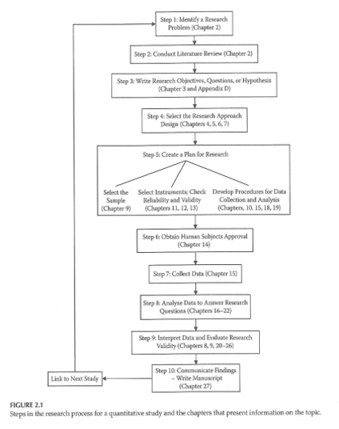

```{r echo=FALSE}
source("prelims.R", echo=FALSE)
```

***
`r read_text("objectives02")`

<div class="notes">

Here are your objectives.

</div>

***
### Planning a Research Project 



<div class="notes">

This figure from your book provides a nice overview of the research process. The first two steps, identifying a research problem and conducting a literature review are steps we will discuss today. Actually, we will not discuss the literature review today. The remaining steps are topics for later weeks. This table includes the chapters associated with each step.

The process is for a quantitative study, but it still closely matches the process that you would use for a qualitative study. Certainly the literature review, setting up a research hypothesis (if you have one), and the human subjects review are pretty much the same no matter what the type of study.

`r read_text("gliner-2017-figure-2-1", path="images")`

</div>

***
### Steps in a research project

* Step 1: Identify a research problem
  + Chapter 2 of Gliner et al.
  + Week 2 of this class.
  
<div class="notes">

The first step in this flow chart is to identify your research problem. We talked a bit about this in the first week of class and we will talk a bit more about it this week as well. Keep in mind that there is no approach that is uniformly good or uniformly bad. A good researcher should be comfortable with both qualitative and quantitative methods, with applied and theoretical research, with field and laboratory studies, and so forth. You pick the approach that best fits the problem. Don't sneer at other types of research. That's bad, bad, bad.

</div>

***
### Steps in a research project

* Step 2: Conduct your literature review
  + Chapter 2 of Gliner et al.
  + Various web resources.
  + Week 3 of this class.
  
<div class="notes">

The second step is to conduct a literature review. This is also covered in Chapter 2 of your book. There are also some very good web resources as well. 

We will cover this topic in week 3. The key thing to keep in mind is that your literature review has to flow. It needs a direction: from general to specific, for example.

</div>

***
### Steps in a research project

* Step 3: Specify your research hypothesis
  + Chapter 3 of Gliner et al.
  + Week 2 of this class.
  + PICO format
  + Research without a research hypothesis
  
<div class="notes">

The next step is specifying your research hypothesis. Not every research study has a research hyothesis, but it it does, you should structure it using the PICO format (Patient group, Intervention, Control group, and Outcomes). We'll talk more about the research hypothesis and research that does not need a research hypothesis in this week's lecture.

</div>

***
### Steps in a research project

* Step 4: Select your research approach
  + Randomized experiments (Chapter 4, Week 4)
  + Quasi experimental designs (Chapter 4, Week 5)
  + Observational designs (Chapter 6, Week 6)

<div class="notes">

There are three different research approaches that you can choose from. In a randomized experiment, you control who gets what, and you use a random device, typically a computer random number generator. In a quasi-experimental design, you have less control over who gets what, and the choices are made without the benefits of randomization. In an observational study, you do not control the asisgnnment of patients into the groups being studied. These are important topics and I'll be spending three full weeks on them.

</div>

***
### Steps in a research project

* Step 5: Create a plan for your research
  + Sampling issues (Chapter 9, Week 7)
  + Measurement issues (Chapters 10-12, Week 8)

<div class="notes">

Your research plan should mention how you get your sample, which we will cover in Week 7 and how you measure variables, which we is what we'll cover in Week 8.

</div>

***
### Steps in a research project

* Step 6: Obtain ethical approval
  + Chapter 14 of Gliner et al.
  + Week 2 of this class.
  + Think about ethical issues from the very start.
  
<div class="notes">

Your book places the material on ethical improvement (ethical conduct, I should say) fairly late in the book, but we will cover it very early (this week) because ethical conduct will often influence choices in your research hypothesis and yours research design.


</div>

***
### Steps in a research project

* Step 7: Collect your data
  + Chapters 13, 15.
  + Week 9.
  
<div class="notes">

Boy, we're getting into it. Collecting your data takes a lot of time and if you don't plan for this well, a lot of the time will be wasted in rework.

How you collect your data will depend in a large part on what type of data you collect. Qualitative data, of course, is in a world all it's own. Within quantitative data, though, you need to think about collection issues for self-report data versus investigator collected data. A codebook is vital, especially if you are doing the data entry yourself.

I've not done a lot of qualitative research but I've read a lot about it and advocate its use whenever I think it is appropriate.

</div>

***
### Steps in a research project

* Step 8: Analyze your data
  + Chapters 16-22 of Gliner et al.
  + Week 10, 12 of this class.
  
<div class="notes">
 
This class is not a course in data analysis, but I do want to give you enough information so you can write a decent data analysis plan. You'll learn about the foundations of inferential statistics and five common modeling approaches (linear regression, logistic regresion, analysis of two by two crosstabulations, analysis of variance, and survival models)

</div>

***
### Steps in a research project

* Step 9: Interpret your data
  + Chapter 23-25 of Gliner et al.
  + Week 13.
  
<div class="notes">

You'll get an overview of how to interpret your data analyses and evaluate the validity of your research. This includes how to write a good discussion secton about the strengths and weaknesses of your study as well as directions for future research.

</div>

***
### Steps in a research project

* Step 10: Communicate your findings
  + Chapter 26 of Gliner et al.
  + Week 14.
  + Written paper
  + Oral presentation
  + Poster presentation
  + Research grants
  
<div class="notes">

Research is not complete until you disseminate your findings. The different formats (written paper, oral presentation, and poster presentation) have fairly standardized formats. You'll also get an overview of how to write a research grant.

As the class goes along, if there is a particular topic that you want me to spend more time on, I'm happy to do it.

If I can brag here a bit, there is no one in the Kansas City area who understands the research process as well as I do. There are some very good people, including Mary Gerkovich, who I have leaned on to produce this class. There are people who have greater depth--they know more about one or two areas than I do. But no one else has the breadth of knowledge that I do. It comes in part with being old. There's nothing that I haven't seen before. Also a big part of it is that I understand the research process from a very fundamental and very foundational level.

In particular, if there is something you are interested in, please, please, please get that information to you. I will present that information, either formally in this class or informally outside of this class.

</div>

***
### Step 1 - Identify a research problem

Definitions are vague

  + What is a research problem? question? aim? goal?
  
* Sources of research problems

	+ Read

	+ Listen
	
	+ Observe

<div class="notes">

There are varying terms: research problem, research question, research aim, research goal, that all involve stating in very general terms what you can do.

These represent statements about issue the you are trying to address, or what are you trying to discover.

I find these distinctions annoying, and prefer to talk only about a research hypothesis. We'll get to that in a bit.

You can find your research problem during your literature review. You can look at replicating someone else's work or extending it into a new area.

Pure replications are rare because of resource limitations, but there is a lot of research showing that many important research findings are not replicable.

You may also get good research ideas from attending other research presentations, such as thesis defenses of your fellow students or at regional/national research conference. Good stuff, good stuff.

You may hear about topics in the classes that you take. I, for example, am doing some interesting work on patient accrual models using a Bayesian approach. Ask me anytime, and I'll tell you more about it than you really want to hear.

If you are already working, what comes up in that environment? Watch what is going on and think about ways that you might improve things.

I want to put in a big plug for community or participatory research. This is another way to develop research ideas. You ask people who are affected by the research you are thinking about doing what they think would work. It forces you to distill your ideas and explain them at a lay person's level and I think that it is good. It also requires great listening skills and an open mind. The people who you want to do research on have quite a different feeling.

</div>

***
### Characteristics of a good research problem

* More dichotomies
	
	+ Broad vs Narrow
	
	+ Widespread vs Limited interest
	
	+ Well-researched vs Unknown territory

<div class="notes">

A good research problem. How broad versus narrow? Narrow enough to be feasible, but broad enough to be of interest to a large audience. I need to warn you here. I have helped a lot of students over the years with their thesis or dissertation work, and when I ask them afterwards what they would have changed, the most frequent comment was "I wish I had collected less data." They really didn't take advantage of all the data they collected.

You should think of your thesis or disseration not as a single shot, but the first shot in a series of volleys. If your research yields more questions to be answered, that's actually a good thing. Let's be honest. You're not going to answer every question or solve every problem with just one study.

Should you work in an area where there is wide-spread interest. That's good in some ways, but you need to make sure that you are very current with what is being done (or that you are being advised by someone who knows what is currently being done). Otherwise, you run the risk of having new research published while you're halfway through your study that make your study obsolete. Attending research conferences is great if you want to know what the current work is in an area with broad interest.

There's less risk if you're working in an area that is not "hot." I also think it is advisable to do things that other people are not doing. This is what I do in my career, rather than doing something that someone else could easily do as well as you could. Work in a neglected area has a lot of value, but always beware. Is a neglected field being neglected because it is an area that is unlikely to bear any fruit?

Working in a neglected area a good thing? I can't answer that question.

It all comes down to the question: do you want to be a big fish in a small pond or a small fish in a big pond?

Closely related is whether you want to be a pioneer and the first to embark in a new area, or do you want to add to a problem that has already been researched.

Both are important. Whenever I present a dichotomoy it is not because I want you to "go to the left" or "go to the right." If you want to be a pioneer, think about small scale "proof of concept" studies. These study a narrowly defined population and may not be set in a very realistic field setting. If you want to work in a well-researched area, consider a pragmatic study, one that studies and broad base of patients with few artificial restrictions. It uses a setting that very closely approximates how health care is actually delivered in the real world.  Also make sure, if there is still a gap that needs to be filled. Stay away from a research area that is so well researched that there are no important problems left to solve.

</div>

***
### Considerations in Choosing a Topic

* Interest and enthusiasm

* Resources

  + Time
  
  + Cost
  
  + Support
  
  + Access
  
  + Control

* Scope of the problem

* Contribution to the profession

  + Adapted from Cottrell & McKenzie. *Health Promotion & Education Research Methods* . 2005.

<div class="notes">

There's more to say about this. Whatever type of research problem you tackle, the most important thing is that it has to be interesting to you. You're going to be spending a fair amount of your life on this.

Don't let your enthusiasm blind you, however. Get feedack from others.

Timing is especially important in this program. Prospective studies and especially prospective longitudinal studies take more time than you may have available.  We've had some students who have done a prospective study but most of them to retrospective students. 

Randomized studies, because they have to put much more machinery in place than observational studies, are more expensive than obervational studies. 

Resources go beyond the financial. Do you have the right expertise or do you have access to colleagues who have that expertise. The era of the "Lone Ranger" scientist is long gone.

Also make sure you have access to the patients that you need for your research. for most studies, your access to patients depends on other people. 

Are you in a position of sufficient authority to get the research done, or do you have someone on your team who has that authority? You can't just walk into a clinic and start ordering people around.

What resources you have at your disposal will identify that scope of the problem that you are able to tackle. Don't bite off more than you can chew, as the saying goes. Don't try to solve every problem all at once. Bite size pieces is what it important here.

Contribution to the profession addresses the "so what" question. Is it going to be publishable. You shouldn't be obsessed about publication, but it is a marker of whether the problem is considered important to others besides yourself.

</div>

***
### Planning a Research Project 

* What should NOT drive picking a research question

	+ A specific research methodology

	+ A specific funding opportunity

	+ A publication-focused motivation

* Always publish your work.

<div class="notes">

Don't get stuck in a rut with a single research methodology. Pick the methodology that most closely matches the needs of the research.

Funding is great, but don't fit your square research idea into a round funding hole.

Publications are important, but the goal is not publication but making a substantive contribution to the field.

Think about what happens if the results do not turn out they way you "want" them to. There is a myth that researchers are fully disinterested, but you have to think about your responsibilities of sharing information even if it is not what you wanted. Besides, you have done a disservice to those volunteers who helped you with the study. They gave up their Saturday morning cartoons (what's that new one: Square Bob Sponge something?) to help you with your research and they didn't do it for you. They did it for the benefit of patients like themselves.

</div>

***
### FINER criteria

* Feasible

* Interesting

* Novel

* Ethical

* Relevant

  + Hulley, Cummings, Browner, Grady, Hearst, & Newman. *Designing Clinical Research* . 2001.

<div class="notes">

Here's an acronym that gives you one more way to think about things when you are trying to pick a research problem. The acronym is FINER.

F. Is your study feasible? Do you have an adequate number of subjects, the appropriate technical expertise, enough money, and a scope that is manageable?

I. Is the problem interesting, both to you and to others.

N. Novel. Does your research have the potential to support or refute existing findings. Does it allow you to expand upon what is already known or provide totally new knowledge?

E. Ethical. Does the research treat your subjects with respect, offers them the autonomy that they deserve, and does it provides beneifts to society?

R. Relevant does your research provide information that other care about. This could be other scientists, if you are developing new theories or it could be your patients if the work is more applied. But somebody has to be interested in what you have found.

</div>

***
### Developing a research hypothesis

* Identify your research hypothesis early.
* Use the PICOTS framework.
  + P = patient
  + I = intervention
  + C = comparison
  + O = outcome
  + T = time frame
  + S = setting
* Your hypothesis may change as you delve deeper.

<div class="notes">

As I mentioned earlier, there are varying terms (research problem, research question, research aim, research goal) that all involve stating in very general terms what you can do.

I find these distinctions annoying, and prefer to talk only about a research hypothesis. A research hypothesis has up to six components, represented by the acronym PICOTS. The first four are the most important, and you may have seen the acronym PICO. It is a criteria used in Evidence Based health Care to ask an answerable question. I have hijecked this acronym because I find it useful in getting beginning researchers to flesh out a research hypothesis. It helps insure that you won't leave an important piece out of your research, such as forgetting to specify a control group or failing to identify the proper outcome measure.

P stand for your patient group. This is mostly for clinical research, so my apologies if you work mostly with animals.

I stands for your intervetion, though sometimes there is an "E" instead for exposure. An intervention is something that you do to try to improve things for your patient population. It may not actually improve things, and at times an intervention might make things worse (jumping from the frying pan into the fire). But an intervention has a good intention at its heart. An exposure is something that patients endure. It is usually difficult or impossible to control, and it generally (but not always) is something that is suspected to cause harm.

C stands for your comparison or control group. Not all studies have a direct control group (sometimes you are comparing to historical norms) and some studies fail to have any control group. There was a study that looked at patients who present to a doctor with rectal bleeding. These patients were followed for three years to see how many of them developed colon cancer. It was a great study, but notice that they could not get a control group. Because patients don't rush to their doctors and say "Doctor, doctor, I need help. Give me the scope, run me through the imaging machine. Because I don't have any blood in my stool. The study could not estimate things like sensitivity or specificity, of course, but it still could estimate a positive predicted value, which is the proportion of patients who have a particular sign and end up developing disease.

O stands for your outcome. This is a common omission. You might believe that people who get your intervention do better than people who do not, but if you don't have a way to measure what "better" means, then you have an incomplete research hypothesis.

T stands for time frame. In a retrospective study, it might represent the years that you drew retrospective records from. In a prospective study, it might represent the time frame for your outcome measure. Note that short term outcomes in a prospective research study are easy to get but they may not be indicative of long term outcomes. Weight loss and smoking cessation are two good examples of this. It's easy to drop a few pounds after a few weeks on a diet, but to continue that loss, or even to avoid regaining the lost weight over many months or years is not so easy. Smoking cessation has the same issue. It's easy to stop smoking for a week or a month, but to kick the habit for a full year is really hard.

S stands for setting. Research in an inpatient setting changes a lot when you are looking at an Intensive Care Unit. Treatment of patients who live at home is different than patients who are in a nursing home.

Note every hypothesis will need to specify each of these six things. Some studies do not have an intervention or exposure. As noted earlier, some studies do not have a control group. 

Also sometimes you can combine these letters. A patient population that is defined as asthmatic patients who get an appendectomy, for example, is a combination of the "P" and the "I". Patients with asthma who show up at the emergency room is a combination of "P" and "S".

Don't force fit your hypothesis into the PICOTS framework. But if you deviate from this framework by leaving out one of more of the letters, think carefully and justify why, for example, you don't need a control group.

The value of specifying a hypothesis is that it helps you avoid what is often called a Type III error: collecting data that does not answer your research question.

</div>

***
### Not all research needs a hypothesis.

+ Examples
  + Estimation
  + Identification

<div class="notes">

Not every research study needs a hypothesis. Many qualitative studies lack a formal hypothesis, for example. In a study without a research hypothesis, the goal is not comparison to a control group but rather either estimation or identification.

An example of estimation is trying to quantify that costs associated with patients in a hospital who have an intubation failure. You already know that intubation failures are bad news, so showing that intubation failures have significantly worse outcomes than successful intubations. Rather you'd like to quantify how much this costs, in terms of money, time, and suffering, so you would have a better idea of how much effort you should spend trying to avoid intubation failures.

Anoter example of estimation involves the study of diagnostic tests. You usually don't wnat to prove or disprove a hypothessi involving diagnostic tests. Instead you want to measure how effective the diagnostic test is in terms of sensitivity and specificity.

An example of identification is documenting, after a child is diagnosed with cancer, what are the experiences, emotions, and problems faced by the helathy siblings of that cancer patient.

Another example of identification is documenting the different treatment paths used for women who are diagnosed with breast cancer.

</div>

***
### Three types of variables. 

* Outcome variable(s)

* Independent variable(s)

	+ Active

	+ Attribute
	
* Covariates

<div class="notes">

Once you have a research hypothesis, you should start thinking about all the variables that you will collect as part of your research. These variables are typically classified into one of three categories.

The outcome variable, sometimes called the dependent variable or the criterion variable, measures whether your intervention makes things better. You may have more than one outcome variable, and if you do, you need to think about what it means if the different outcome measures tell you different things about whether the intervention is actually making things better.

The independent variable is either the intervention or exposure that you are studying or other variaibles that are of direct interest. Your book makes an additional distinction that I normally don't mention. They describe an active independent variable as one that can be manipulated and is, therefore, suited for experimental studies. In contrast, atrribute independent variables cannot be manipulated. Most demographic variables, if they are used as independent variables, represent attribute variables. You can't manipulate someone's gender.

Covariates, sometimes called extraneous variables are variables that are not of direct interest but which can influence your outcome. You include these variables because failure to properly account for them might raise questions about the validity of your research.

You also might measure covariates because they help you define characteristics of the patient population that you are using, so others might look at the descriptive statistics on these variables to help answer the question "How similar are my patients".

</div>

***
### Three types of analyses

* Difference

  + A - B > 0

* Associational

  + A and B are correlated

* Descriptive

  + Means, standard deviations, or proportions of A and B.

These categories are not mutally exclusive.

Note that a research study might involve
+ Analyses associated with each type of RH/RQ

<div class="notes">

Your book makes an interesting distinction between difference analyses and associational analysis. A difference analysis involve a comparison of two group. If A - B is greater than 0 then A is greater than B. Here A might represent the tumor detection rate from contrast-enhanced digital mammography and B might represent the tumor detection rate from a standard mammogram.

For a difference hypothesis, you have a choice of a directional (one-sided) hypothesis or a non-directional (two-sided) hypothesis. An example of a directional hypothesis is that contrast-enhanced mammography can only improve the tumor detection rate. If this more expensive approach actually ended up decreasing the rate, we are not interested in reporting that finding because no one would be interested in hearing about it. Directional hypotheses are VERY controversial and I will try to cover them in more detail later in the clas. 

An associational analysis looks for a trend or pattern among two continuous variables. Are large values of A associated with large values of B and are small values of A associated with small values of B. This is a positive correlation. The reverse would be large values of A are associated with small values of B and small values of A are associated with large vaules of B. This is an example of a negative correlation. Here A and B might represent the tumor detection rate after mammography and B might represent the years of experience of the person reading the mammogram.

Associational implies a relationship but not necessarily that one causes another. There's a story of a statistician who examined fire department records and discovered that the more fire engines that you sent to a fire scene, the more damage that they caused. When you can conclude that an association is causal is also very controversial and I plan to talk more about that later as well.

Descriptive statistics involve simple univariate summary. What is the average value of A or what proportion of your patients have B. A might represent the age of the woman getting the mammogram and B might represent the race/ethnicity of that woman.

</div>

***
### Schematic diagram of research approaches 


<div class="notes">

I think you've seen this figure already. If it from chapter 4 of your book. With a research hypothesis set, you can start to see what path your research might take. 

If you have an active independent variable (usually an intervention rather than an exposure), you have enough control that you can often used a randomized experimental approach. There are times where logistics or patient preferences force you to implement your intervention without randomization. These are quasi-experimental approaches. Your book tends to disparage these quasi-experimental approaches, but they are used quite often in quality improvement studies and some quasi-experimental approaches can be quite persuasive. We'll talk a lot more about this later.

If you have an attribute independent variable (usually an exposure or a demographic variable rather than an intervention), these fit into the broad category of observational (non-experimental) research. With an observational research study, you can choose among comparative, associational, or descriptive approaches. A comparative approach requires a difference hypothesis. Your books emphasizes that the comparative approach is less persuasive than a quasi-experimental or experimental approach, but again I disagree. We'll talk about the additional evidence and support that you need to make a difference hypothesis persuasive in week 5, I hope, when we tackle observational studies.

I don't want to say much more about the associational and descriptive approaches just yet, but we will cover them in detail.

</div>

***
### Landmarks in research ethics

* Federal Food, Drug, and cosmetic Act (1938)

* Nuremberg code (1947)

* Declaration of Helsinki (1964)

* Belmont report (1978)

* Title 45 of the Code of Federal Regulations, Part 46 (1981)

* Health Insurance Portability and Accountability Act (1996)

<div class="notes">

We have an entire course devoted to the ethical conduct of research. I just want to touch on a few issues that you need to think about during the planning phase of your study.

It helps to have a brief understanding of some of the historical milestones in research ethics.

The Nuremberg code was developed in 1947. It is a bit dated today, but it's very brief and worth reviewing to understand some of the foundations that underlie more recent work.

The Declaration of Helsinki (1964, with modifications over the years) provided a modern and more workable framework for research. It is very brief, but provides a surprising amount of guidance. The document plances a strong empahsis on scientifc integrity. This means you don't do research unless it has an important goal). It also stresses the rights of research subjects. They have to provide informed consent and can withdraw at any time. The document also stresses the responsibilities of the researcher. You have to weights costs and benefits and always provide the best available care, even in the control group.

The Belmont report, written in 1976 by the National Commission for the Protection of Human Subjects was manadated by the National Research Act of 1974. It lays out a foundation for ethical research, based on respect for persons, beneficence, and justice. It's a long read, unfortunately, and you may prefer to read some written summaries instead.

It led to the development in 1981 (updated in 1991) of federal regulations (title 45 of the Code of Federal Regulations, Part 46, affectionately nicknamed 45 CFR 46 or the common rule). These are written in "lawyerese". Again a summary is helpful, and you might only need to refer directly to these regulations to settle an argument. Note that there are discrepancies between the requirements for NIH versus FDA research. This document outlined the structure and function of an Institutional Review Board (IRB), and offered special protections for vulnerable populations.

IRBs were established to review research to insure that the rights of the participants is protected. They must have at least five members, mix of gender, race/ethnicity, background. At least one member must be from the general public. In some people's eyes, IRBs serve only to delay research and to destroy the scientific value of research. There is some truth in this perhpas, but it is much to cynical a perspective. Think of the IRB as an ally who can help insure that your research plan is appropriate and most importantly publishable. Research that fails to comply with the regulatory requirements will not survive peer review, so it is better to fix things now rather than wait until the project is over to find that there are ethical flaws that block the dissemination of your research.

The Health Insurance Portability and Accountability Act of 1996 recognized the flow of health information through computerized systems and provided privacy protection for those records.

</div>

***
### Landmarks in research ethics

* Pure Food and Drugs Act (1906)

* Federal Food, Drug, and cosmetic Act (1938)

* Kefauver Harris amendments (1962)

* FDA Modernization Act (1997)

* Best Pharmaceuticals for Children Act (2002)

<div class="notes">

The regulatory framework for testing of drugs evolved over a different time frame.

Much of the research that the Food and Drug Association mandates today originate from a 1906 law intended to apply proper labelling standards to food and drugs.

The Food and Drug Cosmetic Act of 1938 further required that all new drugs be tested for safety. The law was passed after a tragedy involving the deaths of more than 100 people who had taken a drug, Eleixir slfanilamide, that caused acute kidney failure. 

The Estes-Kefauver amendments of 1962 were written in response to the Thalidomide tragedy, where an anti-nausea medication was given to pregnant women and resulted in numerous birth defects. The acts required that new drugs had to show efficacy in addition to safety before they could be approved for use in humans.

The FDA Modernization Act of 1997 provided a framework for drug companies to establish off-label uses (uses not authorized in the original drg approval process) for approved drugs and established a framework for regulation of medical devices.

The Best Pharmaceuticals for Children Act was passed in 2002 to encourage pediatric studies by offering an additional six months of patent protection to certain drugs if these studes were conducted.

</div>

***
### Does my study need IRB approval

* Is it research?

  + Designed in advance
  
  + Systematic approach
  
  + Generalizable knowledge
  
  + Quality improvement versus research

* Does it involve human subjects?

  + interaction with a person, or
  
  + use of private information.

<div class="notes">

One of the most important questions you'll face early in your research planning is deciding whether your research requires IRB review. You have to ask two questions: Is it research? and Does it involve human subjects?

The government definition of research as quotes from 45 CFR 46 is "a systematic investigation, including research development, testing, and evaluation, designed to develop or contribute to generalizable knowledge." The key feature is that the work leads to generalizable knowledge. Some studies are intended only to benefit the actual participants of the study or only the small community that they come from. In this case, the work does not need review by the IRB.

I don't like the requirements that research has to be designed in advance using a systematic approach because it implies that if you are sloppy and haphazard in how you collect your data, you are off the hook with regards to IRB review. But several guidances on what constitutes research stress the advance design and the systematic approach.

Quality improvement (QI) studies lie in an uneasy space with respect to research. If the goal is to provide information only for your particular work area, the QI improvement study may not be considered research. You should talk to your local IRB about whether your QI study needs IRB approval.

A Human subject, again as defined by 45 CFR 46, is "a living individual about whom an investigator (whether professional or student) conducting research obtains data through intervention or interaction with the individual, or
identifiable private information." Pretty much any prospective study of humans will fall in this category. An exception is watching people in public spaces where no expectation of privacy exists. A retrospective study falls into this category if you are using information that the subject would normally expect to be kept private. A retrospective study where the data being used contains any identifiable private information falls in this category.

Research on cadavers doesn't count because the cadavers aren't alive. At least not until the arrival of the zombie apocalypse. There are still procedures that you should follow with cadavers, but they are not under the purview of the IRB.

Research using publicly available data sources does not involve human subjects, because those data would not have been made public if they contained identifiable private information.

Who decides whether it is research and whether it involves human subject varies from place to place, but if there is any uncertainty on this issue, please talk to your IRB.

</div>

***
### IRB categories of approval

* Exempt from review

* Expedited review

* Full review

<div class="notes">

Even if the work is research and it involves human subjects, the IRB may determine that it is exempt from review. This is generally done if the work is done in educational settings and involves normal educational practices. Research of public benefit or service programs may also be exempt.

Expedited review does not necessarily mean faster review. It means that the review requires less effort by the IRB. The review is done by a smaller group and not the full IRB. Expedited review involves certain minimal risk studies, such as the collection of small blood samples, hair or nail clippings. Collection of certain administrative records or surveys or focus groups might apply.

Some research requires full review which means that the entire board meets to discuss your research.

It is not you, but rather the IRB that determines whether research is exempt, or when it requires expedited or full review.

</div>


***
### Ethical issues

* Conflict of interest

* Unfavorable risk/benefit ratio

* Loss of equipoise

* Deception

* Violating privacy

<div class="notes">

Here's a brief list of ethical issues that you may confront as you are planning your research. These should be thought about well before you make your submission to the IRB. In particular, you may want to change your research approach if that change helps you avoid some of these ethical challenges.

Conflict of interest has gotten a lot of press, and I just want to emphasize a perspective that I have that is probably a minority perspective in the research community. A lot of people talk about non-financial conflicts of interest, but I believe (with only a few very rare exceptions) that only financial conflicts are important enough to warrant reporting.

Financial conflicts of interest are real and there is solid empirical evidence of their biasing effects. A financial conflict of interest does not bar you from doing the research, but it usually requires you to have a greater degree of oversight. A Data Safety and Monitoring Board, for example, might be appointed to make calls about whether a research study needs to be ended early because your financial investment in the research might create at least the appearance of bias in that decision.

The risk/benefit ratio is tricky, and we do allow for setting where someone can endure pain, suffering, and increases in the risk of bad outcomes, as long as these are minimal and well controlled. Even when the risks are very small, you may get in trouble if there is little or no benefit to your research.

Equipoise is a very controversial topic. There are varying definitions, but I like the one that defines equipoise as "genuine uncertainty in the expert medical community  over whether a treatment will be beneficial." (quoted from the Wikipedia page on clinical equipoise) This does not imply a perfect balance. Equipoise will help you determine whether use of placebos is acceptable, for example, and there is a lot of debate about placebos. I can't share all the details of this area today, but ask me if you are curious about anything involving equipoise or placebos, as I have written a lot about this on my website and blog.

If you can't deny a well-established treatment to your control arm, then sometimes (but only sometimes) you can offer a waiting list control group. Everybody gets the treatment, but a randomly selected number of patients have to wait a certain amount of time before receiveing the treatment. Also, you can fashion your trial as an add-on design. Everybody gets the best known available therapy, but some get a new, but unproven, therapy and others get a placebo in place of the therapy.

Deception is part of many research studies, especially in Psychology, but it needs to be done carefully. You can deceive people about the purpose of a research study if their knowledge about the purpose would change their behavior in a way that would invalidate the research. If you use deception in a study, you have to "fess up" during a debriefing session after the research is done. You can never deceive a research subject about the risks of the research.

Privacy violations are a big and growing concern in research. You should try to avoid storing private information if you can. If you do have to store private information, keep it in a secure location. USB sticks or the local hard drive on your computer are not secure because these are sometimes lost or stolen. If you must use these media, then use encryption. It is much better to store private information on a network folder because this is protected by your password and the physical storage devices are kept behind locked doors. Note that HIPAA has serious civil and criminal penalties for the accidental disclosure of private health information.

</div>

***
### Ethical concerns in animal studies

* Review by IACUC.

  + Mandated by Animal Welfare Act and USDA regulations

  + Live vertebrate animals
  
  + Sample size justification

<div class="notes">

Animal studies at UMKC are review by the Institutional Animal Care and Use Committee (IACUC). This is mandated by federal law and US Department of Agriculture regulations.

It only applies to live vertebrate animals, so dissections don't count and research on flatforms does not count.

You have to take proper care of research animals and minimize to the greatest extent possible their pain and suffering.

Ther IACUC is going to take a very careful look at the sample size justifications for your animal research. Both too many and too few animals will raise concerns. We'll talk about sample  size justification later in this class.

</div>

***
### Fraud in research

Fraud falls into three broad categories (FFP).

* Fabrication

* Falsification

  + Data alteration

  + Misreporting

* Plagiarism.

Note: A difference of scientific opinion does not mean that one party is behaving fraudulently.

<div class="notes">

I hesitate to talk about fraud because I know all of you are honest. But you need to know what fraud is, because you may encounter it in your interactions with others.

Fraud falls into three major categories: fabrication, falsification, or plagiarism. 

Fabrication is the wholesale invention of data, which falsification means alteration of existing data or withholding or misrepresentingin important details of your research in a presentation or publication. This means details that are important enough to change how people few the validity of your research. In particular, if you change how you originally planned to collect or analyze your data, and you don't not this as a post hoc change in your protocol, you could be accused of fraud.

Plagiarism is the use of other peoples words or ideas without their permission and without proper attribution.

We'll talk about appropriate actions that you should take if you suspect fraud in just a bit.

</div>

***
### Research misconduct (other than fraud)

* Inappropriate authorship

  + Ghost writing
  
  + Leaving off deserving authors
  
  + "Honorary" authorship

* Violation of confidentiality

* Sabotage

<div class="notes">

There are other forms of research misconduct that do not officially constitute fraud but which are still important. Ghost writing, which means writing done by someone who is deliberately kept off the list of authors to avoid conflict of interest disclosures is a big no-no and might rise to the level of fraud. When you publish a paper you have to make sure that everyone who deserves co-authorship is included. You should not leave someone off who made a material contribution to the planning, analysis, or writing. On the other hand, you should not include someone based solely on their reputation or their supervisory role. Finally, do not include someone as a co-author on your paper without getting their permission first.

You are also subject to various confidentiality requirements when you are reviewing other people's work, such as through the peer-review process of a medical journal. Although this is not under the direct purview of the IRB, it is still important that you do not share research information that you have vowed to keep private.

I have never seen it, but there have been reports of scientists who deliberately sabotage other people's work. The motivations for this vary: it could be professional jealousy or it could be a desire to be the first with a new finding.

</div>

***
### Whistle blowing

* Failure to report research misconduct is research misconduct
* No retaliation for legitimate complaints.

<div class="notes">

When you witness research misconduct, you have an obligation to report it. Failure to report research misconduct is itself research misconduct. This is very difficult, of course, if you find yourself in a position subordinate to the person who is behaving badly.

There are protections for whistleblowers, but that does not always protect you against retaliation. I've never found myself in a situation where I have observed research misconduct, so I can't offer too much advice.

</div>

***
### Whistle blowing

* There is more than one avenue for reporting misconduct
  + Do nothing.
  + Talk with the person directly.
  + Talk to some of your peers.
  + Talk with your own supervisor.
  + Talk to a person higher up in the organizational structure
  + Report a complaint anonymously.

<div class="notes">

If you experience something that you feel is not right, you have the option of doing nothing. That's a risky option, but if you feel that all the other options are riskier, I, for one, would understand. Depending on the dynamics, you might consider talking to the offending party directly. You might ask your peers or your own supervisor (assuming that they are not parties to the misconduct allegation) or someone higher up in the organizational structure than the offending party. Most organizations have an ombudsperson who you can talk to. An ombudsperson will never divulge information without your permission. Your organization may also have other anonymous reporting avenues.

If you do talk to someone, please be open to the possibility that you may just be misunderstanding the situation.

</div>

***
### Research Ethics 

+ NIH definition (NIH Catalyst, 2001)
+ Scientific/research misconduct is ?
	+ Fabrication ? inventing data or results
	+ Falsification ? manipulating research materials, equipment, or processes, or changing or omitting data or results
	+ Plagiarism ? appropriation of ideas, processes, results, or words of another person without giving appropriate credit

<div class="notes">

Uniform definition: fabrication, falsification, plagiarism.

Note that when you review a paper or grant, You cannot use any ideas, words, results, or processes from that paper or proposal.

Example of NIH report of research misconduct.

The penalties are fairly severe.

</div>

***
### Research Ethics 

+ Training
	+ CITI training - used by multiple institutions
+ IRBs
	+ UMKC IRB
	+ IRBs at other institutions (CMH, St. Luke's)
+ Research committees

<div class="notes">


</div>

***
