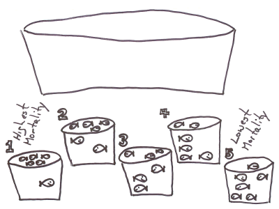

```{r echo=FALSE}
source("prelims.R", echo=FALSE)
```

***
`r read_text("objectives04")`

<div class="notes">

Here are the objectives for this week.

</div>

***
### Cameron and Pauling study of Vitamin C.

* Linus Pauling
  + Two-time Nobel prize winner (Chemistry, Peace)
  + Fervent advocate of mega-doses of Vitamin C
* Non-randomized study of cancer
  + All patients got Vitamin C
  + Ten controls per treated patient
  
* References
  + Cameron E, Pauling L. Supplemental ascorbate in the supportive treatment of cancer: Prolongation of survival times in terminal human cancer. Proc Natl Acad Sci U S A. 1976 Oct;73(10):3685-9. PubMed PMID: 1068480; PubMed Central PMCID: PMC431183.
  + 

<div class="notes">

[Taken from Chapter 1 of my book, Statistical Evidence in Medical Trials]

Paul Rosenbaum, in the first chapter of his book, Observational Studies, gives a fascinating example of an apples to oranges comparison. Ewan Cameron and Linus Pauling published an observational study of Vitamin C as a treatment for advanced cancer (Cameron 1976). For each patient, ten matched controls were selected with the same age, gender, cancer site, and histological tumor type. Patients receiving Vitamin C survived four times longer than the controls (p < 0.0001).

Cameron and Pauling minimize the lack of randomization. "Even though no formal process of randomization was carried out in the selection of our two groups, we believe that they come close to representing random subpopulations of the population of terminal cancer patients in the Vale of Leven Hospital."

Ten years later, the Mayo Clinic (Moertel 1985) conducted a randomized experiment which showed no statistically significant effect of Vitamin C. Why did the Cameron and Pauling study differ from the Mayo study?

The first limitation of the Cameron and Pauling study was that all of their patients received Vitamin C and followed prospectively. The control group represented a retrospective chart review. You should be cautious about any comparison of prospective data to retrospective data.

But there was a more important issue. The treatment group represented patients newly diagnosed with terminal cancer. The control group was selected from death certificate records. So this was clearly an apples versus oranges comparison because the initial prognosis was worse in the control group than in the treatment group. As Paul Rosenbaum says so well: one can say with total confidence, without reservation or caveat, that the prognosis of the patient who is already dead is not good. (page 4)

When the treatment group is apples and the control group is oranges, you can't make a fair comparison.

</div>

### Birth control pills and cervical cancer

* Three groups of women
  + Oral contraceptives
  + Other forms of birth control
  + No birth control
* Differences in these three groups
  + Age at first intercourse
  + Number of secual partners
  + Use of tobacco, alcohol, other drugs
* Most importantly, number of pap smears
  + Oral contraceptives require regular doctor visits

<div class="notes">

[Taken from Chapter 1 of my book, Statistical Evidence in Medical Trials]

Women who take oral contraceptives appear to have a higher risk of cervical cancer. But covariate imbalance might be producing an artificial rise in cancer rates for this group. Women who take oral contraceptives behave, as a group, differently than other women. For example, women who take oral contraceptives have a larger number of pap smears. This is probably because these women visit their doctors more regularly in order to get their prescriptions refilled and therefore have more opportunities to be offered a pap smear. This difference could lead to an increase in the number of detected cancer cases. Perhaps, though, the other women have just as much cancer, but it is more likely to remain undetected.

Both of these examples show covariate imbalance. You can largely avoid covariate imbalance through randomization. It's not always easy, though, to use randomization, as you will see.

</div>

### Experimental versus observational

* Experimental: Active independent variable
* Observational: Attribute independent variable
* Who does the choosing?
  + Patients or doctors? = Observational
  + Researcher? = Experimental
* Patients in a randomized trial are giving you a gift.
  
<div class="notes">

Let's review some of the definitions we've seen earlier.

One of the major distinctions in research design is experimental studies versus non-experimental (observational) studies. 

Your book makes the distinction through the independent variable. An active independent variable allows for either a experimental or quasi-experimental study. An attribute independent variable makes your study non-experimental. That's your book's term, but I prefer the term observational. It is fairly common in the medical literature. Think of observational as "look but don't touch." You observe patients without meddling with them.

Another way of looking at it is to ask the question "Who does the choosing?" If the patient and/or the doctor has a part in deciding, then the study is observational. If the researcher is the only one who decides, and uses a coin flip to decide, that is a randomized clinical trial.

We owe a great debt of graditude to the volunteers in a randomized clinical trial. They are sacrificing a lot of autonomy over what drug or therapy to choose. And they are ceding that autonomy, not to an expert clinician but to the flip of a coin. That's a truly amazing.

</div>

### Randomized versus quasi-experimental

* Quasi-experimental
  + Logistics prevent randomization
  + Very common in Quality Improvement

<div class="notes">

When you have an active independent variable, you don't always have a level of control that allows for randomization. Usually this is caused by logistical issues. Once you go down a certain path, it is impossible to go back. Or the setting that you are studying, like an emergency room is so chaotic that no one can keep track of a randomization table.

It's easy to sneer at quasi-experimental studies and think of them as an inferior form of research. But they are not, and quasi-experimental designs form the backbone of many quality improvement studies. We'll talk more about this in the following week.

</div>


### How to randomize

* Use of a random device
  + Physical devices (flip of a coin, balls in an urn)
  + Computer generated random numbers
* Avoid haphazard approaches
* Avoid alternating assignment
* Remember the law of large numbers

<div class="notes">

Randomization is the use of a physical device like the flip of the coin or drawing balls from an urn (think Bingo!), but more frequently, the use of computer generated random numbers to provide an unpredictable sequence.

If you are new to computer generated random numbers, find one that produces random numbers uniformly in the interval 0 to 1. Any value less than 0.5 represents a tail in a coin flip and any value greater than 0.5 represents a head. A value equal to 0.5 represents the coin landing on its side. 

It is better still to sort on the basis of random numbers. Take a list in a systematic order, attach a column of random numbers, then sort both columns by the column of random numbers. Sorting by a column of random numbers places your list in a random order.

There are haphazard ways to randomize. You could assign subjects based on the last digit of their social security number or telephone number, for example. This is never a good idea, and wil pretty much get you kicked out of any systematic overview down the road. It's sometimes a bit more work to use a random list than a haphazard list, but it is always worth the extra effort.

Alternating assignment (ABABAB) is also a bad idea.

[taken from http://www.pmean.com/00/alternate.html]

Consider how cabbages grown in a garden. You will often see a pattern of big cabbage, little cabbage, big cabbage, little cabbage. These plants are competing for resources. One plant gets a tiny head start, and its roots extend over into the other plant's space, grabbing some extra water and nutrients. This leads to more growth and more grabbing of the other plant's resources.

This type of pattern can also occur in factories. Consider a mill that cuts small pieces of wire from a large spool of wire. The machine might cut the first piece a bit large because it waited a fraction of a second too long. When this happens, the next piece is likely to be too small. If a piece is cut a bit small, the bit of extra left over might make the next piece too big.

Suppose you are monitoring the amount of time a doctor spends with each patient. If the first patient goes a bit long, the doctor is likely to rush the next patient. A doctor that can wrap up a patient quickly, will then feel more relaxed and take more time with the next patient. So there might be a tendency for visits to go long, short, long, short. It doesn't always have to happen this way. The days when I visit the doctor it seems like the pattern for the four patients in front of me is long, long, long, long.

If you randomly assign treatments to a small number of patients, the law of large numbers does not kick in. A small randomized study has large risk of covariate imbalance, just by the luck of the draw. As the size of your study increases, the risk becomes really small.

How big do oyu have to be in order not to worry about this. Your book says 60 patients total, but does not offer any justification for this number. I have seen some simulations that indicate big potential problems for 20 patients total and almost no potential problems for 80 patients total. What I would recommend is that you consider additional measures for small sample sizes like stratification and matching.

</div>

### A fishy research story (part 1 of 7)


<div class="notes">

[taken from http://www.pmean.com/12/fishy.html]

I was told this story but have no way of verifying its accuracy. It is one of those stories that if it is not true, it should be. It illustrates why randomization is important. A long, long, time ago, a research group wanted to examine a pollutant to find concentration levels that would kill fish. This research required that 30 fish be separated into five tanks, each of which would get a different level of the pollutant.

</div>

### A fishy research story (part 2 of 7)


<div class="notes">

The first six fish that you catch go in the first tank.

</div>

### A fishy research story (part 3 of 7)


<div class="notes">

The next six fish that you catch go into the second tank.

</div>

### A fishy research story (part 4 of 7)


<div class="notes">

And so on.

</div>

### A fishy research story (part 5 of 7)


<div class="notes">

And so on.

</div>

### A fishy research story (part 6 of 7)


<div class="notes">

The last six fish that you catch go into the final tank.

</div>

### A fishy research story (part 7 of 7)



<div class="notes">

When they were done, they found that mortality was related not to the chemical concentration but to the order in which the tanks were filled. Most of the fishwere floating lifeless at the top of the first tank, but the fifth tank had almost all happy little swimmers.

What happened was that the slow-moving, easy-to-catch fish (the weakest and most sickly) were all allocated to the first tank. The fast-moving, hard-to-catch fish (the strongest and healthiest) ended up in the last tank.

What you should have done was to assign each fish randomly to a tank. That way each tank is a mix of slow-moving easy-to-catch fish and fast-moving hard-to-catch fish.

</div>

### Advantages of randomization

* Insures covariate balance
  + Smoking during pregnancy and Down's syndrome
* Difficult or impossible to measure covariates
  + Severity of illness
  + Co-medications
  + Co-morbidities
  + Patient's psychological state
* Avoids selection bias

<div class="notes">

A covariate is a variable that is not of direct interest in the research, but which could affect the outcome. If a covariate is imbalanced between the two groups you are comparing, that can interfere with your ability to detect whether there is a difference between the treatment and control group.

There was a study that looked at smoking during pregnancy and found the suprising conclusion that smoking reduced the risk of Down Syndrome. Now smoking does a lot of really bad things to you: cancer, hypertension, stroke, heart attacks, etc. So it would be quite surprising to see cigarettes being protective instead of harmful. The researchers knew, however, that this finding was not real. It turns out that younger women are more likely to smoke during pregnancy than older women. This is a covariate imbalance. The smoking group had a much younger average age than the non-smoking group. Down Syndrome occurs much more often among older women than younger. Once you control for mother's age, the protective effect of smoking pretty much disappears.

Covariate imbalance is a big big problem for observational studies. You have to spend a lot of time and energy worrying about it during the planning phase and controlling for it in the analysis phase. We'll talk more about this in a couple of weeks.

The value of randomization is that an older woman is just as likely to find herself in the treatment group as in the control group. So the law of large numbers assures that you will have good covariate balance.

This applies for both covariates that you can measure, like demographics, and covariates that you might not be able to measure, such as number of co-morbidities, psychological state, and severity of the illness at baseline.

There is a different perspective that is worth mentioning here. Covariate imbalance is sometimes caused by selection bias.

Some of the patients in your research study may prefer one or the other of the two completing therapies being studied. The physicians who are managing the patients in your research study may also have a preference for some of their patients. 

If the patients and/or their physicians pay a role, even indirectly, in choosing between the two competing therapies, then you have to potential for selection bias. Patients might differ on key prognostic variables, leading to an biased comparison that might mask a true effect or produce an artefactual effect.

Randomization removes the patient and physician choice and prevents selection bias.

</div>

### Disadvantages of randomization

* Expensive
* Artificial
  + Extra tests, extra attention
  + Explicit acknowledgement of uncertainty

<div class="notes">

There are a fair number of researchers who get very snobbish about randomization. If it's not randomized, it's not real. This is wrong, wrong, wrong.

I wrote a book back in 2006 that talked about critical appraisal. It covered things like blinding, low drop out rates, patient oriented outcome measures, among other things that make a study more persuasive. I wanted to make the point that while all of these things are "nice to have", none of them are "have to have". So at the end of each chapter, I included a counterpoint: blinding is overrated, intention to treat analysis is overrated.

The end of my first chapter was "randomization is overrated." One of the reviewers for my book threw a fit. How dare a statistician criticize randomization! Well, there are lots of criticisms of randomization made by people who are a lot smarter than me. We'll talk about those in a minute. But the belief that we should always fight for randomization is a misguided belief. It sneers at non-randomized studies and claims that these trials are "weak" and should not become part of the evidence base.

Don't get me wrong. I like randomization. I use it whenever I can. I point out when failure to randomize hurts the persuasiveness of a particular research study. But I'd be remiss in my duty if I did not embrace those well designed non-randomized studies and endorse them when they make more sense than a randomized study.

</div>

### When can't you randomize

* Unethical
  + Lack of equipoise
  + Harmful exposures
* Impractical
  + Too many patients
  + Too much time
  + Strong patient preferences
* Impossible
  + Attribute variables
  + Retrospective studies

<div class="notes">

If you already know that one treatment is superior to another (this has to be more than just a hunch), then you cannot ethically use randomization and doom half of your patients to an inferior treatment.

Randomization is also unethical, for the most part, in studies of harmful exposures. I define an intervention as something you do to your patients with the hope that it will make things better. Sometimes it doesn't work out, and sometimes the proposed intervention is actually harmful rather than helpful. But it is your expectation that the intervention will make things better.

An exposure, on the other hand, is something that you are forced to endure and maybe it's okay, but you worry that it might cause real harm. With the exception of short term reversible harms, you can't randomly assign people to an exposure.

You can quibble about these definitions. Is a particular diet an intervention or an exposure? But interventions versus exposures are yet another example of a false dichotomy that is still useful.

Many times, randomization is just impractical. When you are studying large groups of patients (say tens of thousands or more), you may not have the resources to set up a randomization process. Randomization is also difficult for certain diseases like cancer that have a long latency period. That cancerous polyp in your gut? it was from the Twinky you ate as a teenager and it's a ticking time bomb, but the fuse is set to go off three decades from now. You just don't have the time to wait on a study that could last half of your life.

In other settings, randomization is impossible. You can't randomly assign people to a gender, race/ethnicity, or age group. You can't randomly assign someone in a retrospective study without a time machine. Actually, there is one cute example.

[taken from http://www.pmean.com/04/temporality.html]

There was a cute article in the 2001 year end issue of the British Medical Journal titled: "Beyond Science? Effects of remote, retroactive intercessory prayer on outcomes in patients with bloodstream infection: randomized controlled trial." ([Medline]). The author, Leonard Leibovici, found the records of 3,393 adult patients with bloodstream infection at Rabin Medical Center, randomly divided those records into two groups then randomly selected one group to pray over. Note that this is a RETROSPECTIVE study. The outcomes were determined 4 to 10 years prior to the start of the study. After praying over one group, the author evaluated mortality, stay in the hospital, and duration of fever. Although there was no statistically significant difference in mortality (p=0.40), there was a reduction in the length of stay (p=0.01) and in duration of fever (p=0.04).

It is dangerous to speculate on the motives of the author, but this article was published in a year end issue that is traditionally reserved for light hearted articles.

</div>

### Some alternatives

* Wait list control groups
* Add on trials
* Intensive versus standard advice
* Randomly assign from a different end
* Early stopping

<div class="notes">

In some settings, people will resist participating in a trial where there is a 50% chance of a placebo, but they are willing to be put on a waiting list. Indeed the concept that not everyone can get in the door at the same time make a random allocation to immediate treatment versus delayed treatment may seem like the only "fair" way to handle this.

If you want to measure the effect of smoking cessation during pregnacy, you can randomly assign patients to the normal advice that a doctor might give versus an intervention where you offer special programs for free or provide a more intensive push to stop smking. If the randomly assigned patients in the second group have less smoking and better birth results, then you have randomized evidence of the benefit of smoking cessation during pregnancy. This sort of intervention has also been done for things that area already known to be beneficial like breast-feeding where you would not want to assign women to a non-breast-feeding group.

There's a lot of concern about how gender and race may play a part in what sort of treatments these patients get. You can't send someone into an office as a male and then send them back dressed up as a female. But what you can do is randomly assign physicians. Set up videotapes of actors playing the role of patients. The first video would be a white male, the next a black female, etc. Each physician sees just one randomly selected video. If you see differences (presumably differences not justified by a patient's race or gender), then this is evidence of differential treatment based on race or gender.

You may find information during the course of your clinical trial, either from your own research or research that has just been published by others, that changes equipoise. A study that seemed to be ethical at the start, becomes unethical to continue. In these settings, you have to plan for an early end to your research. This must be done carefully. I will try to highlight some of the issues associated with early stopping of clinical trials later in this class.

</div>

### Blinding/partial blinding. Who knew what when?

* Hiding information (not deception)
* Not always possible (bilateral orchiectomy)

<div class="notes">

Blinding is withholding information about which treatment is which during the conduct of a research study. It is not the same thing as deception. You tell the participants in a study that they will not know until after the study ends whether they received the treatment or the control.

Full blinding is not always possible. I have a joke about how blinding is difficult in a study where one of the treatments is a bilateral orchiectomy. Sooner or later the patient notices that something is missing. Even when full blinding is impossible, partial blinding is usually an option. So the patient knows about the treatment, but the person interviewing the patient does not.

</div>
  
### Types of blinding

* Double blind
  + Physician and patient blinded
* Single blind
  + Patient only
* Partial blind
  + Evaluators blinded

<div class="notes">

There is some ambiguity in the terminology, but a double blind study means that neither the patient nor the physician knows what treatment a patient was randomized to. Now someone always knows, but this person is buried deep in the basement of the pharmacy and has no interactions with the patient or treating physician.

In a single blind, only one of the parties is blinded. This is usually the patient. You can't blind a surgery from the surgeon, but you can do things like use an extra large bandage so the patient cannot see the size of the incision.

Even if you can't blind the patient, you should still try to blind the evaluators. So in a surgery trial, don't collect data from the surgeon who performed the operation, but rather from an independent observer who does not know what surgery was assigned to a particular patient.

The blinded evaluator is even an option for non-randomized trials. There was a case control study where the cases had lung cancer and the controls did not. You can't hide lung cancer from a patient, of course. But the person who interviewed the patient did not know and that stopped the interviewer from probing a bit more aggressively for cancer patients. ("Are you sure you've never smoked any cigarettes? Think hard now.")

</div>

### Hawthorne effect

* Series of studies at a GE factory.
  + Any change, no matter what, improved productivity
  + Positive response to attention.

<div class="notes">

Blinding protects against two sources of bias. The first is known as the Hawthorne effect. It was named after a General Electric factory where a series of experiments were run during the 1920s. One of the experiments involved lighting on a factory floor and worker productivity. The researchers would run an experiment where they lowered the lighting level, and every time they did this, productivity shot up. It got to the point where you could almost not see. Then the researchers tried an experiment where the lighting was restored to normal. In that experiment, the productivity went up as well.

This continued with other interventions as well. The workers liked the attention they got whenever the researchers came by and responded with an increase in productivity.

This is part of what is generally called the placebo effect. There's been a lot written about this, and while you do want to control for the placebo effect if you can, it is important to recognize how misunderstood the placebo effect is. 

</div>

### Ascertainment bias

* The tendency to self deception.
  +  "Linus Pauling actively promoted the use of massive doses of vitamin C during the last few decades of his life. He believed it could cure just about anything from the common cold to cancer. During one interview he explained that after he and his family started taking Vitamin C supplements, they never had colds. The interviewer was a bit surprised probed a bit further 'No colds? Ever?' Linus Pauling responded, 'Oh just an occasional sniffle.'"
 + Steve Simon. StATS: Quantifying the ability of dreams to predict the future (April 10, 2007). Available in [html format](http://www.pmean.com/07/QuantifyingPredictions.html).

<div class="notes">

Every one of has a tendency towards self-deception. I don't mean to pick on Linus Pauling too much, but there's a great story about an interview he had.

Im not sure where I first read this story. If you happen to run across the original source, please let me know.

This is an example of ascentainment or observer bias. There is a tendency to read things differently if you know something about the treatment being studied. It could also be a tendency to probe further or harder.

</div>

### Confusion about the placebo effect

* Natural course of a disease
  + "If a doctor treats your cold, it will go away in fourteen days. If you leave it alone, it will go away in two weeks." Gloria Silverstein.
  + "The art of medicine consists in amusing the patient while nature affects the cure." Voltaire
* Regression to the mean
  + You're never as good as you think you are on your good days and you're never as bad as you think you are on your bad days.
* Hróbjartsson and Gøtzsche study of placebo effect

<div class="notes">

Sometimes improvements in on a placebo represent improvements that you would have seen if there were no blinding. Some disease conditions will end naturally with or without treatment, as the two quotes listed here illustrate.

There is a statistical phenomenon, regression to the mean, that also can be confused for the placebo effect. Regression to the mean occurs when you have a baseline measurement and another measurement at the end of the study. Even with no effect, these measurements will be correlated, because you are you and someone else is someone else.  But there is also some randomness involved. If you have a low baseline score, it is partly you, but partly noise, because measurements fluctuate over time. Same for a high baseline score. The interesting thing is that the noise or random errors will tend to be negative for low baselines and tend to be positive for high baselines. But the measurement at the end of the study is not going to follow this pattern, because noise is random and uninfluenced by the past. So extreme values at baseline tend to become less extreme at the end of the study. This is just a tendency. It's possible that the end of study score will be more extreme, but this happens less often than the score being less extreme.

This has lots of implications for research, but most importantly, if there is an implicit or explicit selection criteria that tends to select patients only the low extreme during the baseline, then that group will improve (become less extreme) at the end of the study, even if the treatment has no effect. And, as we generally study people who are sick, these are people who are, by definition, as the low extreme at baseline.

A large meta-analysis (Hróbjartsson and Gøtzsche 2001) studied the placebo effect in three arm studies. These studies had an active treatment, a placebo, and an unblinded no treatment arm. In these studies, there was very limited evidence of a placebo effect.

Any therapy that claims it is harnessing the power of the placebo effect is hitching their wagon to a falling star.

</div>

### Subversion of the randomization process

* Physician subversion
  + Waiting until the right number pops up
  + Biased implementation of exclusion criteria
  + Not a problem in single investigator trials
* Hiding the randomization list.
  + Sealed envelopes
  + 800 number
* Patient subversion of the randomization process
  + Early anti-retroviral trials for AIDS

<div class="notes">

In theory, the two therapies you are comparing have to have equipoise. There needs to be genuine uncertainty as to which therapy is better. That's a theoretical concept that is rarely met in practice.

There is anecdotal evidence, plus a limited amount of empirical evidence, that suggests that some physicians will try to subvert the randomization process for some of their patients. These might be patients who are a bit more frail and might be bad candidates for one of the two treatment arms. If you steered only the frail patients away from one treatment arm, that arm ends up looking a lot better at the end.

Physicians could subvert the process by peeking at the randomization list and delaying a patient's entry into the study until the right number comes up. This is a blatant violation of research ethics, but it does happen.

It could also occur more subtely. If you know that one arm is coming up next for a particular patient, you might conciously or subconciously apply the exclusion criteria more strictly and then become a bit more lax when the alternate arm is up for grabs.

The preventive measure for subversion of the randomization process is to take possession of the randomization list away from the recruiting physician. You allocate patients using a series of sealed opaque envelopes. Or the assignment of patients is done at a central location that recruiting physicians access through a toll free telephone call.

In a fully blinded study, this is not a concern. it only is an issue for single blind or unblinded studies. For the most part, this is only an issue in trials with more than one recruiting physician. If there is a single recruiter, it's typically the person who also designed the study and this person is unlikely to undermine their own research. But there are some people who get all riled up about this, and get really fussy. Sealed envelopes are no good because people can hold them up to a bright light, or open several envelopes at once. They also complain about the randomization process and want things like a permuted random block desisn.

This is the classic example of the great debate between pragmatists and purists. The pragmatists will argue that this is overkill and the purists will say that you need to uphold the integrity of the research. I am a pragmatist for the most part, but if your boss is a purist, just go with their recommendations, even if it is overkill. They are impossible to argue with.

Patients themselves may try to subvert the randomization process. In the era before AZT became available (prior to 1987), AIDS was considered a death sentence. So when researchers wanted to try to test new therapies, and insisted on a placebo arm, the patients rebelled. They tried to subvert the intent of the trials by doing one of two things. Some patients would get together in small groups and would pool their medication. They would grind up all the pills and then redistribute them. They felt that a half dose of a promising new drug would be a better choice than a 50% chance of getting an ineffective placebo. Other patients would take their first batch of pills to a chemist for analysis. If they found out that they were taking sugar pills, they would drop out and re-enroll under a different name.

You can't blame the patients for this behavior. They are acting in their best interests. In fact, it was largely because of the AIDS crisis that researchers have recognized that the placebo controlled trial is not an absolute requirement in all research studies. There is now general consensus that in a disease that has close to 100% morbidity or mortality, there is no need for a control group at all. Any treatment that is helps even a small fraction of patients to survive will stand out clearly against a background rate of 0% survival.

</div>

### Problems with randomized trials

* Volunteer bias.
  + Willingness to endure painful procedures
* Professional volunteers
* Strong personal preferences
  + Birth control methods
  + Surgical versus non-surgical trials
  + Less invasive surgery

<div class="notes">

Randomized trials rely on volunteers, and volunteers are not like you and me. I did volunteer when I was 18 for a trial evaluating a flu vaccine. I had to stay in their clinic 24/7 for two full weeks, because they didn’t want me roaming free to potentially infect all of Baltimore City. I got free food and could play Risk all day long, and at the end of the study I got the enormous sum of $700. For a poor college student it was heaven, but I wouldn’t even dream of doing something like that today.

So what sort of person volunteers for a randomized trial. It depends, but for trials involving healthy volunteers, it has to be someone who doesn’t mind all the inconveniences associated with the trial and who views a paltry sum of money as something other than a paltry sum.

There are a couple of empirical studies about research volunteers that are worth mentioning. The first is a study that started out with a series of paper and pencil personality trait surveys (this was long before we had things like REDCap). The second half of the study involved correlating these personality traits with certain biochemical markers in cerebrospinal fluid. You get this with a lumbar puncture, which sounds a whole lot nicer than the other term, spinal tap. A lumbar puncture is quite painful and many of the patients in the first phase of the study did not volunteer for the second phase. Normally when someone doesn’t volunteer, you do not get any data on them, but in this case, they had a full personality profile of refusers and the volunteers. The volunteers differed from the refusers on one personality trait, impulsivity. It makes sense when you think about it. But the fact that the volunteers were skewed to one side of the impulsivity scale was problematic when you are interested in correlates of personality traits and markers in spinal fluid.

A second example of volunteer bias involved the genetic profiling of a group of professional volunteers. These are people who sign up repeatedly at places like Vince and Associates. It’s not a lot of money, but you can get by on the money that these sites pay. The genetic profile fond something quite interesting. A certain genetic variant that was associated with slow metabolism of drugs was almost entirely absent from the professional volunteers. Slow metabolism would be associated with a greater risk of side effects. This was a genetic variant that the volunteers themselves probably did not know that they had, but you can envision how this might happen. A hundred people volunteer for their first study and the seven that have this genetic variant end up with blistering headaches, blotchy purple skin, and a wicked bout of diarrhea. The 93 patients with the normal gene think that the trial went pretty well and seriously consider signing up for another one. The seven with purple skin figure that maybe a career of plasma donation is more up there alley.

Now from a research perspective, if studies involving professional volunteers excludes patients who are more likely to experience side effects, it’s a disaster. That patient population is going to make any drug that they test look a lot safer than it really is.

Certain types of studies are difficult to randomized, people cause people are fussy and don't want to give up control over which therapy they might use.

Birth control methods are an obvious example. There are religious beliefs, for example, that come into play. There are also personal preferences about the use of medications versus barrier methods. And people get really upset when they find out that one of the treatment arms is a placebo.

What sort of person would volunteer for a trial that involves a placebo? These would be people who would say "Oh I don't care if we have children now or children later." That's a very small group of people. Most people are trying really hard to get pregnant or are trying really hard to stay unpregnant.

A trial that compares a surgical intervention to a non-surgical intervention is also troublesome. Some people hate the idea of going under anesthesia, getting cut open, and then all that recovery time and would much prefer a medication regimen. Other people might be the opposite. The surgery is over and done with and that's more appealing than years of medication with all that trouble and all those side effects.

Within surgery trials, there has been difficulty comparing less invasive surgery techniques (e.g., the laproscope) to more traditional methods of surgery. Once they hear that one procedure produces a big scar and the other produces a small scar, they don't want to hear anything else. Give me the small scar.

If you try to run a trial where there are strong personal preferences, you will have a hard time recruiting subjects, making it harder to complete your study in a reasonable amount of time. In addition, the volunteers that you do get are  likely to be much different than the general population, harming the generalizability of your research.

Gustavsson, J. P., Åsberg, M. and Schilling, O. (1997), The healthy control subject in psychiatric research: impulsiveness and volunteer bias. Acta Psychiatrica Scandinavica, 96: 325-328. doi:10.1111/j.1600-0447.1997.tb09924.x

Chen S, Kumar S, Chou WH, Barrett JS, Wdlund PJ (1997). A Genetic Bias in Clinical Trials? Cytochroe P450-2D6 (CYP2D6) Genotype in General vs Selected Healthy Subject Populations [letter], British Journal of Clinical Pharmacology 44(3): 303-4.

</div>

### Intention to treat analysis

* Controversial
* Analyze in groups originally randomized to
  + Maintains benefit of randomization
  + Measures practical impact of treatment
* Alternative: per protocol analysis

<div class="notes">

[Taken from http://www.pmean.com/00/intention.html]

An intention to treat analysis specifies how to handle noncompliant patients in a randomized control trial. This analysis requires that patients be analyzed in the groups they were randomized into, regardless of whether they complied with the treatment they were given.

At first, this seems counter-intuitive. If you are trying to see how effective a new drug might be, why would you include patients who refused to take the drug? An analysis that only includes compliant patients has two drawbacks.

Groups defined by compliance are no longer randomized and are thus subject to biases.

Groups defined by compliance may not represent the practical impact of the treatment.

The intention to treat analysis has some controversy, however. When you are examining a randomized control trial, ask yourself whether it is logical to include noncompliant patients.

Intention to treat preserves randomization

The validity of a randomized control trial depends greatly on the process of randomization. Randomization insures that both measurable and unmeasurable factors will balance out on average. If a factor other than the treatment itself could possibly influence an outcome measure in your study, then randomization insures that patients with this factor are equally likely to receive either the treatment or the placebo. This prevents many types of bias that can occur in a non-randomized trial.

An analysis that excludes noncompliant patients is no longer randomized and might cause serious bias. Consider a hypothetical example where you are comparing a surgical treatment to a non-surgical control. Some patients might die prior to surgery. This is an extreme example of noncompliance. If we exclude these patients from the analysis, we are eliminating rapidly dying patients from the surgery group, but not from the control group.

Intention to treat analysis is more realistic

There are many factors that influence whether a patient complies or not with a treatment. Some of the factors that influence compliance might also influence the outcome measure. In particular, noncompliant patients tend to have worse outcomes than compliant patients, even in a placebo group. Perhaps patients who forget to follow a prescribed treatment will also forget to do other things important for their health. Thus an analysis that excludes non-compliant patients may produce a study population that is healthier than the patients that you see.

Intention to treat analysis is especially important for medications that are difficult to tolerate. If you exclude noncompliant patients, you are ignoring the influence of poor tolerability on the efficacy of a treatment.

Dropouts in an intention to treat analysis

Sometimes patients who don't comply with a prescribed treatment will also not comply with the measurement of the outcome. For example, someone who stops taking a drug may also not show up for evaluation either. These people might more properly be labeled as dropouts rather than noncompliant patients. Dropouts may make it impossible to perform an intention to treat analysis, even if you wanted to.

There are a few situations where we can still handle this type of noncompliance. For example, if you are studying smoking cessation, you might conservatively label as a smoker anyone who stops participating in the smoking cessation program. In a study of weight loss, you might assume that a dropout has zero weight loss. Even so, you should always try to design a study that avoids or minimizes the possibility of dropouts.

Excluding noncompliant patients prior to randomization

Some studies evaluate follow patients for a period of time before they are randomized into treatment groups. These studies might allow you to exclude noncompliant patients prior to randomization. If it makes sense to exclude noncompliant patients, this approach allows you to preserve randomization. Be careful, though. Excluding noncompliant patients prior to randomization could make your research results more difficult to generalize to the real world.

</div>

### Baseline measurements

* Not an absolute requirement
* Reduces variance
* Allows quality checks
  + Subversion of randomization
  + Differential dropout
* Several competing analysis strategies

<div class="notes">

Your book encourages the use of baseline measurements, but these are not really needed for a randomized experiment. The process of randomization will insure balance across any baseline measurements, so (unlike observational studies) there is no potential for bias.

There are still several important benefits to measuring an outcome at baseline, if you can.

You can incorporate the measurement at baseline into your statistical model and it will almost always improve the precision of your results. There are several competing analysis strategies (analysis of covariance, change scores) that you can choose from, and I will talk about these choices in a future lecture.

A baseline value also allows you to run a couple of quality checks. If, in spite of your randomization, there is a difference in baseline measures, you might want to investiage for the possibility that there is some subversion of the randomization process.

A baseline measurement also provides a nice quality check for drop outs. You should always worry about those patients who drop out of your study. They might have a different prognosis than those who stayed in the study. But if the baseline measures are comparable between those who dropped out and those who completed the study, that provides a limite amount of re-assurance that the drop-outs are not seriously biasing the results of your study.

</div>

