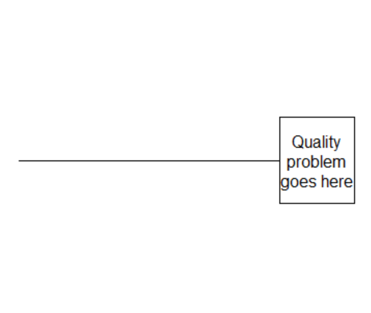
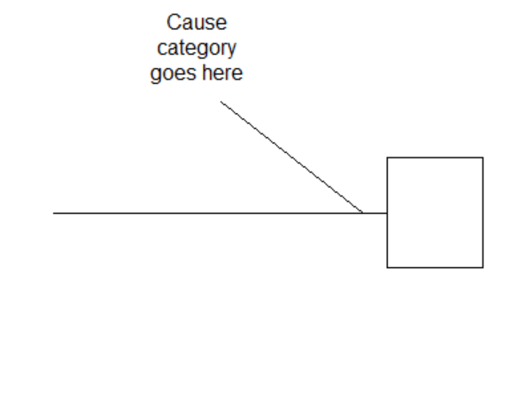
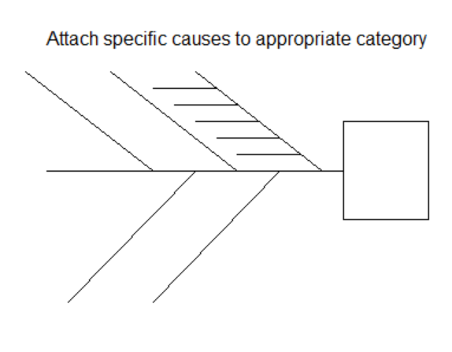
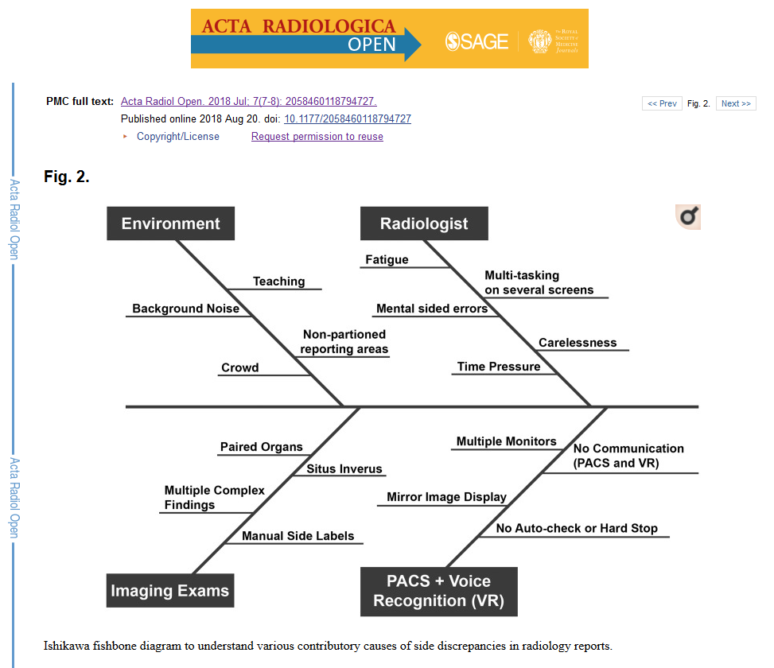
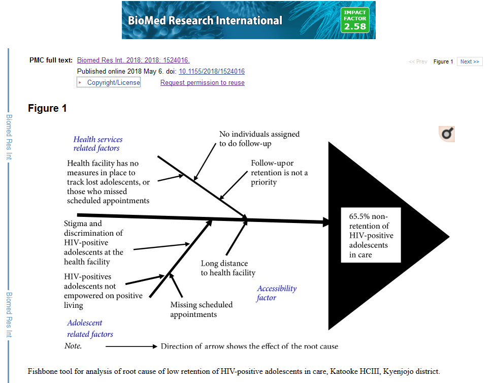
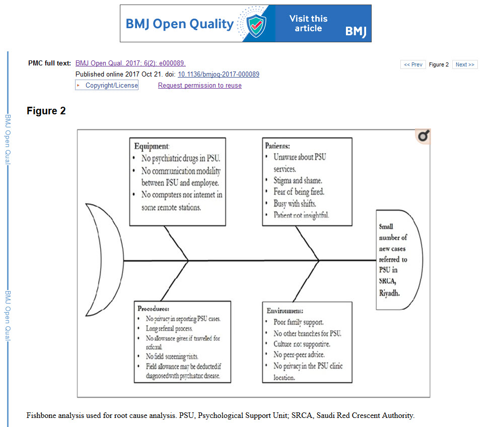
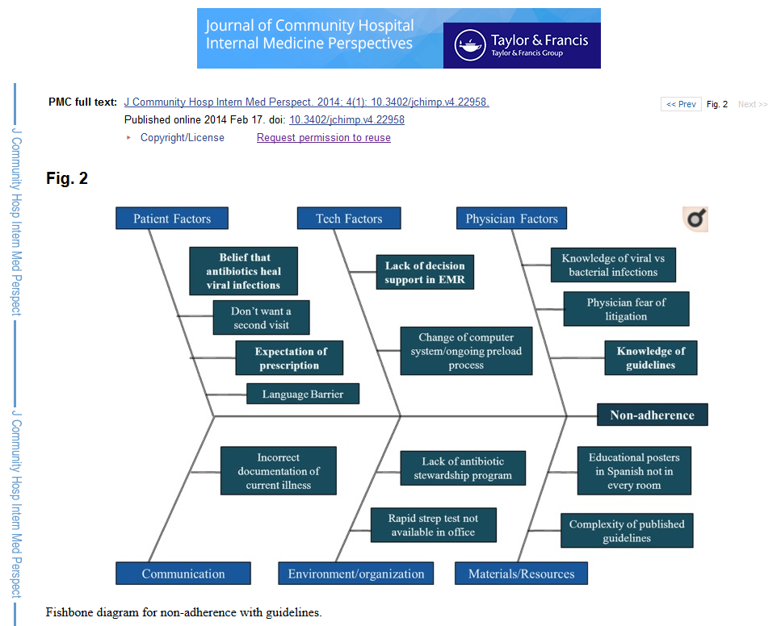
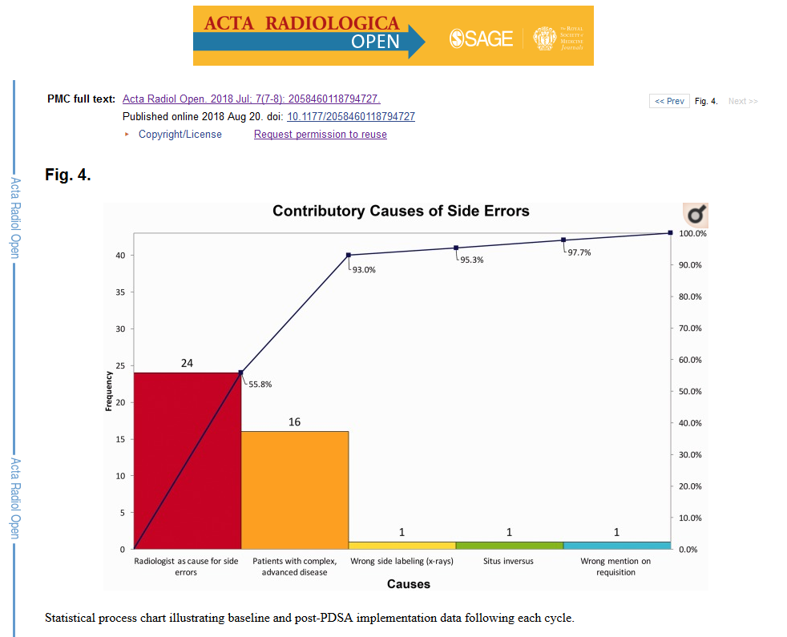
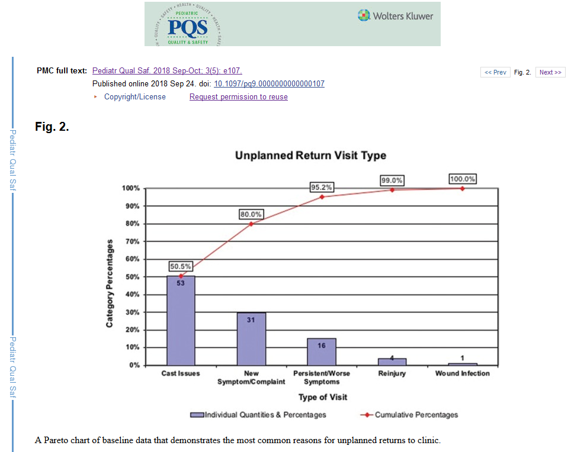
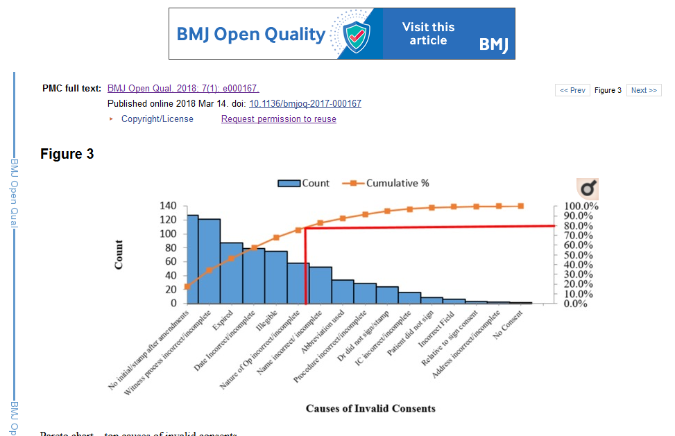

```{r echo=FALSE}
source("prelims.R", echo=FALSE)
```

***
`r read_text("objectives05")`

<div class="notes">

Here are the objectives for this week. I want to introduce some new material on quality improvement (QI) studies and this is the best place to put it. Althought QI and medical research share many features, you need to appreciate some important differences between the two approaches. Many QI studies use quasi-experimental approaches and we'll discuss a few of the more common ones.

</div>

***
`r read_text("readings05", char_max=500)`

<div class="notes">

This is what you should have read already. Take the opportunity to re-read Chapter 5. Some of the material relates to last week's lecture but some is new in this week's lecture. There are a large number of side readings that cover quality improvement topics.

</div>

### What is quality improvement? (1 of 4)

* Variety of names
  + Agile
  + Continuous Quality Improvement (CQI)
  + Kaizen
  + Lean
  + Quality Control (QC)
  + Six Sigma
  + Statistical Process Control (SPC)
  + Total Quality Management (TQM)
* Different from Quality Assurance

<div class="notes">

Some of the material discussed on this page was taken from

https://www.hrsa.gov/sites/default/files/quality/toolbox/508pdfs/qualityimprovement.pdf

Quality Improvement (QI) is a broad area and has appeared under various labels like six sigma and total quality management. There are some subtle differences among these approaches. Lean places a strong emphasis on waste reduction, while TQM paces more emphasis on management. In general, different people like different terminology, and they will argue strenuosly that their acronym is the superior acronym, and that all other acronyms are inferior, usually because, but they are not important from your perspective.

It is quite different from Quality Assurance, which has more of an audit function.

QI is a systematic approach to changing how a health care organization works with the goal of providing better health care delivery. The approach has been tested in the fields of business and engineering over the 100 years ago, and the health care systems started adopting these approaches starting about 25 years ago.

</div>

### What is quality improvement? (2 of 4)

* Historical roots
  + Walter Shewhart (1920s, General Electric)
  + W. Edwards Deming (1950s, Japan)
  + Brent James (1990s, Intermountain Health Care)

<div class="notes">

The historical roots of QI can be found in the contributions of three statisticians, Walter Shewhart, W. Edwards Deming, and Brent James. I get to brag a bit here, because the Statistics profession is one that is largely anonymous to the outside world, but Shewhart and Deming are two exceptions.

Walter Shewhart worked at General Electric in the 1920s and developed the statistical control chart, and described the concept of common cause and special cause variation. 

W. Edwards Deming was a statistician assigned to post-war Japan in the 1950s to work on their census, but ended up helping out with the rebuilding of industries in that country as well. He described a management philosophy that emphasized the involvement of everyone in an organization in the quality improvement process. 

Brent James is the chief quality officer at Intermountain Helathcare and has spoken about the culture change needed in medicine to improve quality and has trained thousands of health care professionals on how to conduct clinical practice improvement projects.

</div>

### What is quality improvement? (3 of 4)

* Systematic approach
  + Commitment to teams
  + Organization-wide support
  + Passion for measurement

<div class="notes">

The QI process makes a strong commitment to teams and emphasizes the importance of broad representation on the team and careful elicitation of viewpoints from every persepctive. While it is possible to run a QI team in a small corner of an organization, the QI process can only function well with organization-wide support, especially support from upper management. The QI process has a strong commitment to measurement, as measurement is the only way to evaluate the success or failure of changes made by the QI process.

</div>

### What is quality improvement? (4 of 4)

* Differences from research
  + Systems approach
  + Little or no attention to generalizability
  + Continuous and cyclical process
  + Major reliance on quasi-experimental studies

<div class="notes">

There is substantial overlap between QI and health care research, but you should be aware of several important differences. QI takes a systems approach to solving problems. Some research takes a systems approach as well, but it's not really a research requirement. QI pays little or no attention to generalizability. The focus of QI is on your particular organization, and ateempts to generalize to other organizations is not a priority. The QI process is not a single step but a continuous effort. This effort is usually represented by the PDCA or PDSA processs (Plan, Do, Check/Study, and Act) and each time you reach the end of a PDCA cycle, you start over again with a new plan.

The final distinction and the reason I am talking about the QI process in this class it that QI relies heavily (but not exclusively) on quasi-experimental studies.

</div>

### The SMART approach

* SMART
  + Specific
  + Measurable
  + Achievable
  + Relevant
  + Time Bounded
* [Who] will do [what] resulting in [measure] by [when]
  + Minnesota Department of Health

<div class="notes">

At a recent graduate research seminar, Felicity Pino talked about the quality improvement studies and introduced an acronym that was new to me, SMART.

Any problem identified by a QI should be written using the five criteria in the acronym SMART (Specific, Measurable, Actionable, Relevant, Time Bounded).

Specific means that you avoid multiple objectives (one verb, not two, according to the CDC) and keep the focus narrow.

Measurable means that you specify a quantitative variable that you will measure, a quantitative value representing where you currently are, and a quantitative value representing where you want to get to.

Achievable means that you have considered both the time and resources and the barriers that you face when setting your objective.

Relevant means that your objective addresses the problem directly.

Time bounded means that you set a calendar date by which you hope to achieve your objective.

As the Minnesota Department of Health puts it, you obective should state "[Who] will [what] resulting in [measure] by [when]"

</div>

### The PDSA cycle

* Plan
* Do
* Study
* Act

<div class="notes">

The PDSA cycle is commonly used when describing QI teams. Some use the acronym PDCA with Check substituting for Study, but the intention is the same. It is a cycle, which means that as soon as you act on what you've learned, you starting a second cycle of planning.

The plan, do, study, act cycle is fairly straightforward, but I want to want you that a trap that some QI teams can fall into is to ignore two of the four parts.

A team, for example, might be trapped in a Plan, Do, Plan, Do cycle and never takes the time to learn from the work or to implement changes based on the work.

Or the team might be trapped in a Plan, Act, Plan, Act cycle and never take the time to see if the plans actually have a measurable impact.

</div>

### Process, outcome, and balancing measures

* Outcome measures
  + Direct measure
  + Low signal to noise ratio
* Process measures
  + Delivering what you promised
  + Understanding the WHY
* Balancing measures
  + Unintended consequences

<div class="notes">

Some of the material for this slide was taken from 

http://www.ihi.org/resources/Pages/HowtoImprove/ScienceofImprovementEstablishingMeasures.aspx

QI studies measure broadly across three areas: outcome measures, process measures, and balancing measures.

An outcome measure is a measurement taken directly on the patients themselves. If you visualize the system as a flow chart, the outcome measures occur downstream (near the bottom of the flow chart). Oucome measures are the reason that QI teams exist. If you make changes that don't have any impact on your patients, why are you bothering?

But you can't focus just on outcome measures. For one thing, they are very noisy. They are influenced by many factors beyond your control. Second, they don't help you so much when they turn up negative. There are many places on a flow chart where things can go wrong, and if your only measurements are at the bottom, you won't know where on the flow chart that your intervention failed. 

A process measure is a measurement on how care is delivered at various stages in the health care process. Process measures involve resources like time or money spent. They can represent the percentage of time that a particular step was followed correctly or that a resource was available. They can measure the degree of consistency, such as a range or standard deviation.

Process measures are typically in top or middle of a flow chart (or upstream). If you intervention failed to influece an outdome on your patients, the process measures can help you understand why. Did the intervention fail or was it not delivered properly?

Balancing measures account for unintended consequences. Did an improvement in one area lead to an offsetting decline in another area? This would be like the famous saying, "jumping from the frying pan into the fire."

</div>

### Drawing a fishbone diagram (1 of 3)



<div class="notes">

There are two tools in QI that are very helpful during the planning process, the fishbone diagram and the Pareto chart.

The fishbone diagram (also called the Ishikawa diagram, or the case and effect diagram) is a tool for identifying the root causes of quality problems. It was named after Kaoru Ishikawa, the man who pioneered the use of this chart in quality improvement in the 1960's. It is a graphical method for displaying possible causes of a quality problem.

If you want to use a Fishbone Diagram, first list the main problem on the right hand side of the paper. Then draw a horizontal line to represent the "backbone" of the diagram. This line is not labeled.

</div>

### Drawing a fishbone diagram (2 of 3)



<div class="notes">

Off of the backbone, draw and label major bones: 4 to 7 major categories of causes. A commonly used list of major causes is Management, Manpower, Machines, and Materials.

Another possible list is Policies, Procedures, Plant, and People.

</div>

### Drawing a fishbone diagram (3 of 3)



<div class="notes">

Then attach specific causes to the appropriate category.

Some people allow the individual causes to have subcauses, which would be attached to the minor bones. This is intended to get at the fundamental or root causes of the problem. Other people do not include this level of detail on their fishbone diagrams.

The process of developing a fishbone diagram can be done by an individual, but more commonly it is done by a team. You can use standard brainstorming approaches for the fishbone diagram. For example you could go around the table repeatedly asking each person to list a cause. Only after all the possible causes are listed do you review and possibly winnow down the list. Then arrange the remaining causes on the fishbone.

If you do use a team to develop a fishbone diagram, make sure that all relevant parties are included. No fair getting input only from doctors and ignoring nurses, for example, in a health care setting. The rule should be that at least one person from any group that is associated with the work process should be included.

When you are done, look at the entire diagram. Does it have reasonable balance across the major bones? Are any common themes emerging? Can you identify causes that are measurable and fixable and which you believe are likely to have a large impact on the problem?

In some situations, you may find that a flow diagram of the work process may be more valuable and informative.

</div>

### Fishbone example (1 of 4)



<div class="notes">

As you will see, there is no standard format or structure for a Fishbone diagram.

Here is an example of a Fishbone diagram in a published research study. The problem, shown only in the legend, is side discrepancies in radiologic reports. The major bones are Environment, Radiologist, Imaging Exams, and Voice Recognition. Two specific causes on the environment bone are background noise and crowd.

</div>

### Fishbone example (2 of 4)



<div class="notes">

Here's a second example. The problem is non-retention of HIV-positive adolescents in care. The major bones are Health Services factors, Adolescent factors, and Accessibility factors. Two of the specific causes on the adolescent factor bone are stigma, and lack of empowerment.

</div>

### Fishbone example (3 of 4)



<div class="notes">

Here's a third example.  The problem is the small number of cases referred to the PSU. The major bones are equipment, patients, procedures, and environments. Two specific causes on the patients bone are lack of awareness and stigma.

</div>

### Fishbone example (4 of 4)



<div class="notes">

Here's one last example. The problem is non-adherence. The major bones are patient factors, tech factors, physician factors, communication, environment/organization, and materials/resources. Two of the specific causes on the physician factor are fear of litigation and knowledge of guidelines (I presume they mean lack of knowledge of guidelines).

</div>

### The Pareto chart

* Based on the Pareto 80-20 principle.
  + The "frequent few"
* Proportion of cases associated with a specific cause.
  + Combined with cumulative frequency
  
<div class="notes">

The Pareto chart is an attempt to focus attention on the most common causes of a problem. It is based on the Pareto Principle which talks about the "frequent few". The Pareto Principle states that most of the troubles that you see (around 80%, but this is just a ballpark estimate) are limited to just a few causes (20%, but again just a ballpark).

It is typically displayed as a bar chart of causes with a percentage of cases in each cause displayed. You put the bars in order from largest to smallest and include a line showing the cumulative frequency of causes.

You should focus your QI efforts on the left side of the Pareto chart.

</div>

### Example of Pareto (1 of 3)



<div class="notes">

This is an example of a Pareto chart published in the peer-reviewed literature. The problem is side errors in radiology and the first two causes (radiologist, and complex, advanced disease) account for 93% of the problems.

</div>

### Example of Pareto (2 of 3)



<div class="notes">

This is second example. The problem is unplanned return visits and the first two causes (cast issues and new symptoms) account for 80% of the problems.

</div>

### Example of Pareto (3 of 3)



<div class="notes">

This is third example. The problem is invalid surgical consents, and it does not quite follow the Pareto principle because the causes are quite varied. The top five causes (No initials after amendments, Witness initials incomplete or absent, Consent forms were expired, Dates incomplete or absent, Illegible handwriting, and use of abbreviations) account for 80% of the invalid consents.

</div>

### What is a quasi-experimental study?

* Could but does not use randomization
* Never sneer at quasi-experimental studies
  + Make a loud mistake
* Problems with randomization
  + Cost
  + Logistical constraints
  + Contamination
  + Small n
  + Difficult to get buy-in
  
<div class="notes">

A quasi-experimental study uses an active independent variable, but does not use a formal process of randomization to control that variable.

The choice to forgo randomization is usually a deliberate choice. Many people, including the authors of your book, dismiss the quasi-experimental design as an inferior alternative to a randomized design, but that are wrong. In some settings, randomization puts you at a disadvantage. If you decide to use a quasi-experimental design, recognize that you are choosing this design because it is superior to a randomized trial. 

I dated a piano major in college and I tried, with very limited success, to learn how to play the piano myself. She told me, "If you're going to make a mistake, make a loud mistake." You don't want to play the piano nervously and hesitantly. The same is true in research. 

If you deviate from a well-established research norm, do so boldly and explicitly. Say something like "Although this quasi-experimental study has some limitations, it avoids many of the well-documented problems with a randomized trial" And then elaborate. Don't apologize for your research design. Brag about how it is the best approach for this particular problem and explain what advantages it offers over a randomized trial.

What are the problems with randomization? First, it is expensive. It takes a lot of money (and a lot of time=remember that time is money). The machinery associated with randomization does not come cheap.

Contamination is the tendency for a particular intervention to "bleed over" into the control group. You may ask a health care provider to use a new approach for patients, but it is soemtimes very easy to let some of the new approach slip in when that person is treating a randomly selected control patient.

Certain interventions, such as changes to the physical layout of a work area are one directional and cannot be undone. This is also true of certain training interventions (Uh-oh! A control patient is next on my randomization list. Time to forget everything that I've just learned.)

The sample size available to randomize may be too small to assure that randomization would work. This is especially true when you are looking at an intervention that can be implemented only at a very broad scale, such as with an entire floor or wing of a hospital.

Even when you have enough control to randomize, the people that have to implement your randomization process may rebel. This especially true in a difficult and hectic environment like an emergency room. Randomization is one more distraction that they just don't need. They are more likely to support your research if you implement the intervention without randomization.

</div>

### Notation for research designs

* O means a measurement is made
* X means an intervention is given.
* ~X means no intervention or a control intervention
* R means randomized assignment
* NR means non-randomized assignment
* E means the experimental group
* C means the control group

<div class="notes">

There is a fairly standard notation with the letter O representing a measurement and the letter X representing an intervention.

The symbols here mean all subjects were assigned to an exposure group, that two measurements were made, then an intervention was given and then two more measurements were made.

</div>

### Example of a design

```{r notation, echo=FALSE, comment=""}
cat("R E: O1 X O2   O3\nR C: O1   O2 X O3")
```

<div class="notes">

This is an example of a waiting list control group. The patients are randomly assigned to E or C. They both get a baseline, O1. Then the E group gets an intervention X that does not happen for the control group just yet. The second measurement is done, and after the second measurement, the same intervention is offered to the control group. Then both groups are measured a third time. The comparison of O2 between the experimental and control groups is the key measure, and you can adjust for baselines using a change score or analysis of covariance. But there are other interesting comparisons. With the experimental group, the comparison of O2 with O3 represents an assessment of whether the effect of X persists over a longer period of time.

</div>

### Single group post-test only design

```{r single-group-post-only, echo=FALSE, comment=""}
cat("NR E: X O")
```

* Simplest design
* Useful for pilot work

<div class="notes">

The simplest possible design is a single group post-test only design. There is no randomization. The treatment given to everyone and you get a measurement only after the treatment. 

It reminds me of a story, that I have not been able to verify. If you find a link to this story, let me know. The famous philosopher Karl Popper asked his wife "How much do you love me?" She responded "I love you eleven".

Eleven compared to what? Maybe she loves bagels fifteen? Maybe he only loves her eight? There's no comparison to be made at all.

Although no comparisons can be done. It could be useful for pilot or feasibility studies.

</div>

***
### Single group comparison post-treatment to baseline

```{r single-group-pre-post, echo=FALSE, comment=""}
cat("NR E: O1 X O2")
```

* Allows a comparison.
* Confounded with temporal trends.

<div class="notes">

One group, pre-test versus post-test. You can look at change before and after the intervention. You still don't know if the change would have occured even without this intervention.

There are effects such as maturation or carry-over effects that could easily account for any difference seen in this design.

You can improve this design by including extra outcome variables. Half of these outcome variables would be expected to be changed by the intervention and half would be expected to be unchanged, even if the intervention is successful.

If you see that the first half changes from baseline and the second half does not, then you have some assurance that there is no temporal trend, at least no trend that might influence all the outcome variables that you are considering.

So a teaching intervention, for example, might teach lessons in X1 and X2, but not X3 and X4. Test all four areas prior to the intervention and afterwards. If you see a change in just X1 and X2 great! If you see a change in all four, though, you're in trouble.

</div>

***
### Two group comparison, without a baseline

```{r two-group-post-only, echo=FALSE, comment=""}
cat("NR E: X O\nNR C:   O")
```

* Nonrandomized comparison
* Confounded with baseline imbalance

<div class="notes">

If you have two groups, assigned without randomization, you do have a comparison, but without a baseline measurement, you can't be sure that the difference that you do see is the same as the difference that existed between the two groups prior to the intervention.

Here's where randomization would have helped a lot. Randomization controls for unmeasured covariates and the baseline value in this study is an unmeasured covariate.

The three quasi-experimental studies described so far are called pre-experimental because you cannot draw any conclusions without making some untestable assumptions.

This sounds terrible, but we make untestable assumptions all the time in science. For example, Carbon-14 dating relies on the assumption that the rate of decay of carbon-14 is the same now as it was a thousand years ago. There's no good way to test this assumption, but we accept it as reasonable.

It's okay to make untestable assumptions if there is no way that you could collect the extra data that you would need to turn it into a testable assumption. Just be explicit about what assumptions you are making and your readers can for themselves whether they agree with you that the assumption is reasonable.

One way to indirectly test the assumption that the two groups were comparable at baseline is to compare the two groups by some demographic variables like age or gender that might be associated with your baseline. If the demographic variables are comparable, then you have some assurance that the baselines would have been comparable, if you had an opportunity to measure and test them.

</div>

### Two group comparison with a baseline

```{r two-group-pre-post, echo=FALSE, comment=""}
cat("NR E: O1 X O2\nNR C: O1   O2")
```

* Best design so far.
* Can check for 
  + temporal trends in the control group.
  + baseline imbalances
* Cannot check for unmeasured covariates
* Cannot check for treatment interaction

### Interrupted time series design

```{r time-series-1, echo=FALSE, comment=""}
cat("NR E: O1 O2 O3 X O4 O5 O6")
```

* Best with three or more measures at baseline
* Check for most temporal trends

<div class="notes">

If you have the option of taking multiple measurements over time, then this can help avoid the problems with using a single group.

If the measurements are flat from O1 through O3, show a jump from O3 to O4, and then becomes flat again from O4 through O6, then you have pretty good evidence against most temporal trends, except for a temporal trend with the bad luck of occuring right at the time of your intervention.

If you see a jump between O3 and O4, but you also see jumps at most of the other time points, that's bad news.

</div>

### Hypothetical patterns in the interrupted time series design

```{r time-series-2, echo=FALSE, comment=""}
x <- 1:6
y1 <- c(1.1, 1.3, 1.2, 2.2, 2.1, 2.3)
y2 <- c(1.1, 1.4, 1.3, 1.8, 2.2, 2.3)
par(mar=c(2.6, 0.6, 1.6, 0.1), mfrow=c(2, 1))
plot(x, y1, axes=FALSE, type="b", ylim=c(0.9, 2.4))
text(3.5, 1, "X")
segments(3.5, 1.1, 3.5, 2.4, lty="dotted", col="gray")
axis(side=1, at=1:6, labels=paste0("O", 1:6))
title("Good news")
plot(x, y2, axes=FALSE, type="b", ylim=c(0.9, 2.4))
text(3.5, 1, "X")
segments(3.5, 1.1, 3.5, 2.4, lty="dotted", col="gray")
axis(side=1, at=1:6, labels=paste0("O", 1:6))
title("Bad news")
```

### Phased design (1 of 4)

```{r time-series-3, echo=FALSE, comment=""}
cat("NR E: O1 O2 X1 O3 O4 O5 X2 O6 O7 O8 X3 O9 O10")
```

* Split intervention into three or more pieces
* Phase in the intervention piece by piece

<div class="notes">


</div>

### Phased design (2 of 4)

```{r time-series-4, echo=FALSE, comment=""}
x <- 1:10
y1 <- c(1.1, 1.3, 2.4, 2.2, 2.3, 3.1, 3.4, 3.2, 4.3, 4.2)
y2 <- c(1.1, 1.7, 1.6, 2.1, 2.7, 2.9, 3.3, 3.9, 4.3, 4.2)
par(mar=c(2.6, 0.6, 1.6, 0.1), mfrow=c(2, 1))
plot(x, y1, axes=FALSE, type="b", ylim=c(0.7, 4.4))
i1 <- c(2.5, 5.5, 8.5) 
text(i1, 1, paste0("X", 1:3))
segments(i1, 1.1, i1, 4.4, lty="dotted", col="gray")
axis(side=1, at=1:10, labels=paste0("O", 1:10))
title("Good news")
plot(x, y2, axes=FALSE, type="b", ylim=c(0.7, 4.4))
text(i1, 1, paste0("X", 1:3))
segments(i1, 1.1, i1, 4.4, lty="dotted", col="gray")
axis(side=1, at=1:10, labels=paste0("O", 1:10))
title("Bad news")
```

<div class="notes">


</div>

### Phased design (3 of 4)

```{r time-series-5, echo=FALSE, comment=""}
cat("NR E1: O1 O2 X O3 O4 O5   O6 O7 O8   O9 O10\n")
cat("NR E2: O1 O2   O3 O4 O5 X O6 O7 O8   O9 O10\n")
cat("NR E3: O1 O2   O3 O4 O5   O6 O7 O8 X O9 O10\n")
```

* Wait for your turn.
* Useful for very small sample sizes.

<div class="notes">

If you can control the timing of an intervention and you can apply the intervention at different times to different patients, then you have an extra bit of evidence to rule out temporal trends as a competing explanation. When each patient sees a shift at the specific time that he/she experiences the intervention, and is flat at the remaining times, then you have assurances that a temporal trend is not the cause. The flatness for patients 2 and 3 early rule out the possibility of a temporal trend as an explanation for the jump in patient 1 and the flatness for patients 1 and 2 late rule out the possibility of a temporal trend as an explanation for the jump in patient 3.

This is a great research design if you have a very small sample size. It works well, for example, if you are implementing a change on three different floors of a hospital, for exam, and it is actually easier in many settings to stagger the interventions rather than run them all at the same time.

</div>

### Phased design (4 of 4)

```{r time-series-6, echo=FALSE, comment=""}
x <- 1:10
y1 <- c(1.1, 1.3, 2.4, 2.2, 2.3, 2.1, 2.4, 2.2, 2.3, 2.2)
y2 <- c(1.2, 1.1, 1.4, 1.1, 1.3, 2.2, 2.3, 2.4, 2.1, 2.4)
y3 <- c(1.3, 1.2, 1.1, 1.3, 1.2, 1.2, 1.3, 1.2, 2.2, 2.3)
par(mar=c(2.6, 0.6, 1.6, 0.1), mfrow=c(3, 1))
plot(x, y1, axes=FALSE, type="b", ylim=c(0.7, 2.5))
text(2.5, 1, "X")
segments(2.5, 1.1, 2.5, 2.5, lty="dotted", col="gray")
axis(side=1, at=1:10, labels=paste0("O", 1:10))
title("First patient")
plot(x, y2, axes=FALSE, type="b", ylim=c(0.7, 2.5))
text(5.5, 1, "X")
segments(5.5, 1.1, 5.5, 2.5, lty="dotted", col="gray")
axis(side=1, at=1:10, labels=paste0("O", 1:10))
title("Second patient")
plot(x, y3, axes=FALSE, type="b", ylim=c(0.7, 2.5))
text(8.5, 1, "X")
segments(8.5, 1.1, 8.5, 2.5, lty="dotted", col="gray")
axis(side=1, at=1:10, labels=paste0("O", 1:10))
title("Third patient")
```

### Withdrawal design (1 of 2)

```{r time-series-7, echo=FALSE, comment=""}
cat("NR E: O1 X O2 -X O3")
```

* Measure
* Add the intervention
* Measure again
* Withdraw the intervention
* Measure one more time

<div class="notes">

Another useful design for some interventions is the withdrawal design. It only works for an intervention that you can do and undo. 

You measure at baseline, add the intervention, then measure again. At this point you have the single group design with a pre and post measurement. But then you start another phase where you withdraw the intervention. At the third measurement, you hope that whatever change that you saw at O2 disappears.

The graphs on this slide show a good pattern for a withdrwal design and a bad pattern.

I read about a great Psychology experiment that used this design. It was a study of whether anonymity encourages bad behavior. Young adults went to a Halloween party as part of an experiment. I'm sure there was a consent form and it listed one of the beneifts of the study was a chance to play bobbing for apples. Anyway, the researchers observed the young adults at the start of the party for evidence of loud, rude, or disruptive behavior. These were teenagers, so I'm sure there was plently to observe. Then everyone at the party put on various masks that cloaked their identities. The bad behavior measures went up. But how did the researchers know that this was caused by the anonymity associated with the Halloween masks? They didn't. But they then entered a third phase of the study where everyone took off their masks and the party continued. The bad behavior measure dropped down to a level that was consistent with the first phase of the party.

It's not a perfect design, but most temporal trends are consistent over time, they go up and up or they go down and down. Now there area few temporal trends that cycle up and down, but these are less common and easier to rule out using a bit of common sense.

The withdrawal design can continue through several more phases. So at the part, you could ask everyone to put on their masks again, measure, take off the masks again, measure, and so forth. If you see a seesaw pattern up when the masks go on, and down when the masks go off, then you are happy.

Note that trying to run a randomized study here is ludicrous for more reasons than I can mention.

</div>

### Withdrawal design (2 of 2)

```{r time-series-8, echo=FALSE, comment=""}
x <- 1:3
y1 <- c(1.1, 2.3, 1.3)
y2 <- c(1.2, 2.6, 3.2)
par(mar=c(2.6, 0.6, 1.6, 0.1), mfrow=c(2, 1))
plot(x, y1, axes=FALSE, type="b", ylim=c(0.7, 3.5))
text(1.5, 0.9, "X")
segments(1.5, 1.1, 1.5, 3.5, lty="dotted", col="gray")
text(2.5, 0.9, "-X")
segments(2.5, 1.1, 2.5, 3.5, lty="dotted", col="gray")
axis(side=1, at=x, labels=paste0("O", x))
title("Good")
plot(x, y2, axes=FALSE, type="b", ylim=c(0.7, 3.5))
text(1.5, 0.9, "X")
segments(1.5, 1.1, 1.5, 3.5, lty="dotted", col="gray")
text(2.5, 0.9, "-X")
segments(2.5, 1.1, 2.5, 3.5, lty="dotted", col="gray")
axis(side=1, at=x, labels=paste0("O", x))
title("Bad")
```
