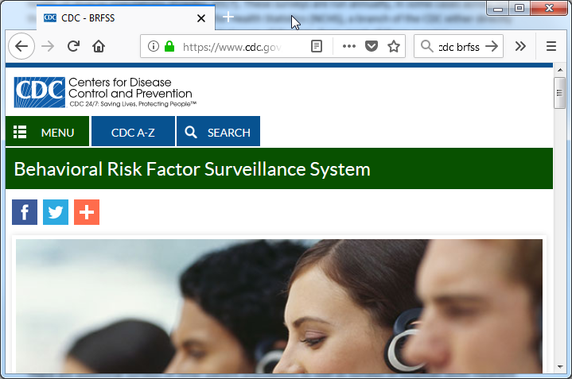
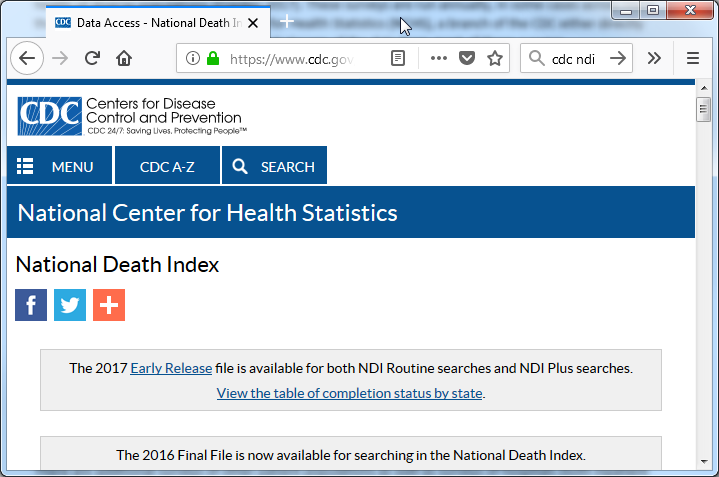
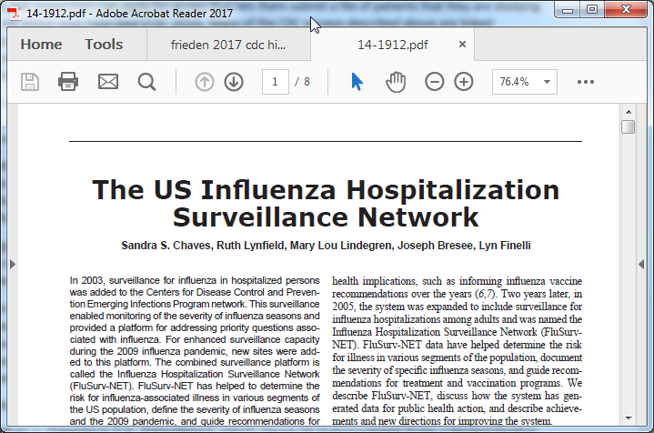
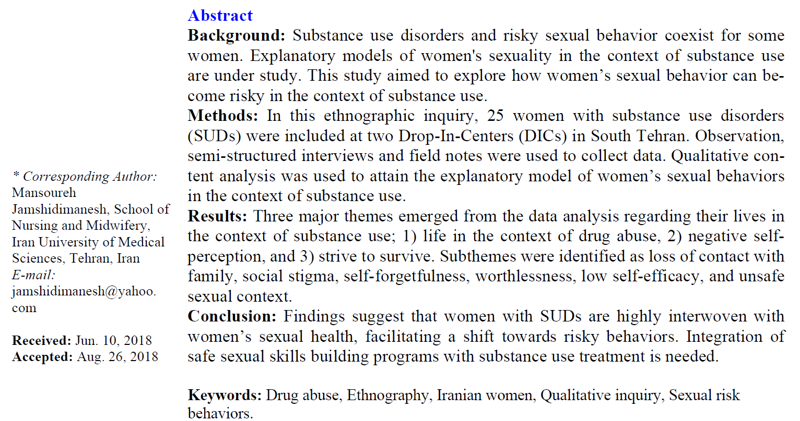

```{r echo=FALSE}
source("prelims.R", echo=FALSE)
```

***
`r read_text("objectives06")`

<div class="notes">

Here are the objectives for this week.

</div>

***
`r read_text("readings06")`

<div class="notes">

This is what you should have read already. If you haven't done the reading yet, pause this video and read this material. You'll get more out of the video if you do so.

</div>

### What is secondary data analysis?

* Primary: data that you both collect and analyze.
* Secondary: you analyze someone else's data
  + "Secondary analysis of existing data" (Cheng 2014)
* Private versus government sources
* Ancillary studies

<div class="notes">

There's a nice paper on the recommended reading list that discusses secondary data analysis. Primary data is data that you (meaning you and your research team) both collect and analyze. Secondary dta is data that someone else collected and you only provide an analysis.

There's an excellent reference in the recommended readings section and they emphasize that you should use the full phrase "secondary analysis of existing data" to avoid confusion.

Secondary data can come from private sources or from government sources. I'll talk in a bit about two excellent government sources of data: the U.S. Census Bureau and the Centers for Disease Control and Prevention.

When you work with an existing research study and ask them to add a few items to collect for your benefit, you are working on an ancillary study. This is a special treat and requires close work with the team on the existing research study. In most secondary data analyses, you con't have this luxury and have to take the data as is.

An ancillary study requires IRB approval. You need to discuss with the coordinators of the study that you are piggy baking on about who gets to be an author on your study, and what the order of authors should be. Do this before the paper is written, or you will find yourself in the middle of an ugly argument.

</div>

### What can you analyze for an already analyzed data set?

* Secondary data analysis is like eating left-over food.
* "Think different"
	+ Variables that are analyzed
	+ Relationships that are explored
	+ Different subsets of cases
	+ Different analysis techniques

<div class="notes">

If the data set has already been analyzed, is there really anything else you can do? Well, yes, but you have to live with the fact that the researchers have already selected and analyzed the most interesting parts of the data. So you are like the last person in line at a pot-luck buffet. The Swedish meatballs and the apple cobbler are already gone and you're left with the kale salad and the creamed spinach.

Don't fret, though. Many researchers collect more data than what they strictly need for their own purposes. 

You do need, as the Apple slogan says to "Think different."

You might look at different outcomes or different exposure variables that address the same general hypotheses. You could develop hypotheses involving new and untested relationships. You might be interested in a particular demographic subgroup. Or finally, you might test the same things that original researchers tested using more or less the same variables, but you might apply a new and different analysis approach.

</div>

### Combining data sets 

* Third "V" in volume, velocity, and variety
* Not the same as systematic overview, think "mash-up"
* Examples
  + Black box warnings and prescription use
  + Staffing levels and patient complaints
  + Pediatric asthma visits and housing survey

<div class="notes">

The combination of disparate data sets is one of the hallmarks of big data (the "variety" V of the three V's of big data). This is not the same as a systematic overvew, which combines several stuides of the same hypothesis. Think of the term "mash-up" which is a combination of seemingly disparite elements to create a new, but coherent product.

Here's a hypothetical example. The FDA provides lists of drugs that get "black box" warnings. This is a fairly serious thing, and you might be interested in seeing whether the prescription rates (as measured through the electronic health record) changed after the black box warning appeared.

Another hypothetical example is looking at staffing levels and the use of unplanned leave, which comes from personnel records, and the number and type of patient complaints, which are tracked in a complaints database.

I've worked with researchers who are looking at pediatric asthma visits at a local hopsital and linking the addresses to a housing survey conducted by the local government. The concern is that substandard housing could be associated with a greater need for asthma care. 

</div>

### Disadvantages of secondary analysis 

* Missing data
  + Variables not collected
  + Specific details not collected
* Wrong data
  + Wrong time
  + Wrong measures
* Stale data
* Unable to fix obvious errors

<div class="notes">

One of the big ones is the lack of control over the data collection process. You can't change how the data was collected without access to a time machine.

You may want infroation on certain variables, but the primary researchers chose not to collect this information. Or they did collect the information, but not at a level of detail that you want.

Maybe they collected the data, but collected it at the wrong time, or used a measurement approach that you dislike.

Because secondary analysis is retrospective, the data may lack "currency". It may describe an health care setting that is so different from what is done today that it represents an inappropriate extrapolation.

In a prospective study, if you get an unusual result, you can ask your research team to double check things, and maybe even go back to the patient and get a fresh set of numbers. You need to do this carefully, but it is a nice option that is totally unavailable to you in a secondary data analysis.

</div>

### Advantages of secondary analysis

* Time
* Money
* Support

<div class="notes">

The advantages of seconday analysis are almost all "comfort" factors.

Secondary data analysis takes less time because the data is already sitting there starting at you. You do, typically, have to spend more time in data management because the data collection was not optimized for your particular needs. Still, the time savings are usually quite substantial.

For the many secondary data sets, there is no cost, whatsoever for acquisition. A few data sets require a fee, but this is usually quite reasonable.

Finally, you will usually find good support for your work. Most people who make their data available for secondary data analyses want you to succeed. Your success makes them look better. This is especially true for government resources.

</div>

### Two types of secondary data sets

* Individual
  + More analysis options
  + Privacy concerns
* Aggregate
  + Mixture of apples and oranges
  + Problems with the ecologic fallacy

<div class="notes">

Some secondary data sets that have individual level records: there is separate records an indvidual unit (usually a person, but it could be an event like an emergency department visit). This is preferable in most settings, but sometimes important information has to be redacted because of privacy concerns. Other pieces of information have random noise added to them to preserve confidentiality (e.g., data shifting).

Aggregate data avoids many of the privacy issues. Aggregate data is also easier to store and to present. One big problem is that when you aggregate across a category, you end up mixing apples and oranges together and this often destroys signals that might be apparent when you look at individual values. When you mix a bunch of indvidual colors together, the results is always a blah shade of gray.

Even if you do find a signal at the aggregate level, you have to be careful. What you see may be an artefact of the ecologic fallacy. The ecologic fallacy is the belief that an association discovered at an aggregate level will also hold at an individual level.

An example of the ecologic fallacy: Sales of cigarettes are greater in states that have higher suicide rates. You don't know whether an individual who smokes is more likely to commit suicide.

</div>

### Getting started with secondary data analysis

* Start with an existing database
* Get familiar with the data
  + What variables are there?
  + What variables are not there?
  + How are the variables coded?
  + Identify potential pairs for associational studies
* Make sure you are answering an interesting question

<div class="notes">

You can attack a secondary data analysis from one of two ends. In a research driven study, you pose a question and then search for secondary data sources that might answer your question. In a data driven study, you decide on a particular secondary data source and then decide what interesting questions this data set might help you answer.

For the latter, read the documentation obsessively. Learn what variables you have and don't have. Make sure yuo are happy with the detail of the category levels for any categorical variable. Identify pairs of variables that you might want to explore the associations.

If you start with the database, you may end up answering a question that is easy to answer with that database, but it is to a question that no one really cares about. Get a second opinion about the interest and relevance of what you are studying.

There's a joke about someone who is searching along a street for a lost set of keys and a passerby volunteers to help them look. The keep looking for a while and the passerby asks where do you think you dropped your keys. The person responds, over there in that alley. So the passerby asks, so why are you looking for it out here? The person replies, because the light is so much better out here.

Moral: You have to be practical about what you can accomplish, but the easy to run study is not necessarily the study you should run.

</div>

### Alternative strategy for secondary analysis 

* Start with a research hypothesis
  + List the inclusion/exclusion criteria
  + List the relevant variables
* Search databases to see if they are a good fit.
  + Do they have the right patients?
  + Where is your control group?
  + Do they have the right variables?
	+ Find out if there are special qualifications for working with the database

<div class="notes">

You may instead want to start with your hypothesis. This seems a lot better. Starting with the data set is like putting the cart before the horse. But it is a lot more work and there is no guarantee that you will find the right data.

With your hypothesis, carefully list the inclusion and exclusion criteria. List the important variables: your outcome variable, your independent variables, and any covariates that you need to adjust for.

Then start looking at some candidate databases. Do they have the right patients. Especially make sure that the database provides you with a good control group. Maybe the data set only has sick people, and you want a healthy control group. There's nothing worse than collecting a bunch of data and then finding out that you did not have a control group for comparison.

</div>

### Get help from the literature

* How has database been used previously?
* What has already been answered?
* What was their analysis plan?
* Understand the limitations.

<div class="notes">

Read the literature on papers that have used this data set. This will help you identify if your work has already been done. Probably not, but it is also important because you will get a broader idea of what can be done. You'll also benefit from seeing what statistical models these researchers have chosen. Also look at the limitations mentioned in the discussion section. These limitations will probably apply to your work as well.

</div>


### "The Nation's Health Protection Agency"


<div class="notes">

These are the slides for a talk I gave last year to the graduate research seminar about a pair of articles that I am writing for the Encyclopedia of Big Data. THe two articles cover the CDC (Centers for Disease Control and Prevention) and the U.S Bureau of the Census..

CDC responds to new and emerging health threats and conducts research to track chronic and acute diseases. This talk will focus on CDC efforts in surveillance using nationwide cross sectional surveys to monitor the health of diverse populations.

</div>

### Nationwide cross sectional surveys


<div class="notes">

This paper by a former director of CDC is an excellent place to start. This talk will focus on CDC efforts in surveillance using nationwide cross sectional surveys to monitor the health of diverse populations (Frieden 2017).

</div>

### National Health Interview Survey


<div class="notes">

The National Health Interview Survey (NHIS) conducts in person interviews about the health status and health care access for 35 thousand households per year, with information collected about the household as a whole and for one randomly selected adult and one randomly selected child (if one is available) in that household (Parsons 2014). NHIS has been used to assess health insurance coverage (Martinez 2016), the effect of physical activity on health (Carlson 2016), and the utilization of cancer screening (White 2017).

</div>

### National Health and Nutrition Examination Survey

 

<div class="notes">

The National Health and Nutrition Examination Survey (NHANES) conducts in person interviews about the diet and health of roughly five thousand participants per year combined with a physical exam for each participant (Johnson 2014). Sera, plasma, and urine are collected during the physical exam. Genetic information is extracted from the sera specimens, though consent rates among various ethnic groups is uneven (Gabriel 2014). NHANES has been used to identify dietary trends in patients with diabetes (Casagrande 2017), the relationship between inadequate hydration and obesity (Chang 2016), and the association of Vitamin D levels and telomere length (Beilfuss 2017).

</div>

### Behavioral Risk Factor Surveillance System

 

<div class="notes">

The Behavioral Risk Factor Surveillance System (BRFSS) conducts telephone surveys of chronic conditions and health risk behaviors using random digit dialing (including cell phone numbers from 2008 onward) for 400 thousand participants per year. This represents the largest telephone survey in the world (Pierannunzi 2013). This survey has been used to identify time trends in asthma prevalence (Bhan 2015), fall injuries among the elderly (Bergen 2016), and mental health disparities between male and female caregivers (Edwards 2016).

</div>

### National Death Index

 

<div class="notes">

The CDC maintains the National Death Index (NDI), a centralized database of death certificate data collected from each of the 50 states and the District of Columbia. The raw data is not available for public use, but researchers can apply for access that lets them submit a file of patients that they are studying to see which ones have died (CDC 2016). Many of the CDC surveys described above are linked automatically to NDI. While privacy concerns restrict direct access to the full information on the death certificate, the CDC does offer geographically and demographically aggregated data sets on deaths (and births) as well as reduced data sets on individual deaths and births with personal identifiers removed.

</div>

### Influenza Hospitalization Surveillance Network



<div class="notes">

The CDC uses big data in its own tracking of infectious diseases. The US Influenza Hospitalization Surveillance Network (FluSurv-Net) monitors influenza hospitalizations in 267 acute care hospitals serving over 27 million people (Chaves 2015).

</div>

### FluView

 

<div class="notes">

Real time reporting on influenza is available at the FluView website (https://www.cdc.gov/flu/weekly/). This site reports on a weekly basis the outpatient visits, hospitalizations, and death rates associated with influenza. It also monitors the geographic spread, the strain type, and drug resistance rates for influenza.

</div>

### Foodborne Diseases Active Surveillance Network

 

<div class="notes">

FoodNet tracks laboratory confirmed food-borne illnesses in ten geographic areas with a population of 48 million people (Crim 2015). 

</div>

### Active Bacterial Core Surveillance

 

<div class="notes">

The Active Bacterial Core Surveillance collects data on invasive bacterial infections in ten states representing up to 42 million people (Langley 2015).

</div>

### United States Bureau of the Census

 

<div class="notes">

Question for the audience, when you think of Census Bureau, what is the first thing that springs to your mind? 

The Census Bureau is a federal agency that produces big data that is of direct value and which also provides the foundation for analyses of other big data sources. They also produce information critical for geographic information systems in the United States.

</div>

### Article I, Section II of the U.S. Constitution

 

<div class="notes">

The Census Bureau is mandated by Article I, Section II of the U.S. Constitution to enumerate the population of the United States to allow the proper allocation of members of the House of Representatives to each state. This census was first held in 1790 and then every ten years afterwards. Full data from the census is released 72 years after the census was held. With careful linking across multiple censuses, researchers can track individuals such as Civil War veterans (Costa 2017) across their full lifespan, or measure demographic changes in narrowly defined geographic regions, such as marriage rates during the boll weevil epidemic of the early 1900s (Bloome 2017). 

</div>

### Integrated Public Use Microdata Series International Partnership

 

<div class="notes">

For more recent censuses, samples of microdata are available, though with steps taken to protect confidentiality (Dreschler 2012). Information from these sources as well as census microdata from 79 other countries is available in a standardized format through the Integrated Public Use Microdata Series International Partnership (Ruggles 2015).

</div>

### American Community Survey

 

<div class="notes">

Starting in 1940, the Census Bureau asked additional questions for a subsample of the census. The questions, known informally as “the long form,” had questions about income, occupation, education, and other socioeconomic issues. In 2006, the long form was replaced with the American Community Survey (ACS), which covered similar issues, but which was run continuously rather than once every ten years (Torrieri 2007). The ACS has advantages associated with the timeliness of the data, but some precision was lost compared to the long form (Spielman 2014, Macdonald 2006).

</div>

### Master Address File

 

<div class="notes">

Both the decennial census and the ACS rely on the Master Address File (MAF), a list of all the addresses in the United States where people might live. The MAF is maintained and updated by the Census Bureau from a variety of sources, but predominantly the delivery sequence file of the United States Postal Service (Loudermilk 2009).

</div>

### Census blocks

 

<div class="notes">

The census block, the smallest of these regions, typically represent what would normally be considered a city block in an urban setting, though the size might be larger for suburban and rural settings. There are many census blocks with zero reported population, largely because the areas are uninhabitable or because residence is prohibited (Freeman 2017).

</div>

### Topologically Integrated Geographic Encoding and Referencing System

 

<div class="notes">

The geographic aggregation is possible because of another product that is of great value to big data applications, the Topologically Integrated Geographic Encoding and Referencing (TIGER) System (Marx 1990). The TIGER System, a database of land features like roads and rivers and administrative boundaries like county and state lines and has formed the foundation of many commercial mapping products used in big data analysis (Croner 1996). The TIGER system allows many useful characterizations of geographic regions, such as whether a region contains a highway ramp, a marker of poor neighborhood quality, (Friesthler 2016) and whether a daycare center is near a busy road (Houston 2006).

</div>

### American Housing Survey

 

<div class="notes">

The American Housing Survey (AHS) is a joint effort with the Department of Housing and Urban Development that surveys both occupied and vacant housing units in a nationally representative sample and a separate survey of large MSAs. The AHS conducts computer assisted interviews of roughly 47,000 housing units biennially. The AHS allows researchers to see whether mixed use development influences commuting choices (Cervero 1996) and to assess measures of the house itself (such as peeling paint) and the neighborhood (such as nearby abandoned buildings) that can correlated with health outcomes (Jacobs 2009).

</div>

### Current Population Survey

 

<div class="notes">

The Current Population Survey, a joint effort with the Bureau of Labor Statistics, is a monthly survey of 60,000 people that provides unemployment rates for the United States as a whole and for local regions and specific demographic groups. The survey includes supplements that allows for the analysis of tobacco use (Zhu 2017), poverty (Pac 2017), food security (Jernigan 2017), and health insurance coverage (Pascale 2016).

</div>

### Consumer Expenditure Survey

 

<div class="notes">

The Consumer Expenditure Survey, also a joint effort with the Bureau of Labor Statistics, is an interview survey of major expenditure components combined with a diary study of detailed individual purchases that is integrated to provide a record of all expenditures of a family. The purchasing patterns for the basis for the market basket of goods used in computation of a measure of inflation, the Consumer Price Index. Individual level data from this survey allows for detailed analysis of purchasing habits, such as expenditures in tobacco consuming households (Rogers 2017) and food expenditures of different ethnic groups (Ryabov 2016).

</div>

### National Crime Victimization Survey

 

<div class="notes">

The National Crime Victimization Survey, a joint effort with the Bureau of Justice Statistics, is a self-report survey of 160,000 households per year on nonfatal personal crimes and household property crimes. The survey has supplements for school violence (Musu-Gillette 2016) and stalking (Menard 2016).

</div>

### Summary

CDC

* NHIS, NHANES, BRFSS, NDI, FluSurv-NET, FluView, FoodNet

Census

* ACS, MAF, Census blocks, TIGER files, AHS, CPS, CES, NCVS

<div class="notes">

Here's a quick overview of all the big data produced by CDC and the Census Bureau.

</div>


### Research Approaches 


<div class="notes">

Going back to the figure that we have used, there are five columns. The past couple of weeks have talked about the first two columns. Now we will talk about the other three columns: comparative, associational, and descriptive studies.

For all of these studies, according to your book, you are "stuck" with an attribute independent variable, one that you cannot manipulate or control. It's one distinction, but you need to be careful because sometimes you have an active independent variable, one that you can control through randomization, but you choose not to randomize. We talked about these under the umbrella of quasi-experimental designs last week, but I want to talk more about them this week as well.
</div>

### Why not randomize everything?

* Can't randomize because...
  + Impossible
  + Impractical
  + Unethical
  + Strong patient preference
  + Retrospective studies
  
<div class="notes">

If you have an attribute independent variable, as your book points out, you cannot randomize. When you compare demographic groups, those who belong to one demographic group are stuck in that group. You can change a person's race or gender at all, and changing a person's age group requires a time machine. You could, possibly, change a person's socio-economic status, as the film "Trading Places" illustrates, but this requires far too much effort to be done on a large scale.

Last week, we talked about setting where randomization was impractical. In a busy setting like an emergency room, you usually can't impose the complexities associated with randomization.

You can't randomize when you are studying a harmful exposure. It is unethical to deliberately expose someone to something that might hurt them. There are a few limited exceptions, such as a harm that is minor and easily reversible.

You can't randomize when patients and/or the treating physicians have a strong preference for (or against) a particular treatment. I talked last time about laproscopic surgery and how it was hard to convince patients to be randomly assigned to the alternative: open surgery, which leaves a large scar.

Finally, you can't randomize a retrospective study, since the data has already been collected.

Your book uses three categories for research: could randomize and did randomize; could randomize, but didn't (and sneers at this choice); and couldn't randomize (because you were "stuck" with an attribute random variable). I think it is better to think about the non-randomized studies using the five criteria listed above.

Of course, a non-randomized study could decide against randomization for more than one of the above reasons. Suppose you are studying the effect of second-hand smoke exposure. You couldn't randomly marry off half of your participants to smokers and half to non-smokers. It would be impractical, because you have to wait for several decades for the cancer to develop. It is unethical because you are deliberately exposing someone to something that is potentially harmful. You also have to deal with strong patient preference. Most of us are quite fussy about who we agree to marry.

</div>

### Departures from Gliner et al

* "Observational" instead of "non-experimental"
* Categorize by sample selection
  + Cohort
  + Cross-sectional
  + Case-control
  + Historical control

<div class="notes">

I'm going to depart a bit from what your book says. The first departure is that I will use the term "observational" instead of "non-experimental." This is a bit dangerous, perhaps, because the term "observational" sometimes refers to research that involves watching what happens in public spaces. But in Medicine, at least, most people understand what I am talking about.

A bigger departure is that I want to classify non-experimental or observational studies not be how they were analyzed (comparative, associational, and descriptive) but by how the sample was selected. There are four approaches: cohort designs, cross-sectional designs, case-control designs, and historial control designs.

</div>

### Cohort designs (1 of 3)

* Cohort defined by exposure
* Compared to unexposed controls
* Prospective or retrospective

<div class="notes">

The first type of observational design is called a cohort design. You select a group of people who have a specific exposure. You compare them to another group that does not have the exposure.

Cohort designs can be defined prospectively or retrospectively. But in a retrospective study, be sure that the outcome occurs after the exposure and not before the exposure.

</div>

### Cohort designs (2 of 3)

* Disadvantages
  + Difficult for rare diseases, long latency
  + Selection bias, confounding
* Advantages
  + Can examine multiple outcomes
  + Easy to explain
  + Well defined comparison group
  + Adaptable to longitudinal analysis
  
<div class="notes">

Let's talk about the disadvantages first.

If you are examining a rare outcome, you need a pretty large sample size. The rule of thumb is that you would like to see 25 to 50 events in the exposed and unexposed groups. If an outcome occurs rarely, like 0.1% of the time, then you'd need tens of thousands of patients to accumulate a sufficient number of events.

If you are looking at an outcome that has a long latency period (such as cancer), you might need to follow your patients for several decades. Who has that sort of luxury? A retrospective cohort might work here, but you'd better have a database that includes information across a very broad time span.

In a study where the patients and/or the doctors choose who gets what, you have an issue with selection bias. Also, you have no ability to insure covariate balance between the exposed and unexposed groups, so confounding is a serious issue.

</div>

### Cohort designs (3 of 3)

* Advantages
  + Can examine multiple outcomes
  + Easy to explain
  + Well defined comparison group
  + Adaptable to longitudinal analysis
  
<div class="notes">

The cohort design can examine a variety of outcomes: mild, moderate, and severe.

It is usually pretty easy to present the data in a cohort design. You have two groups and you follow them over time and then see what happens to them.

It is usually (but not always) easy to define and collect data on a control group. The cohort design makes it easy to collect data at multiple time points (e.g., a longitudinal design) to evaluate short and long term effects of an exposure.

</div>

### Case control designs (1 of 4)

* Cases defined by outcome
* Comparison to controls without the outcome
* Always retrospective

<div class="notes">

In a case control design, the cases are defined by the outcome measure. Did someone have a certain disease or experience a certain bad event? This might represent a diagnosis of cancer, or a heart attack, or suicide attempt.

Look back at the history of that patient and see there is a common history that might identify risk factors that explain the event. You need a comparison group, though, to see if what is common in your cases is or is not common in your controls. A psychologist who was noting the problem with many research studies involving sexual abuse noted with a bit of sarcasm that 95% of all sexual abusers have milk in their refrigerators.

In a case control design, the comparison group is people who did not experience the outcome. You compare the cancer patients to patients who did not have cancer. You compare heart attack patients to patients who did not have heart attacks. You compare suicide attempts to people who did not try to kill themselves.

</div>

### Case control designs (2 of 4)

* Disadvantages
  + Counter-intuitive appearance
  + Difficulty in identifying good controls
  + Confounding

<div class="notes">

The biggest complaint about the case-control design it just doesn't feel right. The case-control design is, to most people (including me), very counter-intuitive nature. You're selecting people on an outcome and then seeing what influences that outcome. There's no sampling going on here, so it almost seems like cheating. It's not cheating, and the theoretical foundation for the case-control design was established in the 1950s.

The other big, big problem for the case control study is finding good controls. You want to find someone just like your lung cancer cases in everything except the lung cancer. Or someone just like a heart attack patient minus the heart attack. Or someone just like the suicide attempt without the attempt.

There is no selection bias in a case-control study. Nobody elects to be a cancer patient, for example. But confounding is a huge issue. Suppose your cases for a cancer patient are people who show up at the same hospital with a broken arm. People with a fracture are almost certainly a different age, have a different set of activities, and so forth. Any of these might be an alternative explanation for why the risk factor is more commonly seen in the cases than in the controls.

</div>

### Case control designs (3 of 4)

* Advantages
  + Can examine multiple risk factors
  + Efficient for rare diseases
  + Great starting point for mysterious outcomes
  
<div class="notes">

A lot of people sneer at the case-control design as the weakest type of observational study, and while it does have significant problems, the humble case-control design has significant advantages over many other types of research.

The case-control design is great if you want to examine a broad range of risk factors. You're at a picnic and half of the people come down with food poisoning caused by listeria. Was it the potato salad? The baked beans? The apple streudel? At a big picnic, there might be hundreds of foods that could have caused the listeria outbreak.

That okay, though. Just find out what everyone ate and if there is a food that almost everyone with listeria had and that almost no one in the healthy control group had, there's your culprit.

The case control design is very efficient for studying rare diseases. You put out the word in the community ("Calling all cases. Calling all cases.") and get everyone in for an interview. 

It's also a great starting point. There is something weird happening out there and we don't know what is causing it. The very first studies of AIDS, back when we didn't know a lot about the disease, were case control studies.

</div>

### Case control designs (4 of 4)

* Selecting controls
  + Hospital/clinic based
  + Community
  + Relative/friends
  + Within the same cohort

<div class="notes">

Controls commonly come from several places. People who visit the same hospital or clinic, but for a reason other than the cancer, heart attack, or suicide attempt. People who live in the same community as the cancer, heart attack, or suicide attempt. Or friends and relatives of the cancer, heart attack, or suicide attempt. Sometimes you have a cohort of patients who you follow over time, and you notice that some of the cohort experience an outcome and you pull a carefully matched set of control patients out of the same cohort. This is a nested case control study.

Because of the difficulty in finding a good set of controls, researchers will almost always use matching to insure that the demographic profiles line up nicely between the cases and the controls.

</div>

### Cross-sectional designs (1 of 3)

* Single group
  + No selection by exposure
  + No selection by outcome
* Can be prospective or retrospective

<div class="notes">

In a cross-sectional design, you're sample is a single group of patients. You don't go hunting for controls among unexposed patients. You don't go hunting for controls among the non-cases. It's the ultimate in one stop shopping.

You might have trouble sometimes determining the difference between a cross-sectional study and a cohort study. Did you select a single group, which naturally divided itself into an exposed cohort and un-exposed controls?  Or did you select an exposed cohort and then separately find an unexposed set of controls?

Cross-sectional designs can be prospective or retrospective.

</div>

### Cross-sectional designs (2 of 3)

* Disadvantages
  + Confusion about temporal ordering
  + Selection bias, confounding

<div class="notes">

It was a physicist, John Archibald Cox, who notes that "time is nature's way of keeping everything from happening all at once." True enough, but in a cross sectional design, you collect data all at once about exposures and outcomes and sometimes you can get confused about what happened first.

There's a bad joke about a statistician who examined fire department records and concluded that the more fire trucks you send to the scene of a fire, the more damage that they cause.

In general, an exposure has to occur before the outcome in order to conclude that it caused the outcome. And this might be easy to miss in a cross-sectional design.

Like the cohort design, the cross-sectional design has problems with selection bias and confounding.

</div>

### Cross-sectional designs (3 of 3)

* Advantages
  + Examine multiple risk factors, multiple outcomes
  + Realistic setting

<div class="notes">

There are several advantages to a cross-sectional design.

Because you are not selecting a single exposure or a single outcome, you have a lot of flexibility to explore multiple exposures against multiple outcomes.

The cross-sectional design is also the most natural and intuitive setting for a research study. You can envision a sampling process that produces this study and in many settings, this sampling produces a realistic picture of the health care process. More realistic than the case control design certainly, and more realistic, possibly, than the cohort designs where the two groups have an artificial distinction between them. You could even argue that a cross-sectional design is more natural than a randomized control trial, because volunteer bias and the extra attention that are part and parcel of a randomized trial make it, at times, a poor representation of how health care is delivered.

</div>

### Historical control designs (1 of 2)

* Controls separated by time
  + Similar to the single group, pre-post measurement
* Sometimes separated by space
  + Similar to the two group, post measurement only
* Often separated by both space and time

<div class="notes">

In a historical control design, control patients are separated by time. Current patients are compared with earlier patients. This may remind you of the quasi-experimental design where you have a single group and get measurements both at baseline and after the intervention.

Sometimes a historical control group represents a setting where the control patients are separated by distance. All of the exposed patients are at your clinic and the controls come from a different clinic.

More often, though, the historical control group is separated from the exposed group by space AND by time. You compare today's patients are your clinic with yesterday's patients at a different clinic.

</div>

### Historical control designs (2 of 2)

* Disadvantages
  + Confounding 
* Advantages
  + Cheap and easy
* Settings with 100% morbidity or mortality

<div class="notes">

Confounding is an issue for any observational study, but with the other three types of studies, you can try to control for this with careful selection of the control group. You can also use matching or statistical adjustments and these often can help a lot.

The historical control study, in most people's minds, is beyond repair. The separation in time and space pretty much guarantees confounding and there really are no remedies that you can apply during the design or during the analysis that will convince anyone that there isn't an alternate explanation that is an equally or more convincing explanation for the results you have found.

The big advantage of the historical control design is time and money. Your historical control group is, by definition, already sitting there waiting for you to use it. In most cases, the historical control group comes cheap or even for free.

Everyone sneers at a historical control group and for once I might be tempted to sneer at it also. There is one exception, though. If an exposure is associated with near 100% morbidity or mortality, then a historical control group works just fine. You would be hard pressed to convince anyone to forgo a treatment in this setting, so why even try. The point, though, is that any improvement will be patently obvious in a disease that, left to its own, kills almost everyone that it touches.

</div>

### Confusion between designs (1 of 6)

* Retrospective cohort vs case-control design
* Prospectitve cohort vs cross-sectional design
* Historical control and the quasi-experimental design

<div class="notes">

The restrospective cohort design is sometimes easy to confuse with cross-sectional design and the case-control design, but there should be an obvious step where subjects are selected. Did you select on the exposure? That makes it a cohort design. Did you select on the outcome? That makes it a case-control design. Did you select a single group and then classify patients as to their exposure and their outcome? Then you have a cross-sectional design.

You could argue that the distinctions here are not important, and you'd be correct. The value in assigning a label is that there is a general belief with some justification that a cohort design is more rigorous than the other designs. Also, certain statistics, like the relative risk, are inappropriate for a case-control design, because the prevalence of the disease is artificially controlled (typically to a 50-50 ratio of cases to controls).

There's also a tendency to confuse the cross-sectional design with the cohort design. Time is important here. Is everything collected all at once and then you sort out who is exposed and who is unexposed? That makes it a cross-sectional design. If you select and exposed group and then separately go out and select an unexposed control before you make any measurements on your data, then you have a cohort design.

The historical control design is similar to some of the quasi-experimental designs discussed last week. The difference is fairly subtle. In a quasi-experimental design, you have an active independent variable and you decide based on logistical constraints that you can't randomized. The historical control design uses an attribute independent variable. Another possible distinction is that a quasi-experimental design studies an intervention and a historical control design studies an exposure. An intervention is something that you hope, at least before you have run your study, that might make things better. Perhaps it makes things worse, but you didn't study it because you thought it might make things worse. An exposure, on the other hand, is something that you worry about. Maybe it is harmless, but maybe not.

These are all subtle distinctions, and the people who publish in the medical journals often get things confused themselves. So don't worry too much about this now. The distinctions are important, from the perspective of the hierarchy of evidence. They are also imporant, at times, because certain research designs (most notably the case-control design) limit some of the statistical summaries that you can use.

</div>

### Confusion between designs (2 of 6)


<div class="notes">

I don't want to confuse or intimidate you, but let's look at an example of an observational study and see what we are up against. This paper talks about neurological complications after surgery and describes it as a case-control study. If that's the case then the outcome has to be complications because the outcome has to occur last.

So you select patients with and without complications and see what happened during the surgery and beforehand that might be a risk factor for complications.

</div>

### Confusion between designs (3 of 6)


<div class="notes">

But the first sentence of the abstract seems to imply something different.

"A total of 2121 patients underwent cardiac surgery."

That implies a cross-sectional study. You get a big group of patients (2121 surgery patients) and see what risk associated with the surgery (such as leaving a sponge inside the patient) affect outcomes like neurological complications. You might also be interested in demographic factors that might influence the outcome like age and gender.

The point is that this looks like a single sample with measurements associated with various risk factors and various outcomes asssessed simultaneously.

</div>

### Confusion between designs (4 of 6)


<div class="notes">

Later, though, you see that patients with "major stroke ... and a spectrum of transient neurological episodes ... were compared ... with matched patients ... without neurological deficits."

For now, I'll lump transient neurological episodes in with the more serious outcome (major stroke) and call this the stroke group.

So that seems to imply that cases and controls were selected from the cross-sectional study.

</div>

### Confusion between designs (5 of 6)


<div class="notes">

Now look here. The phrase "patients with and without imaging" sure sounds like our "cases" with major strokes and transient neurological episodes. But we are comparing these to the controls not on risk factors that occured before the strokes and neurological episodes, but on outcomes like length of stay or mortality. So maybe the major strokes and transient neurological episodes represent a cohort and you want to see whether exposure to strokes influences certain outcome measures that are taken after the stroke. Death certainly occurs after the stroke and not before. So death is the outcome and stroke is the exposure.

</div>

### Confusion between designs (6 of 6)


<div class="notes">

A bit further down, you see a discussion of "bilateral internal carotid stenosis of any grade" and "re-do operations," which sound like risk factors that occur before the stroke. So maybe it is a case-control design after all.

I would characterize this as a cross-sectional study with a case-control study nested within. The cross-sectional sample (2121 patients) provided clues as to whether the exposure group (strokes) had more bad outcomes than the unexposed group. Bad outcomes meaning longer lengths of stay and higher mortality. The case-control study nested within the cross-sectional sample helped identify whether risk factors like stenosis and re-do operations increased the risk of a bad outcome where here the bad outcome was major stroke or transient neurological episodes.

So how can the stroke group be both a cohort group and a case group? It's all in the timing. The example I always cite in this context is low birth weight. For an obstetrician, low birth weight is an outcome, because they see low birth weight as being at the end of the process. For a neonatologist, low birth weight is an exposure because they see low birth weight at the beginning of the process.

The point of this example is that classifying a study into one of the four categories (cohort, cross-sectional, case-control, or historical control) is a tricky process. The experts who publish these papers often get these terms wrong themselves, so don't worry too much if you can't figure things out.

</div>

### Causation and observational designs

* Observational designs CAN establish a causal relationship
  + Just requires more work
  + Control for confounding
  + Bring in external evidence
* Hill's nine criteria (strength, consistency, specificity, temporality, biological gradient, plausibility, experiment, analogy)

<div class="notes">

Your book states very strongly that only randomized trials can establish a cause and effect relationship. Quasi-experiments can sometimes suggest or hint at a cause and effect relationship. And non-experimental studies are pretty much incapable of anything.

This persective is held by many in the research community, but it is wrong, wrong, wrong. 

Observational designs can establish a causal relationship. Let me repeat this, because it is important. Observational designs can establish a causal relationship.

You just have to work a bit harder at it. Confounding, for example, is a serious problem for all observational studies, but there are tools like matching that can control for confounding during the design phase, or propensity score analysis, that can control for confounding during the analysis phase. You don't, necessarily have to resort to these approaches in a randomized trial (though they can't hurt). The point is that pretty much any reasonable randomized trial can establish a causal relationship. But in observational studies, only the very best studies can establish a causal relationship.

The other thing about observational studies is that there is strength in numbers. It is usually not just one study that establishes a cause and effect relationship. It is a series of studies. So your current observational study has to rely on information external to that study because by itself, it may not be strong enough.

I want to review Sir Austin Bradford Hill's criteria for establishing a causal relationship. He wrote a landmark paper in 1965 in the midst of the crisis in the research community about the link between smoking and lung cancer (more on that in a bit). He looked at the evidence that had accumulated and elucidated nine factors that you can use to help establish a causal relationship. None of these by themselves is sufficient, but a reasonable combination of them makes your argument quite persuasive.

</div>

### Hill's criteria (1 of 9)

* Strength
  + Large effects can only be overturned by large confounders.
  + Weak effects can still be real

<div class="notes">

Hill identified the strength of the association as being the most critical factor. The reason for this is that a strong effect could only be overturned by a strong confounder. A weak confounder would only attenuate things a bit. If you want to hypothesize that a third factor among smokers (poor diet, dangerous work conditions, or lack of exercise) could cause the ten to twenty fold increase in the risk of lung cancer, that third factor would have to increase the risk of lung cancer by more ten or twenty fold.

Keep in mind, though, that weak effects can still be real. There was some criticism of a government report that said that the number of deaths due to smoking was around 450 thousand people per year. The critics dissected this number and said, we'll allow you the deaths due to cancer, but not for other factors like stroke and heart attacks, because these only showed a two fold or smaller increase in risk. It turns out that these other ways that smoking can kill you are very real, but because these causes of death (unlike lung cancer) are fairly common in the general population, you can't just get a large increase in risk. If 30% of the public dies from heart attacks, a ten fold increase is just impossible.

When the association is small, you don't totally disregard it. You just have to rely on some of the other criteria.

The other point, that has been made in many settings is that a large effect can be easily produced by a seriously flawed study. Paul Rosenbaum, in his book, Observational Studies discusses a non-randomized study conducted by Linus Pauling that showed a four fold increase in the survival times in patients with advanced cancer who received mega-doses of Vitamin C, and then points out the serious flaw that caused this finding.

</div>

### Hill's criteria (2 of 9)

* Consistency
  + Replication across DIFFERENT study types

<div class="notes">

Consistency is also important. A single positive result in a single observational study could possibly be the result of various biases. A second positive result in a second study that is substantially different than the first study, could possibly be the result of a different set of biases. But by the time the third result comes along, in a study different that the first two, it becomes awfully hard to argue that there is a third set of biases. Biases can work in both directions, and it would be rare that all of these biases would conspire to work together towards a common goal.

Now, if the same study is replicated more or less consistently, then replication doesn't help that much.

</div>

### Hill's criteria (3 of 9)

* Specificity
  + Multiple cures or common bias?
  + Deliberate inclusion of negative outcomes
  + Exceptions: aspirin, smoking
  
<div class="notes">

Specificity means that a treatment cures one and only one disease. If it appears to cure a multitude of diseases, then what is probably happening is that there is a bias (maybe selection bias?) that is causing the exposure group to be healthier than the control group. If an exposure is causing a multitude of problems, maybe a bias is causing the exposure group to be sicker than the control group.

You can rule out a healthier or sicker exposure group if you show that only one outcome (or only a small number of outcomes) is changed between the exposed and unexposed groups. You can take advantage of this by deliberately including outcome measures that you would expect to be negative.

Suppose you are testing whether toll booth workers suffer problems from CO poisoning. You'd get your toll booth workers and compare them to a control group and see if you have more problems with headache, nausea, dizziness, and fatigue. These are all symptoms associated with carbon monoxide poisoning. But what if the people who work in toll booths aren't really sicker, but because they have such a dreary job, they are more likely to complain.

To check for this, ask about muscle pain, rashes, coughing, sneezing, fevers: symptoms that are not normally associated with CO poisoning. If these are elevated in the toll booth workers, then you know that you just have a bunch of complainers on your hands. If these show little or no change, while the symptoms specific to CO poisoning do show a change, then you have stronger evidence that something real is going on.

</div>

### Hill's criteria (4 of 9)

* Temporality
  + A has to precede B to be a cause
  + Advantage of prospective studies
  + Difficult for long latency diseases
  
<div class="notes">

If you cannot establish temporality, then you have a harder time establishing causation. 

This is easier in a prospective study. When you are recalling events in the past, it is easier to get them out of order. This is an issue I mentioned earlier with cross-sectional studies.

There were some speculations about how cancer causes smoking. This seems like a reversal of the causal model, but the argument was that some people have a genetic disposition to cancer and the same set of genes might also make them easier to get addicted. The argument doesn't hold water, of course, but you need that genetic link to keep from being totally disregarded.

Temporality is tricky for a disease that has a long latency period, one that hides quietly in your body for many years before revealing itself. Did the disease change your diet rather than your diet producing the disease?

</div>

### Hill's criteria (5 of 9)

* Biological gradient
  + Dose response relationship
  + Rule out some, but not all confounders
  + Hormesis and other patterns
  

<div class="notes">

A biological gradient means that as the intensity of your intervention increases, the larger the improvement you see in your outcome. For an exposure, a biological gradient means that the greater the amount of exposure, the greater the degree of harm.

The biological gradient is often referred to as a dose-response relationship. If you have the ability to measure several levels of an intervention or exposure, it can help. Some, but not all, biasing factors tend to bias at a constant rate, not at a rate that escalates in a dose-response pattern.

For example, recall bias is a big problem in retrospective studies. People's memory of the past is influenced by what has happened to them recently. It's not that one group is making things up, but rather that the controls are more likely to overlook things.

Recall bias, though, is unlikely to be stronger in patients with a greater exposure, so if you see a gradient, with low exposures showing smaller effects than large exposures, that's good news. You can rule out recall bias and maybe selection bias and maybe even other biases if they affect your comparison more or less uniformly across the spectrum of exposures.

Hormesis is a surprising, but not too unusual pattern where you see a helpful effect for a small dose of something that is decidely harmful for larger doses. There is some evidence, for example, that a small amount of wine (e.g., one glass per day) has some beneficial effects, even though a larger amount of alcohol consumption causes all sorts of problems. So failure to see a dose response pattern is not a disqualifying event.

</div>

### Hill's criteria (6 of 9)

* Plausibility
  + Biological mechanism
  + Dependent on current state of knowledge

<div class="notes">

Plausibility is a measure of whether a result is consistent with what we know about medicine. It is often referred to as a plausible biological mechanism.

It is commonly cited as a factor in deciding whether a result should be trusted, but in the original 1965 publication, Sir Austin Bradford Hill seems somewhat unimpressed. He points out, correctly, that our knowledge of mechanisms changes over time. 

There is also a fair amount of subjectivity in this term. Just to cite one extreme example, there was a surge about a decade ago in prayer studies where patients were randomly assigned to either receive prayers from a stranger or to a control group. There is certainly a big difference in opinion about whether it is plausible to believe in a God who intercedes in our lives when we pray to Him.

The other problem with plausibility is that it is not too hard to come up with a biological mechanism for just about anything. So oral contraceptives could have an effect on the risk of breast cancer, but the mechanism could be an adverse effect because of the estrogen in oral contraceptives, or you could just as easily come up with a mechanism that is protective because of the progestin.

In spite of Hill's reservations, a plausible mechanism is a great thing to have on your side. Lack of plausibility, however, could just mean that we haven't discovered the mechanism yet.

</div>

### Hill's criteria (7 of 9)

* Coherence
  + Follows natural history
  + Consistent with biology

<div class="notes">

The remaining criteria are less frequently cited, but I want to mention them anyway for the sake of completeness.

Coherence means that the results of the research are consistent with what you know about the natural history and biology of the disease. It sounds a bit like having a plausible mechanism, but I think that Sir Austin Bradford Hill is talking about something a bit more indirect than a mechanistic explanation.

</div>

### Hill's criteria (8 of 9)

* Experiment

<div class="notes">

Sir Austin Bradford Hill developed his nine criteria for settings where direct experimental manipulation of the exposure would be impossible, but sometimes you can find an indirect way to run an experiment.

There are settings called natural experiments where a change in exposure was mandated by some fluke or accident. This is not as good as randomization, but the nature of the accident was unlikely to produce serious biases. This could be a law passed to ban import of pesticides, or a change in alcohol taxes. See the Craig 2012 article in the recommended readings.

You might also be able to run an experiment with random assignment not to a particular exposure but rather to an intervention that is hoped might reduce the exposure. So, you can't randomly assign women to breast feeding versus bottle feeding, partly because it would be unethical and partly because of strong patient preference. But what you can do it to encourage every new mother to breast feed her child for six months. And then for a randomly selected subset of these patients, you would give them extra resources, such as access to a lactation consultant, free breast pumps, and regular visits by a home nurse. If those extra resources provided a significant change in breast feeding, then you would probably be able to measure improvements in the health and well-being of both the child and the mother.

</div>

### Hill's criteria (9 of 9)

* Analogy
  + Similar to coherence?

<div class="notes">

This is the weakest and hardest to understand of Hill's nine criteria. It requires a creative way of thinking.

A paper by Fedak in your recommended reading suggests that the similarity in shape between carbon nanotubes and asbestos fibers might allow you to make an analogous claim about the cancer causing properties of carbon nanotubes.

</div>

### Analysis of Qualitative Data 

+ Qualitative – 5 main approaches
	+ Phenomenology
	+ Grounded theory
	+ Ethnography
	+ Case study
	+ Narrative
* Relies on a constructivist philosophy
  + Rejection of the single reality of positivism
  + Research protocol adapts as new information emerges

<div class="notes">

Even if you never run a qualitative research study, you need to get an appreciation for how these studies are designed. They complement quantitative studies well and answer questions that would be difficult or impossible to answer with quantitative methods.

These approaches are all inductive (using specific findings to develop broader theories). You are trying to develop a framework of understanding. Don't go in with a heavy set of expectations.

Qualitative research relies heavily on a construcivist philosophy. This philosophy is a rejection of positivism, the belief that there is a an objective truth and that there is an objective method to get at this truth. The research methodology is adaptive. How you collect information changes all along the way. 

This sounds subjective, but the constructivist argues that you become more objective when you put aside your pre-conceived notions and assumptions.

I hope to talk more about this in week 12.

</div>

### Qualitative research: phenomenology (1 of 3)

* Phenomenom: "an observable fact or event" (Merriam-Webster)
	+ What meaning do people place on this fact or event?
	+ How do people construct their own reality around certain events

<div class="notes">

One definition of "phenomenon" is something the you observe. You want to find how different people place their own meanning on this fact or event. 

You have to try to understand from the perspective of the individual.

In the constructivist philosophy, there is no single reality, but rather you construct your reality based on social relationships and interactions. Your goal as a phenomenological researcher is to put aside your construction of reality and try to understand how others construct their reality.

</div>

### Qualitative research: phenomenology (2 of 3)


<div class="notes">

Here's an example of a study using the phenomenological approach. In the methods section, the authors state that "The data were analyzed by using a five-step phenomenological analysis, which enables the researcher to enter the world of the participants and gain insight into their thoughts, feelings, and preferences."

</div>

### Qualitative research: phenomenology (3 of 3)


<div class="notes">

The phenomenological approach was used to answer three questions:

"(1) How do patients handle and overcome experienced changes after stroke? (2) How do they experience the support to handle these changes during the first year after stroke? (3) How do the similarities and differences transpire in Danish and Norwegian contexts?"

The researchers identified four main issues.

"The participants described four main issues in the recovery process that impacted the experienced changes: (i) strategies and personal factors that promote motivation, (ii) the involvement of family, social network, and peers, (iii) professionals' support, and (iv) social structures that limit the recovery process."

</div>

### Qualitative research: grounded theory (1 of 3)

* Generate theory from data collected from participants
	+ Inferences firmly "grounded" in the data
	+ Prior theoretical expectations avoided
	+ Sampling proceeds parallel to data collection & analysis
	+ Research maintains skepticism, seeks disconfirming examples

<div class="notes">

Grounded theory is the development of a new theory through the personal experiences of individuals. These experiences are primary: your theory is grounded in the data you collect and you need to put aside an existing theoretical beliefs. The sampling process is conditional, and as you collect more data on personal experiences, you may wish to explore different perspectives from a different group. You need to be skeptical and look actively for information that may disconfirm what you think you have already discovered.

</div>

### Qualitative research: grounded theory (2 of 3)


<div class="notes">

Here's an example of a study using the grounded theory approach.

</div>

### Qualitative research: grounded theory (3 of 3)


<div class="notes">

The study was conducted because... "A significant number of women experience childbirth as traumatic. These experiences are often characterized by a loss of control coupled with a perceived lack of support and inadequate communication with health care providers. Little is known about the choices women make in subsequent pregnancy(s) and birth(s), or why they make these choices. This study aimed to understand these choices and explore the reasons behind them."

The general conclusion was that ... "If women who have previously experienced a traumatic birth become pregnant again, they have a strong desire to avoid a repeat experience and to feel in control of their birth choices."

</div>

### Qualitative research: ethnography (1 of 3)

* Study of individuals who share the same culture
  + Methods developed in Sociology/Anthropology
  + Strong emphasis on observation

<div class="notes">

Ethnography is the study of a group of people who share the same culture. The core ideas for ethnography were developed in Sociology and Anthropology, though its use has expanded into many different aspects of health care. Many of the resources that I reviewed stressed the importance of observation rather than interviewing, though both are used.

</div>

### Qualitative research: ethnography (2 of 3)


<div class="notes">

Here's an example of a study using the ethnographic approach.

</div>

### Qualitative research: ethnography (3 of 3)



<div class="notes">

The study was conducted ... "to explore how women’s sexual behavior can become risky in the context of substance use."

The researchers discovered  ... "Three major themes ...  1) life in the context of drug abuse, 2) negative self-perception, and 3) strive to survive. Subthemes were identified as loss of contact with family, social stigma, self-forgetfulness, worthlessness, low self-efficacy, and unsafe sexual context." 

</div>

### Qualitative research: the case study (1 of 3)

* In depth examination of a case or series of cases
  + Not the same as a case report
  + Viewed from a variety of lenses
* Narrow definition
* Emphasis on unusualness

<div class="notes">

The case study is an in-depth examination of a case. It is not clear, to me anyway, what the difference is between a case and a phenomenon. The case could represent a single case, meaning the experiences of one person in a particular setting, or it could represent a series of people. The resources in this area stress the importance of examining the case from a variety of different perspectives.

The case study is not the same as a case report. The case report typically uses a factual reporting (mostly quantitative) of an unusual occurence for a single patient.

It is important to define the case narrowly with respect to time, location, demographics, or other factors.

The case study tries to identify the unusual or the outlier rather than the typical or average.

</div>

### Qualitative research: the case study (2 of 3)


<div class="notes">

Here's an example of a study using the case study approach. </div>

### Qualitative research: the case study (3 of 3)


<div class="notes">

The study was conducted to ... "investigate how contextual factors influenced care coordination for chronic mental illness care within the eThekwini District." 

The general conclusion was that ... "Inequitably resourced catchment areas, unclear referral systems, high staff turnover, freezing of posts, chronic staff shortage and adverse working conditions contributed to care fragmentation, poor client care and client loss in the system. On the other hand, limited community support systems constituted barriers for client reintegration into society and relapses."

</div>

### Qualitative research: narrative (1 of 3)

* Narrative is a written account of an event
  + Story developed from a variety of perspectives
  + Use interviews, documents, artifacts

<div class="notes">

A narrative study is a written account of an event, a story, if you will. You develop this story through interviews, documents, and artifacts. You place the information in a structure. It can be chronological, but could also be organized by themes.

</div>

### Qualitative research: narrative (2 of 3)


<div class="notes">

Here's an example of a study using the narrative approach.

</div>

### Qualitative research: narrative (3 of 3)


<div class="notes">

The study was conducted to ... "clarify the critical mechanism underlying autonomy in physical health promotion based on the perspectives of people with severe mental illness."

The general conclusion was that ...  "'Inhibited autonomy' was extracted as a central component and shaped by the users’ experiences, both in a healthcare setting and in real life. This component emerged based on the lack of an empowerment mechanism in psychiatric services."

</div>

### Problems with traditional research

* "Researchers are like mosquitoes; they suck your blood and leave" from Cochran 2008.
* Harms of research
  + Stigmatization
  + Condescension
  + Reinforcement of stereotypes
  + Cultural insensitivity
  + Failure to respect community standards
  + Abandonment when the research is done
  + Deception about true research purpose

<div class="notes">

I'm going to have some harsh words for you now, but you need to hear them. Researchers don't always make the world a better place.

There is an increasing recognition that research often tends to benefit the person doing the research, and not the people who participate in the research. In fact, sometimes the research harms the participants, through stigmatization, condescending attitudes, and the reinforcement of harmful stereotypes. Researchers have abused their position by deceiving the research participants about the true goal of the research. They often fail to recognize and respects standards within the communities that they conduct their research in. There is also often a sense of abandonment, once the research is done, the participants never see or hear anything about the work.

This is not true about all research and all researchers. It isn't even true about most research, I hope. But it does happen much more often than it should and it "poisons the well" and makes future research more difficult.

</div>

### What is Community Based Participatory Research (CBPR)?

* Designed in collaboration with the people being researched
* Also known as Participatory Action Research (PAR)
* Not restricted to any research methodology

<div class="notes">

Community Based Participatory Research (CBPR) is an effort to avoid many of these abuses by actively engaging the community in all aspects of the research from the planning to the conduct to the write-up of the results. It is also known by the acronym PAR (Participatory Action Research).

CBPR is not restricted to any particular type of research (e.g., qualitative versus quantitative), except that research in the community is, by definition, field research.

</div>

### Disadvantages of CBPR

* Designed in collaboration with the people being researched
* Also known as Participatory Action Research (PAR)
* Not restricted to any particular research methodology

<div class="notes">

CBPR is not easy. It takes a lot more time. You need excellent communication skills, and especially listening skills.

It also will make you feel quite a bit uncomfortable. You will be working with people who are quite different than you are, who have different needs, and different values. And if you're like 90% of all researchers, you're an introvert to begin with. I'm sure that your comfort level will improve over time, but I've been told that getting started is quite awkward.

</div>

### Advantages of CBPR

* Advantages to you, the researcher
  + Precisely targeted intervention
  + Improved participation rate
  + Greater generalizability
* Advantages to the community
  + Sustainability
  + Greater community capacity

<div class="notes">

There are several big advantages to you, the researcher. By involving the participants in the research planning, you will be better able to target your intervention to the specific needs of this particular community. Second, the people in the community who help you plan the research will know better than you do how to design your study to make it attractive for the research participants. This will greatly improve your participation rate. The process of involving the community will almost always place the research in a more naturalistic context, which improves your generalizability.

There are advantages to the community beyond just making you, the researcher, less arrogant. When the community makes a commitment to the research process this insures a better level of sustainability.

The community based process helps the community grow and develop more capacity for research (and research that actually benefits them). They know as little about your world as you know about theirs. They, like you, will learn new skills. This will help the community in their interactions with future researchers. 

</div>


### Getting started with CBPR

* Pick a problem 
  + Simple
  + Important
  + Needed
* Ideal settings
  + Health disparities
  + Complex interventions
* Identify resources
* Keep an open mind
* Be willing to compromise

<div class="notes">

If you are new to CBPR, start with something that is simple, important, and needed. Pick something that you know should add value to the community. 

CBPR has been applied effectively in health disparities research because often you are already doing quite well in some communities, but there are barriers in other communities that keep you from delivering a uniformly high quality of care. The community can help you identify and overcome those barriers.

CBPR is also ideal for complex interventions, because the community can help you package the components that are most important from their perspective.

Identify people who can be resources. Keep an open mind about the process. There is little value in insisting on a rigid approach. Also understand that compromise will be necessary. You need to sacrifice some of the things that you want in order to get the cooperation of people who have different goals than you do.

</div>

### Emphasize your strengths

* Things you know that they don't
  + Existing research evidence
  + Ability to diagnose
  + Natural course and history of disease
  + How to measure
  + Research standards
  
<div class="notes">

When you are working with a community, you can't be arrogant, but you can't hide your light under a bushel either. The community will look to you for your expertise. You know more than they do about what has been published in the literature. Your medical background makes you an expert in diagnosing disease, knowing what treatments are available, and what happens when a disease is left untreated.

You also have the advantage of understanding the standards of research, ESPECIALLY BECAUSE YOU HAAVE HAD THE BENEFIT OF SUCH A GREAT TEACHER IN YOUR RESEARCH METHODS CLASS!!! You know about the need to measure carefully and objectively, the value of a control group, and how to prepare results that are persuasive in the research community.

</div>

### Understand the strengths of the community members

* Things that they know that you don't
  + Specific needs of their community
  + Where to find research volunteers
  + What they will and will not tolerate
  + How to tweak an intervention
  + Pragmatic advice

<div class="notes">

What you are looking for in the community is insights into the local context. The community knows best what their specific needs are and can help you prioritize. They know where to find volunteers, and can tell you what they will do and what they will refuse to do. They know how to adapt your proposed intervention to the special features of their community. In general, they offer very pragmatic advice about how to make a good fit between your research and their community.

</div>
