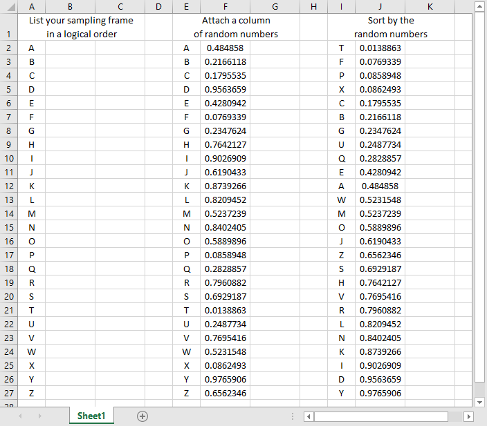
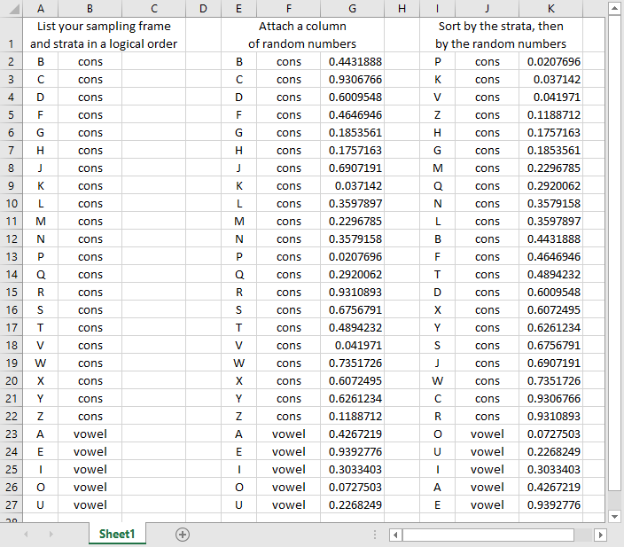
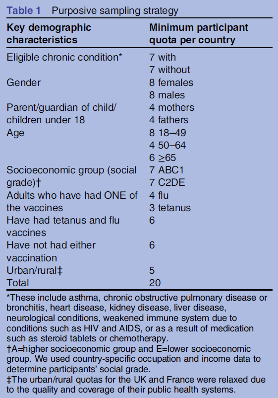
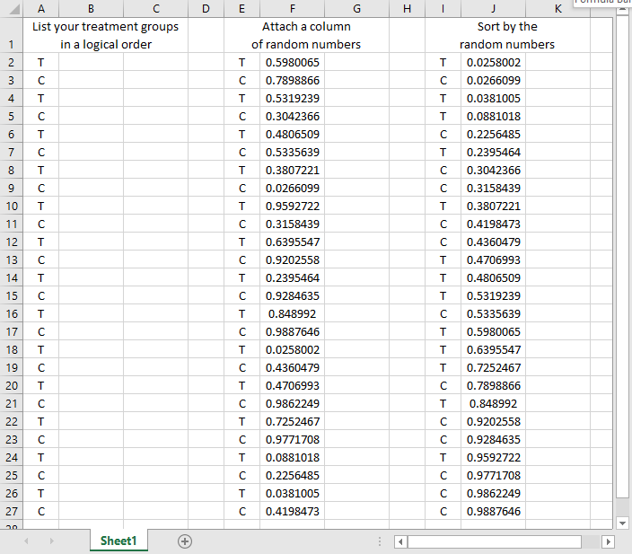

```{r echo=FALSE}
source("prelims.R", echo=FALSE)
```

***
`r read_text("objectives08")`

<div class="notes">

Here are the objectives for this week.

</div>

### What is a population?

* A group of people or objects that share one or more common features.
  + Demography
  + Geography
  + Occupation
  + Time
  + Care requirements
  + Diagnosis

<div class="notes">

A population is a group of people or objects, but in this class, we'll almost always talk about people. There are a few exceptions. Some of the problems that we study involve a population of hospital visits and that is not quite the same thing as a population of people who visit hospitals because some people visit a hospital more than once.

The population shares one or more common features. I got this list somewhere and I can't remember where, but it is a great list of the common characteristics of a population, from the perspective of health care.

</div>

### What is a sampling frame

* Physical list
  + Ideally everyone or almost everyone in population
  + Used to draw your sample
* Expensive, not always available.
* Example: Master Address File.

<div class="notes">

A sampling frame is a physical list associated with a population. It should include everyone (everything) in the population, but that's an ideal that is often difficult to meet.

Because it is a physical list, you can draw a sample from it.

It costs a lot of money to compile a sampling frame, so if you have one, you should definitely take advantage of it.

As an example of a sampling frame, the U.S. Bureau of the Census maintains a database of every housing unit in the United States. It relies on the U.s. Postal Service and community based canvassing efforts to collect information for 278 million addresses in the United States.

I hope that any sampling frame that you develop isn't quite as big as this.

</div>

### What is a sample?

* A sample is a subset of a population
* Representativeness more important than size
+ Reasons for sampling
	+ Expense
	+ Time
	+ Quality control

<div class="notes">

A sample is a subset of a population. It is usually smaller and easier to manage than the entire population.

Critically important in sampling is for the sample to be representative. That's even more important than the actual size of the sample.

College students are not representative of young adults. Volunteers in a clinical trial are not representative of everyone who has the disease.

The major reasons you sample are time and money. The population that id defined in most research studies is far too big for a complete enumeration. There are some exceptions, of course, but almost all studies have to work with a sample.

In fact, one definition of Statistics is the use of information from samples to make inferences about a population. That's a bit narrow perhaps, but still a pretty good starting point if anyone asks you what Statistics really is.

</div>

### Two major types of samples

* Random sample
  + Everyone has known non-zero probability
* Non-random sample
  + Different selection probabilities
  + Some may have zero selection probability

<div class="notes">

A random sample is a sample where every individual (or every object) in the population has a known non-zero probabilitiy of being selected. In many random samples the probability of selection is the same for every subject, but not always.

A random sample is an ideal which is rarely met perfectly, but sometimes you can get pretty close to this ideal. A random sample requires a sampling frame that is a complete list within the population.

A non-random sample is a sample where the probability of selection varies. A few lucky people might have a higher probability of being selected than others. There may be others who have a lower selection probability. Maybe they are trying to hide from you. Maybe they have caller id and they try to screen their calls. Maybe they work odd hours and are difficult to track down.

For any sample, always ask yourself "Who was left out?" if certain people in your sample have a zero probability of being selected, think long and hard about what this means.

</div>

### Extreme example:  World War II bombers


<div class="notes">

There was a statistician, Abraham Wald, who was asked to help out during World War II with a sampling problem. A lot of bombers were not returning from their missions, so the Royal Air Force wanted to put armor on the bombers. But where to put it? They couldn't put it everywhere because it would be too heavy to take off. Even a little bit of extra armor was troublesome because it would decrease the total wieght of bombs that they might carry.

So Dr. Wald looked at the planes that returned and noted where they had holes from enemy fire. These holes were distributed more or less randomly throughout the plane except for two regions where there was nothing. This image, which was taken from the 1998 Howard Wainer article that I mention in the recommended readings, shows where there was nothing: in the middle of the plane between the two wings and underneath the tail.

His recommendation was to place the armor only in those two areas. This seems counterintuitive, which is why it makes such a good puzzle. Dr. Wald hypothesized that any plane hit in those regions did not survive to return. The other areas could be hit and the plane could still limp back to safety. This is an example of selection bias. The bombers in the study were not a random sample of all bombers, they were a sample of bombers that returned safely. 

</div>

### Example: in school survey of drug use in teenagers

* Who has lower selection probability?
* Who has a zero selection probability?
* Can you redefine your population?

<div class="notes">

Suppose you are interested in a survey of teenagers in your community. You go to a high school and select a sample of students. Who has a lower selection probability? Students with a chronic illness, because they tend to miss a lot of days of school. Who has a zero selection probability? Home-schooled teenagers, for one, and dropouts for another.

Now is this a terrible thing? Students with a chronic illness probably have a different drug use pattern (both legal and illegal drugs) than most other studients. I'm not sure about home-schooled students, but students who have dropped out of high school almost certainly have a different drug use pattern.

But think about it from a high school principal's perspective. He or she might be interested only in drug use patterns among students who attend school, so the omission of home schooled students and dropouts may not be an issue.

What you should do, perhaps, is to redefine your population more narrowly when you recognize problems with differential selection probabilities.

</div>

### Example: prisoner IQ study

* Hypothetical study
  + Calculate average IQ of prisoners 
  + Lower than general public
* Conclude: criminals less intelligent than honest people(???)

<div class="notes">

This is a silly example, perhaps, but consider a hypothetical study where you give IQ tests to a random sample of prisoners. You find that the average IQ in this group is lower than the average IQ in the general public.

That seems reasonable enough, but what conclusion can you draw? You might be tempted to conclude that criminals have a lower IQ than honest people.

Maybe, but keep in mind that you won't find every criminal in prison. A better conclusion might be that criminals who get caught are dumber than criminals who don't get caught.

</div>

### Take a break here

* What have we learned so far?
  + Definitions: population, sampling frame, sample
  + Distinction between random sample and a non-random sample

* What is coming next?
  + Different types of probability samples
  + How to generate a random sample

<div class="notes">

Let's take a break here. You've learned a few basic definitions so far. Coming up next are different types of probability samples.

</div>

### Sampling 

* Sampling designs – Probability sampling
	+ Simple random sampling
	+ Systematic sampling
	+ Stratified sampling
	+ Cluster sampling

<div class="notes">

In a probability sample, every person in the population has a known non-zero probability of being in the sample. A sampling frame is an absolute requirement for a probability sample. If you do not have a sampling frame, you must rely on a non-probability sample.

In simple random sampling, each patient has an equal and independent probability of being selected.

I do not recommend a systematic sample. It is easy. If you want a sample that is one-tenth the size of the population, select every tenth observation from the sampling frame. Randomly choose whether you start. With ten percent systematic sample, that possible starting points are the first, second, third, ... all the way through the tenth observation in the sampling frame. If you started with the eleventh value or later, you would be selecting less than 10% of the sampling frame.

For a stratified sample, you divide your sampling frame into layers or strata. You might do this by geographic regions, age groups, gender. Then select a simple random sample within each strata.

In some studies, the number of patients sampled from each strata is proportional to the number of patients within each strata. In other studies, certain strata are over sampled to insure a decent sample size for certain minority groups. If you encounter over sampling, you must, must, must use a weighting approach for your data analysis.

A cluster sample involves the division of the sample into discrete clusters. These clusters might represent clinics or hospitals. A specific number of clusters are sampled in their entirety and others are left behind. Within each cluster, you either conduct a simple random sample, or you get the records for every patient in that cluster.

A cluster sample is inefficient from a statistical perspective because two patients from the same clinic or hospital are likely to be positively correlated. This correlation increases your standard error, sometime substantially.

The reason you pick a cluster sample is that it save a lot of time. If you had to visit every single hospital in the United States to get a simple random sample or a stratified random sample, you would die of exhaustion.

Instead, select a small number of hospitals that are representative of all hospitals in the U.S. and then travel only to those locations.

There are variations on cluster sampling where you have a second layer of clusters beneath the first layer. So you might randomly select 50 school districts in the United States and then randomly select 5 elementary schools within each district for further sampling.

</div>

### How to draw a simple random sample

1. List the sampling frame in a logical order

2. Attach a column of random numbers

3. Sort by the column of random numbers

4. Select your sample, starting at the top

<div class="notes">

There are a lot of places, including your book, that make the actual process of drawing a random sample more complicated than it needs to be. Ignore what your book says and follow this algorithm.

List your sampling frame in a logical order. Then attach a column of random numbers and sort by that column. Sorting by a column of random numbers places your list in a random order.

Then just select your sample starting from the top of the randomly sorted list.

</div>

### Simple random sample using Microsoft Excel



<div class="notes">

This shows the random sampling process using Microsoft Excel. If the image is too smallfor you to view here, open up the file random01.xlsx from the Canvas website.


There are 26 patients in your sampling frame. Arrange them in a systematic order. Then attach a column of random numbers. Notice that the smallest random number (0.0138863) is associated with "T". This letter goes to the top of the list when you sort the data and is the first person in your sample.

If you needed to select five people, your simple random sample would be T, F, P, X, and C.

</div>

### How to draw a stratified random sample

1. List the sampling frame and strata in a logical order

2. Attach a column of random numbers

3. Sort by the strata and the column of random numbers

4. Select your sample, starting at the top

<div class="notes">

The process of selecting a stratified random sample is similar. You have two columns. The first column is your sampling frame and the second column is your strata. Add a column of random numbers and sort first by the strata and then by the random numbers. This places the numbers in a random order within each strata.

</div>

### Stratified random sample using Microsoft Excel



<div class="notes">

This shows the stratified random sampling process using Microsoft Excel. If the image is too smallfor you to view here, open up the file random02.xlsx from the Canvas website.

Split your data into two strata: consonants and vowels. Arrange them systematically.

Attach a column of random numbers. Notice that "P" has the smallest random number among the consonants (0.0207696) and "O" has the smallest random number among the vowels (0.0727503). Then do a two level sort: first by the strata and then by the random numbers.

If you wanted a random sample of three consonants and two vowels, your stratified sample would be P, K, V among the consonants and O and U among the vowels.

</div>

### Take another break here

* What have we learned so far?
  + Types of probability samples
  + How to draw a random sample
  
* What is coming up next?
  + Different types of non-probability samples
  + How to allocate treatments randomly
  
<div class="notes">

Let's take another break. We've talked about some different types of probability samples: simple, systematic, stratified, and cluster. We'll tackle non-probability samples next.

</div>

### Sampling 

* Sampling designs – Nonprobability sampling
	+ Convenience sampling
	+ Quota sampling
	+ Purposive sampling
	+ Purposeful sampling
  + Snowball sampling

<div class="notes">

In a non-probability sample, the probability of an person being selected is unknown. You use this approach because you have to (it is impossible to obtain a sampling frame) or because it takes too much time or too much money.

A convenience sample is a sample that is collected without any planned attempt to make the sample representative. You choose people for your sample because they are easy to find. When a drug company places an ad in the paper looking for volunteers, the sample that they get is a convenience sample. When a doctor recruits patients who just happen to be coming to his or her clinic that day, that is a convenience sample.

Sometimes researchers will make a feeble attempt to get a representative sample, such as asking physicians in urban, suburban, and rural setting to recruit patients. But it still represents a convenience sample.

A quota sample is like a convenience sample. It gives you flexibility in who to select as long as certain quotas are met. Back when shopping malls were popular, marketing research firms would take samples from the people strolling by the stores. They'd approach people and ask if they wanted to participate in a survey or a taste test or something similar. The people doing the sample had to get a certain number of people in each demographic group, and my demographic group (young male) was always the hardest to get. So these people would walk right past everyone else and pick me out for their sample because they already had enough older people and enough females.

In a purposive sample, you identify characteristics that you feel are important and search for for patients with those characteristics. In some qualitative studies, for example, researchers will try to find a few patients who representative of one extreme and a few who are representative of the opposite extreme and sometimes a few who are in the middle. This insures that you will hear a broad range of comments.

Purposeful sampling is also commonly used with qualitative research. You only have a limited amount of time and money and you want to select patients who are "information rich."

Both purposive and purposeful samples require the use of subjective judgement. This sounds terrible, but there is at least some empirical evidence that a purposive sample can outperform a simple random sample. See the van Hoeven article under recommended readings for an example. 

Snowball sampling is an attempt to get a decent number of patients in a population that is hard to sample from in the more traditional approaches. You ask the first few patients in your sample to recommend others. Then you get recommendations from these people. And so forth. This sampling technology got its name from the analogy of a snowball rolling downhil and getting bigger and bigger.

Snowball sampling has been used to identify drug addicts, for example, because these people are normally resistant to solicitation of information through more traditional channels.

</div>

### Example of a purposive sample



<div class="notes">

This table, from the Wheelock artice in recommended readings, shows an example of a purposive sample. If you have trouble reading this table, open up the link to the Wheelock paper in the recommended readings for this week.

In each country, researchers had to select 20 patients and they had to make sure that some of these patients h ad and some did not have the eligible chronic condition. They also had to get a minimum number from particular demographic groups like gender, age, socioeconomic status, and vaccination status.

Now, if this sounds more like a quota sample than a purposive sample, I couldn't disagree with you. There is a subtle distinction between many of these non-probability samples.

</div>

### Randomizing treatments within a convenience sample

Many studies use a convenience sample, which may hamper external validity, but they randomly assign treatment or control conditions within the convenience sample, which helps with internal validity. The process works much like the process of drawing a simple random sample.

1. List your treatment groups in a logical order

2. Attach a column of random numbers

3. Sort by the column of random numbers

4. Allocate treatment groups, starting at the top of the list.

<div class="notes">

Much research involves the use of convenience samples, with randomization to two or more treatment groups. The randomization after a convenience sample is not the same as using a random sample, and it does nothing for generalizability (or external validity). It does help with internal validity.

if you've never randomized treatment allocation before, the literature is a bit confusing. The simplest approach is to follow the same logic that you use for selecting a random sample. Please the treatment conditions in a systematic order, attach a column of random numbers and then sort by the random numbers. This places your treatment allocation in a random order. You assign your first patient to the treatment group listed at the top of the list. The second patient giets the next treatment group listed, and so forth.

</div>

### Randomizing treatment allocation using Microsoft Excel



<div class="notes">

This shows the randomized allocation of treatments using Microsoft Excel. If the image is too smallfor you to view here, open up the file random03.xlsx from the Canvas website.

Arrange your treatments systematically (T, C, T, C, etc.)

Attach a column of random numbers. Notice that the smallest random number (0.0258002) is associated with a "T". This "T" goes to the top of the list. The first five patients get allocated to T, C, T, T, and C respectively.

</div>

### Randomizing a crossover trial using Microsoft Excel


<div class="notes">

The process of sorting by a column of random numbers extends easily to more complex research designs. This screenshot from a Microsoft Excel spreadsheet shows the randomized allocation of treatment order in a crossover trials using Microsoft Excel.

Arrange the treatment and control values in pairs. Then attach a column of random numbers. When you sort by pair and then by the column of random numbers, you arrange the order of treatments randomly within each pair. The first pair has a smaller random number for C (0.652967) than for T (0.7492683), so the first subject gets a treatment followed by a control. The next three subjects get the control first.

Following this basic idea, you can just as easily randomize with three or more treatment groups, and randomize treatment order within strata.

</div>

### Matching and pairing

* Improved precision
* Logistical issues
* Works for both randomized and observational studies

<div class="notes">

Matching and pairing can greatly improve the precision of your research study, but it can raise some difficulties as well.

You can use matching for randomized studies. Arrange your patient groups into pairs of patients with similar demographics (same race, same gender, same age plus or minus 3 years). Then randomly assign one of the patients in a pair to the treatment group and the other patient into the control group.

In a case control study, select your case and then find a control with similar demographics. The same idea works for a cohort study.

</div>

### The logistics of matching

* Not obvious
* Simplest solution: greedy matching
* Unpaired patients are lost to your analysis
  + Extra precision from pairing
  + Loss of precision from loss of the unpaired.
  
<div class="notes">

The process of matching is trickier than it looks. If you have a single variable to match on, it is pretty easy. But with multiple matching variables, you have to sometimes make trade-offs. How important is it to match to the same gender? Would you rather be sure that the match is very close in age?

If you match, you need to face the fact that some of the precision and/or bias reduction that you get from matching will be reduced by the loss of some patients who you are unable to find a good match for. There's a phrase about jumping from the frying pan into the fire, and with matching, you are not sure if the effort will end up hurting rather than helping.

I tried to work out a simple matching program, but it is messier than I had thought. If I can work out a simple example, I will let you know.

</div>

### The cross-over trial

* Only for some randomized trials
* Each subject serves as own control
* Randomize treatment order
* Beware of carry-over

<div class="notes">

A research design that takes matching to its ultimate extent is the cross-over trial. This only works for randomized studies, and then only for some of them, but when it does work, it's great.

In a cross-over trial, each subject is given the treatment and also given the control. You randomize the order: some subjects get the treatment first and then the control. Some subjects get the control first and then the treatment.

You can't use this design for an attribute variable. You can't switch someone from one age group to another, for example.

Even with an independent variable that you can manipulate, the cross-over trial is sometimes problematic. You can't switch from the treatment group to the control group for example, when the control is a masectomy and the treatment is a lumpectomy, because you can't undo the effects of one surgery and try the different surgery.

Training interventions also don't work. You can't train someone one way, get them to unlearn things and then re-train them a different way.

Generally, you have to have a treatment that is short and easily reversible. You gain a lot of precision because all of the factors that are difficult to get perfect balance for in a normal trial disappear in a cross-over trial. Differences in demographics and differences in severity of illness completely disappear.

For drugs that have a carry-over effect, you should probably wait until the first drug is completely washed out of the body before starting the second drug. This can be a problem for certain drugs that have a long half-life.

</div>