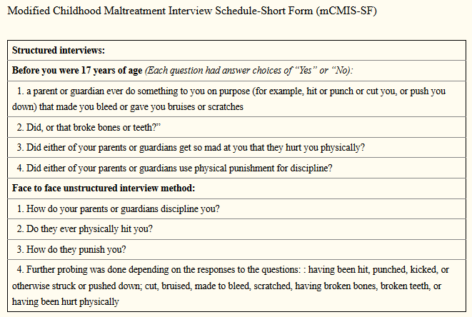
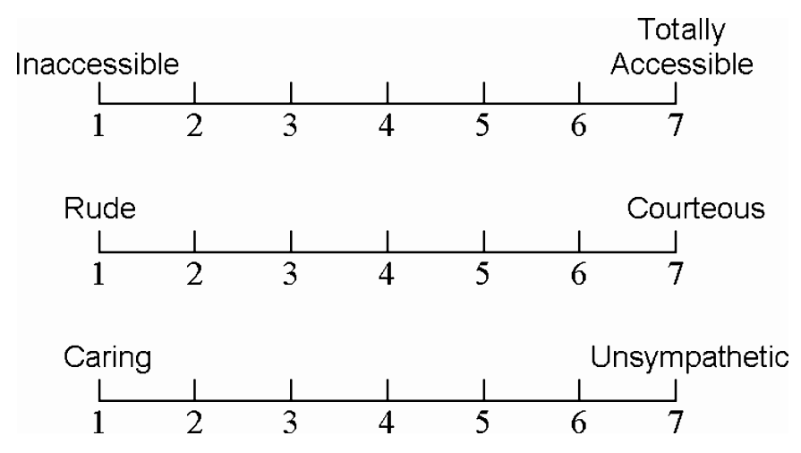
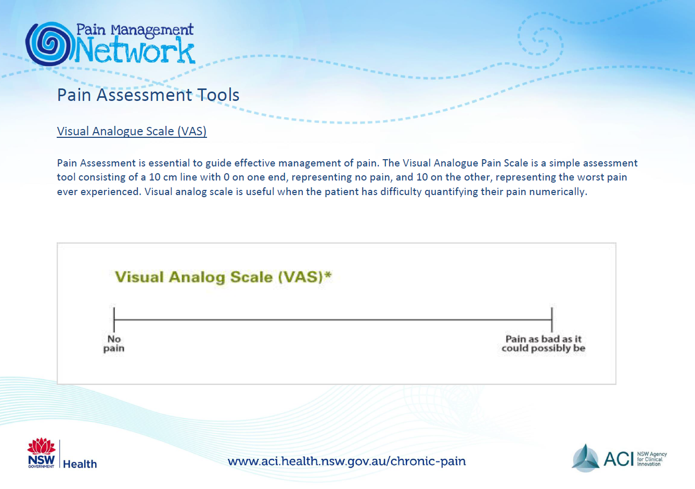
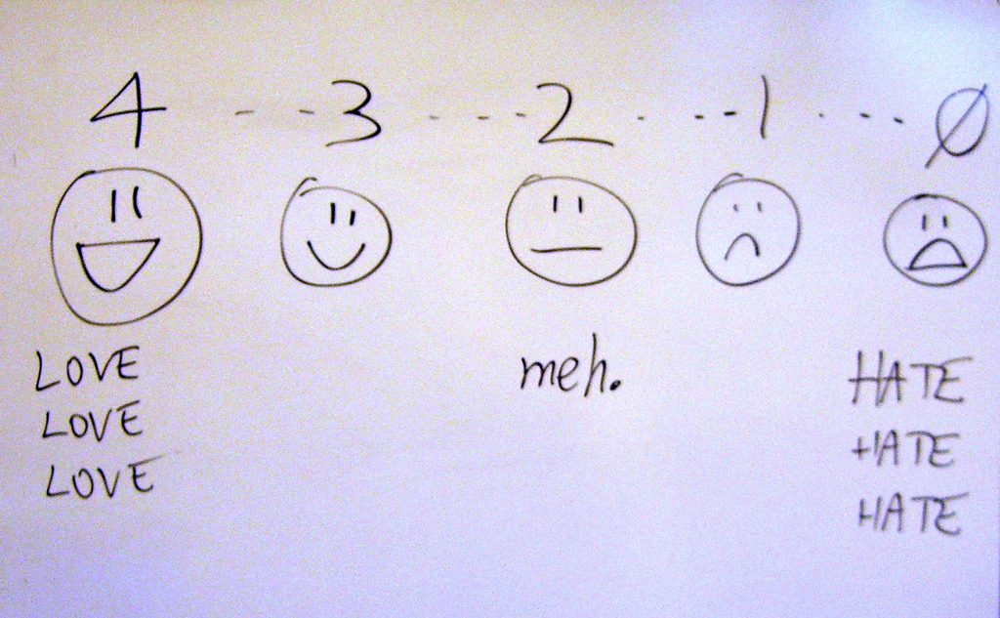

```{r echo=FALSE}
source("prelims.R", echo=FALSE)
```

### Data collection methods

* Data collection methods
  + Focus groups
  + Interviews
  + Questionnaires
  + Existing data

<div class="notes">

This talk will cover various data collection methods: focus groups, interviews, questionnaires, and existing data sources.

</div>

### Running focus groups

* Two person job
* Facilitator
  + Asks questions
  + Guide discussion, but stays neutral
* Recorder
  + Runs the tape recorder
  + Keeps written notes
* Debriefing session
  
<div class="notes">

If you decide to collect data in a focus group, you need a second person. You could do it by yourself, but you are asking for trouble. One of you takes the role of the facilitator and one takes the role of the recorder.

The facilitator asks a series of prepared questions. Your role is to guide the discussion while still keeping neutral. This means that you intervene if the group is getting off target or if one person is dominating the discussion. You should prepare some brief prompts to get your participants to elaborate or to draw in other participants.

The recorder doesn't say anything after the introductions, but runs the recording device and take notes. The notes serve several purposes. First, they serve as a backup if your recording fails. Second, they note any significant non-verbal information such as gestures and body language. Third, the notes help to identify who is speaking when. A seating diagram is helpful for this. Note that not all focus groups track who is speaking.

After the session is complete, the two of you sit down and talk about how things went.

</div>

### Structure of a focus group

* Six to ten participants
* Multiple groups
  + Stop when you achieve saturation
* Sixty to ninety minutes
* Ten questions, semi-structured interview

<div class="notes">

The size of a focus group can vary, but I've seen recommendations of six to twelve people.

What the research community does agree on is that you need to plan for more than one group. The consistency of responses from one group to the next will tell you if you have reached saturation. 

Saturation is evidence that no new themes or ideas have emerged from your groups. Almost all assessments of whether saturation has been achieved are qualitative and subjective.

The concept of saturation makes it difficult for you to plan a budget, but keep in mind that you cannot even begin to assess saturation until you've run your second focus group.

Other common recommendations are to keep each session short, 60 to 90 minutes, and to have no more than ten questions. Your questions should follow a semi-structured format, which I'll talk about in the context of interviewing.

Getting information from a group is a double-edged sword. Often in a focus group, one participant will build on the comments of another and provide a perspective that you may have missed in a single person interview. At other times, however, one person may stifle the feedback from another. A good focus group leader will recognize this and work to insure that everyone participates fully. It's easy to say this in theory, but in practice, it can be difficult.

</div>

### Interview

* Administration
  + Telephone
  + Face-to-face
* Format
  + Unstructured
  + Semi-structured
  + Structured

<div class="notes">

An interview is direct communication between the researcher and the subject. You can set up the interview on the telephone or conduct a face-to-face interview. The obvious advantage of a telephone interview is that it is fast and does not involve travel of either party. 

A face-to-face interview takes more effort, but can sometimes help with building a sense of rapport and trust.

Interviews have three formats, unstructured, semi-structured, or structured. An unstructured format is rarely used in research because it makes you work impossible to replicate.

An unstructured interview is not used too often, because of problems with repeatability. The interviewer goes in with a general idea of what to discuss, but no specific questions. The general direction of the interview will determine what questions to ask next.

A semi-structured interview has a planned structure that includes a list of questions to ask. These questions are typically open ended, to allow the patient to bring up issues that the researcher may not have been aware of. Most semi-structured interviews have a series of probe questions that are intended to prompt the research subject to elaborate further on a topic of interest.

A structured interview has a fixed set of questions that are asked in a consistent order with no major deviations. There are no prompts to get your patients to elaborate, but the interviewer can try to clarify any ambiguous or clearly invalid responses.

</div>

### Example of structured and unstructured interviews



<div class="notes">

Here's an example of two interviews. The first is a structured interview with four yes/no questions. 

"Before you were 17 years of age (Each question had answer choices of “Yes” or “No)"

a parent or guardian ever do something to you on purpose (for example, hit or punch or cut you, or push you down) that made you bleed or gave you bruises or scratches.
 
Did, or that broke bones or teeth?”
 
Did either of your parents or guardians get so mad at you that they hurt you physically?
 
Did either of your parents or guardians use physical punishment for discipline?

The second interview is described as unstructured. I would call it semi-structured, but that is a nitpick. The questions were

How do your parents or guardians discipline you?

Do they ever physically hit you?

How do they punish you?

Further probing was done depending on the responses to the questions: : having been hit, punched, kicked, or otherwise struck or pushed down; cut, bruised, made to bleed, scratched, having broken bones, broken teeth, or having been hurt physically
 
The questions in this structured interview are close ended. This is quite common, but you can also have a structured interview with open ended questions. For the semi-structured or unstructured interview, however, the questions must be open ended so that you can probe for more information.

The article that these interview questions came from noted that the unstructured interview was far more likely to uncover reports of abus than the structured interview.

Image source: Diaz 2017 (see the reading list for full details).

</div>

### Take a break here

* What have you learned?
  + Focus groups
  + Interviews
* What is coming next?
  + Questionnaires
  
<div class="notes">

We've covered quite a bit of ground already, talking about focus groups and intervirews. Let's take a break. When I return, I'll talk about questionnaires.

</div>

### Questionnaire

* Not the same as a survey
  + Questionnaire is the form
  + Survey is the process
* Administration
  + Mail
  + Computer (REDCap)
  + Telephone
  + In person
  
Note: telephone and in person questionnaires could be classified as interviews.
  
<div class="notes">

A questionnaire is a form with questions that your research subjects fill out by themselves. The term "quesitonnaire" is often used interchangably with the word "survey," but there is a distinction. The questionnaire is a specific term referring to the form itself, while a survey is intended to describe the entire process of data collection.

Now I myself use these terms without regard to the semantics, so if you do so also, you are in good company. But once in a while you will find someone who insists on careful choices of words like this.

You can administer a questionnaire over the telephone or in person. If you wanted to get fussy about terminology, a telephone or in person questionnaire is actually an interview. This is like everything else. You'll find a fuss-budget who will insist on the proper terminology and they are correct to do so. But they are still fuss-budgets.

You can send out a questionnaire by mail or you can ask people to fill out the questionnaire on the computer. If you are using the computer, you should consider REDCap instead of commercial products like SurveyMonkey or SurveyGizmo. REDCap is an open source product that is supported by the Center for Health Insights. It's useful for any research project, but especially for online questionnaires.

The benefit of REDCap (and to be fair, these are benefits that commercial products like SurveyMonkey also share) is that it automates data entry for you. The data from your questionnaire populates a database with a rigid structure that helps assure good data quality.

REDCap will also do some basic spot checking for you and will prevent some problems with invalid entries. So, you won't see someone check two items on a list where you asked them to only check one. You won't get an entry of 3.5 when the only possible values are 1 through 5 plus 9.

</div>
  
### Question types

* No one to supervise if person answers "incorrectly".
  + Q. What is your age? A. Older than dirt.
  + Q. What is the one word that describes your greatest weakness? A. Inability to follow directions.
* Three broad classes of questions
  + Open ended
  + Partial open ended
  + Close ended

<div class="notes">

Right off the bat, there is a big difference between interviews and questionnaires. The interviewer can play the role of a referee, of sorts. In an interview, if someone comes up with a response that is ambiguous or clearly out of bounds, the interviewer can step in (carefully, of course) and fix things. That's not an option for a paper and pencil questionnaire. A computerized questionnaire offers a partial fix - it will beep or buzz when you try something outside of a predetermined range. That's nice, but it is not nearly as flexible as an actual human being.

For both questionnaires and interviews, you have three broad class of questions: open ended questions, partial open ended questions and close ended questions.

</div>

### Advantages of open ended questions

* Richer, more detailed responses
* Captures unanticipated responses
* Avoids "pigeonholing".
  + "Pigeonholing is a process that attempts to classify disparate entities into a limited number of categories (usually, mutually exclusive ones). The term usually carries connotations of criticism, implying that the classification scheme referred to inadequately reflects the entities being sorted, or that it is based on stereotypes." Wikipedia.
  
<div class="notes">

Open ended questions let people use their own words. You can get an unlimited number of responses, which is both good and bad. The open ended question provides a richer set of responses, but is harder to quantify.

If you don't know the general categories of responses that people can provide in advance, the open ended question is your best friend. But keep in mind that you could use a pilot study with open ended questions to get a general idea of what the possible responses might be and use that to design close ended questions for the full study.

The other big advantage of open ended questions is that it avoids pigeon-holing. A pigeon hole is an array of stacked boxes that allow you to sort through paperwork quickly by placing different types of papers into different boxes. The term is often used pejoratively to refer to the process of assigning categories that often are too simplistic because of the limited number of choices.

</div>
  
### Advantages of close ended questions

* Faster
* Easier to analyze
* Better quality control

Note: partially open ended questions are a compromise and have the worst of both worlds.

<div class="notes">

Close ended questions are faster, and that's a benefit both to you and to the person filling out the questionnaire. This is especially true if you are using mobile devices like phones and tablets to collect your data. The keyboard that is available on these devices is small and difficult to use. Your research subjects will probably be much happier if they can tap to select one from a limited set of options.

Close ended questions are easier to analyze. 

Quality control is a bit easier with close ended questions. That doesn't mean that someone won't trip you up. But less latitude in how you can respond means fewer things that could be done wrong.

</div>

### Types of close ended questions

* Fill in the blank
* Ordinal scales
  + Semantic differential scales
  + Likert scale
  + Visual analog scale
* Nominal scales
  + Select one option
  + Select all that apply

<div class="notes">

There are several possible ways to ask close ended questions.

You can ask people to fill in the blank. Strictly speaking this is not a close ended question, but the intent is to get responses from a limited subset. You might ask a person "What is your age?" and leave a blank and you're supposed to fill in a number.

In some cases, fill in the blank works just fine, but always watch out for unexpected responses.

For an ordinal response, the order of the choices has meaning. If you re-arranged the order of choices for an ordinal category, you would, at a minimum, make things confusing. So a common ordinal scale is strongly disagree, disagree, neutral, agree, strongly agree. it would mess things up if you tried to alphabetize these responses: agree, disagree, neutral, strongly agree, strongly disagree.

For a nominal response, the order is largely arbitrary. Suppose you had to choose between the marital status choices: single, married, divorced, widowed. Re-ordering these alphabetically (divorced, married, single, widowed) is a little weird, but still tolerable.

Ordinal responses typically are collected using a semantic differential scale, a visual analog scale or some type of Likert scale.

Nominal responses are collectetd using a check box, but there are two possibilities: check only one, or check all that apply.

</div>

### Semantic differential scale

* Pairs of polar opposite adjectives
* Internal scale with no intermediate descriptors
* Select a response along the continuum.
* Common themes
  + Evaluative (good-bad)
  + Potency (strong-weak)
  + Activity (fast-slow)

<div class="notes">

The semantic differential scale has two extreme endpoints with unlabeled numbers in between. You are supposed to pick a number that represents how close you are to one of the two extremes. This if often done with moods (happy/sad, calm/excited, silly/serious), but you can also use this to evaluate something external like the quality of your interaction with a health care provider (rude/courteous, friendly/cold, informative/confusing).

There are three common themes for these pairs of polar opposites. They are usually measuring an evaluation (good versus bad, for example), or potency (strong versus weak), or activity (faster versus slow). This structure, has been studied extensively using various factor analysis models and is often referred to by the acronym EPA.

</div>

### Example of a semantic differential scale



<div class="notes">

Here's an example of a semantic differential scale that is found in the article by Desselle on summated rating attitude scales. The adjective pairs are inaccessible/totally accessible, rude/courteous, caring/unsympathetic. You get to choose a number between 1 and 7 where 1 represents completely rude and 7 represents completely courteous on the second question, for example.

</div>

### Take a second break

* What have you learned?
  + Questionnaires
  + Semantic differential scale
* What's up next?
  + Likert scales

<div class="notes">


There's a lot of material here, so let's take another break.

</div>

### Visual analog scale

* Line segment
  + Total length 100 millimeters
* Labels at two extremes
  + Alert/Extremely drowsy
  + Energetic/worn out
  + completely full/starving
* Mark an X along the continuum

<div class="notes">

The visual analog scale is a graphical method for collecting data. You see a line segment with a length of exactly 100 millimeters. At either end are two extremes, Alert/Extremely drowsy, for example. You are asked to place an X anywhere along that line to represent how alert or drowsy you are. Record the distance from the left endpoint to the X. The visual analog scale gives you any possible value between 0 and 100.

It seems like a difficult task, but for many different measurements, the visual analog scale has been shown to have good reliability and validity. It's easiest to do with pencil and paper, but with a small bit of programming, you can adapt this to a computerized data collection system as well.

</div>

### Example of a visual analog scale



<div class="notes">

This is an example of the visual analog scale. You are measruing pain, with the left endpoint representing no pain and the right endpoint representing pain as bad as it could possibly be.

</div>

### Likert scale

* Discrete values
* Extremes and intermediate points labelled.
* Measurements of frequency
  + Very frequently, Frequently, Occasionally, Rarely
  + Never, Rarely, Sometimes, Often
  + Every day, Two or three times a week, Once a week, Less than once a week
  
<div class="notes">

The Likert scale is a sequence of discrete values to represent an ordinal concept. Most Likert scales have anchors, single words or short phrases attached to every discrete value.

The Likert scale could measure frequency. The choices could be Very frequently, Frequently, Occasionally, Rarely. Another choice would be Never, Rarely, Sometimes, Often. You could refer to a calendar with responses like Every day, Two or three times a week, Once a week, Less than once a week.

</div>

### Likert scale  
* Satisfaction (Very satisfied, satisfied, dissatistfied, very dissatisfied)
* Quality (Very good, Good, Fair, Poor)
* Agreement scale (5 points)
  + Strongly disagree, disagree, neutral, agree, strongly agree
* Agreement scale (6 points)
  + Strongly disagree, disagree, slightly disagree, slightly agree, agree, strongly agree
  
<div class="notes">

If you are measuring satisfaction, you might choose Very satisfied, Satisfied, Dissatisfied, Very dissatisfied.

If you are measuring quality, you might choose Excellent, Very good, Good, Fair, Poor.

If you are asking how important something is, you might choose Very important, Important, Moderately important, Slightly important, Not at all important.

In the most common form, you are asked to read a statement and choose among five options: strongly disagree, disagree, neutral, agree, and strongly agree. For a six point scale this would be modified to strongly disagree, disagree, slightly disagree, slightly agree, agree, strongly agree.

If the Likert scale and the semantic differentiation scale sound similar, well they are. The difference is, perhaps, that the Likert scale is uses the same anchors for a series of measurements, while the semantic differential scale changes from one pair of polar opposites to a different pair for every measurement. The semantic differential scale does not normally include anchors for the intermediate values, while a Likert scale normally does include anchors.

But if you use these terms interchangably, I certainly won't complain.

</div>


### Example of a Likert scale



<div class="notes">

This is an example of Likert scale. 

https://www.flickr.com/photos/billsophoto/4175299981

</div>

### Likert response options

* Number of points
  + Larger is better? worse? than smaller
  + Even is better? worse? than odd
* Not applicable, Don't know
* Reverse scaling

<div class="notes">

There are a large number of ways to present a ordinal scale, and very little consensus in the research community about which approach is best. It, very likely, will depend on the context of your particular research setting. Here are some of the things that people argue about.

You have to have more than two options for an ordinal scale, or it reduces to a binary scale. So you might see three choices, or as many as ten. More than ten is very rare.

The most common number is five and the most common alternatives are four, six, and seven. But the two biggest debates are small versus large and odd versus even.

Is a large number of choices better or worse than a small number of choices? Some people think that too many choices will confuse you. Others think that more choices are better because they allow you the freedom to make subtle, but important distinctions. Others will argue that a larger number of choices will make it easier to analyze, because you can get closer to a bell shaped curve with a larger number of responses. This can backfire, though. With too many choices, people may gravitate towards a few favorite values leading to dips in frequencies at the unpopular values.

Is there a reason to choose even versus odd numbers. An odd number of choices always has a middle value (3 for a five point scale, for example) that represents neutral, or neither agree nor disagree. Some researchers hate this, and think that a neutral response is too easy to select thoughtlessly. An even number of values forces you to commit, even if only slightly, to the agree side or the disagree side.

Sometimes, you might want to leave a response blank because it is not applicable, or you don't know. Both of these responses are different from the neutral option in a five point Likert scale, but if you aren't give a not applicable or don't know option, you might choose the neutral option as the best alternative.

Reverse scaling is the inclusion of questions where a positive result is sometimes scored as a high number and sometimes scored as a low number. This is done sometimes to insure that people read each question carefully and don't just choose the same option thoughtlessly down the list.

</div>

### Time for a third break

* What have you learned?
  + Visual analog scales
  + Likert scales
* What's next?
  + Nominal scales
  
<div class="notes">

That's a lot to digest. Let's take another break.

### Nominal responses

* Pick one of the following
  + Assumes mutually exclusive
* Pick all that apply
  + Allows for overlap
  + Code as multiple binaries
* Code for "other"
  + Partial open ended
* Code for "Prefer not to answer"
  
<div class="notes">

For nominal categories, you have two approaches. The first approach is to ask your research subjects to choose only one response from the list. This assumes that there is only one obvious choice in the list for anyone and everyone. For the marital status question, it seems obvious enough. The choices are single, married, divorced, or widowed. These seem to be mutually exclusive, but what about someone who was married, widowed, remarried, and then divorced. This isn't all that common, so maybe you don't have to worry about it.

The nominal category that has gotten a lot of attention recently is race. There is a vocal lobby in the community to allow someone to select more than one category. You could include a bi-racial category, perhaps. Or you could let everyone select multiple racial categories.

There's really no correct answer. A lot depends on the context.

The standard way to code multiple response variables is to include an indicator for each category. I will talk about that in more detail later.

You should consider an option for other, with an open ended fill in the blank immediately afterwards. This is better than having someone scrawl something in the margin, check more than one box, or leave the question blank. This turns your close ended question into a partial open ended question.

If you are asking a question that some people might consider sensitive (such as illicit drug use), you should consider a "prefer not to answer" option. Again, this is better than leaving a question blank, and you're not sure if they didn't want to answer or just overlooked this question. The "prefer not to answer" option might also help someone continue with a survey that they might otherwise stop filling out because they didn't like the sort of questions you were asking.

</div>

### General structure of a questionnaire

* Sensitive questions last
* Broad categories
  + Income
* Do you really need to ask?
* Avoid leading up to a question

<div class="notes">

Many researchers advise that you put sensitive questions at the end. If you ask about age and income at the start, your patients might get nervous or upset. "Why do they need to know this information?" If you place these questions at the end, your patients will have gotten a general sense of what you are interested in and may no longer see the questions as intrusive. Note that this is anecdotal evidence. A lot of people cite this but I have not seen any empirical data to support their viewpoint.

Sometimes, you can avoid concerns about sensitive questions by asking for broad categories rather than specific numbers. For income, as an example, you might only be interested in whether someone is at or near the poverty line. If you stop income at a value close to the median income (say $50,000 per year and higher), you'll have some issues for some people on the low end, but at the high end, you'll ease some concerns about people who don't wnat to admit exactly how rich they are.

I recall a survey I was asked to fill out. It was on perceptions about web sites or something other quite technical. They asked the standard questions about demographics: age, gender, race/ethnicity. Then there was a question about sexual identity. It listed heterosexual. It listed homosexual. It listed bi-sexual. It listed transexual. It went on and on and on. Every choice for LGBTQIA and then some. Now I have a fairly open mind when it comes to sexuality, and there are times when you really do need to know this level of detail. A study of sexually transmitted diseases might need to understand sexuality at such a fine level of detail. But a tech questionnaire about web sites? I suspect that the person who wrote this survey had a close friend who was LGBT and wanted to be sure that his survey was sensitive to the variety of sexualities that too often are disparaged or ignored.

Question order in a questionnaire is important in that asking a series of questions might tend to nudge someone towards one extreme or the other. Some unscrupulous pollsters do this to get a result more favorable to their customer. Look at the short clip from the British comedy, Yes Prime Minister, for an example of nudging someone with a series of leading questions.

There isn't a lot of practical advice about how to avoid leading questions, unfortunately. It's easier to point out a problem than to suggest a solution.

</div>
  
### Practical advice

* Don't ask for what you don't need
  + More data than you have time to analyze
* Make your questionnaire easy for data entry
* Pilot test your questionnaire

<div class="notes">

I make it a habit of asking people, after they are done defending their thesis or dissertation what they would have done differently if they had to do it all over again. A common response is that they would not have collected so much data. They never got around to analyzing even half of it. Now, it may seem like sacrilege for a statistician to agree with this, but I do think it is a bad idea to bite off more than you can chew, so to speak. If nothing else, a shorter questionnaire would have a higher compliance rate and better quality responses.

If you are using a paper questionnaire, lay out the questionnaire in a manner that makes it easy for data entry. This means lining up things nicely so the numbers are consistently in the same location (e.g., flush with the right margin). This sort of design will also minimize problems with people accidentally skipping some items.

You should also run a pilot test on your questionnaire. Last week, I talked about response process validation. Those steps work very well for pre-testing a questionnaire. Give the questionnaire to a small sample of your patients and watch as they fill it out. Get them to talk out loud about what they are thinking.

After the questionnaires are filled out, look for improper or unexpected responses. If people are filling out a response halfway between 3 and 4 on a five point Likert scale, then maybe you would be better off with a seven point Likert scale. If people are circling two or more responses, even though you tell them to select only one, then maybe you should restructure your questionnaire to accommodate multiple responses. If the fill in the blank responses are not providing you the correct data, changing how you ask for that information.

Do the subjects in your pilot study make simple mistakes like failing to check the back side of the survey? Do they refuse to answer certain questions because of their sensitive nature? Do they tend to mindlessly choose the same middle answer throughout a series of Likert scale questions. Do they always choose the rightmost extreme, even on questions that are reverse scaled?

During your pilot, see if you can get some data on how long it takes on average to fill out the questionnaire. This could be placed in the cover letter for the questionnaire or in the consent form.

Also get an estimate on how much labor is needed to distribute and recollect all the questionnaires. See how many people need a reminder notice (or two reminders) to return their questionnaires. This sort of information during a pilot study will help you plan the main study more effectively.

</div>

### Take a fourth break

* What have we learned
  + Nominal scale questions on questionnaires
* What is coming up next
  + Existing data sources
  + Advantages of different data collection approaches
  
<div class="notes">

That's about it for questionnaires. Let's take another break.

</div>

### Existing data sources

* Re-analysis of published data
  + Protect confidentiality
  + Give appropriate acknowledgement or co-authorship
* Curated databases
  + Contractual limitations
  + Sample weights
* Web scraping
  + Respect limits on volume and speed of download
  + Protect copyrights

<div class="notes">

Our department is big on secondary data analysis. This is the re-use of existing data sets. These come from a variety of sources, but you must always respect the limits that the original researchers place on their data.

If you are taking data from an existing research publication (or, in the case of meta-analysis, from multiple existing research publications), find out what sort of acknowledgement is appropriate. In some circumstances, you may feel obligated to offer co-authorship to the original researchers. If this is the case, get an agreement in writing before you start any work. It is a bit easier if the researchers have included a link to the raw data in their publication, but still be careful to read any restrictions that they may have placed on the original data.

If the data that you are getting includes Protected Health Information (PHI), there are important regulations that you must follow under the Health Insurance Portability and Accountability Act. Because you are working with PHI, you need to get approval from your local IRB even though the original authors got IRB approval at their site.

If the authors have made their data set available for free download, your life is a bit easier. There is no PHI in a publicly available data set, or if there were, the person who would get in trouble for this would be the original authors. You have to promise not to take the disparite pieces of information that by themselves are innocuous enogh, but which in aggregate might allow you to figure out the identity of some of the people in the sample.

Various groups will collect data not for their own benefit, but rather to let others publish interesting things. This might be through a government program or through a charitable foundation. These data sets are carefully curated and have excellent documentation. The people behind these data sets are very eager to help. They see your publications as being one of the strongest rationales for what they are doing. They want you to be successful.

Read the documentation carefully, including the limits on how you can use this data. Even though the data has been anonymized, you will be asked to promise that you will not try to use certain crosstabulations that might identify individual respondents.

Many of these data sets have sample weights associated with them. The sample weights help you properly calibrate your results to nationwide totals, or they help you properly account for oversampling of minority groups. Some of these data sets use clustering and stratification to reduce costs and improve the coverage and quality of their data. If you are using data that requires sample weights, failure to choose the appropriate analysis will produce invalid results.

The one big issue with secondary data analysis is that you don't have the option of getting the variables you need the most and you often have to settle for second-best measures.

A new source of data is stored on the Internet, and getting this data often requires specialized tools, web scrapers. The data that you get from web scraping is free (other than your time and labor) and will almost always be exempt from IRB approval. Some sites will have policies on web scraping, limiting either the amount of data you can take, the speed at which you can take it, or both. These limits are needed to insure that others who need this data for a variety of reasons won't be crowded out by web scraping robots. Some of the information that you get through web scraping may also be protected by copyright law.

</div>

### Advantages of focus groups

* Faster than separate interviews
* Participants build each others comments

<div class="notes">

Focus groups are great. You get six or ten people in the room and interview all of them in a lot less time than it would take for individual interviews. The participants will often react to what others say, which can get them to elicit thoughts and opinions that you might have missed in a one-on-one interview.

</div>

### Advantages of interviews

* On-the-spot fixes
* Increased participation rate

<div class="notes">

Interviews are great. You get a rich set of reponses, and if someone goes off track and provides a weird answer, the interviewer has an opportunity to fix things.

</div>

### Advantages of a questionnaire

* Less labor
* No interviewer bias

<div class="notes">

Questionnaires are great. If you have to interview people, you'll be spending half your life on the phone. If that's wahat's needed for research, fine. But if your patients are capable and willing and can do so accurately, you'll save a lot of time.

You'll also avoid interviewer bias. Interviewer bias is the tendency to get different results depending on the race, gender, age, or other overt feature of the person conducting the interview. It's not the interviewer's fault, necessarily. The person being interviewed might be more open and honest with certain interviewers than others.

</div>

### Advantages of existing data

* Fast
* Cheap
* Naturalistic

<div class="notes">

Existing data sets are great. They are first and foremost, very fast. The data is sitting there staring at you. You still have to do a lot of data management with most existing data sets, because they are not necessarily in the structure that you need for your research. Still, even with a ton of data management, it beats waiting around to get that five year mortality data.

Existing data is also cheap, and free in many cases. Free is never free, of course. You spend a fair amount of labor on existing data, but for the same reasons mentioned earlier, the cost still beats that of other types of research.

A big advantage of many (but not all) existing data sets is that the data is collected outside the context of a clinical trial. Clinical trials, with all the special exams and all the extra attention, have an artificiality about them. Data that you collect from some sources, such as the electronic health record, represent observations that are directly representative of the typical care that your patients receive.

</div>

### We're done

* What have you learned
  + Methods of data collection (focus groups, interviews, questionnaires, existing data sources)
  + Advantage of different data collection methods
* What is coming next week
  + Data quality/data management

<div class="notes">

we're done. We've talked about four major ways to collect data: focus groups, interviews, questionnaires, and existing data sources. Next week we'll talk about data quality and data management.

</div>

