```{r echo=FALSE}
source("prelims.R", echo=FALSE)
```

### Data management

* Data dictionary
  + Variable names, Variable labels, Value labels, Missing value codes
* Managing complex files
  + Multiple response, Longitudinal/repeated measures data
* Storage options
  + Spreadsheet, Text file, Database, REDCap
  
<div class="notes">

There's a lot to cover in this video. I'll start with the data dictionary, which provides documentation on variable names, variable labels, value labels, and missing value codes. Then I want to mention two tricky issues with data management: multiple response variables and longitudinal/repeated measures data.

Let me just mention how happy I am to talk about data management issues. You don't know how much I have suffered over the years because the people I work with have failed to do some very basic data management. If nothing else, I want to make sure that you don't cause similar pain to your research teams in the future. Listen well and heed all the advice I give here today. It is built on top of a mountain of suffering.

</div>

### Data dictionary

* Also called a code book
* Start before collecting data
* Revise as needed

<div class="notes">

Your meta-data belongs in a data dictionary. The data dictionary, also known as the code book, is a short document (usually one page or less) that describes your data. It helps you organize and structure your data entry process. It also helps anyone else who might be working with you on the project. Finally, it is invaluable if you plan to share your data with outside groups.

If there is a distinction between a code book and a data dictionary, it is that the code book is usually more of an internal document where you tabulate rules about your data and decisions that you've had to make about unusual and unexpected situations.

An example of this is how to handle a five point Likert scale where someone circles both a 3 and a 4. Do you code that as a 3.5 or an invalid response? Either one is defensible, but you need to make sure that you write this down, so that the next time you encounter this situation, you'll make the choice that is consistent with your earlier action.

You should start a data dictionary before you collect any data. Update it during the data collection, if necessary.

I'll describe what belongs in a data dictionary after I describe the various elements of meta-data.

</div>

### Variable names

* Brief, but descriptive explanation
* Roughly 4 to 16 characters
* No blanks and (almost) no symbols
* One to three words

<div class="notes">

Define a brief variable name for every variable that you collect. You will use these names when you analyze your data using a program like R, SAS, or SPSS. The variable name should be just long enough to be understandable, but short enough to minimize the typing in your data analysis program. I would recommend something between 4 to 16 characters and one or three short words.

Sometimes a very brief abbreviation is okay, like bw for birthweight or bmi for body mass index. 

</div>

### Good and bad variable names

* Names to avoid (www.writersexchange.com)
  + systolic blood pressure
  + systolic-blood-pressure
* Names that work
  + systolic_blood_pressure
  + systolic.blood.pressure
  + SystolicBloodPressure
* NEVER USE ALL CAPS FOR VARIABLE NAMES
  + Lower case ascenders (e.g., f and l)
  + Lower case descenders (e.g., g and y)
  
<div class="notes">

If your variable name is two or three short words (former smoker, or plasma beta carotene), you need to be careful. There's a story about a group called Writer's Exchange. They wanted to set up a website, www.writersexchange.com. It seemed like a good idea until they noticed that the website could be read as writer sex change. 

You cannot use blanks between the words. It would work for some systems easily, for others, it would require some tedious work-arounds, and for still others, it would lead to system errors.

You can't connect the words with dashes, because most systems will interpret the dash as a subtraction. Actually, just about any symbol (dollar sign, percent sign, asterisk) is a no-no. This can seriously stifle your creativity, but you have to live with it. Most statistical software programs reserve these symbols for special purposes, and if you use them in your variable names, you will confuse things.

There are two exceptions, the underscore character and the dot. These can be used almost anywhere. The dot is tricky in SQL and Java, as I understand it, but fine almost everywhere else. I believe the underscore is fine just about anywhere. But you can also use a mixture of upper and lower case, known as CamelCase.

Please avoid the use of all upper case for variable names. It looks bad, but more importantly is harder to read. Lower case has the advantage of ascenders, letters that creep into the upper zone, like f and l, and descenders, letters that creep into the lower zone, like g and y. These make it easier to read lower case quickly and accurately. So either use all lower case like e.e. cummings, or mixed case with only the initial letter of a word capitalized.

</div>

### Variable labels

* Longer descriptions
  + Can include spaces and punctuation
  + Ideal length is 20-40 characters
  + Mention units of measurement, special qualifiers
  
<div class="notes">

Most statistical software programs have variable labels. R, sadly, is an exception. Variable labels are intended to be longer text fields that can describe your variables in greater detail. They typically have no limits on spaces, punctuation, or special characters. The variable labels will appear in your output in place of the variable name, making your output easier to follow.

You want to be more expansive with your variable labels: about 20 to 40 characters in length is good. Too much longer and the labels won't fit well on your tables or graphs.

If your variable has units of measurement, here is where you specify grams, kilograms, or pounds. If there are special qualifiers, like whether body temperature was measured orally, rectally, or under the axilla, here is where you put those details.

</div>

### Missing value codes

* Explain WHY the value is missing
* For a survey
  + Did not answer
  + Not applicable
* For a lab result
  + Below the limit of detection
  + Insufficient volume for testing
  + Dropped the test tube and it shattered making a huge mess

<div class="notes">

Sometimes you do not have data for a particular variable for some of your patients. This is perfectly fine. You must explain why the value is missing. 

Sometimes a value is missing because a patient skipped the item on your questionnaire. Sometimes, though, you are the one who told the patient to skip the question. You were asking about the age of the patient's spouse and you thought that would be a difficult question for someone unmarried to answer. You should probably analyze those two different missing values quite differently.

If you are looking at lab results on a serum sample, there are several reasons why the lab result might be missing. Maybe the value was below the limit of detection. Maybe you did not have enough blood to test for this particular value. Maybe you dropped the test tube before you could analyze anything.

If you decided that you would replace the missing values with the average of the values where you did have data, that's not such a bad thing to do to fix things from the dropped test tube. There's no hint that a large or small value on the lab value would make the test tube more slippery. I'd worry a bit more about low sample volume. But the missing value where you absolutely cann ont and should not replace the missing value with the average of the remaining values is the case where the value was missing because it was below the limit of detection. Below low the limit of detection makes this particular lab value smaller than any of the others in the data set. And you're going to replace it by an average? For this case, a simple solution is to replace the missing value with a value halfway between zero and the limit of detection.

That's whay the reason for missingness is so important.

</div>

### Example of missing value codes

* Use extreme number code
  + 9, 99, 999
  + -1
* Use symbols
  + NA
  + (asterisk)
  + (dot)
* Never use blanks to designate missing
* Note missing value code on data dictionary

<div class="notes">

There are several ways you can code missing values. I recommend an extreme number code. 9 works well for values that can't get any larger than 4 or 5. Use 99 or 999 if the values can get larger. You want to choose enough nines so that the value is clearly outside of any reasonable range of legitimate values. So a birthweight of 99 kilograms is obviously a missing value for anyone except for a baby elephant. An IQ score of 999 is outside the range even of Albert Einstein.

Some people use -1 for a missing value code if the variable is clearly not ever going to be a negative value. A baby could not have a birth weight of -1 kilogram, because such a baby would float up to the ceiling after being delivered.

If there are several reasons why a variable could be missing, use a separate code for each reason, such as 997 for lost test tube, 998 for insufficient volume for testing, and 999 for a result below the limit of detection.

You can also use symbols for missing values such as an asterisk or a dot. You can also use the letters NA, which is what R expects. These last three have a disadvantage for numeric variables. They end up confusing some imports and force your numeric column into a character string.

</div>

### Missing value example


<div class="notes">

Here's a humorous example of failure to account properly for missing values. The printer had a sales price of 299 dollars and 99 cents. The original price was listed as 9,999 dollars and 99 cents, which is an outrageous price for a printer. Clearly, a field of all nines was intended to be a missing value code. But the system that computed the savings did not recognize this as a missing value and calculated that if you bought this printer, you would be saving $9,700 dollars.

</div>

### First break

* What have you learned
  + variable names
  + Variable labels
  + Missing value codes
* What's coming up
  + Date formats
  + Categorical values

### Date formats


<div class="notes">

As this cartoon shows, there are a variety of ways to code dates. This is Scott Munro, creator of the wonderful xkcd cartoon series. He shows the dates in a variety of formats that get more and more bizarre, including Roman numeral and binary versions of the date. He is trying to emphasize the importance of following a single standard. He recommends, and I heartily agree with his recommendation, that you should always use the ISO 8601 standard.

The ISO 8601 standard for dates starts with the four digit year followed by a dash. Then you have two digits for the month. It is always two digits, so January is 01 rather than 1 and September is 09 rather than 9. This is followed by another dash and then the two digit day. Note that the first day of the month is 01 rather than 1.

One nice side effect of the ISO 8601 standard is that if the date gets converted to a string, that string can be sorted and it will always sort by the year, then the month, and then the date, which is exactly what you want.

Nobody follows this standard. The most common deviation is failing to put a zero in front of single digit months and single digit dates. Leaving out that zero ruins the ability to sort the data as I noted early because the months will be sorted as 1, 10, 11, 12, then 2, 3, 4, etc.

Another deviation is using slashes rather than dashes. This is a minor issue, but a much bigger problem is changing the year, month, date order. In America, we like to put the month, followed by the day, followed by the year. In Europe, they put the day followed by the month, followed by the year. Note only does this ruin the sort order, but dates like 10/12/2019 are ambiguous. Is it October 12 or December 10?

Sometimes you will see the month spelled out or with a three letter abbreviation. This also ruins the sort order, as April is not the first month of the year, even though it appears first alphabetically. It also causes problems internationally, since the names of the months are differnt in different languages.

Does it seem like I'm nitpicking. Well maybe I am. But here is the one thing that I hope you will agree is a major issue and not a nitpick.

Sometimes, people only use two digits for the year. This is a serious problem and it leads to little kids being classified as 101 years old.

Do any of you remember the Y2K crisis? It was a big bust, but let me tell you about my two plans to profit from the Y2K crisis. My first plan was to go to the ATM machine at 11:59pm on December 31 and withdraw the maximum amount in the hopes that the ATM would crash one minute later and lose the record of my transaction. My second plan was to show up late for work on the Monday following Y2K and explain to my boss that I was only late because my alarm clock was not Y2K compliant.

It turns out that the concerns about Y2K did not materialize. Either because they were overblown or because all the programming that we did to fix things actually saved ourselves from a major computer meltdown. But the Y2K crisis still affects data analysis today.

Never, never, never code your data as two digit years. Even if all the dates are year 2000 and later. You are asking for trouble if you don't use four digit years.

</div>

### Internal storage formats

* Excel - number of days since 1899-12-31 (1900-01-00)
* R - number of days since January 1, 1970
* SAS - number of days since January 1, 1960
* SPSS - number of seconds since October 14, 1582

<div class="notes">

Everything in the computer is stored as a number. That includes dates. Your computer is smart enough to turn that number into a string that you can interpret properly, but the underlying storage has to be a number so that your computer can calculate things like the number of days between when you entered the hospital and when you left.

Every system has a different way of storing dates and you can summarize this best by noting what the index date is, the date that is stored internally as a zero.

Every program has a different index data and this can sometimes lead to problems when you switch from one program to another.

Excel decided to make their index date the start of the 20th century, which seems simple enough, but they made two mistakes. First, they assigned zero to a non-existent date (January 0, 1900). You can fix this by considering the index date to be December 31, 1899. A bigger problem is the geniuses at Microsoft failed to recognize that 1900 was NOT a leap year.

For what it's worth, Microsoft did it this way to make things compatible with another spreadsheet, Lotus 1-2-3. Also, some of the Microsoft Excel versions for the Macintosh used an index date of 1904-01-01. This was also done to maintain compatibility, this time with other Macintosh programs, since earlier versions of Macintosh refused to compute dates earlier than 1904.

That sounds like a nitpick, but having two different index dates and making leap year mistakes can lead to conversion problems. The moral is to always do some spot checking on dates when converting from Excel to a different system. Being off by four years from what you think the date is could really screw things up. Even being off by a single day because of a leap year screw up could mess up an inclusion/exclusion criteria based on the year of birth.

R and SAS choose more current index dates. The choice of an index date for SPSS has a more interesting story behind it.

</div>

### Gregorian calendar

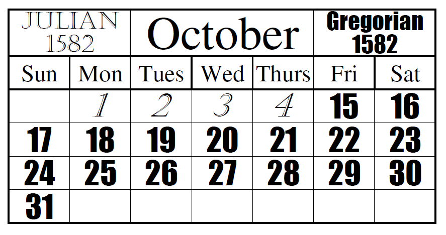

<div class="notes">

if the date of October 14, 1582 seems strange to you, it represents the start of the Gregorian calendar. The Julian calendar developed in ancient times was quite impressive. Astonomers at the time knew that the earth took 365.25 days to travel one orbit around the sun. So they invented the concept of a leap year.

Unfortunately, the earth actually takes 365.24219 days. That 0.00781 seems small but it means that you are off but a full day every 128 years. The Church was becoming concerned because Easter, a holiday that clearly belong in the Spring was falling earlier and earlier in the season. The astronomers figured out that 3/400 or 0.0075 was pretty close, so if they could find a way to shorten the calendar by 3 days every 400 years, they'd keep things well in sync. So they decided to toss out leap years on three of the four century years. That would make 1700, 1800, and 1900 normal years, but 2000 would still be a leap year.

Now there is even a discrepancy between (3/400) 0.0075 and 0.00781 so the proposed solution is to take back another leap day in the year 4000 and then again in the year 8000. I hope to be alive to see these two events.

And to make up for all the accumulated errors over the past fifteen centuries, they decided to remove ten days from the calendar. October 4, 1582 would be followed by October 15, 1582, putting Easter back to mid-Spring, where it properly belonged for then and for all future generations. So the skipped over date of October 14, 1582 is day 0 of the Gregorian calendar.

Here is an illustration of the transition, thanks to By Asmdemon - Own work, CC BY-SA 4.0, https://commons.wikimedia.org/w/index.php?curid=35391210

</div>

### Gregorian calendar


<div class="notes">

Here's a picture of Pope Gregory XIII, taken from Wikipedia. He's the Pope responsible for the Gergorian calendar. For what it's worth, it took a lot of time for some countries to convert to the Gregorian calendar. England (and the American colonies) switched in 1752 and because of their delay had to miss eleven days and not ten. They would have switched earlier, but did not like being dictated to by the Pope. Countries where the Orthodox Church predominated were even slower. Russia did not switch until the Communists took over in 1918 and Greece waited until 1923.

Enough of the trivia. Let's get back to real hard data.

So why did SPSS choose the number of seconds since October 14, 1582 rather than the number of days. Perhaps they were concerned about some of the rounding that could occur when you were tracking dates and times and not just dates. if you count by the number of elapsed seconds, you never have to round. Now, in exchange, you have to deal with date values that are on the order of 13 billion, and if you do a length of stay calculation, you are calculating the number of seconds that you were stuck in the hospital and not the number of days you were stuck in the hospital. You have to divide by 86,400 (the number of seconds in a day) to get length of stay in days.

</div>

### Categorical values

* Definition: small number of possible values
* Beware of ambiguities
  + YES, yes, and Yes are three distinct levels.
* Use number codes
  + 0, 1, 9 for binary variables
* Single letter codes
  + M, F, and U for gender
  + Potentially ambiguous
  + Consistent case is important.

<div class="notes">

A categorical variable is a variable with a small number of possible values. What's small? If you can state all the possible values without taking a breath, that's categorical. Actually, don't worry excessively about what meets the definition of categorical. Use a bit of common sense and you'll be fine.

Some people use text strings to designate categorical variables. This requires more typing, which may not be too serious a concern, but it also raises the possibility of ambiguity, especially if several people are responsible for data entry.

Note that the strings YES (all upper case), yes (all lower case), and Yes (Mixed case) may look the same to you, but they are treated as separate categories by the computer. 

Your book recommends number codes, and I agree with them. But you should know that others hate number codes and prefer the use of short strings or single letter codes.

Single letter codes are easy to remember. The letter codes (M, F, and U) for gender are obviously Male, Female, and Unknown. These single letters are also convenient plotting codes. At times, the codes can be ambiguous. Did you code your patients W for white, or C for Caucasian?

</div>

### Example of ambiguous coding

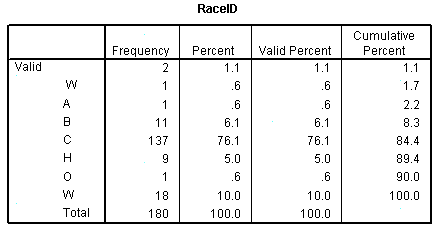

<div class="notes">

Here is an example of ambiguous data that I documented on my website back in 2007. I had a data set with a variable RaceID, and when I examined the data using the frequencies procedure in SPSS, I got this table. It shows two observations with blank values at the very top. This is bad form, as I noted earlier, and a special code letter like U or X should be presented instead. Notice also that W appears twice. The first W has a slight indent to it, which gives you a hint that something is not quite right. It turns out that there was a patient with a race code that was two characters long rather than one character. And those two characters were blank and W.

That was easy enough to fix, but this is why they pay me the big bucks. Because I pay very close attention to small details that might otherwise screw up the analysis.

One more nitpick. The code for A is ambiguous. Does it mean Asian American or American Indian? I can guess most of the others: B for Black, C for Causasian, H for Hispanic, O for Other and W for White (Why was this not combined with C?).

</div>

### Reverse coding (1 of 2)

* Context specific
* Sequence of IF THEN ELSE statements
  + if (is.na(x)) then y=NA
  +   else if (x=1) then y=4
  +   else if (x=2) then y=3
  +   else if (x=3) then y=2
  +   else if (x=4) then y=1
  +   else y=9

<div class="notes">

Reverse scaling is tedious and always go slowly, because tedium tends to produce simple mistakes. SPSS has a very nice recode dialog box that is hard to mess up. 

You can also use a series of IF THEN ELSE commands to do the reverse coding. Always start by recoding the missing value. Notice that I took the time to code as 9 anything outside what I believed were the only possible values.

</div>

### Reverse coding (2 of 2)

* Functional transformations
  + 0,1 to 1,0 is f(x)=1-x
  + 1,2,3,4 to 4,3,2,1 is f(x)=5-x
  + 0,1,2,3,4 to 4,3,2,1,0 is f(x)=4-x
* Always check your results
* Watch out for missing value codes

<div class="notes">

But if you want to be clever, there is usually a simple mathematical function of the form k-x  or k+1-x that will reverse scale everything all at once.

If you had a variable with values 0 and 1, the function f(x)=1-x will effectively convert the 0 to a 1 and the 1 to a 0.

If you had a variable with values 1, 2, 3, and 4, the function f(x)=5-x would effectively reverse these values. But note that if 0 were legal, if the possible values were 0, 1, 2, 3, and 4, then the proper function would be f(x)=4-x.

Always account properly for missing values when reverse scaling. It's a good idea to do a simple frequency table before and after reverse coding. It is also a good idea to store the reverse coded variable under a different name, so that you could easily undo any mistakes that you might have made.

</div>

### Second break

* What have you learned
  + Dates
  + Value labels
  + Reverse coding
* What's coming next
  + Multiple response
  + Longitudinal/repeated measures data

```{r multiple-response1, echo=FALSE}
plot1 <- function() {
  r <- c(10, 30)
  plot(r, r, type="n")
  q <- c(
    "Q1. What are a few of your favorite things?",
    "        a. Raindrops on roses",
    "        b. Whiskers on kittens",
    "        c. Bright copper kettles",
    "        d. Warm woolen mittens")
  text(rep(10, 5), 27:23, q, adj=0, cex=0.75)
  points(rep(10.35, 4), 26:23, pch=c(0, 7, 7, 7), cex=2)
  text(rep(10, 5), 21:17, q, adj=0, cex=0.75)
  points(rep(10.35, 4), 20:17, pch=c(7, 7, 7, 0), cex=2)
  text(rep(10, 5), 15:11, q, adj=0, cex=0.75)
  points(rep(10.35, 4), 14:11, pch=c(0, 0, 7, 7), cex=2)
}

plot2 <- function(xe=30){
  segments(xe, 30, xe, 10)
  segments(22, 30, 22, 10)

  segments(22, 30, xe, 30)
  segments(22, 28, xe, 28)
  segments(22, 22, xe, 22)
  segments(22, 16, xe, 16)
  segments(22, 10, xe, 10)
}

plot3 <- function(xm=c(24, 26, 28)) {
  for (x in xm) {
    segments(x, 30, x, 10)
  }
}
fn <- "../images/11/multiple_response%01d.png"
png(file=fn, width=350, height=350)
par(mar=rep(0, 4))

plot1()

plot1()
plot2(24)
text(23, 29, "q1", cex=0.75)
text(23, 25, "bcd", cex=0.75, adj=0.5)
text(23, 19, "abc", cex=0.75, adj=0.5)
text(23, 13, "cd", cex=0.75, adj=0.5)

plot1()
plot2(28)
plot3(c(24, 26))
text(23, 29, "q1.1", cex=0.75)
text(25, 29, "q1.2", cex=0.75)
text(27, 29, "q1.3", cex=0.75)
text(23, 25, "b", cex=0.75, adj=0.5)
text(25, 25, "c", cex=0.75, adj=0.5)
text(27, 25, "d", cex=0.75, adj=0.5)
text(23, 19, "a", cex=0.75, adj=0.5)
text(25, 19, "b", cex=0.75, adj=0.5)
text(27, 19, "c", cex=0.75, adj=0.5)
text(23, 13, "c", cex=0.75, adj=0.5)
text(25, 13, "d", cex=0.75, adj=0.5)

par(mar=rep(0, 4))
plot1()
plot2(30)
plot3(c(24, 26, 28))
text(23, 29, "q1.a", cex=0.75)
text(25, 29, "q1.b", cex=0.75)
text(27, 29, "q1.c", cex=0.75)
text(29, 29, "q1.d", cex=0.75)
text(23, 25, "0", cex=0.75, adj=0.5)
text(25, 25, "1", cex=0.75, adj=0.5)
text(27, 25, "1", cex=0.75, adj=0.5)
text(29, 25, "1", cex=0.75, adj=0.5)
text(23, 19, "1", cex=0.75, adj=0.5)
text(25, 19, "1", cex=0.75, adj=0.5)
text(27, 19, "1", cex=0.75, adj=0.5)
text(29, 19, "0", cex=0.75, adj=0.5)
text(23, 13, "0", cex=0.75, adj=0.5)
text(25, 13, "0", cex=0.75, adj=0.5)
text(27, 13, "1", cex=0.75, adj=0.5)
text(29, 13, "1", cex=0.75, adj=0.5)

silence <- dev.off()
```

### A multiple response example


<div class="notes">

This is an example of a questionnaire where the patients can choose one of more of the following favorite things: Raindrops on roses, or whiskers on kittens. Bright copper kettles, or warm woolen mittens.

The first patient liked the last three things: whiskers on kittens, bright copper kettles, and warm woolen mittens.

The second patient liked the first three things: raindrops on roses, whiskers on kittens, and bright copper kettles.

The third patient liked the last two things: bright copper kettles, and warm woolen mittens.

</div>

### Coding multiple response with a single column

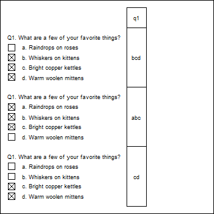

<div class="notes">

You can code all the possible responses in a single column. Since the first person chose the last three responses, code their response as bcd. The second person chose the first three responses, and would be coded as abc. The third person only chose the last two responses, and would be coded cd.

This approach makes it difficult to compute even simple statistics, such as the proportion of patients who chose "Whiskers on kittens." You'd have to work with a string search function. How many of the strings contain the letter b? It's not a terribly hard amount of work, but with a bit of planning, you could make it a bit easier for yourself down the road. 

</div>

### A different way to code multiple response

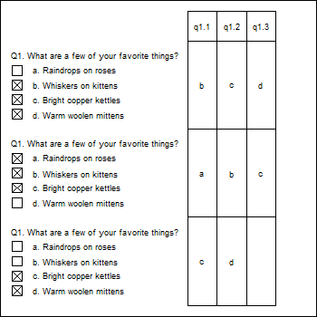

<div class="notes">

You could split this into three columns, putting the first selection in the first column, the second selection in the second column, and the third selection in the third column. So the bcd gets split into b in the first column, c in the second column, and d in the third column. The abc gets split into a in the first column, b in the second column, and c in the third column. The cd gets split into c in the first column, d in the second column and the third column is left blank.

This is a bit better, but there are still some problems. 

This format produces some unneeded missing values, such as for the patient who has less than three favorite things.

If you find out halfway through the survey that someone chose all four favorite things, you'd have to go back and add a new column. 

This format is also a bit tricky. Notice how even though all three patients selected c, the letter appears once in the third column, once in the second column, and once in the first column. If you wanted the percentage of patients who chose "c," you'd have to calculate the percentage of c's in the first column, and add it to the percentage of c's in the second column and the percentage of c's in the third column.

</div>

### The recommended way to code multiple response

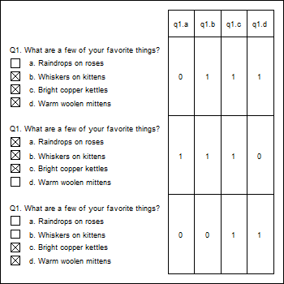

<div class="notes">

The recommended way to code multiple response is to create indicator variables for each possible response. The q1.a column is one for the second patient, as he/she was the only one who who liked raindrops on roses. The other two patients get a zero in this column. The q1.b column is one for the first and second patients, who both liked whiskers on kittens, but zero for the third patient who did not like whiskers on kittens. What's wrong here? Who doesn't like whiskers on kittens? The q1.c column is one for everybody because everybody liked bright copper kettles. Finally, in column q1.d, the first and third patients get ones for the like of warm woolen mittens, and the second patient gets a zero.

So the number of patients who like whiskers on kittens is just the number of ones in column q1.b.

Also note another big advantage here--no blank cells!

</div>

### Longitudinal data, Repeated measures data

* Longitunal
  + Multiple time points per patient
* Repeated measurements
  + Measuring patient repeatedly under different conditions
* Tall and thin format
  + One line per visit/measurement
* Short and fat format
  + One line per patient
  
<div class="notes">

Longitudinal data are data collected at several different time periods on the same individual. Repeated measurements data are the same measurements collected on an individual under different conditions. Both longitudinal and repeated measurements data are very powerful because each subject can serve as their own control. Data analysis is tricky, but data management is even trickier.

You have two different options for storing longitudinal or repeated measurements data. The tall and thin format has one row for each visit in a longitudinal study or one row for each measurement in a repeated measures study. This means lots of rows, but not so many columns. This makes the data set tall and thin.

The short and fat format has one row per patient and each visit or each repeated measure is spread out across multiple variables. This means fewer rows but many more columns.

Some data analyses, such as plots, work better with the tall and thin format. Other analyses, such as correlations, work better with the short and fat format. It is tedious to switch between the two formats, but you can do this.

</div>

### Example of tall/thin, dictionary

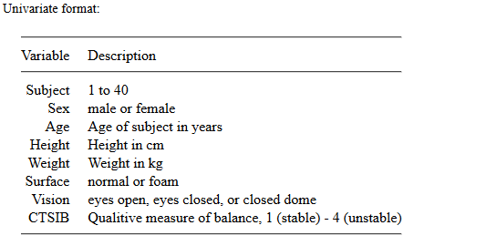

<div class="notes">

Here's a data set looking at balance. Patients are asked to balance on one foot either on a normal surface or on a softer surface of foam. I presume that balancing is harder on a soft surface like foam. They do this under three vision conditions: eyes open, eyes closed, and a closed dome which allows a little bit of partial vision. I presume that balancing is easier with eyes open, hardest with eyes colses, and somewhere in the middle for a closed dome. Each combination of surface and vision was repeated twice, leading to 2 by 3 by 2 or 12 different repeated measurements.

The outcome variable is an observer assessment of balance on a four point scale.

This is the data dictionary for the tall and thin formatted data. A single column holds the observer assessment of balance, which means 12 by 40 or 480 rows of data.

</div>

### Example of short/fat, dictionary

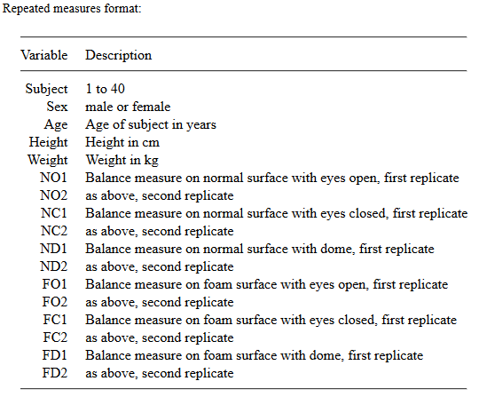

<div class="notes">

Here's the data dictionary for the short and fat format. There's one row per patient, but this means that the twelve repeated measures conditions have to have separate columns. NO1 and NO2 represent the normal surface, open eyes measurements. NC1 and NC2 represent the normal surface, closed eyes measurements. The last two columns, FD1 and FD2 represent a foam surface and domed vision. I'll leave it to you to decode the middle values.

</div>

### Example of tall/thin, data

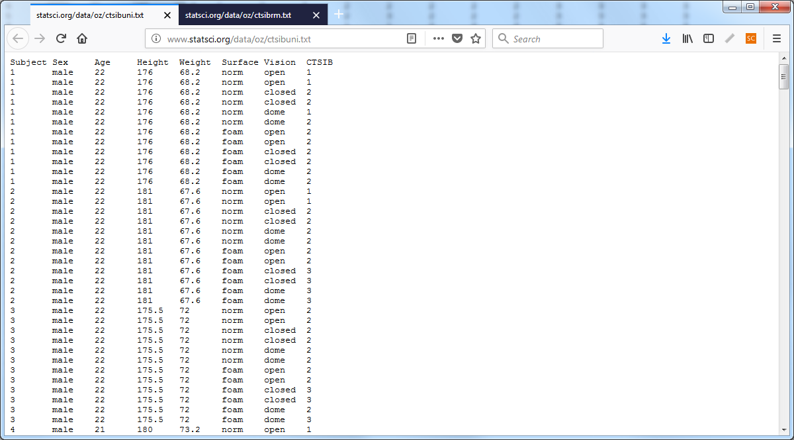

<div class="notes">

Here's the data for the tall and thin format. Don't worry about individual values, but do notice the size of the scroll bar on the right hand side is quite small indicating that you are only seeing a small fraction of the available rows.

</div>

### Example of short/fat, data

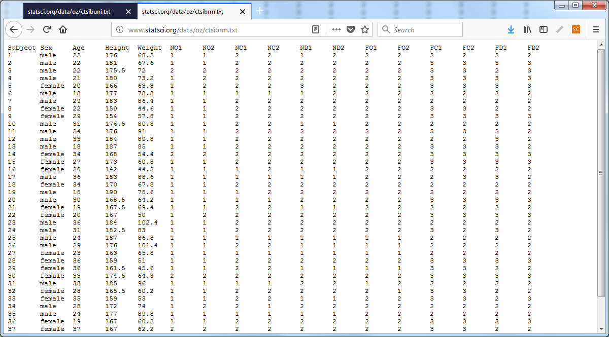

<div class="notes">

Here's the data in the short and fat format. Look again at the scroll bar on the right. It is so large because we are seeing almost all of the data (37 out of the 40 rows). Notice also that the short and fat format fills the screen almost completely from left to right. The tall and thin format did not come anywhere close to the right margin.

</div>

### A simple alternative to both tall/thin and short/fat

* Disadvantages of tall/thin
  + Too much repetition
* Disadvantages of short/fat
* Database format
  + Time constant table
  + Time varying table

<div class="notes">

There are serious disadvantages to the tall and thin format. For gender, you see male, male, male repeated twelve times because the first subject's gender was male for all twelve of the repeated measures. Repeated data like this is an open invitation for errors to creep in.

There are serious disadvantages to the short and fat format. Listing each visit in a separate set of columns or listing every repeated measurement condition in separate columns means that you have to do a lot of left and right scrolling to see all of the data. Left/right scrolling is painful, compared to up/down scrolling.

I had someone with a longitudinal data set where there were up to 40 separate visits with multiple measurements at each visit. He used the short and fat format and actually ran out of columns in the Excel spreadsheet. This was an earlier version of Excel where the column limit was 255. Now it is much higher. But think about it. A data set with 255 columns. Why I'd get exhausted just trying to name all those columns.

I recommend that you split longitudinal data into two pieces. The first piece represents time constant variables. These are the variables that do not change from visit to visit or across the repeated measurements. Most demographics like sex and race are the same from visit to visit.

The time varying table contains values that change from one visit to another in a longitudinal study or values that change from one repeated measures condition to another

</div>

### Time constant data

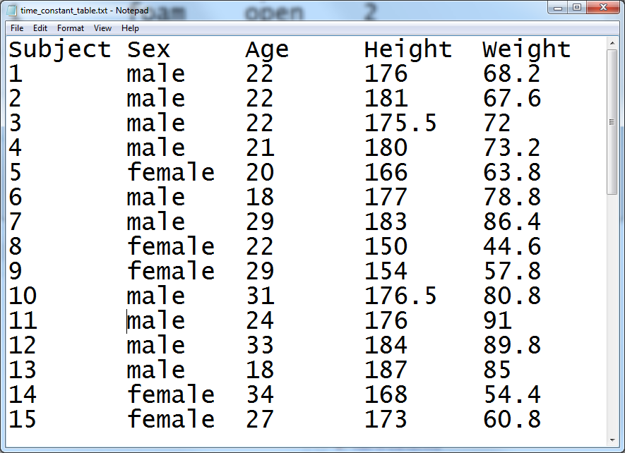

<div class="notes">

There is one row per patient for the time constant variables and notice that there is no repetition.

</div>

### Time varying data

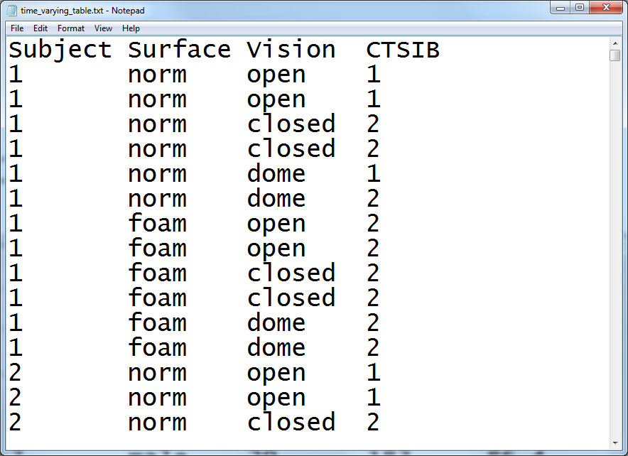

<div class="notes">

There is one row per repeated measurement for the time varying variables. If you split the data this way, make sure that each patient is given a unique identifier. You'll need this when you merge the time constant and time varying variables.

</div>

### Contents of a data dictionary

  + Variable names
  + Variable labels
  + Units of measurement
  + Permissible/impermissible values
  + Value labels
  + Missing value codes
  + Source
  + License

<div class="notes">

The data dictionary should list variable names. We already talked about variable names. Also include a longer description, a variable label. The variable label can use blanks, special symbols, and typically has a longer length. Be sure to specify the units of measurement, if applicable.

If there are permissible/impermissible values or a legal range, then include this information in the data dictionary. It could be put in as part of the variable label or listed as a footnote.

If your variable is categorical, specify what the categories are. There is nothing worse than not knowing whether 1 is male and 2 is female or if 1 is female and 2 is male.

</div>

### Third break

* What have you learned
  + Multiple response variables
  + Longitudinal/repeated measures data
* What's next
  + Double entry coding
  + Excel files

### Double entry coding

* Great quality check
  + If you can afford it
* Prepare a code book first
  + Count the proportion of discrepancies
* If too many discrepancies
  + Revise the code book and re-do the data entry.
* If discrepancies small enough
  + Report this number in your publication

<div class="notes">

Double entry coding is using two people to enter the identical data sets. They do this independently, then you compare the results to measure the degree of data entry errors.

Before you start double entry coding, you need a very detailed code book so there is little room for subjective interpretations of what to enter for unusual responses.

Fix the discrepancies, of course. The error rate will be different for the different data entry people, but the product of the two error rates is an estimate of the number of undetected errors. So if one person had an error rate of 5% and the other had an error rate of 2%, the overall error rate would be 0.05*0.02=0.001.

If your undetected error rate is too high, you are at fault for writing an ambiguous code book. Rewrite the code book and repeat the whole process.

Once you get a good undetected error rate, publish this number in your methods or results section of your paper.

</div>

### If you enter data into Excel

* Do not use colors
* Do not include summary statistics
* Rectangular grid
* Don't squeeze two data values into one cell
  + Systolic/diastolic blood pressures
  + 44M for a 44 year old male
* Variable names in first row
* No blank cells
  + Contradicts your book

<div class="notes">

A lot of researchers do their data entry in Microsoft Excel or some similar spreadsheet program. This is, at best, sub-optimal. REDCap is a much better option. But if you decide to use a spreadsheet, be careful. Spreadsheets are very flexible. Too flexible. You can put some of your numbers over here and others over there and then some more in the middle, and what you end up with is a muddle.

The key rule for a spreadsheet is to use a rectangular grid. A rectangular grid has a single number at the intersection of every row and column. Don't leave holes in your grid, even if the value is missing. 

Don't try to squeeze to pieces of data into the same cell. A common problem is when researchers put 120/80 into a cell to represent the systolic and diastolic blood pressures. When you enter data like this, you have two problems. First, there is no easy way to compute the average systolic or diastolic blood pressure. Second, some statistical software will see the slash and confuse it for division, converting your 120/80 into 1.5.

Use one cell for the systolic blood pressure and a different cell for the diastolic blood pressure. Likewise, an entry of 44M for a forty four year old male is troublesome. You can't easily compute the average age or the percentage of males.

It's a good idea to place the variable names in the first row of the spreadsheet. It's not a strict requirement, as you have already provided the variable names in your data dictionary. If you are nice enough to do this, however, it will be easier to import the data. the first row also makes it possibile to spot check your data to make sure that the columns are lining up properly.

Don't use the first two or three rows to organize your variables into headings and subheadings.

A lot of people will include some brief summary statistics as the last row or two of the spreadsheet. This is a bad idea, as the summary statistics might be confused for actual data points. If you need to compute a few summary statistics, learn how to place these in a separate worksheet.

Don't use a lot of fancy formatting in your spreadsheet. This means, no colors, no different fonts or sizes, and no merged cells. All of this is lost when you import your data into SAS, SPSS, or R.

Let me emphasize one more thing. Do not use blank cells ever in your spreadsheet. If your data is missing, use a missing value code. This contradicts your book's advice, but your book is wrong. A blank cell could easily be converted into a zero, if you're not careful and zero is quite different than missing.

If the structure of your data is irregular and cannot fit into a rectangular grid, re-organize. If you have measurements on 24 treatment subjects and 26 controls, don't put the outcome measure for the 24 treatment patients in one column and the 26 control patients in a second column. Put all 50 in a single column and add an additional column with 26 ones and 24 twos to distinguish who is a treatment patient and who is a control.

</div>

### A poorly structured spreadsheet 


<div class="notes">

This image and the next three might be a bit tricky to see on your screen. You can download the original images from the Canvas site and magnify them, if you want to see the details.

Here is a spreadsheet that I received recently that violates many of the recommendations that I just made.

The first row contains information that should belong in the data dictionary. The second and third rows organize the variables into major groupings: the Kear HTN Management Tool, and the Motivators of and Barriers to Health-Smart Behaviors Inventory. There are subgroups within these two groups: Medication Adherence, Health Behaviors, Medication Side Effects, and Barriers to Managing Blood Pressure for the Kear HTN Management Tool, and Healthy Breakfast - Motivators, and some other subgrous for the Motivators of and Barriers to Health-Smart Behaviors Inventory.

The groupings and subgroupings belong in the data dictionary but not here. 

The fourth column gives a description of each variable. The first two columns are: I forgot to take my medication for high blood pressure,	I took all my medication for high blood pressure. These are much too long to serve as variable names. They would make great variable labels instead, and this information belongs in a data dictionary.

There is an important bit of information hidden in the formatting of the variable labels.

"Any question from any survey that is in yellow text indicates that the "ideal response" would run on a spectrum opposite to the majority of other responses, e.g. most responses on the MBHBI are "ideally" 4 for a healthy individual, but for a question in yellow text, a healthy individual would indicate 1."

So the ninth column (I participate in activities to reduce or limit my stress to help lower my blood pressure) is in black because a large value is good. But the tenth column (I have experienced side effects from my high blood pressure medication (such a dizziness, unsteadiness, weakness, decreased heart rate, or fatigue)) is in yellow because a small value is good.

The sixth row is totally blank which is great for readability but an annoyance when you import the data.

Finally, notice the blank cells. I found out that these represented cases where someone skipped a question.

</div>

### Revisions to this spreadsheet


<div class="notes">

I was able to work with this data set, as is, without too much trouble, but here's a modification that would have been a bit easier to work with.

The first row includes brief, but descriptive variable names. The column names are MedAdherence1 through 3, HealthBehaviors1	through 5, SideEffects1 through 3, and so forth. I anticipated that I would not need to distinguish among the particular questions within a subgroup, since I would probably just use an aggregate sum of each subgroup (after reverse scaling) for most of the analyses. 

</div>

### The codebook from this spreadsheet

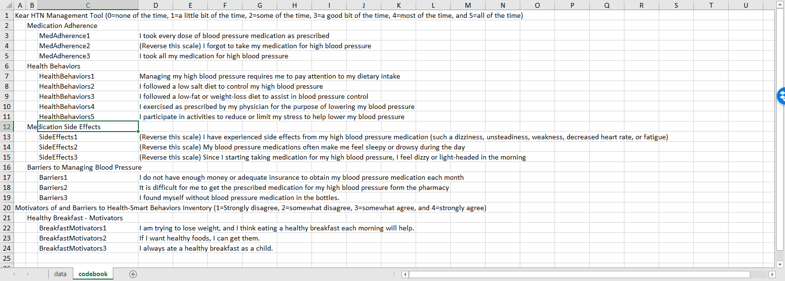

<div class="notes">

I also cut and pasted some of the preliminary rows in the original spreadsheet and restructured things a bit to develop a data dictionary.

</div>

### Fourth break

* What have you learned
  + Double entry
  + Excel files
* What's coming next
  + Text files
  + Database files

### Text files

* Fixed width
* Delimited
  + Commas
  + Spaces
  + Tabs
  + "Quotes around text"
  
<div class="notes">

You may wish to create a text file for others to use. The text format is popular for sharing your data, because others can inspect the data easily without needing any specialized software.

You can used a fixed width format. The

</div>

### Data dictionary for aboriginal prison death study

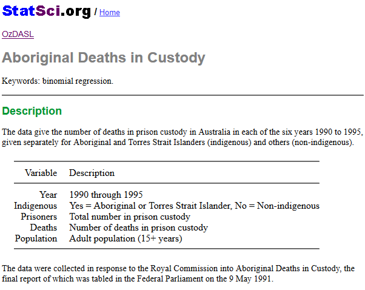

<div class="notes">

Here is the data dictionary for a small data set that I will use to illustrate the various text formats. It comes from OzDASL, the Australian Data And Story Library. This data set represents the number of deaths in prison of both aboriginal Australians and others. The variables are

Year (1990 through 1995), 

Indigenous (yes or no), 

Prisoners, the number in prison custody, 

Deaths, the number of deaths, and

Population, the adult population (15 years or older)

</div>

### Comma separated values (csv)

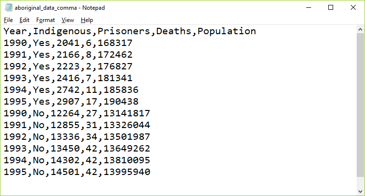

<div class="notes">

The most popular text format is the comma separated value. These files usually have a .csv extension. Each data point is separated from the other data values by a comma.

</div>

### Comma separated values with quotes

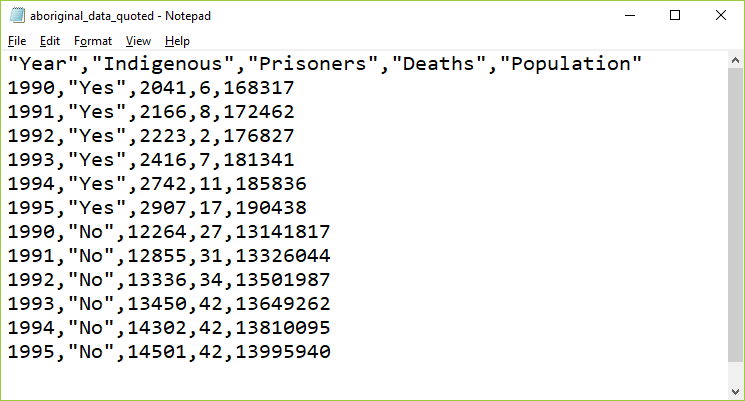

<div class="notes">

If your text data contains space, punctuation, or other special symbols, then it is a good idea to place quotes around your text. It's not really needed for this data set, but I wanted to show you anyway.

There are elaborate rules for how to handle text data that contains quote marks. Use double quotes to surround text that includes single quotes and use single quotes to surround text that has double quotes. Doubling up a quote mark is another approach that usually works. It's one of those tedious things that only Statisticians worry about.

</div>

### Fixed width format

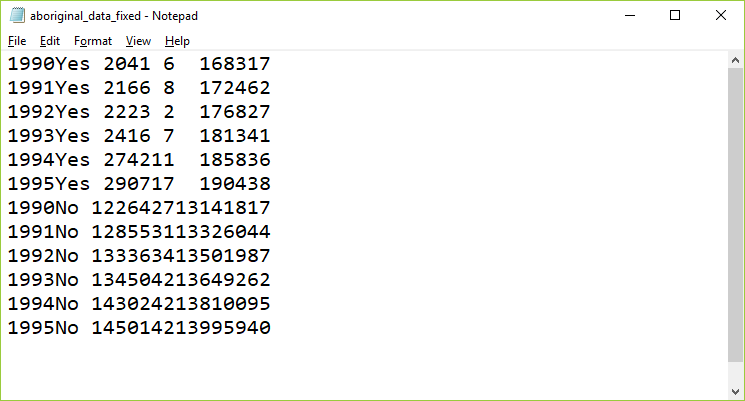

<div class="notes">

In this fixed width format, the first variable, year, is listed in columns 1 through 4. Then the text variable, Indigenous, takes the next three columns, columns 5 through 7. The number of prisoners is either a four or five digit number, so it uses columns 8 through 12. The number of deaths is, thankfully small, either one or two digits, so it fits into columns 13 and 14. The population could be in the tens of millions, so it needs to use columns 15 through 22.

You need a fairly detailed data dictionary for fixed with format data, because otherwise you might not be sure where one number stops and another number begins.

</div>

### Spaced format

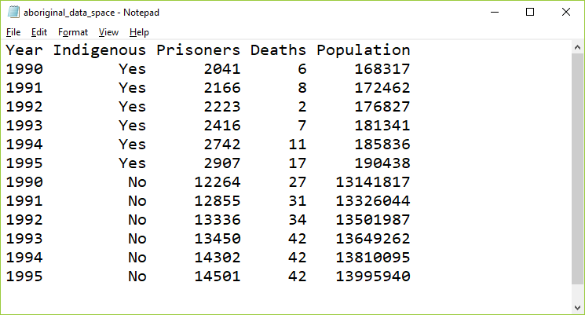

<div class="notes">

Usually, you will encounter a fixed width format in data sets with hundreds of variables and thousands or millions of rows. In these files, saving a few characters here or there can make a big difference in download times. But for small data sets, you can insert a few extra blanks so that everything lines up nicely. Here is an example.

</div>

### Tab separated values

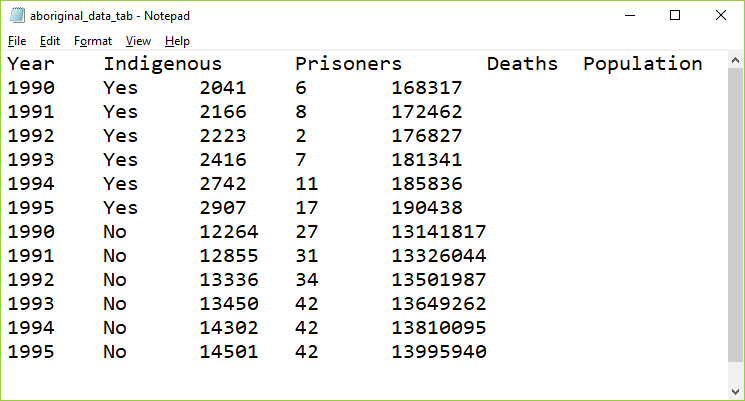

<div class="notes">

In the tab separated format, the tab character is used to separate values. The tab character effectively jumps to a specific fixed location. These locations are usually eight characters apart, starting at column 9, then 17, 25, etc.

The tab character appears to the human eye as multiple blanks but it is actually a non printing character, 09 in hexadecimal.

It's hard sometimes to figure out if a file is using tabs or spaces as delimiters. Most text editors and word processors will let you search for the tab character, often with a code like /t (forward slash t). If you start to insert blanks in a tab delimited file, at first nothing happens, then all of a sudden, you notice a sudden jump in the text to the right of where you are inserting. Finally, look to see if the text seems to line up somewhat but with a few irregularities. This happens when some of the text data for a variable is longer than 8 characters and other text for that variable is shorter than 8 characters. In the example shown here, none of the data is longer than 8 characters, but the variable names are, which is why they don't align perfectly with the data. 

</div>

### Database systems

* Terminology
  + Tables
  + Fields
  + Records
  + Primary key
  + Foreign key

<div class="notes">

Databases use slightly different terminology than what statistical software like R, SAS, and SPSS use, so let's review the basic terminology.

A table is a rectangular grid of numbers. Fields represent the columns of the table, what our statistical packages would call variables. Records represents the rows of the table, or what our statistical pacakges would call observations. The primary key is a identifier that, ideally, is unique for every record. A foreign key is a link between this table and a the primary key of a different table.

</div>

### Database table for value labels 

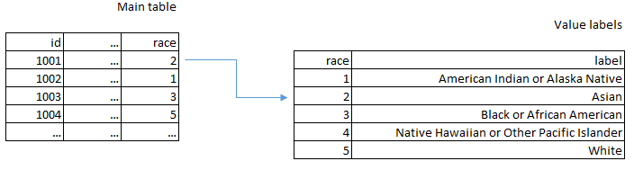

<div class="notes">

Earlier, you saw how longitudinal or repeated measures data could be split into two tables. The use of multiple linked tables is a powerful reason to use a database.

Here's another example. Suppose you were tracking race using the following categories:

American Indian or Alaska Native

Asian

Black or African American

Native Hawaiian or Other Pacific Islander

White

You wouldn't want to type the long labels in over and over again. So you would use the numbers 1 through 5 with 1 for American Indian or Alaska Native and 5 for White. But in a separate table you could keep the longer labels and then just join the tables together to get the nice labels for each subject.

</div>

### REDCap
  
* Research Electronic Data Capture
* Not open source, but freely distributed by Vanderbilt
* Software components
  + PHP
  + JavaScript
  + MySQL
* Case report forms
* Strongly recommended

<div class="notes">

REDCap is a database built on top of open source components, PHP, JavaScript, and MySQL. It has a lot of features that are especially attractive to researchers. For data entry, it allows you to easily define a case report form, a structure for your data entry. It can manage double entry seamlessly. When you are done with data entry, it has nice features to simplify the export of your data into R, SAS, or SPSS.

REDCap also has a survey module that allows you to collect questionnaire data over the Internet.

It has a lot of nice built in security features as well to guard against accidental release of private health information.

You should use REDCap for pretty much any research project. It has a bit less value, perhaps, for secondary data sets, but for any project where you have to enter the data yourself, you'd be crazy not to use REDCap.

</div>

### Conclusion

* Data dictionary
  + Variable names, Variable labels, Value labels, Missing value codes
* Managing complex files
  + Multiple response, Longitudinal/repeated measures data
* Storage options
  + Spreadsheet, Text file, Database, REDCap
  
