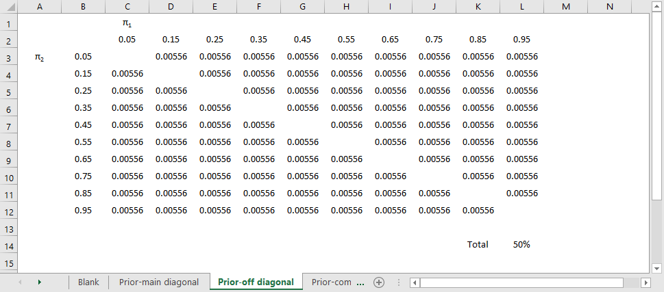

```{r echo=FALSE}
source("prelims.R", echo=FALSE)
```

### Pop quiz

+ A research paper computes a p-value of 0.45. How would you interpret this p-value?
  + Strong evidence for the null hypothesis.
  + Strong evidence for the alternative hypothesis.
  + Little or no evidence for the null hypothesis.
  + Little or no evidence for the alternative hypothesis.
  + More than one answer above is correct.

<div class="notes">

I gave a talk about ten years ago, and I had a "pop quiz" to start out the talk. It turns out that I was a bit careless in how I worded the question, but I decided to keep it in for future talks about p-values to help illustrate an important point. I won't ask you for the answer just yet, but here is the question.

A research paper computes a p-value of 0.45. How would you interpret this p-value? 

Strong evidence for the null hypothesis;

Strong evidence for the alternative hypothesis;

Little or no evidence for the null hypothesis;

Little or no evidence for the alternative hypothesis;

More than one answer above is correct.


</div>

### Another question

+ A research paper computes a confidence interval for a relative risk of 0.82 to 3.94. What does this confidence interval tell you that the result is:
  + statistically significant and clinically important.
  + not statistically significant, but is clinically important.
  + statistically significant, but not clinically important.
  + not statistically significant, and not clinically important.
  + ambiguous.


<div class="notes">

Here's another question to toss out, but this time it is not poorly worded.

A research paper computes a confidence interval for a relative risk of 0.82 to 3.94. What does this confidence interval tell you.

The result is statistically significant and clinically important, is not statistically significant, but is clinically important, and so forth. The last answer, the result is ambiguous, is the correct one, which you'll see in a little bit.

By the way, if you weren't writhing in the floor in agony when you saw this interval, I want to change that.

</div>

### What is a population?

+ A population is a collection of items of interest often defined in terms of
  + demography,
  + geography,
  + occupation,
  + time,
  + care requirements,
  + diagnosis, or 
  + some combination of the above.

<div class="notes">

Here's a definition of a population that I found somewhere but then I lost the link. So if anyone ever runs across this list of characteristics of a population, please let me know. It is too clever a list for me to have figured it out by myself.

A population is a collection of items of research. In clinical research, the population is often a collection of people, sharing some commmon features. They may all be in the same demographic group, the may all come from the same area, they may all have the same job, they may be getting the same type of medical care, they may have the same diseases, or it may be a combination of these items.

</div>

### Example of a population

Population: All infants born in the state of Missouri during the 1995 calendar year who have one or more visits to the Emergency Room during their first year of life.

<div class="notes">

Here's an example that hits on about all these. All infants born in the state of Missouri during the 1995 calendar year who have one or more visits to the Emergency Room during their first year of life.

Let's look at the different pieces.

All infants (demography)

born in the state of Missouri (geography)

during the 1995 calendar year (time)

who have one or more visits to the Emergency Room (care requirements)

during their first year of life (time, again)

</div>

### What is a sample?

+ A sample is a subset of a population
  + Small and manageable
+ Is your sample representative?
+ Your goal
  + Make inferences about the population
  + Using information from the sample
  
<div class="notes">

A sample is a subet of a population. Usually it is of a much smaller size than the population. It has to be small enough to be manageable.

The primary goal of much research is to use information collected from a sample to try to characterize a certain population. As such, you should pay a lot of attention to how representative the sample is of the population.

If there are problems, with representativeness, consider redefining your population a bit more narrowly. For example, a sample of 85 smokers between the ages of 13 and 18 in Rochester, Minnesota who respond to an advertisement about participation in a smoking cessation program might not be considered representative of the population of all teenage smokers, because the participants selected themselves. The sample might be more representative if we restrict our population to those teenage smokers who want to quit.

</div>

### More definitions for hypothesis testing

+ Parameter
  + Computed for a population
  + Almost always unknown
+ Statistic
  + Computed for a sample
  + Estimate of population parameter
+ Sampling error  
  
<div class="notes">

A parameter is a number computed from a population. Since the population is often very large, it is often impossible to compute a parameter.

A statistic is a number computed from a sample. Since the sample is small enough to be manageable, the values of the statistic are computed with the hope that they will be good estimates of the corresponding population parameter.

Sampling error is the uncertainty created by the sampling process.

</div>

### Hypotheses

+ Null hypothesis
  + Designated by $H_0$
  + No change, no effect
+ Alternative hypothesis
  + Designated by $H_a$
+ Decision rule

<div class="notes">

Researchers will often designate a null and alternative hypothesis. The null hypothesis (H0) is traditionally reserved for a hypothesis involving no effect, no change, or no trend. Let me emphasize that this is no change in a parameter.

The alternative hypothesis implies some type of change, either an improvement or decrement. It could also imply some type of association: a positive association (as one variable increases, the other variable also increases), or a negative association (as one variable increases, the other variable decreases).

Hypotheses are statements about population parameters. Because you new know exactly what a parameter is, you can never state with certainty whether a hypothesis about a parameter is true or false. Remeber this, as it becomes important later.

The decision rule is a statement about what particular values in the sample would lead you to accept the null hypothesis and what values would lead you to reject the null hypothesis.

</div>

### Comparison of continuous outcome for two populations

+ Most common research problem
+ Population parameters ($\mu_1$ and $\mu_2$)
+ Sample statistics ($\bar{X}_1$ and $\bar{X}_2$)
+ $H_0 \ \mu_1-\mu_2=0$ 
+ Accept $H_0$ if $\bar{X}_1-\bar{X}_2$ is close to zero.

<div class="notes">

The most frequent hypothesis involves a comparison of continuous outcomes between two groups, a treatment group and a control group. These are designated by the subscripts 1 and 2, but there is no standard that says that 1 is the treatment and 2 is the control. It is just as likely to be the reverse. You have to look for some context to make sure you know which subscript is which.

The null hypothesis is that the difference in population means is zero. You compute the difference in sample means and accept the null hypothesis if that difference is close to zero.

How close is close? It depends on how much sampling error you have.

Example: In a study of nulvadapine in Alzheimer disease, this drug was compared to placebo on the one year decline in cognition, as measured by the Alzheimer's Disease Assessment Scale Cognitive Subscale-12. The null hypothesis was that the average difference in cognitive decline between the drug and placebo was zero. The decline was 6.41 units in the placebo group and 5.75 in the control group, a difference in the sample of 0.66. Since the difference in the two means was close to zero, the researchers accepted the null hypothesis. They concluded "The results do not suggest benefit of nilvadipine as a treatment in a population spanning mild to moderate Alzheimer disease."

</div>

### Comparison of binary outcome for two populations

+ Population parameters ($\pi_1$ and $\pi_2$)
+ Sample statistics ($p_1$ and $p_2$)
+ $H_0 \ \pi_1-\pi_2=0$ 
+ Accept $H_0$ if $p_1-p_2$ is close to zero.

<div class="notes">

Another common hypothesis involves a comparison of binary outcomes between two groups, a treatment group and a control group. The population parameters are proportions instead of means, but otherwise the concept is the same.

Close to zero, as before, means close to zero relative to the amount of sampling error.

Example: in the same study, the researchers hypothesized that the difference in proportions for patients experiencing serious adverse events was zero. The sample proportions were 20% (50/252) and 16% (42/257). Since the differrence in proportions was small, the researchers accepted the null hypothesis and concluded that "Nilvadipine appeared to be safe and well tolerated"

</div>

### Regression models

+ Population parameters, $\beta_0$ and $\beta_1$
  + $\beta_1$ quantifies a relationship
  + $\beta_1=0$ implies no relationship
+ Sample statistics $b_0$ and $b_1$
+ $H_0 \ \beta_1=0$
+ Accept $H_0$ if $b1$ is close to zero

<div class="notes">

I'll talk a lot about regression models later, but let me introduce a hypothesis involving a regression model. Typically, but not always, a regression model has an intercept term and a slope term. The slope term quantifies the relationship between your independent variable and your dependent variable. If the population parameter is zero that means there is no relationship in the population. Like the other models, you compute a sample statistic and accept the null hypothesis if that sample statistic is close to zero.

Example: in a study of endothelial function and cognitive preformance in patients with coronary heart disease, the researchers hypothesized that there was no linear relationship between change in reactive hyperemia index (RHI) and the change in overall cognition. The regression coefficient was 0.55 which was not close to zero, so the researchers rejected the null hypothesis and concluded that "an increased RHI was significantly associated with an improvement in overall cognition."

Saleem M, Herrmann N, Dinoff A, et al. Association Between Endothelial Function and Cognitive Performance in Patients With Coronary Artery Disease During Cardiac Rehabilitation. Psychosom Med. 2019;81(2):184–191. doi:10.1097/PSY.0000000000000651.

Regression models are quite flexible. They can incorporate a variety of measurements for your outcome variable and can provide for risk adjustments to your outcome variable.

This is not a data analysis class, but I do want to provide you with enough information so you can write a good data analysis plan. More likely than not, your data analysis plan will involve a regression model of some type.

</div>

### First break

+ What have you learned
  + Poulation, sample
  + Parameter, statistic
  + Basic hypotheses
+ What's coming next
  + Directional alternatives
  + Text hypotheses
  + Type I and Type II errors

### Directional alternatives

+ Used when changes in opposite direction are
  + Impossible
  + Irrelevant/equivalent to no change
+ $H_0 \ \mu_1-\mu_2 \le 0$ 
+ $H_a \ \mu_1-\mu_2 \gt 0$ 
+ Reject $H_0$ if $\bar{X}_1-\bar{X}_2 > t \times se$
+ Must be stated a priori
  + "Wrong" direction now interesting
  + Switch for better power

<div class="notes">

It is a bit unusual, but there are situations where changes in the "wrong" direction are considered impossible or irrelevant or equivalent to no change.

Example: in a study of a robotic object hitting game, patients with Parkinson's disease were compared to age matched controls. Here the first group is Parkinson's and the second group is the control.

The null hypothesis was that the score was equivalent between the two groups. The alternative was that the score would be worse in the Parkinson's group. An improved score for the Parkinson's group would not be interesting because there is no scientifically reason to believe that having a condition like Parkinson's would provide a benefit in a test of motor skills. The mean scores for the control group and the Parkinson's group were 8.40 and 4.85 respectively. The difference in the sample means was 3.65 which was sufficiently large to reject the null hypothesis. The game was intended to be a test of motor skills and showing a difference in the Parkinson's group would demonstrate validity of this measure. Other tests involved just the Parkinson's disease patients on and off a drug, levodopa, that can relieve some of the symptoms of Parkinson's disease. The authors concluded that there was a "dynamic interaction between cognitive and kinematic skills while the PD patients performed a virtual reality game."

Consider the situation where you are testing a new drug versus placebo. A drug could be worse than a placebo. It happens all the time. But there is no reason to test for this. You would not adopt a new drug if it were equivalent to placebo and you would not adopt a new drug if it were inferior to placebo. So your null hypothesis is that the new drug is not better than placebo, meaning equal to placebo or worse than the placebo.

The actual orientation of a directional hypothesis depends on whether a larger value of the outcome measure is good or a smaller value is good. So for an outcome like pain, pain is like golf. A lower score on a pain scale is good. It also depends on which group gets labelled with a 1 and which gets a 2. And it depends on whether you consider a good effect to be impossible/irrelevant or a bad effect to be impossible/irrelevant.

Let's assume that you are testing a new pain relief drug versus placebo, that the placebo is group 1 and that higher values of pain with the new drug are irrelevant because that leads to the same decision as equivalent values of pain.

In this case, mu1-mu2 a measure where positive values are good and worth reporting, and where negative values are bad and lead to the same decision as zero values. So the null hypothesis uses a less than or equal to sign and the alternative hypothesis uses a greater than sign.

In this setting, you would compute the sample average pain levels in the placebo minus the sample average pain in the treatment group. If that difference was large and positive, you would reject the null hypothesis. How large? Typically you would compare this difference in sample means to a percentile from the t-distribution times the standard error for the difference in sample means.

You must specify a directional alternative prior to data collection, and once you commit to a directional alternative, you can't back out. You run the risk of being accused of fraud. The concern is that a researcher might start with the directional alternative because it provide a bit of a boost to the power of a study. But when the results come back and the results are pointing in the opposite direction, all of a sudden things change. The researcher now thinks that the "wrong" direction is no interesting and relevant and comes up with all sorts of reasons why this finding, which was not anticipated prior to data collection, is now so obvious and worth pursuing.

The opposite type of fraud can occur when you get a p-value for a two-sided alternative and it is just a bit too large. You want to shrink the p-value, and switching to a directional alternative (in the direction that you observed, of course) is what you really wanted all along. The switch cuts your p-value in half and now you have a statistically significant result.

</div>

### Passive smoking controversy

+ EPA meta-analysis of passive smoking
+ Criticized for using a one-sided hypothesis
  + Samet JM, Burke TA. Turning science into junk: the tobacco industry and passive smoking. Am J Public Health. 2001;91(11):1742–1744. Available in [html format](https://www.ncbi.nlm.nih.gov/pmc/articles/PMC1446866/) or [PDF format](https://www.ncbi.nlm.nih.gov/pmc/articles/PMC1446866/pdf/0911742.pdf).
  
<div class="notes">

Consider a study of the effects of second-hand smoke. These studies always use directional alternatives. From what we know about active cigarette smoking is that it increases the risk of cancer and cardiovascular disease. So there is no reason to expect that passive smoke exposure should be any different than active smoking. Maybe it is less toxic, because of dilution and because the smoking coming off a cigarette from one end is different than the smoke coming off the cigarette from the other end. Fair enough, but there is not reason to believe that things are so different that all of a sudden the smoke becomes protective. 

Since there is no scientific basis for a protective effect of passive smoking, it makes sense to test that passive smoking has no effect versus it having an increase in bad outcomes compared to the control group. So your null hypothesis is "not harmful" and your alternative is "harmful". The beneficial hypothesis is lumped into the null hypothesis, but no one would dare claim that passive smoking was protective.

Actually, the tobacco companies did complain that the use of a directional alternative violated the norms of science. They won in a court battle in North Carolina, but lost on appeal.

As another aside, I was involved with prayer study. We planned this study using a one-sided hypothesis (remote prayer has a positive effect on health). The Institutional Review Board suggested changing this to a two-sided hypothesis (remote prayer has either a positive or a negative effect on health). Thankfully, we did not observe an outcome in the opposite tail as that would have been very difficult to explain.

</div>

### Hypothesis in English instead of Greek

+ Only statisticians like Greek letters
  + Translate to simple text
+ For two group comparisons
  + Safer, more effective
+ For regression models
  + Trend, association
  
<div class="notes">

As a researcher, you should always think about your hypothesis in terms of population parameters, but your writing should use text. Translate the Greek letters to English.

If you have a hypothesis that compares two groups, look for comparative words like "safer" or "more effective". If your hypothesis involves some type of regression model, you should consider terms like "trend" or "association".

</div>

### Example of text hypotheses (1 of 1)

+ "... the objective of this 78-week randomised, placebo-controlled study was to determine whether treatment with nilvadipine sustained-release 8 mg, once a day, was effective and safe in slowing the rate of cognitive decline in patients with mild to moderate Alzheimer disease."
  + Lawlor B, Segurado R, Kennelly S, et al. Nilvadipine in mild to moderate Alzheimer disease: A randomised controlled trial. PLoS Med. 2018; 15(9): e1002660. DOI: 10.1371/journal.pmed.1002660
  
<div class="notes">

Here's an example of a two group comparison. One group gets nilvadipine and the other group gets a placebo. Safety was measured as the proportion of patients who experienced an adverse event. The researchers also measured the proportion of patients who experienced a serious adverse event. So the Greek hypothesis would involve pi's. 

Effectiveness was measured using the Alzheimer's Disease Assessment Scale Cognitive Subscale-12 and the Clinical Dementia Rating Scale sum of boxes. Both of these outcome measurements are continuous, so the Greek hypothesis would involve mu's.

</div>

### Example of text hypotheses (2 of 2)

+ "... we investigated trends in BCC incidence over a span of 20 years and the associations between incident BCC and risk factors in a total population of 140,171 participants from 2 large US-based cohort studies: women in the Nurses' Health Study (NHS; 1986–2006) and men in the Health Professionals' Follow-up Study (HPFS; 1988–2006)."
  + Wu S, Han J, Li WQ, Li T, Qureshi AA. Basal-cell carcinoma incidence and associated risk factors in U.S. women and men. Am J Epidemiol. 2013; 178(6): 890–897. DOI: 10.1093/aje/kwt073
  
<div class="notes">

This study used a regression model, a Cox regression model, to study trends and associations, so the Greek hypotheses would involve beta's.

</div>

### What is a Type I Error?

+ Type I error
  + Rejecting the null hypothesis when the null hypothesis is true.
  + False positive result
  + Example: allowing an ineffective drug on the market
+ $\alpha$ = P[Type I error]

<div class="notes">

In your research, you specify a null hypothesis (typically labeled H0) and an alternative hypothesis (typically labeled Ha, or sometimes H1). By tradition, the null hypothesis corresponds to no change. When you are using Statistics to decide between these two hypothesis, you have to allow for the possibility of error. Actually, if you are using any other procedure, you should still allow for the possibility of error, but we statisticians are the only ones honest enough to admit this.

A Type I error is rejecting the null hypothesis when the null hypothesis is true.

Consider a new drug that we will put on the market if we can show that it is better than a placebo. In this context, H0 would represent the hypothesis that the average improvement (or perhaps the probability of improvement) among all patients taking the new drug is equal to the average improvement (probability of improvement) among all patients taking the placebo. A Type I error would be allowing an ineffective drug onto the market.

Remember that the hypotheses involve population paramters. Population parameters are impossible to compute. So you can only talk about Type I errors in an abstract sense. You will never know for certain if you have made a Type I error.

Alpha is the probability of a Type I error, and alpha is a value that you can compute. In most studies, researchers work hard to keep the probability of a Type I error low, typically at 5%.

</div>

### What is a Type II Error? 

+ Type II error
  + Accepting the null hypothesis when the null hypothesis is false.
  + False negative result
  + Example: keeping an effective drug off of the market
+ $\beta$ = P[Type II error]
+ Power = $1-\beta$

<div class="notes">

A Type II error is accepting the null hypothesis when the null hypothesis is false. You should always remember that it is impossible to prove a negative. Some statisticians will emphasize this fact by using the phrase "fail to reject the null hypothesis" in place of "accept the null hypothesis." The former phrase always strikes me as semantic overkill. 

Many studies have small sample sizes that make it difficult to reject the null hypothesis, even when there is a big change in the data. In these situations, a Type II error might be a possible explanation for the negative study results.

Consider a new drug that we will put on the market if we can show that it is better than a placebo. In this context, H0 would represent the hypothesis that the average improvement (or perhaps the probability of improvement) among all patients taking the new drug is equal to the average improvement (probability of improvement) among all patients taking the placebo. A Type II error would be keeping an effective drug off the market.

It bears repeating that population parameters are impossible to compute. So you will never know for certain if you have made a Type I error.

Beta is the probability of a Type II error. Beta is a known quantity. Typically researchers try to keep beta small. 10% is a typical value, though in some settings, a Type II error rate as large as 20% could be tolerated.

Power is defined as 1-beta. I will talk more about power in a little bit.

</div>

### Second break

+ What have you learned?
  + Directional alternatives
  + Text hypotheses
  + Type I and Type II errors
+ What's combing next
  + p-values
  + p-hacking

### What is a p-value?

+ p-value = $P[\bar{X}_1-\bar{X}_2>t \times se \ | \ \mu_1-\mu_2=0 ]$
  + Probability of sample results OR a result more extreme, given that $H_0$ is true

<div class="notes">

Here's the formula for the p-value. It changes depending on what your hypothesis is, but this formula gets the general idea across. Don't worry for now about details like the absolute value sign and the "2 times" in front of the probability.

In English, this formula is telling you that the p-value is the probability that you observe the sample results or a result more extreme, assuming that the null hypothesis is true.

The p-value is, by far, the most popular statistic reported in research studies. In spite of its popularity, the p-value is quite controversial. One journal, Basic and Applied Social Psychology, banned the use of p-values in its journal.

Fricker (2019) American Statistician, 73(S1): 374-384.

</div>

### Alternate explanations of the p-value

+ The p-value is a measure of consistency between the data and the null hypothesis
  + Small value implies inconsistent
  + Large value implies consistent
+ The p-value as a measure of evidence against the null hypothesis
  + Small value implies lots of evidence
  + Large value implies little or no evidence

<div class="notes">

There are two interpretations that I feel are more practical. You can think of the p-value as a measure of consistency between the data and the null hypothesis. A small value implies inconsistency. It is very unlikely that you will get a value like you've seen in your sample or a value more extreme under the assumption that the null hypothesis is true. So you should reject that assumption.

On the other hand if the sample results or anything more extreme has a high probability under the assumption that the null hypothesis is true, then you should feel comfortable accepting that assumption.

I have argued that the p-value is a measure of evidence. Some have called it a poor measure of evidence, but I stand by my interpretation.

If the p-value is small, you have lots of evidence against the null hypothesis. If the p-value is large, you have little or no evidence against the null hypothesis.

</div>

### What the p-value is NOT (1 of 2)

+ Not the probability that the null hypothesis is true
  + Don't reverse the condition
  + p-value $=P\Big[\bar{X}_1-\bar{X}_2>t \times se \ | \ \mu_1-\mu_2=0 \Big]$
  + p-value $\ne P\Big[\mu_1-\mu_2=0 \ | \ \bar{X}_1-\bar{X}_2>t \times se \Big]$

<div class="notes">

The p-value is a conditional probability, and you always need to be careful about conditional probabilities. It is a probability about a sample result given an assumption about the population result. It is not a probability about a population result given the sample result. There are two reasons for this. 

First, you can't reorder a conditional probability. The probability of A given B is almost never the same as the probability of B given A. The example I give for this is the probability of being happy given that you are rich. That's a pretty high number, I hope you'll agree. There are a few rich people who lead miserable lives, but from everything I've seen, most rich people are pretty darn happy. The reverse of this is the probability of being rich given that you are happy. That number is much smaller. Because although I believe that money can buy happiness, a lot of other things can also buy happiness just as well. It's not quite as easy to find happiness if you're poor, but somehow, a lot of poor people find a way to be happy anyway.

A second reason that you can't reverse the order is that you cannot make a probability statement about population parameters. They are numbers computed from the entire population, and are fixed values. You cannot make a probability statement about something that has no sampling error.

</div>

### Pop quiz, revisited

+ A research paper computes a p-value of 0.45. How would you interpret this p-value?
  + Strong evidence for the null hypothesis
  + Strong evidence for the alternative hypothesis
  + Little or no evidence for the null hypothesis
  + Little or no evidence for the alternative hypothesis
  + More than one answer above is correct.
  + I do not know the answer.
  
<div class="notes">

Here's that pop quiz again. Take a look at it quickly. Note that the p-value is of evidence against the null hypothesis. So each of the first four responses is wrong.

I wrote this question quickly, so shame, shame on me. But I've reproduced the example because it illustrates an important point.

</div>

### What the p-value is not (2 of 2)

+ Not a measure FOR either hypothesis
  + Little evidence against the null $\ne$ lots of evidence for the null
+ Not very informative if it is large
  + Need a power calculation, OR
  + Narrow confidence interval
+ Not very helpful for huge data sets

<div class="notes">

The p-value is not a measure for either hypothesis. It is always a measure against a particular hypothesis. Now when the p-value is small, you can make a strong statement. We have lots of evidence against the null hypothesis. That translates into lots of evidence in favor of the alternative hypothesis.

When the p-value is large, however, you are in a quandry. Little or no evidence against the null hypothesis is not the same as lots of evidence for the null hypothesis.

It's possible to have little or no evidence against the null and also have little or no evidence against the alternative. This happens whenever you have a really small sample size combined with a lot of noise.

You can't prove a negative, so the saying goes. Well, you can prove a negative, but you have to work harder at it. A large p-value by itself is not persuasive, but if you combine it with a power calculation done prior to data collection, that's pretty good evidence in support of the null hypothesis.

You could also combine a large p-value with a narrow confidence interval to support the null hypothesis. I'll talk about that more in just a bit.

In general, the p-value is not very helpful for large samples. We're seeing this more and more. Just about everything pops up as statistically significant with these huge data sets, and you can't use the p-value to separate the important stuff from the trivial stuff. You need to look instead at the magnitude of the sample estimates and calculate how much uncertainty you can remove in your future predictions.

</div>

### p-hacking (1 of 2)


<div class="notes">

This cartoon is impossible to read, but you can find it on the Canvas site or in the readings. Here's a brief run down.

In the first panel, a woman runs up to a man and shouts: Jelly beans cause acne!

The man replies : Scientists! Investigate!

In the second panel, one scientist, holind a clipboard announces: We found no link between jelly beans and acne (p > 0.05).

In the third panel, the woman says: I hear it's only a certain color that causes it.

In a bunch of small panels, the scientist with a clipboard reports: We found no link between purple jelly beans and acne (p > 0.05).

We found no link between brown jelly beans and acne (p > 0.05).

We found no link between pink jelly beans and acne (p > 0.05).

The same for blue, teal, salmon, red, and so forth. And then...

We found a link between green jelly beans and acne (p < 0.05). An off-screen voice goes: Whoa!

The next six panels show

We found no link between mauve jelly beans and acne (p > 0.05).

We found no link between beige jelly beans and acne (p > 0.05).

We found no link between lilac jelly beans and acne (p > 0.05).

We found no link between black jelly beans and acne (p > 0.05).

We found no link between peach jelly beans and acne (p > 0.05).

We found no link between orange jelly beans and acne (p > 0.05).

At the bottom is a newspaper with the headline: Green Jelly Beans Linked To Acne! 95% Confidence. Only 5% chance of coincidence!

If you are interested in a transcript and a detailed explanation, https://www.explainxkcd.com/wiki/index.php/882:_Significant

</div>

  
### p-hacking (2 of 2)

+ Abuse of the hypothesis testing framework.
  + Run multiple tests on the same outcome
  + Test multiple outcome measures
  + Remove outliers and retest
+ Defenses against p-hacking
  + Bonferroni
  + Primary versus secondary
  + Published protocol

<div class="notes">

This is an example of p-hacking. You change the testing process to increase the probability of a Type I error (Rejecting the null hypothesis when the null hypothesis is true). This increases the chance of getting a positive result, which you may find desirable, but only by increasing the probability of a false positive result.

Some examples of p-hacking. Run multiple tests on the same outcome measure. Start with the regular t-test, include the t-test that allows for unequal variances, and run two different non-parametric tests, the Wilcoxon-Mann-Whitney test and the sign test. Choose the test with the smallest p-value.

You also might consider multiple outcome measures. Compare the mortality rate, the relapse rate, and the rehospitalization rate. If any of the three is statistically significant, claim victory.

You could also do this with longitudinal data. Compare pain relief at one hour and at four hours. If you see a difference at one hour, claim that your new medication is faster acting. If you see a difference at four hours, claim that your medication is longer lasting.

You might run a test with the full data set and then with an outlier or two removed. Report for the data set that has the smaller p-value and pretend that this was your original choice all along.

These are only a few of the choices. I don't want to say more because I feel like I'm the devil tempting you.

There are two defenses against p-hacking. Well three if you count being honest. But what I mean is there are two things that you can do that will satisfy others that you are playing fairly.

First, you can adjust your decision rule by using a Bonferroni correction. Bonferroni divides alpha by the number of tests. If you are using three different outcome measures, compare your p-value of 0.0133 instead of 0.05.

Second, you can designate one of your outcome measures as primary. If you achieve statistical significance on your primary outcome, great. The remaining outcome measures are secondary. If you achieve statistical significance on a secondary outcome meausure only, report the results as provisional and requiring independent replication.

You should publish a detailed protocol, either through a clinical trial registry, or now there are journals which accept publications of the research protocols before any data are collected. It's a paper with literature review and methods section, but no results and no discussion section.

Now p-hacking has happened because some people have a skewed view of research. They are interested in using research to promote their own agenda rather than using research to uncover the truth. Perfectly understandable if you are a drug company, but you as an independent researcher should never try to skew the data. It hurts you and it hurts your patients. You need to adopt a disinterested posture in that you are glad when the research points in one direction and you are glad when it points in the opposite direction, because either way, you know more than you did before and you can treat your patients better because of this knowledge.

</div>

### Third break

+ What have you learned?
  + p-values
  + p-hacking
+ What's coming next?
  + Confidence intervals
  + Range of clinical indifference

### What is a confidence interval?

Dear Professor Mean:  Can you give me a simple explanation of what a confidence interval is?

+ A confidence interval is a range of values that quantifies the size of sampling error.
  + Also, a range of plausible values.
  + Not a probability statement about a parameter

<div class="notes">

We statisticians have a habit of hedging our bets. We always insert qualifiers into our reports, warn about all sorts of assumptions, and never admit to anything more extreme than probable. There's a famous saying: "Statistics means never having to say you're certain."

We qualify our statements, of course, because we are always dealing with imperfect information. In particular, we are often asked to make statements about a population (a large group of subjects) using information from a sample (a small, but carefully selected subset of this population). No matter how carefully this sample is selected to be a fair and unbiased representation of the population, relying on information from a sample will always lead to some level of uncertainty.

A confidence interval is a range of values that tries to quantify this uncertainty. Consider it as a range of plausible values. 

A narrow confidence interval implies high precision; we can specify plausible values to within a tiny range. A wide interval implies poor precision; we can only specify plausible values to a broad and uninformative range.

I also like to think of the confidence interval as a range of plausible values. It is not a probability statement, however, because the confidence interval is a statement about a population parameter, which does not have sampling error.

</div>

### Example of a confidence interval

+ Homeopathic treatment of swelling after oral surgery
  + 95% CI: -5.5 to 7.5 mm
  + Lokken P, Straumsheim PA, Tveiten D, Skjelbred P, Borchgrevink CF. Effect of homoeopathy on pain and other events after acute trauma: placebo controlled trial with bilateral oral surgery BMJ. 1995;310(6992):1439-1442. http://www.bmj.com/content/310/6992/1439.full
  
<div class="notes">

Always look for confidence intervals that are wide enough to drive a truck through. They are very good indicators of small sample sizes.

Consider a recent study of homoeopathic treatment of pain and swelling after oral surgery (Lokken 1995). When examining swelling 3 days after the operation, they showed that homoeopathy led to 1 mm less swelling on average. The 95% confidence interval, however, ranged from -5.5 to 7.5 mm. From what little I know about oral surgery, this appears to be a very wide interval. This interval implies that neither a large improvement due to homoeopathy nor a large decrement could be ruled out.

Now, you can't drive a truck through an interval that goes from -5.5 to 7.5 mm, but from the perspective of a human mouth, this interval is huge. Generally when a confidence interval is very wide like this one, it is an indication of an inadequate sample size, an issue that the authors mention in the discussion section of this paper.

</div>

### Confidence interval interpretation (1 of 7)


<div class="notes">

When you see a confidence interval in a published medical report, you should look for two things. First, does the interval contain a value that implies no change or no effect? For example, with a confidence interval for a difference look to see whether that interval includes zero. With a confidence interval for a ratio, look to see whether that interval contains one.

Here's an example of a confidence interval that contains the null value. This interval implies no statistically significant change.

</div>

### Confidence interval interpretation (2 of 7)


<div class="notes">

Here's an example of a confidence interval that excludes the null value. If we assume that larger implies better, then the interval would imply a statistically significant improvement.

</div>

### Confidence interval interpretation (3 of 7)


<div class="notes">

Here's a different example of a confidence interval that excludes the null value. This interval implies a statistically significant decline.

</div>

### Confidence interval interpretation (4 of 7)


<div class="notes">

You should also see whether the confidence interval lies partly or entirely within a range of clinical indifference. Clinical indifference represents values of such a trivial size that you would not want to change your current practice. For example, you would not recommend a special diet that showed a one year weight loss of only five pounds. You would not order a diagnostic test that had a predictive value of less than 50%.

Clinical indifference is a medical judgment, and not a statistical judgment. It depends on your knowledge of the range of possible treatments, their costs, and their side effects. As statistician, I can only speculate on what a range of clinical indifference is. I do want to emphasize, however, that if a confidence interval is contained entirely within your range of clinical indifference, then you have clear and convincing evidence to keep doing things the same way.

</div>

### Confidence interval interpretation (5 of 7)


<div class="notes">

One the other hand, if part of the confidence interval lies outside the range of clinical indifference, then you should consider the possibility that the sample size is too small.

The interval contains zero, so it is plausible to behave as if the difference in population means or proportions is zero. But the interval also contains values that are clinically important. So it is plausible to behave as if there is a clinically important difference in means. How can you have two such different interpretations being plausible at the same time? That's the definition of ambiguity. If you don't like it, get used to it. Statisics will often identify areas of ambiguity, which is a good thing, because it tells us to not act prematurely, but instead demand more data before you make a definitive decision.

</div>

### Quiz question, revisited

+ A research paper computes a confidence interval for a relative risk of 0.82 to 3.94. What does this confidence interval tell you that the result is:
  + statistically significant and clinically important.
  + not statistically significant, but is clinically important.
  + statistically significant, but not clinically important.
  + not statistically significant, and not clinically important.
  + ambiguous.


<div class="notes">

Let's go back to that question I posed earlier.

A research paper computes a confidence interval for a relative risk of 0.82 to 3.94. What does this confidence interval tell you.

Well, it tells you that a relative risk of 1 (equal risks) is plausible, but that a relative risk of 2 (a doubling of risk) is also plausible. A tripling of risk is plausible. Good grief! This is an ambiguous result.

Doesn't this bother you? It should. Someone ran a terrible experiment. An experiment so poorly designed that it can't distinguish between no change in risk, or a tripling of risk.

It's a terrible thing, but it happens all the time and it doesn't seem to bother anyone but me. This is wretched. You got a hundred patients to let you poke and prod them. They took some bitter pills or maybe placebos. They are sacrificing their bodies in the name of science. And the best you can do is a confidence interval that goes from 0.82 to 3.94. Hang your head in shame!

</div>


### Confidence interval interpretation (6 of 7)


<div class="notes">

Some studies have sample sizes that are so large that even trivial differences are declared statistically significant, especially in this era of big data. If your confidence interval excludes the null value but still lies entirely within the range of clinical indifference, then you have a result with statistical significance, but no practical significance.

</div>

### Confidence interval interpretation (7 of 7)


<div class="notes">

Finally, if your confidence interval excludes the null value and lies outside the range of clinical indifference, then you have both statistical and practical significance.

Let's talk about one more case. I don't have a picture, but imagine a confidence interval that is mostly in the white region, the region of clinical importance, but the lower limit stretches into the range of clinical indifference. It doesn't quite include the null value, but it comes within kissing distance. That's a result that achieves statistical significance, but it does not provide definitive proof of clinical importance. No one ever talks about this case, but they should. Your confidence interval indicates statistical significance, but just barely. So don't pretend that your results are the final word. You should not stop researching until you get a confidence interval that lies entirely inside or entirely outside the range of clinical indifference.

</div>

### Fourth break

+ What have you learned?
  + Confidence intervals
  + Range of clinical indifference
+ What's coming next?
  + Non-inferiority testing
  + Sample size justification

### Non-inferiority testing

+ Reasons for adopting a new drug/therapy
  + Greater efficacy
  + Lower cost
  + Better compliance
  + Fewer side effects
+ $H_0 \ \pi_1-\pi_2 \le -\Delta$ 
+ $H_a \ \pi_1-\pi_2 \gt -\Delta$ 
  + $\Delta$ is the non-inferiority margin
  + Reject $H_0$ if $p_1-p_2 \gt -\Delta + z \times se$
  + Trade-off between efficacy and cost, compliance, or side effects
  
<div class="notes">

Why does a new drug replace an old drug? I should talk about therapies instead of drugs, but it is easier to pretend that the only thing that doctors do is hand out pills.

There are several reasons to switch. First, the new drug might be more efficacious. It cures more people.

But there are other things that are important as well. The new therapy might be cheaper. Money is never the only consideration, of course, but you can't ignore it either. Even when the cost of drugs is hidden by insurance coverage, there is a price that all of society pays when you ignore simple economics. 

Another reason to switch is compliance. If you can replace needles with a pill or replace three times a day dosing with twice a day dosing, you'll find that a lot more of your patients will take the drug.

A third reason to switch would be a change in side effects. All drugs have side effects, of course, but sometimes you can reduce the number of patients that experience these side effects. Sometimes, you can replace serious side effects with more mild side effects.

If you expect a new drug to show reduced cost, better compliance, or fewer side effects, you might be willing to tolerate a deficit in efficacy. Now, it would have to be a small deficit, often a very small deficit. 

Non-inferiority testing addresses the problem where you want to show that a new drug, superior in other ways, does not give away too much in efficacy. So you want to test that your new drug is not substantially inferior than the old drug with respect to therapy.

A formal hypothesis test to demonstrate that a new drug is not substantially worse on an efficacy endpoint is called a non-inferiority test. To conduct this test, you need to define a non-inferiority margin. This a value that separate an intolerable loss in efficacy from a tolerable loss. How do you pick a non-inferiority margin? 

Sometimes it's easy. So in testing a flu vaccine, you might tolerate a 20% decline in the number of colds if you could knew that you would be getting at least a 20% increase in the number of people who would be getting vaccinated.

Other times, it's tricky. A side effect of the flu vaccine is localized soreness, and while we want to minimize this, experiencing localized soreness and experiencing the flu are not the same thing. You might want to set up a ratio, say, that ten localized soreness events equals one flu event. Then, if you knew that the new vaccine would have 20% fewer problems with localized soreness, you'd be able to only tolerate a 2% decline in efficacy. Anything worse, and you'd have less than a 10 to 1 ratio.

If the new vaccine were 50% cheaper, you'd just have to figure out the dollar value associated with a single case of the flu and do make sure that the proportion of fewer cures times cost of a single cure was smaller than the cost savings. So if all the bad things associated with the flu, the suffering, the lost work time, and the increased risk of other bad things like pneumonia had a dollar value of five thousand dollars, and you could save two hundred dollars per dose of vaccine, then you'd need to need to make sure that the decline in efficacy was not 4% or worse. 

I'm vastly oversimplifying things here. I'm not talking, for example, about the complexities associated with absolute versus relative risk. And some of my math calculations might be a bit dicey. But to be honest, no one even tries to look at things from this simpilistic of an approach. They just pick a number out of thin air, and don't offer any justification. If you need to set a non-inferiority margin, talk to a bunch of people and make sure that you are assessing the trade-offs properly.

Once you have your non-inferiority margin, the rest is easy. Your alternative hypothesis is that the difference in means is above the non-inferiority margin. The way I have described the hypotheses might need to change the direction of the sign depending on whether you label the group with the new drug with a 1 or a 2. Instead of rejecting H0 if you are above zero by a certain amount determined by sampling error, you reject 

</div>

### Sample size justification

+ Rules of thumb
  + Rule of 50
  + Rule of 16
+ CI width  
+ Power calculations
  + research hypothesis
  + standard deviation
  + minimum clinically important difference
+ Post hoc power - never!
+ Effect sizes - never!

<div class="notes">

There area lot of formulas out there and a lot of software that will help you justify your sample size, but I don't want to talk in detail about them. I do want to mention a few quick rules of thumb that you can apply to see if you are on the right track.

The first of these is the rule of 50. If you are measuring a binary outcome, you need to plan for a large enough sample size so that you see 25 to 50 events in each group. This is a very useful rule for seeing if your sample size needs to be in the hundreds, or if it needs to be in the thousands.

I was working with a researcher who wanted to study infants who were breastfeeding while at the hospital, go home and then come back in seven days with breastfeeding jaundice. I said, okay, about how often does this happen. And he said maybe somewhere between a half a percent and two percent of the babies. So I did the math. If the rate is on the high end, 2%, that means one out of every 50 patients will be readmitted. So you needs to get 50 times as many babies to assure that you will get 50 events. Thats 2,500. In one group. And with the numbers on the high end of his interval. So I tell him, you'll probably need to study around 5,000 infants. He was not happy.

No one every got thrown in jail for violating a rule of thumb. But when you do the formal sample size formula, you sure as heck won't get a sample size of 100. A sample of 100 patients would mean that you'd expect to see two infants readmitted. Do you want to hang your hat on two infants?

The other rule, called the rule of 16, is useful for continuous outcomes. If you believe that a clinically important difference is a certain size, and that size is x% of a standard deviation, then you need to have 16/x-squared patients in each group. So if you believe that the clinically important difference is half a standard deviation, divide 16 by 0.5 squared to get 64 patients per group. If the clinically important difference is only one tenth of a standard deviation, watch out. You need to collect 16 divided by 0.1 squared or 1600 patients per group.

You can also justify your sample size by specifying how narrow you'd like your confidence intervals to be. This is especially useful in settings where there is no formal research hypothesis. The calculations here are a bit tedious, but manageable. Suppose you are running a diagnostic test and you want sensitivity and specificity to both have very narrow confidence intervals. You plan to recruit in a population where the prevalence of the disease is only 10%. This means that sensitivity, which has the proportion of diseased patients in the denominator, is your most crucial confidence interval. Trial and error works well here. You'd like any interval to have a maximum width of plus or minus 0.1. If sensitivity were 90%, your 95% confidence interval would be 0.871 to 0.928. Now try 70% sensitivity. Your interval is 0.655 to 0.745. It looks like we could get by with a slightly smaller sample size.

A formal power calculation is the most common way to justify your sample size. I won't show the details, but justificaiton using a power calculation requires you to specify a research hypothesis (using Greek symbols like mu, pi, or beta), the standard deviation of your outcome measure (assuming a continuous outcome measure), and the minimum clinically important difference.

Never try to justify your sample size after the fact. It is called a post hoc power calculation. It is very bad. If you didn't have the foresight to justify your sample size before collecting your data, rely on the width of your confidence intervals to show that your sample size was adequate.

Your book and a lot of other books talk about effect sizes. While an effect size is a useful intermediate calculation, you cannot use the effect size, by ifself, as it is impossible to interpret. Imagine a store with a sign in front announcing "Giant sae: all prices reduced by half a standard deviation".

if you want to define a minimum clinically important difference, you must do it in the original scale of measurement, not using some unitless quantity like an effect size.

</div>


### Fifth break

+ What have you learned?
  + Non-inferiority testing
  + Sample size justification
+ What is coming next?
  + Criticisms of hypothesis testing
  + Bayesian data analysis
  
### Criticisms of hypothesis testing (1 of 4)

+ Criticisms of the binary hypothesis
  + Dichotomy is simplistic
  + Point null is never true
  + Cannot prove the null
+ Possible remedy
  + $H_0 \ -\Delta \le \ \mu_1-\mu_2 \le \Delta$ 

  
<div class="notes">

There are many cricisms of hypothesis testing. You need to be aware of these criticisms, but I am not suggesting that you abandon hypothesis testing because of these criticisms.

The first set of criticisms deals with the binary nature of the hypotheses.

I've said many times that all dichotomies are false dichotomies, and I still hold to that. Hypothesis testing is a double dichotomy. You specify only two hypotheses, and you only two choices are accepting the null hypothesis and rejecting the null hypothesis. Shouldn't there be more than two choices?

Let me give an example. I found a couple of articles that studied the safety of vaccines. Now, vaccines are complicated, but let's try to understand the safety issue more clearly. It depends on the benefits of the vaccination combined with the probability that an individual will receive the benefit. Balance that against the harm caused by the vaccine combined with the probability that an individual will experience the harm. So how much harm and how probable does it need to be before you can say that you have a clinically important difference? Complicated, yes, but let's throw in a curve ball. How much do the harms and the probabilities need to be before you warn someone about those harms. How much do the harms and the probabilities need to be before you decide that you shouldn't be using this vaccine? Two very different questions, and two very different thresholds. So why do we force both of them into a single decision point?

Why shouldn't you allow a gray decision? So you could accept the null hypothesis for some values of the sample statistics, reject it for other values, and choose to neither accept nor reject for values intermediate.

Another thing about hypotheses is that a difference of exactly zero never actually occurs in the population. There's no way that, if you averaged a population of all males with particular disease and you averaged a population of all the females with a particular disease that you'd get the two to be exactly the same, even for a disease that has no association with gender. So what is the point of setting up a hypothesis and making a decision about it when you know in your heart of hearts that the null hypothesis is never true.

The other issue with hypothesis testing is that it does not allow you to prove the null hypothesis. If you really wanted to prove the null hypothesis, you have to do all sort of messy gyrations. Wouldn't it be nice to be able to act with the same level of certainty when you accept the null hypothesis as you do when you reject the null hypothesis? The very phrasing that some people use (fail to reject the null hypothesis in place of accept the null hypothesis) shows how convoluted things get.

Many of these criticisms of the binary hypothesis would disappear if we allowed for testing not equality in the null hypothesis but rather testing whether the difference is within some interval. But this is not going to happen anytime soon.

</div>

### Criticisms of hypothesis testing (2 of 4)

+ Criticisms of the p-value
  + Not intuitive, easily misunderstood
  + "results more extreme"
  + Ignores clinical importance
  + Does not measure uncontrolled biases

<div class="notes">

The p-value that lies at the heart of hpyothesis testing has also been roundly criticized. It seems backwards in more than one way. It is evidence against a hypothesis rather than for a hypothesis. You get lots of evidence against the null hypothesis when the p-value is small and little or no evidence when the p-value is large. And the conditional probability that your p-value represents, the probability of getting sample results or results more extreme given that the null hypothesis is true represents the reverse of what you really want. What you really want is the probability that the null hypothesis is true given the data that you observed.

A lot of people dislike the idea of looking for a probability involving the sample results or results more extreme. Why, they ask, do you want a probabilty involving results more extreme. You didn't observe a value more extreme. You observed a single vlaue.

The p-vaue ignores clinical importance. This would be easy to fix if people used an interval -delta to delta for the null hypothesis as mentioned earlier, but no one is ready to do this.

Finally, the p-value is unaffected by threats to internal validity. If you conduct the study poorly, such as failing to keep information away from patients in a blineded study, or having a large number of protocol violations, that should be reflected in your p-value. But the p-value ignore these problems.

</div>

### Criticisms of hypothesis testing (3 of 4)

+ General criticisms
  + Too hard to reject H0
  + Too easy to reject H0
  + Too reliant on a single study
  + Thoughtless application

<div class="notes">

Hypothesis testing has been criticized because it is too hard to reject the null hypothesis, especially for small samples in a noisy setting. The conservative inside of you and me probably thinks this is good. Don't make a choice between two therapies or drugs until you've accumulated sufficient evidence. But failing to act quickly can sometimes force you to pay a price. This relates to the tradeoffs that you see all the time between false negative results and false positive results. The hypothesis testing framework is biased towards preventing a false positive result (a Type I error) and it is very difficult to get this framework to work well when a false negative result is worse. This can occur, for example, in a setting with a 100% fatal disease with no known cure.

The opposite problem is also true. It is often too easy to reject the null hypothesis. In this era of big data, you can quickly get millions of data points or more and you have so much precision that any sample statistics even of a trivial size will lead to a statistically significant result. This is not good. Instead of identifying one or two risk factors as being statistically significant, a really big data set will identify hundreds or even thousands of risk factors as being statistically significant.

The p-value is too reliant on a single study and does not consider what previous research has been done.

My biggest criticism of p-values, though, is the thougtless way in which they are applied. I've written about the p-value receptor inside a scientist's brain.

A research team took ten scientists and placed them inside an fMRI. The fMRI shows which parts of your brain are active as your brain processes different types of information. The scientists were shown a variety of graphs taken from actual peer-reviewed publications.

As you might expect, the part of your brain that activates first when you are presented an image of a graph is your visual cortex. For most graphs, this was quickly followed by an activation of the parietal lobe, the part of your brain responsible for numerical computations.

But some graphs showed a different pattern. If the graph included a p-value, activation of the visual cortex is followed by activation of an area of your amygdala that is as yet poorly understood. The research team called this portion of the amygdala the p-value receptor.

If your p-value receptor is activated and the p-value is larger than 0.05, the p-value receptor sends strong signals to the pain centers of the brain. This is clearly an adaptive behavior. Scientists who routinely produce p-values larger than 0.05 will not survive and reproduce.

If the p-value receptor is activated and the p-value is 0.05 or smaller, the p-value receptor sends strong signals to the pleasure centers of the brain. Again this is an adaptive behavior. But the interesting finding is that there is a dose response effect. The p-value receptor produces about the same level of pleasure stimulation for p-values of 0.05, 0.04, 0.03, and 0.02. But p-values of 0.01 show an increase in stimulation that becomes even strong for p-values of 0.0099 and smaller. Perhaps there is some pattern associated with p-values that have two zeros to the right of the decimal place that is stronger then a p-value with just a single zero.

The scientists also examined the effect of p-values reported in scientific notation. There was an increase in latency when the p-value receptor is fed a p-value in scientific notation. This probably represents an attempt to decode the scientific notation. But p-values in scientific notation with exponents of -4 or smaller showed an eventual spike in activation of the pleasure centers of the brain that are comparable to those achieved during orgasm.

The research also noted a second important effect of the p-value receptor. Once the p-value receptor is stimulated, the entire cereberal cortex, the portion of your brain associated with logic and complex thinking, is immediately shut down. This insures that a scientist’s brain will focus only on the pleasure or pain associated with the p-value and will ignore the power of the study, the magnitude of the treatment effect, and other unimportant issues.

The researchers suggest that statisticians who want to earn more consulting income and insure repeated business should do their best to produce only p-values that stimulate the pleasure centers of the brain.

This is from my blog: http://blog.pmean.com/scientist-brain/

</div>

### Criticisms of hypothesis testing (4 of 4)


<div class="notes">

I have to end with another cartoon. Both of these cartoons were drawn by Scott Munro, the creator of the xkcd comic series.

This is a cartoon showing a table of p-values with various labels.

0.001, 0.01, 0.02, and 0.03 are labeled "Highly Significant".

0.04 and 0.049 are labeled "Significant".

0.050 is labeled "Oh crap. Redo calculations." This is because no one knows what exactly to do with a p-value that is right on the boundary.

0.051, 0.06 are labeled "On the edge of significance". If these values are on the edge of significance then the 0.04 and 0.049 should share that same label. But no one uses these hedging terms unless they are on the "wrong" side of 0.05.

0.07, 0.08, 0.09, 0.099 are labeled "Highly suggestive, relevant at the p<0.10 level". I personally don't have a complaint here, but others consider this a post hoc modification and a form of p-hacking.

≥0.1 is labeled "Hey, look at this interesting subgroup analysis". This is a reference to p-hacking. If your primary p-value is not statistically significant, hunt for some other p-values.

</div>

### A simple example of Bayesian data analysis.

* ECMO study
* Treatment versus control, mortality endpoint
  + Treatment: 28 of 29 babies survived
  + Control: 6 of 10 babies survived
  + Source: Jim Albert in the Journal of Statistics Education (1995, vol. 3 no. 3) which is available on the web at www.amstat.org/publications/jse/v3n3/albert.html.

<div class="notes">

Bayesian data analysis seems hard, and it is. Even for me, I struggle with understanding Bayesian data analysis. In fairness, I must admit that much of my discomfort is just lack of experience with Bayesian methods. In fact, I've found that in some ways, Bayesian data analysis is simpler than classical data analysis. You, too, can understand Bayesian data analysis, even if you'll never be an expert at it. There's a wonderful example of Bayesian data analysis at work that is simple and fun. It's taken directly from an article by Jim Albert in the Journal of Statistics Education (1995, vol. 3 no. 3) which is available on the web at www.amstat.org/publications/jse/v3n3/albert.html.

I want to use his second example, involving a comparison of ECMO to conventional therapy in the treatment of babies with severe respiratory failure. In this study, 28 of 29 babies assigned to ECMO survived and 6 of 10 babies assigned to conventional therapy survived. Refer to the Albert article for the source of the original data. Before I show how Jim Albert tackled a Bayesian analysis of this data, let me review the general paradigm of Bayesian data analysis.

</div>

### Wikipedia introduction

* P(H|E) = P(E|H) P(H) / P(E)
  + H = hypothesis
  + E = evidence
  + P(H) = prior
  + P(E|H) = likelihood
  + P(H|E) = posterior
  
<div class="notes">

Wikipedia gives a nice general introduction to the concept of Bayesian data analysis with the following formula:

P(H|E) = P(E|H) P(H) / P(E)

where H represents a particular hypothesis, and E represents evidence (data). P, of course, stands for probability.

</div>

### Prior distribution

* Degree of belief
  + Based on previous studies
  + Subjective opinion (!?!)
* Examples of subjective opinions
  + Simpler is better
  + Be cautious about subgroup analysis
  + Biological mechanism adds evidence
* Flat or non-informative prior

<div class="notes">

The first step is to specify P(H), which is called the prior probability. Specifying the prior probability is probably the one aspect of Bayesian data analysis that causes the most controversy. The prior probability represents the degree of belief that you have in a particular hypothesis prior to collection of your data. The prior distribution can incorporate data from previous related studies or it can incorporate subjective impressions of the researcher. What!?! you're saying right now. Aren't statistics supposed to remove the need for subjective opinions? There is a lot that can be written about this, but I would just like to note a few things.

First, it is impossible to totally remove subjective opinion from a data analysis. You can't do research without adopting some informal rules. These rules may be reasonable, they may be supported to some extent by empirical data, but they are still applied in a largely subjective fashion. Here are some of the subjective beliefs that I use in my work:

You should always prefer a simple model to a complex model if both predict the data with the same level of precision.

You should be cautious about any subgroup finding that was not pre-specified in the research protocol.

if you can find a plausible biological mechanism, that adds credibility to your results.

Advocates of Bayesian data analysis will point out that use of prior distributions will force you to explicitly state some of the subjective opinions that you bring with you to the data analysis.

Second, the use of a range of prior distributions can help resolve controversies involving conflicting beliefs. For example, an important research question is whether a research finding should "close the book" to further research. If data indicates a negative result, and this result is negative even using an optimistic prior probability, then all researchers, even those with the most optimistic hopes for the therapy, should move on. Similarly, if the data indicates a positive result, and this result is positive even using a pessimistic prior probability, then it's time for everyone to adopt the new therapy. Now, you shouldn't let the research agenda be held hostage by extremely optimistic or pessimistic priors, but if any reasonable prior indicates the same final result, then any reasonable person should close the book on this research area.

Third, while Bayesian data analysis allows you to incorporate subjective opinions into your prior probability, it does not require you to incorporate subjectivity. Many Bayesian data analyses use what it called a diffuse or non-informative prior distribution. This is a prior distribution that is neither optimistic nor pessimistic, but spreads the probability more or less evenly across all hypotheses.

</div>

### Lay out the parameters


<div class="notes">

Here's an example of a very simple Bayesian analysis. The columns, pi1, represent the population proportion of infants on ECMO who survive. We hope that the results will be on the right hand side, but we don't know until we run the experiment.

The rows represent the population proportion of infants in the control group who survive. We'd like to see the values near the bottom rather than the top, but in a population of very premature births, this is not guaranteed.

</div>

### Place half the probability on the diagonal


<div class="notes">

We don't know if ECMO is better or worse, so let's start out by placing half the probability along the diagonal. The diagonal here represents all the cases where the survival probability on ECMO equals the survival probability in the control group. There are ten diagonal cells, so it seems fair to divide the 50% probability into ten pieces of 5% each.

</div>

### Difuse prior



<div class="notes">

Now spread out the remaining 50% of the probability across the remainder of the table. There are 90 cells remaining, so when you divide 50% by 90, you get 0.56%. Notice that the upper triangle gets just as much probabilty as the lower triangle. if the parameter were found in the upper triangle, that would represent cases where ECMO has a higher survival rate than the control group.

</div>

### Difuse prior


<div class="notes">

Put these two together and check that the total probability is 100%. These represents your prior belief, and since this study was run before there was much research, it makes sense to spread the probability more or less evenly across the table, but also spliting the data so that the probability on the diagonal, the probability of the null hypothesis, is the same as the probabilty off the diagonal, the probability of the alternative hypothesis.

Now if the thought of assigning probabilities to hypotheses prior to collecting data makes you feel queasy, you are in good company. But bear with me for a moment.

</div>

### Likelihood


<div class="notes">

The second step in a Bayesian data analysis is to calculate P(E | H), the probability of the observed data under each hypothesis. If the ECMO survival rate is 90% and the conventional therapy survival rate is 60%, then the probability of observed 28 out of 29 survivors in the ECMO group is 152 out of one thousand, the probability of observing 6 out of 10 survivors in the conventional therapy group is 251 out of one thousand. The product of those two probabilities is 38,152 out of one million which we can round to 38 out of one thousand. If you've forgotten how to calculate probabilities like this, that's okay. It involves the binomial distribution, and there are functions in many programs that will produce this calculation for you. In Microsoft Excel, for example, you can use the following formula.

binomdist(28,29,0.95FALSE)*binomdist(6,10,0.65,FALSE)

The table above shows the binomial probabilities under each of the 100 different hypotheses.  Many of the probabilities are much smaller than one out of one thousand. The likelihood of seeing 28 survivals out of 29 babies in the ECMO survivals is very small when the hypothesized survival rate is 15%, 35%, or even 55%. Very small probabilities are represented by zeros.

</div>

### Multiply


<div class="notes">

Now multiply the prior probability of each hypothesis by the likelihood of the data under each hypothesis. For ECMO=0.9, conventional therapy=0.6, this product is 5 out of a thousand times 38 out of a thousand, which equals 190 out of a million (actually it is 173 out of a million when you don't round the data so much). For ECMO=conventional=0.8, the product is 45 out of a thousand times 1 out of a thousand, or 45 out of a million.

This table shows the product of the prior probabilities and the likelihoods. We're almost done, but there is one catch. These numbers do not add up to 1 (they add up to 794 out of a million), so we need to rescale them. We divide by P(E) which is defined in the wikipedia article as

P(E) = P(E|H1) P(H1) + P(E|H2) P(H2) + ...

In the example shown here, this calculation is pretty easy: add up the 121 cells to get 794 out of a million and then divide each cell by that sum. For more complex setting, this calculation requires some calculus, which should put some fear and dread into most of you. It turns out that even experts in Calculus will find it impossible to get an answer for some data analysis settings, so often Bayesian data analysis requires computer simulations at this point.

</div>

### Standardize


<div class="notes">

Here's the table after standardizing all the terms so they add up to 1.

This table is the posterior probabilities, P(H | E). You can calculate the probability that ECMO is exactly 10% better than conventional therapy (0+0+...+1+13+84+0 = 98 out of a thousand), that ECMO is exactly 20% better (0+0+...+13+218+0 = 231 out of a thousand), exactly 30% better (0+0+...+7+178+0 = 185 out of a thousand), and so forth.

Here's something fun that Dr. Albert didn't show. You could take each of the cells in the table, compute a ratio of survival rates and then calculate the median of these ratios as 1.5 (see above for details). You might argue that 1.33 is a "better" median because 448 is closer to 500 than 666, and I wouldn't argue too much with you about that choice.

</div>

### Posterior


<div class="notes">

You can combine and manipulate these posterior probabilities far more easily than classical statistics would allow. For example, how likely are we to believe the hypothesis that ECMO and conventional therapy have the same survival rates? Just add the cells along the diagonal to get 6.0%. Prior to collecting the data, we placed the probability that the two rates were equal at 500 out of a thousand, so the data has greatly (but not completely) dissuaded us from this belief. 

</div>

### Posterior


<div class="notes">

The probability of the upper triangle is 93.9%. That's pretty strong evidence that ECMO is superior. There's a lot more you can do with this data, but I just wanted to give you a small taste of how a Bayesian analysis works. First, you lay out the possible values for the population parameters. Then specify probabilities for these parameters. If you do not have a strong prior belief, or if you do not want to incorporate your prior beliefs into the analysis, spread out the probabilities in a more or less uniform fashion. Then calculate the likelihood of the data for each set of population parameters. In a survival setting, this is just a binomial distribution. Multiply the prior times the likelihood and standardize. The resulting matrix is a set of probabilities that you can sum up or manipulate in other ways. 

</div>

### Conclusion

+ What have you learned?
  + Hypothesis testing
  + p-values and confidence intervals
  + Sample size justification
  + Bayesian analysis
+ What's coming next week
  + Scales of measurement
  + Descriptive statistics
  + Linear, logistic, Poisson, and Cox regression
  + Analysis of qualitative data
  + Writing a methods section


