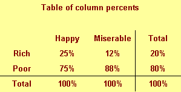
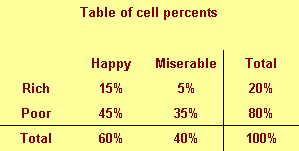
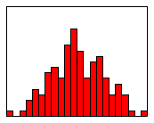
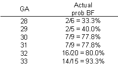

```{r echo=FALSE}
source("prelims.R", echo=FALSE)
```

### Measurement 

+ Traditional levels (scales) of measurement
	+ Nominal
	+ Ordinal
	+ Interval
	+ Ratio

+ Special cases
  + Binary data
  + Count data, rate data
  + Time-to-event

<div class="notes">

Measurement scales are an important, but controversial, categorization of the types of variables used in research. They help you decide what statistics are appropriate for your data. I don't want to get to deeply into this, but I do want to give you enough context so that you can write a decent data analysis plan for your methods section.

There are four categories: nominal, ordinal, interval, and ratio, that were first described by a psychologist, S.S. Stevens, over 80 years ago.

Nominal data is categorical, meaning you only have a small number of possible values. An additional requirement for nominal data is that order is not important. If you can re-order the list of categories without causing too much fuss, you have nominal data. Examples of nominal data include race, gender, and geographic region.

Ordinal data is also categorical, but you cannot re-arrange the list without changing things. Order is important. All Likert scale items are ordinal. Military ranks are ordinal. Education levels are ordinal, more or less, but if you make distinctions along the level of M.D. versus Ph.D., it is not. Use a bit of common sense. It works just fine for High school, some college, two year degree, four year degree, graduate/professional degree. Stages of cancer is another example.

Interval data and ratio data are two types of continuous data. Don't worry too much about the distinction between interval and ratio. It is not that important. The very important distinction is between ordinal data and interval data.

For an interval scale, the difference of one unit means the same thing when you are on the low end versus the high end of the scale. Examples of interval scales include temperature and IQ tests.

For a ratio scale, the ratio of two measurements means the same thing when you are on the low end versus the high end of the scale. Concepts such as "twice as much" are meaningful for ratio data. Ratio data also have a fixed zero point. Examples of ratio scales include birth weight, age, income.

There are three special cases worth describing.

Binary data is data that only has two possible values. Examples include yes/no responses, gender (male/female, assuming that transgender is not an issue), and correct/incorrect responses on a test. Don't bother making a distinction between nominal or ordinal data if your variable is binary. There is no way to re-order the data if there are only two values, except for the trivial case of reversing the two levels. It is best to treat binary data as a subset of nominal data.

Count data is a type of ratio data, but it is a bit unsual because it cannot include fractional or decimal values. It is also bounded below by zero. For the most part, you can treat count data as ratio data, except that linear regression does not work well for count data. Count data almost always violates the linear regression assumptions of normality and homogeneity of variance.

Time-to-event data is also a type of ratio data, but it is also a bit unusual. Time-to-event data almost always has censored values, values where the event has not occurred yet. It also is bounded below by zero. It also tends to violate the same assumptions in linear regression: normality and homogeneity.

</div>

### Ordinal verus interval controversy
+ Sums of ordinal variables are meaningless
+ Counterexample: grade point average
  + Shift from A to B versus a shift from D to F?
  + Two B's equal and A plus a C?
+ Purist versus pragmatist
+ Is a sum of Likert scale items different?
  + Unequal scalings average out?

<div class="notes">

A neagtive requirement for ordinal data is that sums computed on an ordinal scale are meaningless. You can't talk about how a private plus a sergeant is equal to two corporals, even though you might code private=1, corporal=2, sergeant=3. If sums are meaningless, then averages are meaningless as well. Any test or statistical model that uses averages is meaningless. So if your outcome is ordinal, no t-tests for you. No ANOVA and no linear regression.

I understand the concern of many researchers about this issue, but, personally, I think it is an overblown controversy. Let me talk about a case where the data is obviously ordinal, but where averages are meaningful.

The grade that you get in this, or any other class, is ordinal. You only have a finite number of values (A, B, C, D, and F) and you can't re-arrange these to put C as the first value without doing serious violence to your data.

A shift of one unit means something quite different on one end of the scale versus the other. A shift from an A down to a B is not good, but a shift from a D to an F is altogether worse.

Futhermore, sums are meaningless. You can't say that a student with two B's is equivalent to a student with an A and a C.

In spite of this, you see people reporting grade point averages with no concern at all about whether this might be an inappropriate measure. For them, assigning a 0 to F and 4 to A is perfectly reasonable.

Now that's not true for everybody. One person I used to work with commented that he would never ever hire someone who had a single F on his transcript. For him the scale was not 4, 3, 2, 1, and 0 for the five possible grades. It was 4, 3, 2, and 1 for A through D and a minus infinity for an F.

Now I would hire you if you had one or two F's on your transcript, but I can't say that my colleague was wrong.

So what do you do? In many senses, the ordinal versus interval controversy mimics the eternal battle between the purists and the pragmatists. The purists would insist that any whiff of an average for ordinal data is wrong, wrong, wrong. A pragmatist would say that it might be wrong, but it is simple and easy and provides a good enough approximation to the more complex approaches that you might need for a "proper" analysis of ordinal data.

There are shades of gray here as well. People are less likely to get upset with you if you are talking about a sum of several Likert scale items than a single Likert scale item. The distances might vary on the low end versus the high end, but when you average across multiple Likert scales, you average out those differences. A sum is also more likely to have a symmetric bell-shaped distribution, and that tends to soothe a few ruffled feathers.

</div>

### Permissible statistical summaries

+ Nominal: percentage, mode
+ Ordinal: median
+ Interval: mean, standard deviation
+ Ratio: Coefficient of variation
+ Special cases

<div class="notes">

For nominal data, there are very few numeric summaries that are meaningful. You can't compute a standard deviation for gender or an average race. About the only meaningful numeric summary for nominal data is percentages. You could compute a mode, the most frequently occurring value, but this is not used all that often.

For ordinal data, you can compute the median in addtion to percentages. You might also compute other percentiles like the quartiles. But an average is not a good option here.

You can, however, compute an average for interval data, as well as a standard deviation.

The ratio scale allows you to calculate one additional statistic, the coefficient of variance, but this is hardly worth mentioning. The coefficient of variance, if you are curious, is computed as the standard deviation divided by the mean. It is a unitless measure of spread, which is helpful at times. But quite honestly, there is almost no practical difference between interval data and ratio data.

There is a natural hierarchy to these measurements in that any statistic that can be used to summarize nominal data can also be used to summarize ordinal, interval, or ratio data. Any statistic that can be used to summarize ordinal data can also be used to summarize interval or ratio data. Finally, any statistic that can be used to summarize interval data can also be used to summarize ratio data.

</div>

### Permissible models

+ Special cases
  + Binary: Logistic regression
  + Counts: Poisson regression
  + Time-to-event data: Cox proportional hazards regression
+ Nominal: Chi-square tests, multinomial logistic regression
+ Ordinal outcome variable: Non-parametric tests, ordinal logistic regression
+ Ordinal indepdent variable" p for trend tests
+ Interval/ratio: t-tests, analysis of variance, linear regression

<div class="notes">

In addition to the permissible statistical summaries, there are permissible statistical models. Let's deal with the special cases first.

With a binary outcome, logistic regression is a model that everyone accepts as legitimate. For count data, a special type of ratio data, you should consider a Poisson regression model. And time-to-event outcomes require the use of Cox proportional hazards regression models.

Nominal outcome variables with more than two levels the choices depend strongly on whether your independent variable is continuous or categorical, and I can't cover all the possibilities. Chi-square tests are commonly used.

For an ordinal outcome variable, there are a variety of nonparametric tests that you can choose from. It depends on what your independent variable looks like.

There are some specialized procedures, multinomial logistic regression for a nominal outcome variable with more two levels and ordinal logistic regression for an ordinal outcome variable. A description of these two models is beyond the scope of this class.

An interesting case is when the independent variable is ordinal. There are a variety of p-for-trend tests that you can choose from. A description of this approach is beyond the scope of this class. I do apologize, but I'm already covering way too much material.

for an interval or ratio level outcome variable, the t-test or analysis of variance is sometimes used, but I like the linear regression model because it handles so many different cases.

</div>

### First break

+ What have you learned?
  + Scales of measurement
  + Ordinal verus interval controversy
+ What's coming next?
  + Descriptive statistics
  + Linear regression

### Steps in your data analysis

+ Quality check of data
+ Description of sample
+ Test of hypotheses/research questions
+ Additional exploratory analyses

<div class="notes">

Your data analysis should start with a quality check. This can be simple or elaborate depending on the source of your data. THen you need to provide descriptive statistics that help characterize the population you are sampling from. Then you need to test your research hypothesis or address your research questions. There may be additional exploratory analyses.

</div>

***
### Quality check of your data (1/2)
+ Completeness of data collection
+ Review for responses that are ambiguous, out of range, etc
+ Edit responses as needed
+ Check response frequencies
	+ Combine smaller categories, if needed

<div class="notes">

Before you do anything else, make sure that you are comfortable with the quality of your data. How much effort you spend here is a judgement call. Most people don't spend enough time, but it is possible to get so obsessed about quality that you never get your regular analysis started.

Look for responses that clearly don't belong. I attended a talk where they were talking about data values that were obviously so bad that they represented science fiction. Such as an age which is reminiscent of the Yoda quote "when 900 years old you reach, look as good you will not."

Some errors will be easily correctable. If the only permissible values are on a 1 through 5 Likert scale with 9 or no response, an 11 is easily changed to 1. For others, though, you should go back to the original records, if possible, to fix things. Don't assume too much, as a missing value code may do less damage than an incorrectly corrected value. Please document whatever choices you make, and be consistent about your choices.

For important categorical variables, look at the frequency counts for each category. If these are small, consider combining several categories together. So you may not have enough data to represent individual minority groups, so you would combine them with single to represent an overall category, non-white, to compare with white.

</div>

### Quality check of your data (2/2)

+ Zero (or near-zero) variation
+ Missing value count
+ List five five rows, last five rows
+ Correlations

<div class="notes">

There are some descriptive statistics that you should run just for your own benefit. Check the minimum and maximum values for every numeric variable in your data set. I received a data set with a bunch of 5 point Likert scale items and for most of the variables, the minimum was 1, but the maximum was 33 or 55. Guess what happened?

Get a missing value count and monitor it closely. See if there are odd patterns, such as the missing values declining over time but then jumping back up at the end. It could be normal, but it could be an indication of a problem.

When you get correlations, look for unexpected patterns, such as a negative correlation where a positive one was expected. It could be okay, or it could mean that the scales on a Likert scale got switched around halfway through the survey due to a misprint.

In some data sets, you may find that certain variables are constant, or nearly constant. I had a data set with 82 white mothers and 2 non-white mothers. There is no point including race as a covariate in any statistical models when the data is this close to constant.

Track missing value counts very carefully. In complex mutlivariate models, these missing values can accumulate to the point where you end up losing 50% or more of your data. How best to handle missing values is beyond the scope of this course, but no matter what approach you use, please document it carefully.

Always take a peek at the first five and the last five rows of your data set. If these do not align, then something changed during the import, perhaps a row of data with one too few or one too many variables. Also check to see if the last row or last few rows of your data set are entirely missing values.

</div>

### Data reduction
* Check composite scores
  + Check Cronbach's alpha
  + Examine leaving out single items
  + Factor analysis, Structural Equations Modeling

<div class="notes">

If you have scales that are a composite score of multiple individual questions, you might want to look at a reliability coefficent like Cronbach's alpha. Some people advocate computing this statistic on a series of scores with individual variables deleted. If you get a sharp jump in alpha after a particular variable is deleted, this may indicate that, for your particular population, perhaps, a simplier composite without the one variable might be needed. You might consider running an exploratory factor analysis to see if the composite score still has a justifiable set of individual components. I, personally, do not like the idea of tampering with composite scores that were developed by others.

</div>

### Data transformations
* Ideal - selected a priori
  + Sometimes based on precedent
  + Sometimes motivated by theory
  + Sometimes based on empirical findings
+ Don't bother if your range is narrow
  + max/min <= 3
+ Log transformation

<div class="notes">

For some of your continuous variables, you may want to consider transformations. This is the use of a common mathematical function like the square root or the logarithm, to improve some of the properties of your variable. Sometimes this is based on precedent. A transformation has been found to be helpful for this sort of data in the past and has come into common use. Sometimes, you can derive a transformation from an understanding of the theory behind the measurement. Most often, though, transformations are justified on the basis of empirical findings associated with your own data set.

Generally, transformations are used most often for data that is bounded below by zero and with no obvious upper bound. This lower bound constrains the data on the low end, leading to skewness, unequal variances, and other problems.

You should not bother with transformations if your variable has a narrow range (if the maximum divided by the minimum is less than 3). It is the nonlinear features of the transformation, the stretching and squeezing of data in certain regions, that has the possbility of benefit, and a narrow range means that there is not sufficient stretching versus squeezing to have any important impact.

The log transformation is a commonly used transformation that has several interesting features.

</div>

### Log transformation


<div class="notes">

The logarithm function squeezes together big data values (anything larger than 1). The bigger the data value, the more the squeezing. The graph shown here illustrates this effect. The first two values are 2.0 and 2.2. Their logarithms, 0.69 and 0.79 are much closer. The second two values, 2.6 and 2.8, are squeezed even more. Their logarithms are 0.96 and 1.03.

</div>

### Log transformation


<div class="notes">

The logarithm also stretches small values apart (values less than 1). The smaller the values the more the stretching. The values of 0.4 and 0.45 have logarithms (-0.92 and -0.80) that are further apart. The values of 0.20 and 0.25 are stretched even further. Their logarithms are -1.61 and -1.39, respectively.

</div>

### Log transformation


<div class="notes">

If your data are skewed to the right, a log transformation can sometimes produce a data set that is closer to symmetric. Recall that in a skewed right distribution, the left tail (the smaller values) is tightly packed together and the right tail (the larger values) is widely spread apart. The logarithm will squeeze the right tail of the distribution and stretch the left tail, which produces a greater degree of symmetry. If the data are symmetric or skewed to the left, a log transformation could actually make things worse. Also, a log transformation is unlikely to be effective if the data has a narrow range (if the largest value is not more than three times bigger than the smallest value).

</div>

### Log transformation fixes
+ Skewness
+ Outliers
+ Unequal variation
+ Multiplicative models
  + log(ab) = log(a)+log(b)

<div class="notes">

Outliers: If your data has outliers on the high end, a log transformation can sometimes help. The squeezing of large values might pull that outlier back in closer to the rest of the data. If your data has outliers on the low end, the log transformation might actually make the outlier worse, since it stretches small values.

Unequal variation: Many statistical procedures require that all of your subject groups have comparable variation. If you data has unequal variation, then the some of your tests and confidence intervals may be invalid. A log transformation can help with certain types of unequal variation.

A common pattern of unequal variation is when the groups with the large means also tend to have large standard deviations. Consider housing prices in several different neighborhoods. In one part of town, houses might be cheap, and sell for 60 to 80 thousand dollars. In a different neighborhood, houses might sell for 120 to 180 thousand dollars. And in the snooty part of town, houses might sell for 400 to 600 thousand dollars. Notice that as the neighborhoods got more expensive, the range of prices got wider. This is an example of data where groups with large means tend to have large standard deviations.

With this pattern of variation, the log transformation can equalize the variation. The log transformation will squeeze the groups with the larger standard deviations more than it will squeeze the groups with the smaller standard deviations. The log transformation is especially effective when the size of a group's standard deviation is directly proportional to the size of its mean.

Multiplicative models

There are two common statistical models, additive and multiplicative. An additive model assumes that factors that change your outcome measure, change it by addition or subtraction. An example of an additive model would when we increase the number of mail order catalogs sent out by 1,000, and that adds an extra $5,000 in sales.

A multiplicative model assumes that factors that change your outcome measure, change it by multiplication or division. An example of a multiplicative model woud be when an inch of rain takes half of the pollen out of the air.

In an additive model, the changes that we see are the same size, regardless of whether we are on the high end or the low end of the scale. Extra catalogs add the same amount to our sales regardless of whether our sales are big or small. In a multiplicative model, the changes we see are bigger at the high end of the scale than at the low end. An inch of rain takes a lot of pollen out on a high pollen day but proportionately less pollen out on a low pollen day.

If you remember your high school algebra, you'll recall that the logarithm of a product is equal to the sum of the logarithms.

Therefore, a logarithm converts multiplication/division into addition/subtraction. Another way to think about this in a multiplicative model, large values imply large changes and small values imply small changes. The stretching and squeezing of the logarithm levels out the changes.

When should you consider a log transformation?

</div>

### When should you use the log transformation?
+ Data bounded below by zero.
  + Mean < Standard deviation
+ Ratio data
+ Max > 3*Min

<div class="notes">

There are several situations where a log transformation should be given special consideration.

Is your data bounded below by zero? When your data are bounded below by zero, you often have problems with skewness. The bound of zero prevents outliers on the low end, and constrains the left tail of the distribution to be tightly packed. Also groups with means close to zero are more constrained (hence less variable) than groups with means far away from zero.

It does matter how close you are to zero. If your mean is within a standard deviation or two of zero, then expect some skewness. After all the bell shaped curve which speads out about three standard deviations on either side would crash into zero and cause a traffic jam in the left tail.

Is your data defined as a ratio? Ratios tend to be skewed by their very nature. They also tend to have models that are multiplicative.

Is the largest value in your data more than three times larger than the smallest value? The relative stretching and squeezing of the logarithm only has an impact if your data has a wide range. If the maximum of your data is not at least three times as big as your minimum, then the logarithm can't squeeze and stretch your data enough to have any useful impact.

</div>

### Log transformation


<div class="notes">

The boxplots below show the original (untransformed) data for the 15 patients with no functional alleles. The graph also shows the log transformed data. Notice that the untransformed data shows quite a bit of skewness. The lower whisker and the lower half of the box are much packed tightly, while the upper whisker and the upper half of the box are spread widely.

The log transformed data, while not perfectly symmetric, does tend to have a better balance between the lower half and the upper half of the distribution.

</div>

### Log transformation


<div class="notes">

Here's some data where the left hand side represents the original data. Even though it doesn't look that extreme the largest value is 6.9 standard deviations above the mean. That's because most of the data are scrunched together at the bottom. They deviate very little, keeping the standard deviation small.

On the right hand side, you have the log transformed data. It is not perfect, and perhaps there is now an outlier on the low end. Nevertheless, the worst outlier is still within 4 standard deviations of the mean. The influence of outliers is much less extreme with the log transformed data.

</div>

### Standard deviations, untransformed


<div class="notes">

When we compute standard deviations for the patients with no functional alleles and the patients with one or more functional alleles, we see that the former group has a much larger standard deviation. This is not too surprising. The patients with no functional alleles are further from the lower bound and thus have much more room to vary.

</div>

### Standard deviations, log transformed


<div class="notes">

After a log transformation, the standard deviations are much closer.

</div>

### Log transformation, summary
+ Removes skewness
+ Removes outliers
+ Stabilizes variances
+ Does not always work
+ Best when
  + Data bounded below by zero
  + Mean < Standard deviation
  + Max/Min > 3
  
<div class="notes">

This is important, so it is worth reviewing. The log transformation is a miracle transformation. It stretches the small values and squeezes the large value. This can sometimes remove the impact of skewness and outliers. It can sometimes stablize your variances. But it doesn't always work, and can sometimes cause more problems than it can solve.

The log transformation is best when your data is bounded below by zero, your mean is smaller than your standard deviation, and the relative range (the maximum value in your data set divided by the minimum value) is greater than 3.

</div>

### Descriptive statistics
+ Part of every quantitative study
+ Table 1, overall summaries
  + Outcomes and covariates
  + Means and standard deviations
  + Percentages (always show denominator)
+ Key subgroup comparisons
  + Crosstabulations
  + Means/standard deviations by subgroup

<div class="notes">

Your descriptive statistics should be a part of any research study. This is done in almost every research paper and it almost always appears as the first table in your paper. So we sometimes call these "Table 1 statistics."

Your descriptive statistics should include your outcome variables, most certainly, but also your covariates. Covariates are variables that are not of direct interest but which can potentially influence your outcome anyway. This includes, in any human study, things like age and gender.

if your data are continuous (interval or ratio scale), summarize your data with a mean and standard deviation. Some people advocate a different summary if your data is skewed, using the median and the range, for example, instead of the mean and standard deviation. There is no consensus on how much the data has to be skewed, or even if you need to switch at all. I, for one, see the mean and standard deviation as useful summaries, even for skewed data, but I am in a minority on this.

For categorical outcomes summarize using a percentage. Always show what your numerator and denominator would be if you report percentages.

If you want to compare across key demographic groups, use crosstabulations for categorical outcomes and means/standard deviations by subgroup for continuous outcomes.

Let me talk a bit about crosstabulations because these are almost always done poorly.

</div>

### Rules for crosstabulations

+ Never display multiple statistics
+ Place treatment/exposure categories in the rows
+ Summarize using row percentages
+ Many rows, not many columns
+ Round liberally.

<div class="notes">

When you are deciding how to display two by two (or larger) tables, you have a variety of ways to do this. No way is correct all the time, and some of choices reflect subjective judgment. But here are some rules I use.

Never display more than one type of number in a table. Statistical software like SPSS can produce counts, row percents, column percents, cell percents, expected counts, residuals, and/or cell contribution to chi-squared values. At one time or another you might want to use each of these statistics, but never all at one time. Two or more numbers in a table causes confusion and makes your tables harder to interpret.

Present a single summary statistic in the table if at all possible. If you need to display two summary statistics (for example, both counts and row percentages), then place the counts in one table and the row percentages in a different table. If you have to fit them in the same table, place the two numbers side by side with the less important number appearing second and in parentheses For example, 54% (257).

Row percentages are usually best. Row percentages are the percentages you compute by dividing each count by the row total. Row percentages place the comparison between two numbers within a single column, so that one number is directly beneath the number you want to compare it to. This is usually better than column percents, where the numbers you want to compare are side by side. If you find that column percentages make more sense. Consider swapping the rows and columns.

If you find that cell percentages make the most sense, consider creating composite categories that combine the row and column categories. Cell percentages are the percentages that you get when you divide each cell count by the overall total. When cell percents are interesting, it usually means that you are interested in the four distinct categories in your two by two table. For example, you are interested in seeing what fraction of job candidates are white males, rather than seeing how the probability of being male influences the probability of being white. For this type of data, treat it as a single categorical variable with four levels (white males, white females, black males, black females) rather than two categorical variables with each having two levels (black/white, male/female).

Place the treatment/exposure variable as rows and outcome variable as columns. This relates to the above item. You usually are interested in the probability of an outcome like death or disease, and you are interested in how this probability changes when the treatment or exposure changes. Arranging the table thusly and using row percents usually gets you the comparison you are interested in.

If one variable has a lot more levels than the other variable, place that variable in rows. A table that is tall and thin is usually easier to read than a table that is short and wide. It is easier to scroll up and down rather than left and right. For a really large number of levels, you might have to print your table on two or more pages. Usually it is a lot easier to align these pages if the table is tall and thin. A short wide table that is split on two or more pages is often a disaster.

Whenever you report percentages, always round. A change on the order of tenths of a percent are almost never interesting or important. Displaying that tenth of a percent makes it harder to manipulate the numbers to see the big picture.

Don't worry about whether your percentages add up to 99% or 101%. First of all, it can't happen with a two by two table unless you round incorrectly. For a larger table, it can happen, but your audience is sophisticated enough to understand why this is the case. No one, for example, is going to be upset when 33% plus 33% plus 33% adds up to less than 100%.

When in doubt, write out your table several different ways. Pick out the one that gives the clearest picture of what is really happening. Don't rely on the first draft of your table, just like you would never rely on the first draft of your writing.

</div>
### Table of percentages


<div class="notes">

A simple fictitious example will help illustrate these points.

We classify people by their income (rich/poor) and also by their attitude (happy/miserable). The first row shows 30 rich happy people and 10 rich miserable people, for a total of 40 rich people in our sample. The second row shows 90 poor happy people and 70 poor miserable people, for a toal of 160 poor people. The third row shows a total of 120 happy people and 80 miserable people. The last number in the lower right hand corner of the table is 200 the total across everyone rich and poor, happy and miserable.

</div>
  
### Table of column percentages



<div class="notes">

This figure shows column percentages. We compute this by dividing each number by the column total.

We see for example in the first column that only 25% of all happy people are rich. The remaining 75% of happy people are poor. The total percentage is 100% in the first column (and in every other column). That's how you can tell that these numbers are column percentages. The second column shows that 12% of all miserable people are rich, 88% are poor, adding to a column total of 100%. The last column shows that 20% of our sample is rich, irregardless of their mood and the 80% of our sample is poor. 

</div>
  
### Table of row percentages


<div class="notes">

This figure shows row percentages. We compute this by dividing each number by the row total.

We see, for example that 75% of rich people are happy and only 25% are miserable. This is a different conditional probability, the probability of being happy given that you are rich.

Notice the distinction between the two probabilities. Only a few happy people are rich, but most rich people are happy.

Row percentages are percentages that add up to 100 within each row.

</div>
  
### Table of cell percentages



<div class="notes">

This figure shows cell percentages. We compute this by dividing each number by the grand total. Each percentage represents the probability of having two conditions. The first row tells us that there is a 15% chance of being rich and happy and a 5% probability of being rich and poor. There is a 45% chance that someone is poor and happy and a 35% chance that someone is poor and miserable.

The total percentages don't add up until you get to the lower right hand corner. That's how you can tell that these are cell percentages.

</div>
  
### Combining two numbers


<div class="notes">

The table above shows a good format for combining two numbers in a single table. Put the more important number first (and the more important number is almost always a percentage) and the less important number goes to the right and in parentheses.

</div>
  
### Table of percentages


<div class="notes">

This is an alternate way of displaying cell percentages.

</div>
  
### Table of percentages


<div class="notes">

If we had a six categories for attitude rather than just two, we might arrange the table differently.

Notice that this table would not require any sideways scrolling.

</div>

### Rules for crosstabulations
+ Never display multiple statistics
+ Place treatment/exposure categories in the rows
+ Summarize using row percentages
+ Many rows, not many columns
+ Round liberally.

<div class="notes">

This is imporant, so here are those rules again.

Never display more than one type of number in a table.

Place the treatment/exposure variable as rows and outcome variable as columns.

Row percentages are usually best.

If one variable has a lot more levels than the other variable, place that variable in rows.

Whenever you report percentages, always round.

Don't worry about whether your percentages add up to 99% or 101%.

When in doubt, write out your table several different ways.

</div>

### Graphs
+ Overall summaries
  + Histograms for continuous data
  + Bar/pie charts for categorical data
+ Assessing relationships
  + Side by side pie/bar charts
  + Boxplots
  + Scatterplots
  
<div class="notes">

There are a gazillion different graphs that you can present in a descriptive analysis, but here are the most common choices.

To display information about a single variable, use a histogram for anything continuous and a bar or pie chart for anything categorical.

If you want to display the relationship between two variables, use side by side pie or bar charts if both variables are categorical, boxplots if you have a mix, and scatterplots if both variables are continuous.

</div>
  
### Histogram examples (1 of 3)



<div class="notes">

I shouldn't have to describe this to you, but here is an example of a histrogram for data that roughly follows a bell shaped curve pattern.

</div>

### Histogram examples (2 of 3)


<div class="notes">

Here is a histogram for data that is skewed to the right.

</div>

### Histogram examples (3 of 3)


<div class="notes">

Here is a histogram for data that is bimodal.

</div>

### Side by side pie/bar charts

+ Pies and bars only work well for 2 or 3 categories
  + Pacman charts
+ No good graphs for more categories
+ Avoid cheap 3D effects

<div class="notes">


</div>

### A very busy pie chart


<div class="notes">

This image was found on Wikimedia Commons and has been placed in the public domain.

</div>

### A bar chart


<div class="notes">

Here's a bar chart showing the number of unaccompanied minors apprehended by the US Border Patrol for each year from 2013 through 2018/ The bar is highest in 2014 and almost as high in 2016. The bar is divided into four colors representing the country of origin: Mexico, El Salvador, Guatemala, and Honduras. The relative share of minors from Mexico has declined over time. 

This bar chart is not terribly bad. I'd rather see a table, personally, but I can't complain.

This image was found on Wikimedia Commons and has been placed in the public domain.

</div>

### A very busy bar chart


<div class="notes">

This bar chart, however, is almost impossible to read. It would help if they did just two or three countries and then an "other" category.

This image was found on Wikimedia Commons and has is licensed under the creative commons share alike license. It is available at https://commons.wikimedia.org/wiki/File:Top_500_Computers_Chart.svg

</div>

### Boxplot


<div class="notes">

The box plot is a graphical display of a five number summary. Sometimes the box plot is also known as a box and whiskers plot. It is very useful for examining relationships between a categorical variable and a continuous variable.

Here are the four steps you follow to draw a boxplot.

Draw a box from the 25th to the 75th percentile.

Split the box with a line at the median.

Draw a thin lines (whisker) from the 75th percentile up to the maximum value.

Draw another thin line from the 25th percentile down to the minimum value.

The length of the box in a box plot, i.e., the distance between the 25th and 75th percentiles, is known as the interquartile range. You can use this box length to detect outliers. If any whisker is more than 1.5 times as long as the length of the box, then we have evidence of outliers. A common variation on the box plot is to draw the whisker to the value which is just shy of 1.5 box lengths away, and highlight each individual data point more than 1.5 box lengths away.

The boxplot is useful for comparing the distributions of two different groups. If the median in one box exceeds the end of the box of the other group, that is evidence of a "large" discrepancy between the two groups. What passes as the median for one group would actually be the 25th or 75th percentile of the other group.

Just about any statistical software program (SAS, SPSS, Stata, R, etc.) can produce boxplots and you can find code to produce boxplots in many programming languages.

Notice that these boxplots are horizontal rather than vertical. The main reason to turn these 90 degrees is if your labels and axes fit better this way.

</div>

### Scatterplot


<div class="notes">

This is a scatterplot, a useful way to summarize the association between two continuous variables.

Often a trend line or a smoothing curve helps. This seems to be the case when you have a lot of data, meaning a lot of overprinting, and the data is fairly noisy.

</div>

### Second break

+ What have you learned?
  + Descriptive statistics
+ What's coming next?
  + Linear regression
  
<div class="notes">

That's a lot to digest. There is more good stuff coming. The linear regression model is one of the best statistical models out there to test a hypothesis involving continuous outcome variables.

</div>

### Linear regression
+ Continuous outcome variable
+ Very flexible
  + Either categorical or continuous independent variables
  + Multiple variables (risk adjustment)
  + Interactions
+ Alternatives
  + t-test
  + Analysis of variance

<div class="notes">

The linear regression model is useful for a hypothesis involving a continuous outcome variable. Continuous means interval or ratio scale. Some people use linear regression for an ordinal outcome, and I'm fine with that, but you will get a big fight at peer review time if you try this.

The linear regression model is very flexible. It can accommodate either a categorical or a continuous independent variable. You can use multiple independent variables, which allows you to do risk adjustments and it also lets you examine interactions.

I'll talk about two other approaches used commonly, the t-test and analysis of variance.

</div>

### Linear regression

+ High school algebra
  + Y = m X + b
  + m = Δy / Δx
+ The slope represents the estimated average change in Y when X increases by one unit.
+ The intercept represents the estimated average value of Y when X equals zero.

<div class="notes">

When I ask most people to remember their high school algebra class, I get a mixture of reactions. Most recoil in horror. About one in every four people say they liked that class. Personally, I thought that algebra, and all the other math classes I took were great because they didn't require writing a term paper.

One formula in algebra that most people can recall is the formula for a straight line. Actually, there are several different formulas, but the one that most people cite is

Y = m X + b

where m represents the slope, and b represents the y-intercept (we'll call it just the intercept here). They can also sometimes remember the formula for the slope:

m = Δy / Δx

In English, we would say that this is the change in y divided by the change in x.

In linear regression, we use a straight linear to estimate a trend in data. We can't always draw a straight line that passes through every data point, but we can find a line that "comes close" to most of the data. This line is an estimate, and we interpret the slope and the intercept of this line as follows:

The slope represents the estimated average change in Y when X increases by one unit.

The intercept represents the estimated average value of Y when X equals zero.

Be cautious with your interpretation of the intercept. Sometimes the value X=0 is impossible, implausible, or represents a dangerous extrapolation outside the range of the data.

</div>

### Age vs duration - graph


<div class="notes">

The graph shown below represents the relationship between mother's age and the duration of breast feeding in a research study on breast feeding in pre-term infants.

</div>

### Age vs duration - output


<div class="notes">

The regression coefficients are shown here. The intercept, 6, is represented the estimated average duration of breast feeding for a mother that is zero years old. This is an impossible value, so the interpretation is not useful. What is useful, is the interpretation of the slope.

Notice that a 20 year old mother has a duration of 13 weeks. A 40 year old mother has a duration of 21 weeks.

Calculate 21-13 divided by 40-20 equals 8 divided by 20 equals 0.4. The estimated average duration of breast feeding increases by 0.4 weeks for every extra year in the mother's age.

</div>


### Treatment vs duration


<div class="notes">

When X is categorical, the interpretation changes somewhat. Let's look at the simplest situation, a binary variable. A binary variable can have only two possible categories. Some examples are live/dead, treatment/control, diseased/healthy, male/female. We need to assign number codes to the categories. Most people assign the codes 1 and 2, but it is actually better to assign the codes 0 and 1.

In a study of breast feeding, we have a treatment group and a control group. Let us label the treatment group as 1 and the control group as 0. The outcome variable is the age when breast feeding stopped.

</div>

### Treatment vs duration


<div class="notes">

In this situation, the intercept, 13, represents the average duration for the control group. 

Calculate 20-13 divided by 1-0.

The slope is 7, which is the change in the average duration when we move from the control group to the treatment group.

When we represent a binary variable using 0-1 coding, the slope represents the estimated average change in Y when you switch from one group to the other.

The intercept represents the estimated average value of Y for the group coded as zero. 

The intercept represents the average duration of breast feeding for the NG tube group. We see that the average duration is 20 weeks for the NG tube group. The (FEED_TYP=1) term is an estimate of how much the average duration changes when we move from the NG tube group to the bottle group. We see that the bottle group has an average duration that is 7 weeks shorter.

Shown below is a table of means from the general linear model.

We see that the difference between the two means is roughly 7 weeks, which confirms the results shown previously.

The previous model was a crude model. We see a seven week difference between the two groups, but could some of all of this difference be due to the fact that the NG tube group had older mothers? To answer this, we need to fit an adjusted model.

</div>

### Adjusted model
+ Crude model
  + One independent variable
+ Adjusted model
  + More than one independent variable
+ Interpretation of slope
  + Estimated average change in Y
  + When X1 changes by one unit
  + And X2 is held  contant.

<div class="notes">

There are two types of models, crude models and adjusted models. A crude model looks at how a single factor affects your outcome measure and ignores potential covariates. An adjusted model incorporates these potential covariaties. Start with a crude model. It's simpler and it helps you to get a quick overview of how things are panning out. Then continue by making adjustments for important confounders.

The adjusted model includes two or more independent variables. The interpretation of the slope changes when you have a second independent variable.

It still represents the estimated average change in Y when X (in this case X1) increases by one unit. But there is an extra provision. It is the estimated change when X2 is held constant.

</div>

### Adjusted model


<div class="notes">

The p-value for feeding group is .009, which is still significant, even after adjusting for the effect of mother's age.

This table shows that the effect of bottle feeding is to decrease duration of breast feeding by about six weeks, after adjusting for mother's age. Each year that a mother is older increase the duration of breast feeding by a quarter of a week.

A previous descriptive analysis of this data revealed that the average age for mothers in the treatment group is 29 years and the average age for mothers in the control group is 25 years. When you see a discrepancy like this in an important covariate, you need to assess whether the four year gap in average ages could account for part or all of the effect of the treatment group.

This analysis shows that the four year gap only accounts for a small portion of the difference. Since each year of age changes the duration by a quarter week, this means that the difference between mother's ages acounts for just one week in the 7 week difference we saw in the crude model.

</div>

### Some alternatives
+ t-test (two sample t-test)
  + Continuous outcome
  + Catregorical independent variable with two levels
+ Disadvantages of the t-test
  + No risk adjustment or interactions
+ Analysis of variance
  + Continuous outcome
  + Categorical independent variable with three or more levels
  + Can use more than one categorical independent variable
+ Analysis of covariance
  + Second indepdent variable is continuous
  
<div class="notes">

Some people prefer an alternative to the linear regression model in certain special cases. If you have a continuous outcome variable and a single indepdent variable with exactly two levels, you can select the t-test as your statistical model. 

The t-test does not generalize well. It can't do risk adjustments and it can not model an interaction of two independent variables.

If you have three or more levels, use analysis of variance instead. It allows for adjustment for second or third categorical independent variable, and can estimate interactions.

if you want to add a second independent variable and that variable is continuous, you would be using an analysis of covariance instead.

</div>

### Continuous outcomes - summary
+ Linear regression
  + Continuous outcome
  + Can provide risk adjustments
+ Two-sample t-test
+ Analysis of variance
+ Analysis of covariance

<div class="notes">

In summary, the linear regression model is used with a continuous outcome variable. It provides risk adjustments, and I showed a simple example. It can also model the interaction of two or more independent variables.

Some alternatives you might consider with a continuous independent variable are the t-test, analysis of variance, and analysis of covariance.

</div>

### Third break
+ What have you learned?
  + Linear regression
+ What's coming next?
  + Logistic regression
  + Poisson regression
  
<div class="notes">

I love linear regression models and thought it would be helpful to spend a bit of time on a real example. In the next video, I will talk about logistic and Poisson regression.

</div>
  
### Logistic regression
+ Binary outcome variable
+ Either categorical or continuous independent variables
+ Multiple variables (risk adjustment)
+ Interactions

<div class="notes">

The logistic regression model is a model that uses a binary (two possible values) outcome variable. Examples of a binary variable are mortality (live/dead), and morbidity (healthy/diseased). Sometimes you might take a continuous outcome and convert it into a binary outcome. For example, you might be interested in the length of stay in the hospital for mothers during an unremarkable delivery. A binary outcome might compare mothers who were discharged within 48 hours versus mothers discharged more than 48 hours.

The covariates in a logistic regression model represent variables that might be associated with the outcome variable. Covariates can be either continuous or categorical variables.

For binary outcomes, you might find it helpful to code the variable using indicator variables. An indicator variable equals either zero or one. Use the value of one to represent the presence of a condition and zero to represent absence of that condition. As an example, let 1=diseased, 0=healthy.

Indicator variables have many nice mathematical properties. One simple property is that the average of an indicator variable equals the observed probability in your data of the specific condition for that variable.

A logistic regression model examines the relationship between one or more independent variable and the log odds of your binary outcome variable. Log odds seem like a complex way to describe your data, but when you are dealing with probabilities, this approach leads to the simplest description of your data that is consistent with the rules of probability.

</div>

### A linear model for probability (1/2)


<div class="notes">

Let's consider an artificial data example where we collect data on the gestational age of infants (GA), which is a continuous variable, and the probability that these infants will be breast feeding at discharge from the hospital (BF), which is a binary variable. We expect an increasing trend in the probability of BF as GA increases. Premature infants are usually sicker and they have to stay in the hospital longer. Both of these present obstacles to BF.

A linear model for probability

A linear model would presume that the probability of BF increases as a linear function of GA. You can represent a linear function algebraically as

prob BF = a + b*GA

This means that each unit increase in GA would add b percentage points to the probability of BF. The table shown below gives an example of a linear function.

This table represents the linear function

prob BF = 4 + 2*GA

which means that you can get the probability of BF by doubling GA and adding 4. So an infant with a gestational age of 30 would have a probability of 4+2*30 = 64.

A simple interpretation of this model is that each additional week of GA adds an extra 2% to the probability of BF. We could call this an additive probability model.

</div>

### A linear model for probability (2/2)


<div class="notes">

I'm not an expert on BF; what little experience I've had with the topic occurred over 40 years ago. But I do know that an additive probability model tends to have problems when you get probabilities close to 0% or 100%. Let's change the linear model slightly to the following:

prob BF = 4 + 3*GA

This model would produce the following table of probabilities.

You may find it difficult to explain what a probability of 106% means. This is a reason to avoid using a additive model for estimating probabilities. In particular, try to avoid using an additive model unless you have good reason to expect that all of your estimated probabilities will be between 20% and 80%.

</div>

### A multiplicative model for probability


<div class="notes">

It's worthwhile to consider a different model here, a multiplicative model for probability, even though it suffers from the same problems as the additive model.

In a multiplicative model, you change the probabilities by multiplying rather than adding. Here's a simple example.

In this example, each extra week of GA produces a tripling in the probability of BF. Contrast this to the linear models shown above, where each extra week of GA adds 2% or 3% to the probability of BF.

A multiplicative model can't produce any probabilities less than 0%, but it's pretty easy to get a probability bigger than 100%. A multiplicative model for probability is actually quite attractive, as long as you have good reason to expect that all of the probabilities are small, say less than 20%.

</div>

### The relationship between odds and probability
+ Usually only seen in gambling contexts
+ Sometimes ambiguous
  + Odds in favor versus odds against
+ Odds = Prob / (1-Prob)
+ Prob = Odds / (1+Odds)

<div class="notes">

Another approach is to try to model the odds rather than the probability of BF. You see odds mentioned quite frequently in gambling contexts. If the odds are three to one in favor of your favorite football team, that means you would expect a win to occur about three times as often as a loss. If the odds are four to one against your team, you would expect a loss to occur about four times as often as a win.

You need to be careful with odds. Sometimes the odds represent the odds in favor of winning and sometimes they represent the odds against winning. Usually it is pretty clear from the context. When you are told that your odds of winning the lottery are a million to one, you know that this means that you would expect to having a losing ticket about a million times more often than you would expect to hit the jackpot.

It's easy to convert odds into probabilities and vice versa. With odds of three to one in favor, you would expect to see roughly three wins and only one loss out of every four attempts. In other words, your probability for winning is 0.75.

If you expect the probability of winning to be 20%, you would expect to see roughly one win and four losses out of every five attempts. In other words, your odds are 4 to 1 against.

The formulas for conversion are

odds = prob / (1-prob)

and

prob = odds / (1+odds).

In medicine and epidemiology, when an event is less likely to happen and more likely not to happen, we represent the odds as a value less than one. So odds of four to one against an event would be represented by the fraction 1/4 or 0.25. When an event is more likely to happen than not, we represent the odds as a value greater than one. So odds of three to one in favor of an event would be represented simply as an odds of 3. With this convention, odds are bounded below by zero, but have no upper bound.

</div>

### A multiplicative odds model


<div class="notes">

Let's consider a multiplicative model for the odds (not the probability) of BF.

This model implies that each additional week of GA triples the odds of BF. A multiplicative model for odds is nice because it can't produce any meaningless estimates.

It's interesting to look at how the logarithm of the odds behave.

Notice that an extra week of GA adds 1.1 units to the log odds. So you can describe this model as linear (additive) in the log odds. When you run a logistic regression model in SPSS or other statistical software, it uses a model just like this, a model that is linear on the log odds scale. This may not seem too important now, but when you look at the output, you need to remember that SPSS presents all of the results in terms of log odds. If you want to see results in terms of probabilities instead of logs, you have to transform your results.

Let's look at how the probabilities behave in this model.

Notice that even when the odds get as large as 27 to 1, the probability still stays below 100%. Also notice that the probabilities change in neither an additive nor a multiplicative fashion.

</div>

### Linearity on log-odds scale


<div class="notes">

If you take a logarithm of these odds, you will notice an interesting pattern. Each year of gestational age adds 1.1 to the log odds. The geeks will explain this as saying that a logistic regression is linear on the log odds scale.

</div>

### The S-shaped logistic curve (1/2)


<div class="notes">

You can also convert the odds into probabilities. Remember the formula? The probability of an events is the odds divided by 1 plus the odds.

</div>

### The S-shaped logistic curve (2/2)


<div class="notes">

The probabilities follow an S-shaped curve that is characteristic of all logistic regression models. The curve levels off at zero on one side and at one on the other side. This curve ensures that the estimated probabilities are always between 0% and 100%.

</div>

### An example of a log odds model with real data (1/2)



<div class="notes">

Here are the results of a logistic regresion model with real data. 

</div>

### An example of a log odds model with real data (2/2)


<div class="notes">

There are other approaches that also work well for this type of data, such as a probit model, that I won't discuss here. But I did want to show you what the data relating GA and BF really looks like.

I've simplified this data set by removing some of the extreme gestational ages. The estimated logistic regression model is

log odds = -16.72 + 0.577*GA

The table below shows the predicted log odds, and the calculations needed to transform this estimate back into predicted probabilities.

Let's examine these calculations for GA = 30. The predicted log odds would be

log odds = -16.72 + 0.577*30 = 0.59

Convert from log odds to odds by exponentiating.

odds = exp(0.59) = 1.80

And finally, convert from odds back into probability.

prob = 1.80 / (1+1.80) = 0.643

The predicted probability of 64.3% is reasonably close to the true probability (77.8%).

You might also want to take note of the predicted odds. Notice that the ratio of any odds to the odds in the next row is 1.78. For example,

3.20/1.80 = 1.78

5.70/3.20 = 1.78

It's not a coincidence that you get the same value when you exponentiate the slope term in the log odds equation.

exp(0.59) = 1.78

This is a general property of the logistic model. The slope term in a logistic regression model represents the log of the odds ratio representing the increase (decrease) in risk as the independent variable increases by one unit.

</div>

### Model computations
+ log odds = -16.72 + 0.577*GA
+ Example: GA=30, estimated probability = 64.3%
  + log odds = -16.72 + 0.577*30 = 0.59
  + odds = exp(0.59) = 1.80
  + prob = 1.80 / (1+1.80) = 0.643
+ GS=31
  + log odds = 1.16, odds = 3.20, prob = 76.2%
+ GS=32
  + log odds = 1.74, odds = 5.70, prob = 85.1%
+ Constant odds ratio
  + 3.20 / 1.80 = 1.78
  + 5.70 / 3.20 = 1.78

<div class="notes">

The estimated logistic regression model is

log odds = -16.72 + 0.577*GA

The table below shows the predicted log odds, and the calculations needed to transform this estimate back into predicted probabilities.

Let's examine these calculations for GA = 30. The predicted log odds would be

log odds = -16.72 + 0.577*30 = 0.59

Convert from log odds to odds by exponentiating.

odds = exp(0.59) = 1.80

And finally, convert from odds back into probability.

prob = 1.80 / (1+1.80) = 0.643

The predicted probability of 64.3% is reasonably close to the true probability (77.8%).

You might also want to take note of the predicted odds. Notice that the ratio of any odds to the odds in the next row is 1.78. For example,

3.20/1.80 = 1.78

5.70/3.20 = 1.78

It's not a coincidence that you get the same value when you exponentiate the slope term in the log odds equation.

exp(0.59) = 1.78

This is a general property of the logistic model. The slope term in a logistic regression model represents the log of the odds ratio representing the increase (decrease) in risk as the independent variable increases by one unit.


</div>

### Categorical variables in a logistic regression (1/2)


<div class="notes">

You treat categorical variables in much the same way as you would in a linear regression model. Let's start with some data that listed survival outcomes on the Titanic. That ship was struck by an iceberg and 863 passengers died out of a total of 1,313. This happened during an era where there was a strong belief in "women and children" first.

You can see this in the crosstabulation shown above. Among females, the odds of dying were 2-1 against, because the number of survivors (308) was twice as big as the number who died (154). Among males, the odds of dying were almost 5 to 1 in favor (actually 4.993 to 1), since the number who survived (142) was about one-fifth the number who died (709).

The odds ratio is either 0.1 or 10 depending on whether you look at mortality versus survival and whether the odds for men are in the numerator or the denominator.

</div>

### Categorical variables in a logistic regression (2/2)


<div class="notes">

Let's start with the CONSTANT row of the data. This has an interpretation similar to the intercept in the linear regression model. the B column represents the estimated log odds when SexMale=0. Above, you saw that the odds for dying were 2 to 1 against for females, and the natural logarithm of 2 is 0.693. The last column, EXP(B) represents the odds, or 2.000. You need to be careful with this interpretation, because sometimes SPSS will report the odds in favor of an event and sometimes it will report the odds against an event. You have to look at the crosstabulation to be sure which it is.

The SexMale row has an interpretation similar to the slope term in a linear regression model. The B column represents the estimated change in the log odds when SexMale increases by one unit. This is effectively the log odds ratio. We computed the odds ratio above, and -2.301 is the natural logarithm of 0.1. The last column, EXP(B) provides you with the odds ratio (0.100).

Coding is very important here. Suppose you had chosen the coding for SexFemale where1=female and 0=male. You would get an odds ratio of 10 (actually 9.986) instead of 0.1.

</div>

### Alternatives to logistic regresion
+ Test of two proportions
  + Only for a binary independent variable
  + No risk adjustments or interactions
+ Chisquare test
  + Only for a categorical independent variable
  + Either two or more than two levels
  
### What if your outcomes is categorical but not binary?
+ Three of more levels
  + Chi-square test
  + Multinomial logistic regression
+ Ordinal outcome variable
  + Nonparametric tests
  + Ordinal logistic regression

### Categorical outcomes -- summary
+ Logistic regression
  + Binary outcome variable
  + Both categorical and continuous independent variables
  + Risk adjustmentsn and interactions possible
+ Alternative methods
  + Test of two proportions
  + Chi-square test
  + Multinomial logistic regression.
  + Nonparametric tests
  + Ordinal logistic regression
  
<div class="notes">

We spent a lot of time on logistic regression. It was worth it because logistic regression is useful in many research settings. We'll go a bit faster for the remaining models.

</div>

### Poisson regression
+ The problems with counts
  + Skewed
  + Non-negative
  + Unequal variances
+ Analysis of rates

<div class="notes">

Poisson regression assumes that your outcome variable follows a Poisson distribution, a distribution that we frequently encounter when we are counting a number of events. The distribution was first used to characterize deaths by horse kicks in the Prussian army. Let's hope that your application is not as unpleasant.

Poisson distributions have three special problems that make traditional (i.e., least squares) regression problematic.

The Poisson distribution is skewed; traditional regression assumes a symmetric distribution of errors.

The Poisson distribution is non-negative; traditional regression might sometimes produce predicted values that are negative.

For the Poisson distribution, the variance increases as the mean increases; traditional regression assumes a constant variance.

In contrast, the Poisson regression model is not troubled by any of the above conditions. In particular, Poisson regression implicitly uses a log transformation which adjusts for the skewness and prevents the model from producing negative predicted values. Poisson regression also models the variance as a function of the mean.

What if my data is a rate and not a count?

Poisson regression can also be used to analyze rate data. Rates are simply counts divided by a measure like area or time. For example, infection rates are often measured as a number per patient day of exposure. To fit a model using rates, you need to have the original counts (the numerator of the rate) and the measure of time/area (the denominator of the rate). The Poisson model is fit to the counts and uses the log of the denominator as an offset variable. The details are a bit messy, so refer to the appropriate software manual.

</div>

### Poisson regression example - data

+ Responses to a mailing
  + 0 9
  + 1 4
  + 2 2
  + 3 3
  + 4 0
  + 5 0
  + 6 1

<div class="notes">

I've been working on an interesting project that requires Poisson regression. A company sends out a mailing and gets a certain number of telephone calls back on each of the days following. The number of phone calls is typically (but not always) highest on the first day afterwards and declines rapidly on successive days. I wanted to develop a simple Poisson regression model for this data.

</div>

### Poisson regression example - output

```{}
Call: glm(formula = ct ~ tm, family = poisson)

Coefficients:
(Intercept)           tm
     2.1063      -0.5505

Degrees of Freedom: 6 Total (i.e. Null); 5 Residual
```

+ exp(2.1063) = 8.2
+ exp(-0.5505) = 0.58

<div class="notes">

How would you interpret these coefficients?  The Poisson regression model uses a log link function. This means that the average value for the data is assumed to be linear on a log scale.

In a linear regression model, the intercept is the estimated average value of the dependent variable when the independent variable is equal to zero. In a Poisson regression model, the antilog of the intercept represents the estimated average count when the independent variable is zero. Since exp(2.1) = 8.2, you would say that the estimated average count at time zero is 8.2.

You might be tempted to make the intercept equal to 9. While this is not an outrageous thing to do, it is not quite as efficient. The Poisson regression model has to fit all of the counts well, not just the count at 0.

In a linear regression model, the slope represents the estimated average change in the dependent variable when the independent variable increases by one unit. In a Poisson regression model, the antilog of the slope represents the estimated average change in the count when the independent variable increases by one unit. An important difference, though, is that the change is a multiplicative change. Since exp(-0.55) = 0.58, you would say that the estimated average count declines by a factor of 0.58 (a 42% decline) when time increases by one day.

A zero slope in a Poisson regression model corresponds to a multiplicative change of 1 which, of course, is no change. A positive slope in a Poisson regression model corresponds to a multiplicative change greater than 1. You could call this an exponential rise. A negative slope in a Poisson regression model corresponds to a multiplicative change less than 1. This is an exponential decline.

The predict function in R produces estimated average values on a log scale for each time point.

</div>

### Poisson regression example: Predictions 

```{}
round(predict(pmod),4)
     1      2      3      4       5       6       7
2.1063 1.5558 1.0053 0.4548 -0.0957 -0.6462 -1.1967

> round(exp(predict(pmod)),4)
     1      2      3      4      5      6      7
8.2177 4.7388 2.7327 1.5758 0.9087 0.5240 0.3022
```

+ 4.7388 / 8.2177 = 0.58
+ 2.7327 / 4.7388 = 0.58

<div class="notes">

I've rounded these data slightly from the actual output to save space. Note that R places an index of 1 through 7 above each predicted value. This is a bit confusing, perhaps, because the first value corresponds to time=0 and the last value corresponds to time=6.

If you take the antilog of these values, you get the estimated average count at each time point.

</div>

### Fourth break

+ What have you learned?
  + Logistic regression
  + Poisson regression
+ What's coming next?
  + Cox regression
  + Longitudinal/hierarchical designs
  
<div class="notes">

We talked about logistic regression in some detail and spent a bit of time on Poisson regression. Next up is Cox regression and longitudinal and hierarchical designs.

</div>
  
### Time to event outcomes
+ Special type of ratio scale outcome
  + Non-negative
  + Usually skewed
+ Censoring
  + Partial information on some subjects
  + Not the same as missing data
  
<div class="notes">

Survival data models provide interpretation of data representing the time until an event occurs. In many situations, the event is death, but it can also represent the time to other bad events such as cancer relapse or failure of a medical device. It can also be used to denote time to positive events such as pregnancy.

Survival data models also incorporate one of the complexities of "time to event" data, the fact that not all patients experience the event during the time frame of the study. So, if we are doing a five year mortality study, we have the problem of those stubborn patients who refuse to die during the study period. Other patients may move out of town halfway through the study and are lost to follow-up. In a study of medical devices, sometimes the device continues to work up to a certain time, but then has to be removed, not because the device failed, but because the patient got healthier and no longer needed the device.

These observations are called censored observations. With censored observations, the actual time of the event is unknown but we do know that it would not be any earlier than the time that the last evaluation or follow-up visit was done. These censored observations provide partial information. They influence our estimates of survival probability up to the last evaluation or follow-up, but do not provide any information about survival probabilities beyond that point. To disregard this information is dangerous and could seriously bias your results.

</div>
  
### Fruit fly experiment - the data

```{}
Day Prob Day Prob Day Prob
 37 96%   40 92%   43 88%
 44 84%   45 80%   47 76%
 49 72%   54 68%   56 64%
 58 60%   59 56%   60 52%
 61 48%   62 44%   68 40%
 70 36%   71 32%   72 28%
 73 24%   75 20%   77 16%
 79 12%   89  8%   94  4%
 96  0%
```

<div class="notes">

The following data represents survival time for a group of fruit flies and is a subset of a larger data set found at the Data and Story Library (DASL). The data set has been slightly modified to simplify some of these explanations.

There are 25 flies in the sample, with the first fly dying on day 37 and the last fly dying on day 96. If you wanted to estimate the survival probability for this data, you would draw a curve that decreases by 4% (1/25) every time a fly dies.

</div>

### Here's a graph of these probabilities over time.


<div class="notes">

By tradition and for some rather technical reasons, you should use a stair step pattern rather than a diagonal line to connect adjacent survival probabilities.

Now let's alter the experiment. Suppose that totally by accident, a technician leaves the screen cover open on day 70 and all the flies escape. This includes the fly who was going to die on the afternoon of the 70th day anyway. Oh the sadness of it all; the poor fly has the briefest of tastes of freedom then ends up shriveled up on a window sill.

You're probably worried that the whole experiment has been ruined. But don't be so pessimistic. You still have complete information on survival of the fruit flies up to their 70th day of life. Here's how you would present the data and estimate the survival probabilities.

</div>

### The data, round 2

```{}
Day Prob  Day Prob  Day Prob
 37 96%    40 92%    43 88%
 44 84%    45 80%    47 76%
 49 72%    54 68%    56 64%
 58 60%    59 56%    60 52%
 61 48%    62 44%    68 40%
 70+ ?     70+ ?     70+ ?
 70+ ?     70+ ?     70+ ?
 70+ ?     70+ ?     70+ ?
 70+ ?
```

### The graph, round 2


<div class="notes">

We clearly have enough data to make several important statements about survival probability. For example, the median survival time is 61 days because roughly half of the flies had died before this day.

Here is a graph of the survival probabilities of the second experiment. This graph is identical to the graph in the first experiment up to day 70 after which you can no longer estimate survival probabilities.

By the way, you might be tempted to ignore the ten flies who escaped. But that would seriously bias your results. All of these flies were tough and hardy flies who lived well beyond the median day of death. If you pretended that they didn't exist, you would seriously underestimate the survival probabilities. The median survival time, for example, of the 15 flies who did not escape, for example, is only 54 days which is much smaller than the actual median.

Let's look at a third experiment, where the screen cover is left open and all but four of the remaining flies escape. It turns out that those four remaining flies who didn't bug out will allow us to still get reasonable estimates of survival probabilities beyond 70 days. Here is the data and the survival probabilities.

</div>

### The data, round 3

```{}

Day Prob  Day Prob  Day Prob
 37 96%    40 92%    43 88%
 44 84%    45 80%    47 76%
 49 72%    54 68%    56 64%
 58 60%    59 56%    60 52%
 61 48%    62 44%    68 40%
 70+ ?     71 30%    70+ ?
 70+ ?     75 20%    70+ ?
 70+ ?     89 10%    70+ ?
 96  0%
```

### The graph, round 3


<div class="notes">

What you do with the six escaped flies is to allocate their survival probabilities equally among the four flies who didn't bug out. This places a great responsibility among each of those four remaining flies since each one is now responsible for 10% of the remaining survival probability, their original 4% plus 6% more which represents a fourth of the 24% survival probability that was lost with the six escaping flies.

Another way of looking at this is that the six flies who escaped influence the denominator of the survival probabilities up to day 70 and then totally drop out of the calculations for any further survival probabilities. Because the denominator has been reduced, the jumps at each remaining death are much larger.

Here is a graph of the survival probability estimates from the third experiment.

These survival probabilities differ only slightly from the survival probabilities in the original experiment. This works out because the mechanism that caused us to lose information on six of the fruit flies was independent of their ultimate survival.

If the censoring mechanism were somehow related to survival prognosis, then you would have the possibility of serious bias in your estimates. Suppose for example, that only the toughest of flies (those with the most days left in their short lives) would have been able to escape. The flies destined to die on days 70, 71, 72, and 73, were already on their deathbeds and unable to fly at all, much les make a difficult escape. Then these censored values would not be randomly interspersed among the remaining survival times, but would constitute some of the larger values. But since these larger values would remain unobserved, you would underestimate survival probabilities beyond the 70th day.

This is known as informative censoring, and it happens more often that you might expect. Suppose someone drops out of a cancer mortality study because they are abandoning the drugs being studied in favor of laetrile treatments down in Mexico. Usually, this is a sign that the current drugs are not working well, so a censored observation here might represent a patient with a poorer prognosis. Excluding these patients would lead to an overestimate of survival probabilities.

</div>

### Happy and sad corners for the Kaplan-Meier curve


<div class="notes">

Let's also talk about the happy and sad regions of a Kaplan-Meier graph.

Normally the Kaplan-Meier curve starts in the upper left corner of the graph. At time = 0, everyone has survived. Now there are two possibilities. Everyone could die very quickly and the curve drops rapidly to the lower left region. This is the unhappy region. Most people are dead in a very short time.

If the curve is not very steep and extends in the upper right corner, that means that most people are still alive after a long amount of time. Hooray! This is the happy corner for the Kaplan-Meier curve. 

</div>

### Cox regression


<div class="notes">

The sudden drops in a Kaplan-Meier curve occur at any event. The size of the drops is a rough indication of the sample size. A small sample size has big drops, and a large sample size, where you divide up the mortality probability among a larger number of people, has smaller drops.

Because of censoring, the size of the drops will increase over time. Sometimes this is barely noticeable. But if you get from a region with small drops to a region with large drops, this represents a loss of precision because many of your patients dropped out before they could contribute to the mortality probability at the later time points.

</div>

### Cox regression


<div class="notes">

Here's a nice pair of Kaplan-Meier curves. The outcome is a composite: recurrence-free survival. An event is either death or cancer recurrence. p16 is a genetic marker. The vertical lines represent censored observations. The survival probability does not change when a patient drops out, only when they die or have a recurrence.

Notice that the green curve, p16+, is closer to the happy upper right hand corner. The blue curve, p16-, is closer to the sad lower left hand corner. The drops get pretty big after 6 years indicating that we have not so much precision this far out in time.

</div>

### Estimating the median and other percentiles


<div class="notes">

When you see a survival curve in a research paper, there are two ways to interpret it. First, you can get an estimate of the median (or other percentiles) by projecting horizontally until you intersect with the survival curve and then head down to get your estimate. In the survival curve we have just looked at, you would estimate the median survival as slightly more than 60 days.

</div>

### Estimating a fixed time survival probability


<div class="notes">

You can also estimate probabilities for survival at any given time by projecting up from the time and then moving to the left to estimate the probability. In the example below, you can see that the 80 day survival probability is a little bit less than 25%.

</div>

### Cox regression


<div class="notes">

The Cox regression model is written in terms of the hazard function. The hazard function is the short term rate of death adjusted for the number of people still alive and still in the study. These graphs show an increasing, decreasing, and constant hazard.

The math for hazard functions gets a bit messy, so I only want to talk about hazard functions in a conceptual sense.

An increasing hazard means that the older you get, the higher the probability that you will experience the event. This is the most common pattern and it shows a deterioration with age.

Once in a while you see the reverse pattern, though. A decreasing hazard means that the older you get, the tougher you get. You are at greater risk of dying early in your life. This actually does happen in the neonatology ward. The most dangerous day in your lifetime was the very first day of your life.

An even more unusual pattern is the constant hazard. This is a Peter Pan model. Your short term risk of dying never changes. You don't get weaker over time, and you don't get stronger. The Grim Reaper gets us all eventually, but he doesn't spend most of his time at the old folks home.

These last two examples occur more frequently in Engineering applications than in medicine.

</div>

### Alternatives to Cox regression
+ Log rank test
  + Single categorical indpendent variable
  + Any number of levels
+ Parametric survival models
  + Requires much stronger assumptions
  + Exponential, Weibull, or other distribution
  + Can extrapolare beyond the range of the data
  
<div class="notes">

The Cox regression model is very flexible, but for simple cases, a single categorical independent variable, the log rank test is sometimes used instead. There are also some parametric survival models where you assume that the survival times follow an exponential, Weibull, or other distribution. These have an advantage in that you can extrapolate beyond the range of the data, but please do this carefully.

</div>

### Cox regression - summary
+ Time-to-event outcome
+ Continuous or categorical independent variables
+ Mutiple independent variables
  + Risk adjustment
  + Interactions
+ Alternatives
  + Log rank test
  + Parametric models
  
<div class="notes">

The time to event outcomes use a Cox regression model. We didn't have time for a lot of examples, but the Cox regression model can handle continuous or categorical independent variables, multiple independent variables, risk adjustment, and interactions.

In some simpler setting with just a single independent variable and a categorical one, to boot, you can use the log rank test. Another alternative you might see is a parametric survival model.

</div>
  
### Summary - the big four models
+ Linear regression
+ Logistic regression
+ Poisson regression
+ Cox regression
+ All very flexible
  + Allow categorical and continuous independent variables
  + Allow for risk adjustments and interactions

<div class="notes">

I tend to choose almost exclusively from these four regression models because they are all very flexible. It doesn;t matter whether your independent variable is categorical or continuous. You can have multiple independent variables, risk adjustment, and interactions.

There are lots of alternatives, but they typically have lots of limitations or can only accept certain types of independent variables.

</div>

### Hierarchical/longitudinal designs
+ Matching
+ Baseline measures
+ Longitudinal designs
+ Cluster effects

<div class="notes">

If you have a hierarchical or longitudinal design, you must, must, must account for it in your data analysis plan. Failure to do this will lead to invalid statistical results.

A longitudinal or hierarchical design appear in various forms, but I want to talk about four important settings: matching, baseline measaures, longitudinal designs, and cluster effects.

</div>

### Matching
+ Greatly improves precision
+ Logistical issues
  + Close but not exact matches
  + Loss of data due to mismatches
  + Best when controls come from a large pool
+ Analysis methods
  + Paired t-test
  + Random effects models
  
<div class="notes">

Matching is a great thing if you can do it. It greatly improves your precision. Matching is typically done by finding pairs of subjects with similar demographics: same gender, same race, and same age (plus or minus three years). Once in a while you are lucky and the pairs appear naturally. A study of children might have a child with a certain disease and a healthy sibling close in age. Identical twin studies are even better.

The logistics of matching are tough. You have to decide how close is close enough to call a pair a match. You will end up losing some data for patients who don't have a good match. If you have a large pool of control subjects to draw your matches from, you may be okay.

When you have matched data, you need to adjust your statistical model. Analysis of matched data uses either the paired t-test or a random effects model. I won't go into the details of a random effects model, but this is covered in Biostats 3, taught by An-Lin Cheng.

</div>

### Baseline measures
+ Nice to have
  + Adjust for baseline imbalance
  + Improve precision
+ Analysis methods
  + Change score
  + Baseline covariate
  + Bonate, Analysis of Pretest-Posttest Designs
  
<div class="notes">

You also have to adjust your model if you have baseline measurements. This is a small added complication, but baseline measures allow you to adjust for baseline imbalance and can often greatly improve your precision.

There are two competing methods for baseline data, change scores and using the baseline value as a covariate. There is a lot of controversy about these competing approaches and I can't afford the time to discuss them in detail. There's a great book by Peter Bonate that talks about this.

</div>

### Longitudinal designs (1/2)
+ Advantages
  + Rich, complete picture
  + Improved precision
+ Disadvantages
  + Expensive
  + Dropout

<div class="notes">

I love longitudinal data. It provides a rich and complete picture of health care over both short term and long term time frames. Longitudinal designs also provide extra precision, much in the same way that baseline measurements provide added precision. 

But only if they weren't so darned expensive. Dropouts are also a big issue in longitudinal designs.

</div>
  
### Longitudinal designs (2/2)
+ Analysis methods
  + Within subject designs
  + Nested effects
  + Repeated measures
  + Split plot designs
  + Random effects models
  
<div class="notes">

There are a variety of analysis methods for longitudinal data. Many of these, within subjects designs, nested effects, repeated measures, and split plot designs have fallen out of common use because they are complicated and require assumptions that are rarely met in the real world. Almost everyone these days use some time of random effects model for longitudinal data or generalized estimating equations.

If you want more information about these approaches, take An-Lin's class.

</div>

### Cluster effects
+ More than one source of variation
+ Sources
  + Families
  + Clinics/Hospitals
  + Schools
  + Multicenter trials
+ What is the unit of randomization?
+ Analysis methods
  + Random effects models
  + Hierarchical models

<div class="notes">

Cluster effects occur when you have more than one source of variation. Two measurements from patients in the same cluster tend to be less variable than measurements from two patients in different clusters.

Sources of cluster variations occur when you make measuremnts on multiple members of multiple different families. Siblings and parents share a common environment and most of the genes stay the same, so there is less variation within a family than variation between two unrelated patients. Clinics, hospitals, and schools all produce cluster effects.

Be careful when you describe clusters in a randomized setting. Do you randomly assign within each cluster, or does everyone in a cluster get exactly the same treatment, but that treatment varies randomly from one cluster to another. It makes a really big difference.

The two analysis methods used here are random effects models and hierarchical models. The math is too messy to describe here. Take An-Line's class. Please!

</div>

### Fifth break

+ What have you learned?
  + Cox regression
  + Longitudinal/hierarchical designs
+ What's coming next?
  + Qualitative data analysis
  
<div class="notes">

I want to talk next about qualitative research methods.

</div>

### Analysis of Qualitative Data-resources

+ Typically, a one-hour interview requires a minimum of three to four hours (or more) of analysis.
+ Involve the participants in the process, especially for narrative research.
+ Tools:
  + focus groups
  + semi-structured interviews
  + participant observation
  + archival records
  

<div class="notes">

When you are planning a qualitative study, expect a lot of time in data preparation and analysis, about three to four hours for every hour of interviews.

You want to involve the participants in the design. This means letting them determine how the questions and the data collection might evovle over time.

Qualitative data is usually collected as part of a focus group, semi-structured interviews, participant observations (watching the process of delivery of health care), and analysis of records (meaning items with textual information).

</div>

### Inductive process
+ Start with the specific (raw data / transcript)
	+ Develop a theoretical framework from the data
	+ Conceptual categories emerge from the data
	+ Iterative process
+ Define the process
  + Who does the work
  + Privacy protections
  + How you will adapt

<div class="notes">

Quantitative analysis is almost always structured and defined in detail prior to data collection. But qualitative analysis is different. You are trying to build a theoretical frame work from data, so you are moving from specific data to a generality. This is known as inductive research. You are using small pieces of text to develop broad themes and establish an overarching pattern or framework.

You data collection may change as you collect information. I was helping a group of nurses who were running some focus groups (I didn't do too much other than observe from a distance). A big pattern emerged with the very first focus group. There was a generational difference in norms and expectations. So much so that the first focus group almost devolved into a shouting match. So the nurses decided to ask lots of questions about generational issues and they also decided wisely to separate the boomer generation from the Xers.

So if things can and should change as you collect data, how do you write a methods section? You have to focus on the process. Well there are small things, such as who does the questions in the interviews, how the interviews will be recorded and transcibed, and so forth. You should mention privacy protections.

Most importantly, if you expect to let the early data drive how you will collect later data collection efforts, say this explicitly and explain what you will be looking for as you decide how and when to make mid-course adaptations.

</div>

### Analysis process for qualitative data
+ Your research question is only your starting point.
+ Don't let your question blind you to new information
+ Build themes before you complete your data collection
	+ Check back against the  raw data
	+ Look for negative examples
	+ Don't ignore infrequently voiced themes
+ When have you achieved saturation?

<div class="notes">

Software allows you to go back and forth between themes and the original text. Cross-referencing is important. Find examples easily. It helps provide validity checks. Does someone agree with your categorization.

Categories need to be faithful to the data. This is internal validity. But you need to place this in a broader understanding.

You need to be careful about trying to quantify this too much. Keep in mind that just because someone talks about something a lot does not mean that this is the most important thing to them. The most important thing might be something that people are uncomfortable talking about.

Phrasing of the person versus observations generated by the researcher. Labels should be considered as provisional as you work with more complete information. It is an iterative process. Go back to original data. You're looking at the specific of what's been told versus a broader understanding.

Establishing the criteria may depend on how many people are doing the coding. If you don't have a pre-existing structure, the coding may evolve and may involve 100% review (both raters review everything and resolve discrepancy). Then a third person does an audit.

The point at which you are not gaining any new insight, no new categories being identified, no new relationships being defined. Saturation is a way to assess your sample size. Have you gotten a representative amount of data. 

Really important to keep notes of the coding and analysis process, so you can check your work. Allows you to do qualirty checks on the process.

</div>


### Coding the texts
+ Balancing act 
	+ Level of creativity by coder to identify categories/relationships
	+ Must reflect the informants thoughts
	+ Audit of the coding by an independent person can check for the match between the coding and the source information
+ Look for "negative cases"

<div class="notes">

The data from a qualitative analysis is a stream of words, broken into small snippets of text. You need to assign each of these snippets to one or more categories. Software can help with this, but you need to think carefully about your role in the analysis. You can't be a disinterested bystander. 

When you analyze qualitative data, you want to think intelligently about the data in front of you but you don't want to force your pre-conceived ideas on top of the data that you collect. You need to remain true to what the participants are telling you.

Coding the data is, by necessity, a subjective process. You should plan on having two people code the data into categories independently. You also need an auditor, someone who looks critically at the match between the raw text and the themes you have developed.

One way to avoid pre-conceptions is to be constantly on the lookout for negative cases, cases that would tend to disprove any conclusions you might be tempted to draw prematurely from the data.

</div>

### What goes in the methods section of a qualitative study
+ Recruitment process
+ Structure of the interview/focus group
+ Recording and transcription details
+ Softare used to create categories
+ Process to insure reliability
  + Multiple raters
  + Adjudication of disagreement
  + Other audits
  
<div class="notes">

The methods that you document in a qualitative study are quite different than those you use for a qualitative study. Here are some of the elements that you need to talk about.

</div>

### Sixth break

+ What have you learned?
  + Qualitative data analysis
+ What's coming next?
  + Writing a methods section
  
<div class="notes">

We are done, but let me take some time to talk about how you put all this together in a written summary of your methods.

</div>
  
### What purpose does a methods section serve?
+ Assessment of the quality of your research
  + Brag here about your rigor
  + Save limitations for discussion
+ Allow others to replicate/extend
  + Non-obvious details
  
<div class="notes">

When you write a methods section, keep the two set of readers in mind: those who want to evaluate your research and those who want to use your research as a model for their own replication or extension of your work.

</div>

### What should not be included in the methods section

+ "The Methods section should include only information that was available at the time the plan or protocol for the study was being written; all information obtained during the study belongs in the Results section."
  + Uniform requirements for manuscripts submitted to biomedical journals: Writing and editing for biomedical publication. J Pharmacol Pharmacother. 2010;1(1):42–58.
+ Exceptions
  + Patient counts, Dropout rates, Protocol changes
  
<div class="notes">

There is a sharp dividing line, according to some, about what goes in methods and what does in the results section.

some people will put a few details like patient counts and dropout ratesin the methods section, but in general, you should only put information in methods if it was known prior to data collection. The one exception, perhaps, would be changes in the protocol that occur during the study. Ideally, you do not have this, but it happens and you must document these changes.

</div>

### What belongs in the methods section
+ Every methods section is different
+ General structure
  + Participants
  + Materials
  + Procedures
  + Measures
  + Analysis
  
<div class="notes">

There is no consensus on the organization of material in a methods section. Here is one strucure that I developed by synthesizing several of the structures that I liked.

</div>
  
### Participants
+ Where you will find your participants
+ Inclusion/exclusion criteria
+ Efforts to insure representativeness

<div class="notes">

Since clinical research almost always involves humans, tell us where you find those humans.

</div>

### Materials/Procedures
+ Only document the non-routine
+ Materials
  + Chemicals
  + Include company and location
+ Procedures
  + Running complex equipment
  + Multiple step laboratory methods
  
<div class="notes">

For materials and procedures, only document the stuff that is non-obvious. Anyone with a reasonable medical background knows how to take a blood pressure, so don't mention any details, unless you are deviating from a common norm (e.g., taking blood pressure from a leg).

</div>

### Measures
+ Outcome variables
+ Independent variables
+ Covariates
+ Validity/reliability

<div class="notes">

Define your variables and classify them into outcomes, independent variables, and covariates. For those variables where it is appropriate, discuss what you already know about validity and reliability.

</div>


### Analysis
+ Research hypotheses / questions
+ Sample size justification
+ Descriptive methods 
  + Boilerplate: "Continuous variables were summarized as means and SDs, and categorical variables were summarized as percentages." Saleem 2019.

<div class="notes">

Boilerplate refers to text that is used so often and without any changes that you can safely use it in your publication without fear of being accused of plagiarism. The first boilerplate comes early in your data analysis methods, and describes how you are summarizing continuous variables using means and standard deviations and summarizing categorical variables using percentages. The second boilerplate mentions that all of your statistical tests are two sided (which they are 90% of the time) and that you use an alpha level of 0.05 to decide what is statistically significant (which you do 99.99% of the time).

</div>

### Analysis
+ Statistical model
+ Adjustments for multiplicity
+ Handling missing values/dropout
+ Alpha level and one/two sided tests
  + Boilerplate: "All tests were two sided, and P values below the 5% level were regarded as significant." Lokken 1995.

<div class="notes">


</div>


### Conclusion

+ Scales of measurement
+ Descriptive statistics
+ Linear, logistic, Poisson, and Cox regression
+ Analysis of qualitative data
+ Writing a methods section

<div class="notes">

We're done. Start on your final project, and stop by if you have any questions.

</div>

