```{r echo=FALSE}
source("prelims.R", echo=FALSE)
```

### Talking about your research

+ Very important skill
  + Talk every chance you get
+ Way outside my comfort zone
  + Rely on advice from the experts

<div class="notes">

Being able to talk about your research is an important skill. This includes both talks at formal research conferences and local seminars. Talk every chance you get. You want everyone you know to be aware of what you are doing, and you never can predict where help for your work will come from next.

I give pretty good talks. I won several area and regional Toastmasters contests, for example. One of my talks in 1997 won an award. But I could do a lot better.

Let me share what I know, but I want to back this up with advice from the real experts.

</div>

### Ben Stein movie scene

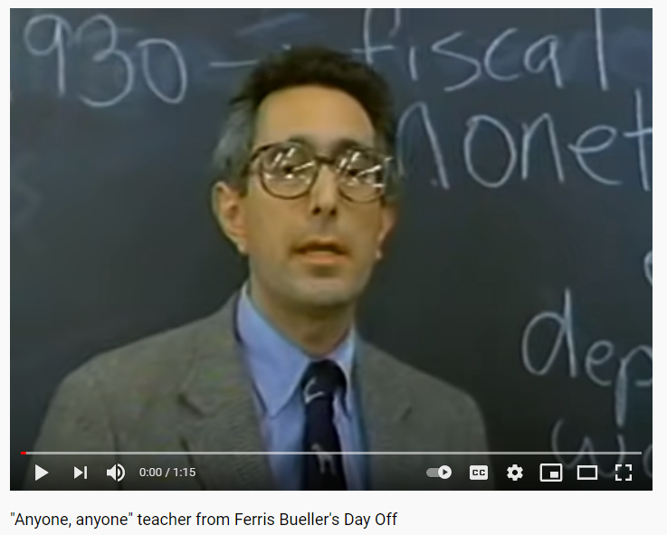

<div class="notes">

I almost never use negative examples, but this one is an exception. Ben Stein has a small role in the movie "Ferris Bueller's Day Off." He plays an Economics teacher who gives an exaggeratedly boring lecture about tariffs. There are several things he does that you should not do when you give a talk.

You can find this video clip on YouTube, https://www.youtube.com/watch?v=uhiCFdWeQfA 

</div>

### "How to Give a Great Talk" Nic Fleming, Nature 2018 (1/6)

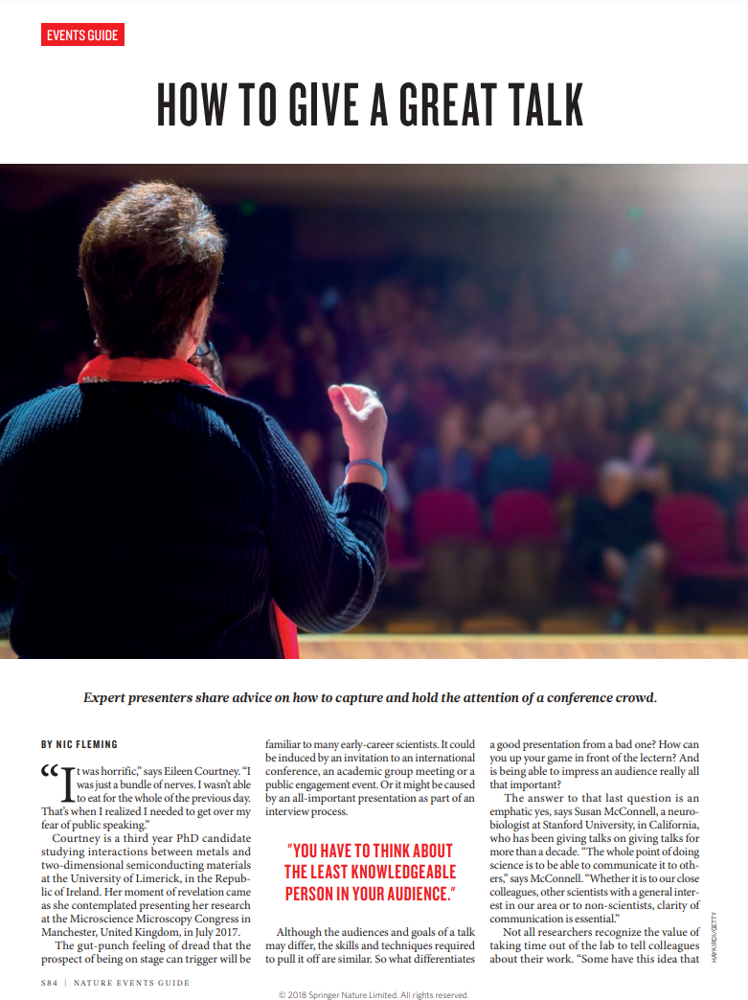

<div class="notes">

Here's some great advice from Nic Fleming, published in Nature in 2018.

</div>

### "How to Give a Great Talk" Nic Fleming, Nature 2018 (2/6)

+ Use vivid words to paint a picture
  + delightful
  + disturbing
  + puzzling

<div class="notes">

Almost every researcher that I have met has a passion. The passions are different from one another, and sometimes they conflict. But the passion is what you are trying to convey. If something about your work makes you smile, use words like "delightful." If something makes you angry, use words like "disturbing." If something is difficult for you to understand use words like "puzzling."

</div>

### "How to Give a Great Talk" Nic Fleming, Nature 2018 (3/6)

+ Use vocal variety
  + Volume
  + Pitch
  + Tone

<div class="notes">

Notice how Ben Stein talks in a monotone. It could be worse, but he sticks with the same volume, only has slight variations in pitch, and 

Different parts of your talk need different voices. Use a louder volume (carefully) to build excitement or to convey a need for action. Use a softer volume when you want to draw your audience in. Use a higher pitch when raising questions and a lower pitch when making forceful statements.

Use a higher pitch to raise questions. "Why do we have such poor health care in the United States?" Use a lower pitch to convey concern. "There's a serious problem with health care today."

What is tone exactly. The best example is a phrase that almost every child has heard from their mother: "Don't talk to me in that tone of voice." Tone is the emotion behind your voice. The mother was noting anger or contempt in the voice of the child. Unless you are a natural actor, you will have difficulty with tone. But make an effort. Think about the emotion you want to convey: happiness, anger, or curiosity. Use not just your words, but your tone to help create that mood. You don't have to be perfect at this, and any effort to convey emotion in the tone of your voice will help tremendously.

</div>

### "How to Give a Great Talk" Nic Fleming, Nature 2018 (4/6)

+ Insert small pauses
  + Gets your audience to think
  + Create emphasis
  + Allows your message to sink in.
  + Creates tension

<div class="notes">

Another very important tip is to insert pauses. Pauses often get your audience to think. This is especially helpful after questions. Notice how Ben Stein never gave his students a chance to answer any of his questions. He used the same pace throughout the lecture.

Pauses ... can ... emphasize ... certain ... points.

Just from a practical perspective, an occasional pause allows people to process what you just said. You don't want to throw too much information at them all at once, and a brief pause from time to time can really help.

Pauses are also useful at times to create tension. Stop talking and people start wondering what you are going to say next. That's a trick that job interviewers use. They'll ask a negative question like "What's your greatest weakness?" You might have an answer ready that shows that you are human without illustrating anything too negative. But watch out. The smart interviewer will pause after your first answer. The silence will make you nervous. Do I need to mention a second weakness? Don't fall for this. Toss in a second weakness and maybe a third to fill in the awkward space. All of a sudden, you've admitted to things that you should never have done in a job interview.

Silence in a talk can work the same way. It creates tension and unease. There are times when you can use this to your advantage. For example, you are talking about ethical conduct of research. Say something like "All researchers have flirted with unethical behavior." Then stop. People will start to squirm and feel uncomfortable. Don't pause forever, but once you've provided this level of discomfort, use it to emphasize why rules of conduct for research are so important.

</div>

### "How to Give a Great Talk" Nic Fleming, Nature 2018 (5/6)

+ Rehearse
  + Prepare, practice, and perfect.
  + Get feedback
  + Practice in an environment similar to your talk

<div class="notes">

Dr. Fleming offers advice throughout the paper about practice. Speak through your talk not to the point of total memorization, but to the point at which you don't find yourself making awkward pauses. Ask your colleagues to listen to you practice and get their feedback. Also practice in a setting similar to the environment that you will give your talk in. if your speech is in front of podium, find a podium somewhere to practice. If you will be talking as part of a panel seated along a table, practice your talk while you are sitting.

The biggest advantage of practicing is that it tends to minimize the natural sense of nervousness that we all feel.

</div>

### "How to Give a Great Talk" Nic Fleming, Nature 2018 (6/6)

+ Ensure you are within the time limit
  + Plan on fixed amount of time per slide
    + This gives a rough estimate on your slide count.
  + Time every rehearsal
    + Cut relentlessly, if needed
    + Develop a rhythm to help with timing
  + Give yourself a margin of error

<div class="notes">

The worst sin you can commit in scientific presentations is going over your allotted time limit. The audience will hate you for it, because they have a busy conference and don't want your talk to interfere with their schedule.

But there's another problem with long talks. Every other speaker in your session will hate you with an unbridled passion if you take too long. You are cheating them out of their time just so you can get more attention for your topic.

First budget a certain amount of time for each slide. It may be 30 seconds to 2 minutes, but do a rough calculation so that you don't have too many slides. If your rough calculation is off, cut back on the number of slides. But don't do this by combining two slides together.

Second, you will never know how long it takes to speak about your topic until you rehearse. Keep time while you rehearse. If you are way off with the first rehearsal, cut out major sections of your talk. Be relentless about this. Better to leave your audience wanting more than irritating them by giving them more than they asked for.

If your first rehearsal is close, see if a second or third practice will cut things a bit. Normally, practice will give you a good rhythm and that can help make things fit better in your time limit.

Don't stop rehearsing until you have your talk a bit under the time limit. Give yourself a margin of error. Nervousness in front of an actual audience  could draw things out a bit longer than your rehearsals. Also expect a bit of lost time during the transition from one speaker to another.

If you end up finishing a bit early, the other speakers will love you for it. Never feel bad about failing to fill out every allotted minute you have been given.

</div>

### Preparing your slides

+ Variety of programs
  + Microsoft PowerPoint
  + Adobe pdf
  + Apple Keynote
  + Prezi
  + Ioslides
  + Slidy
  + Beamer

<div class="notes">

I speak about slide presentations as if Microsoft PowerPoint were the only program out there that can produce slide presentations. It's not and here are some alternatives.

I don't want to list advantages and disadvantages to these alternatives. In general, they all have their own quirks, but they are all still professional grade quality products.

</div>

### "Points of View. PowerPoint in the Classroom" (1/5)

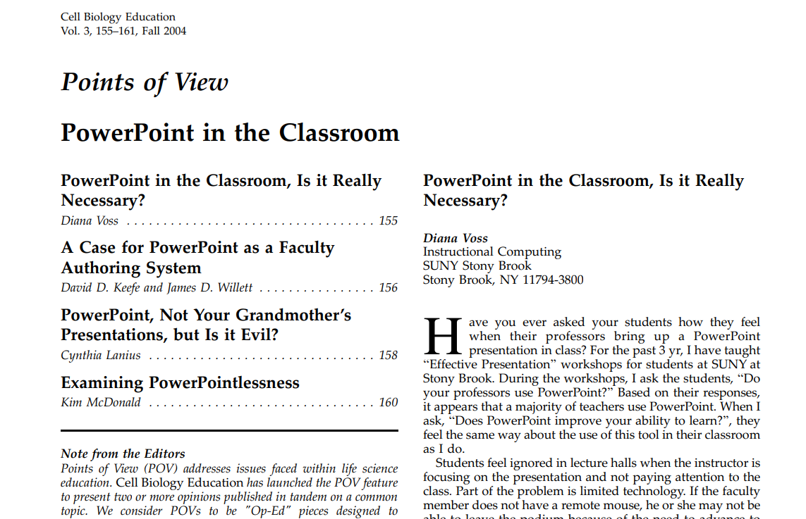

<div class="notes">

This is an article in Cell Biology Education in 2004 that I like because it offers a range of perspectives.

</div>

### "Points of View. PowerPoint in the Classroom" (2/5)

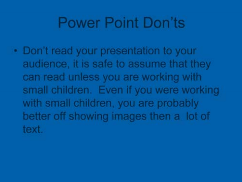

<div class="notes">

Here's a bad slide. Let me read it to you.

"Don't read your presentation to your audience. It is safe to assume that they can read unless you are working with small children. Even if you were working with small children, you are probably better off showing images than a lot of text."

This example is a trap I have fallen into. When I am nervous about a particular topic, I tend to put all the words I plan to say directly on the slide. That way I won't forget something important. But you can and should use speaker notes.

</div>

### "Points of View. PowerPoint in the Classroom" (3/5)

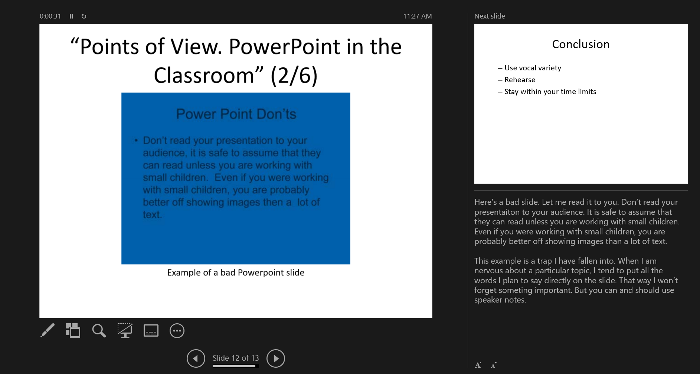

<div class="notes">

This is a view of the speaker notes from a Powerpoint presentation. The left side of the screen shows the slide your audience is currently looking at. The lower right corner contains your speaker notes. It's a great relief to have this up when you are talking. Sometimes I read the speaker notes directly, and sometimes I will improvise a bit. But it is my security blanket. 

A nice bonus appears in the upper right corner. You get a preview of your next slide. Often this gives me a chance to lead into the slide before I actually display it.

The speaker notes version works great when you have two or more monitors. Or you can print the speaker notes as a pdf file.

</div>

### "Points of View. PowerPoint in the Classroom" (4/5)

+ PowerPointlessness
  + Transitions, sounds, other special effects
  + Distract the viewer from your main message
  + Distract you from more important elements

<div class="notes">

Here are two quotes from the paper worth remembering.

PowerPointlessness is "any fancy transitions, sounds, and other effects that have no discernible purpose, use, or benefit"

"Presenters may be seduced into spending more time on the appearance of the slides than on the organization of their thoughts or the sequence in which ideas should be presented."


</div>

### "Points of View. PowerPoint in the Classroom" (5/5)

+ PowerPoint Master Slide
  + Template to insure consistent appearance
  + Allows branding.


<div class="notes">

Although I do not recommend this, many people advocate the use of a master slide or template. This provides a consistent appearance to your presentation. It also allows for branding. If everyone from a given company or organization uses the same background image and color scheme, people will start to know and remember the organization that is sponsoring all of these talks. It's part of promoting a particular corporate image.

</div>

### UMKC templates (1/7)


<div class="notes">

Here is a series of templates that UMKC provides. I do not recommend their use.

</div>

### UMKC templates (2/7)


### UMKC templates (3/7)


### UMKC templates (4/7)


### UMKC templates (5/7)

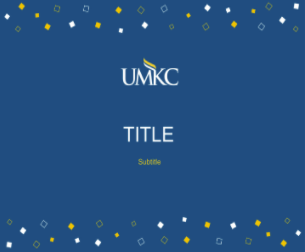

### UMKC templates (6/7)

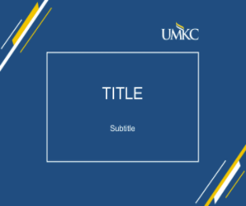

### UMKC templates (7/7)

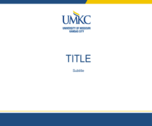


### Do you really need slides? (1/4)

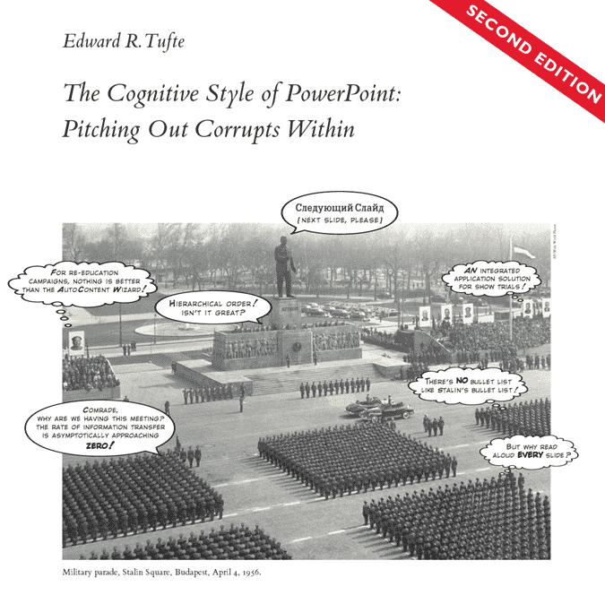

<div class="notes">

There is a minority, but a very vocal minority who believe that the process of presenting information using slides in a program in PowerPoint is inherently flawed. It is not that people are using the tool wrong. It is that the tool itself is incapable of producing meaningful interactions.

Edward Tufte is probably the most famous voice among these critics. He believes that programs like PowerPoint "weaken verbal and spatial reasoning, and almost always corrupt statistical analysis." He especially hates the use of bullet points. 

</div>

### Do you really need slides? (2/4)

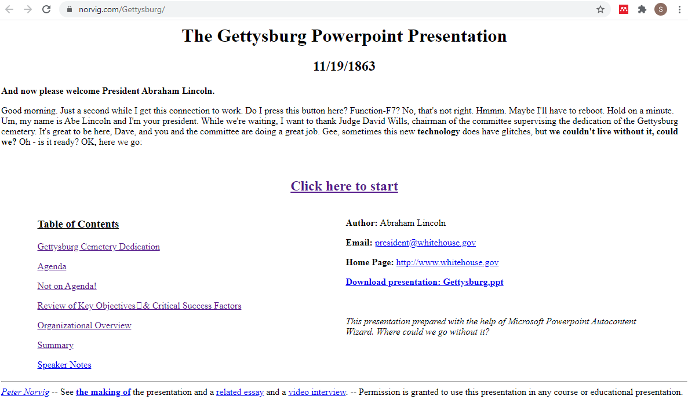

<div class="notes">

Peter Norvig has a satirical slide show up about Lincoln's Gettysburg address. This is one of the most famous speeches in U.S. History. I want to read it to you right now, because it is so well done.

"Four score and seven years ago our fathers brought forth on this continent a new nation, conceived in liberty and dedicated to the proposition that all men are created equal. Now we are engaged in a great civil war, testing whether that nation or any nation so conceived and so dedicated can long endure. We are met on a great battlefield of that war. We have come to dedicate a portion of that field as a final resting-place for those who here gave their lives that that nation might live. It is altogether fitting and proper that we should do this."

Note: I might stop here, or I could read the rest of the speech.

But in a larger sense, we cannot dedicate, we cannot consecrate, we cannot hallow this ground. The brave men, living and dead who struggled here have consecrated it far above our poor power to add or detract. The world will little note nor long remember what we say here, but it can never forget what they did here. It is for us the living rather to be dedicated here to the unfinished work which they who fought here have thus far so nobly advanced. It is rather for us to be here dedicated to the great task remaining before us--that from these honored dead we take increased devotion to that cause for which they gave the last full measure of devotion--that we here highly resolve that these dead shall not have died in vain, that this nation under God shall have a new birth of freedom, and that government of the people, by the people, for the people shall not perish from the earth."

Peter Norvig imagines what would happen today if Abraham Lincoln gave the same address and used PowerPoint to "enhance" his talk.

</div>


### Do you really need slides? (3/4)

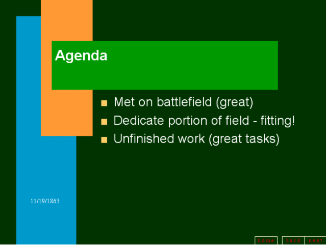

<div class="notes">

One of the earlier slides reads "Agenda" with bullet points

Met on the battlefield (great)

Dedicate portion of field - fitting!

Unfinished work (great tasks.)

Notice how the bullets literally suck the life out of Lincoln's inspirational words? Here are the original sentences.

"We are met on a great battlefield of that war. We have come to dedicate a portion of that field as a final resting-place for those who here gave their lives that that nation might live. It is altogether fitting and proper that we should do this."

and a few sentences later

"It is for us the living rather to be dedicated here to the unfinished work which they who fought here have thus far so nobly advanced."

</div>


### Do you really need slides? (4/4)

+ Two alternatives to slides
  + Stand in front of your audience and talk
  + Use a handout
+ Counterpoint: why I am using slides today
  + My customers demand PowerPoint
  + Needed for remote presentation
  + Slides serve to show structure

<div class="notes">

So if you don't use slides, what should you do?

First, there is nothing wrong with just standing in front of your audience and talking. Abraham Lincoln did a pretty good job doing this at Gettysburg. It is not an easy task quite honestly, but I have done it. You end up looking at your audience a lot more if there is no PowerPoint slide up on the projector behind you.

When I do skip the slides, I almost always prepare a handout and pass it out to the audience ahead of time. The criticism of using handouts is that people will read your handout instead of listening to your talk. There is nothing wrong with this, other than an affront, possibly to your ego. If people read your handout during the talk and they learn everything they need to know from the handout, then your talk was a success.

Having done this for many years, I have returned to using PowerPoint for my talks. 

The bullet points is not the point that you are currently talking about. It is the bullet points just before and just after the bullet point you are talking about. Having a series of bullet points reminds the audience where the speaker was just a few seconds or minutes ago and where the speaker will be a few seconds or minutes from now. If your bullets follow a logical sequence, seeing them all up on the screen reinforces that logical sequence.

</div>


### Conclusion

+ Use vocal variety
+ Rehearse
+ Stay within your time limits


<div class="notes">


</div>

