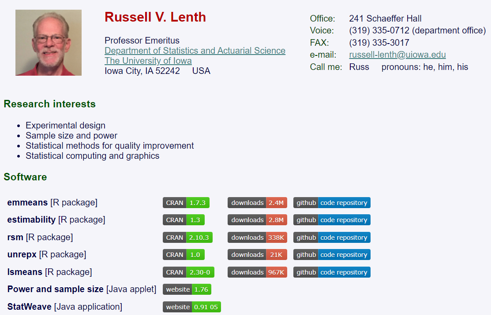
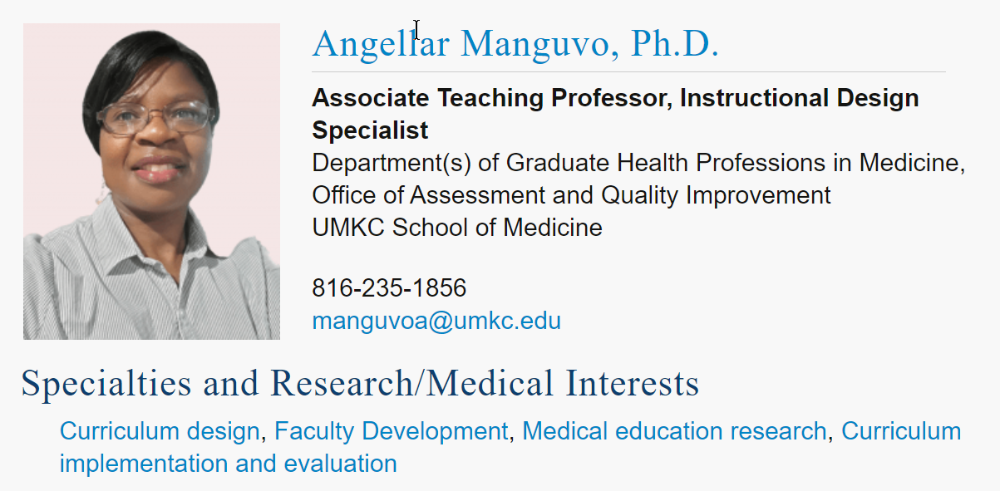
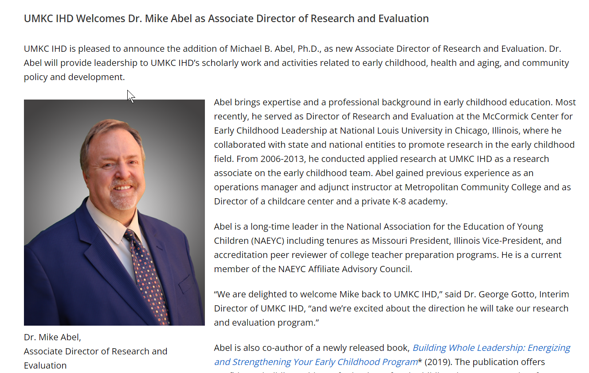
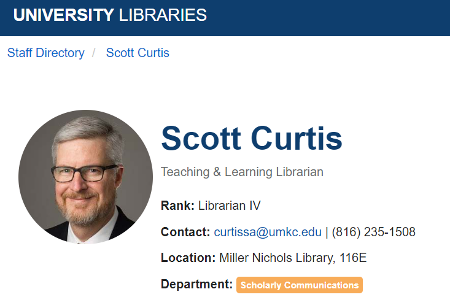
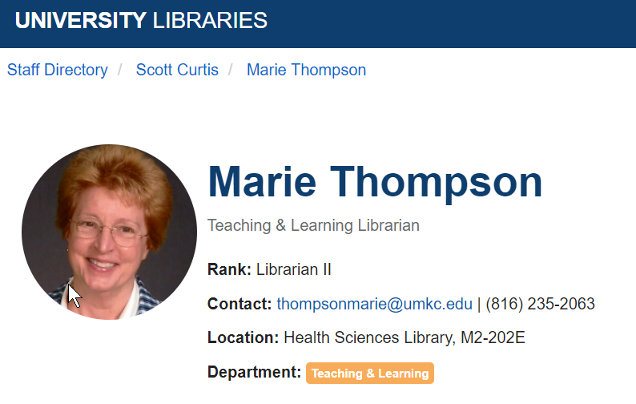
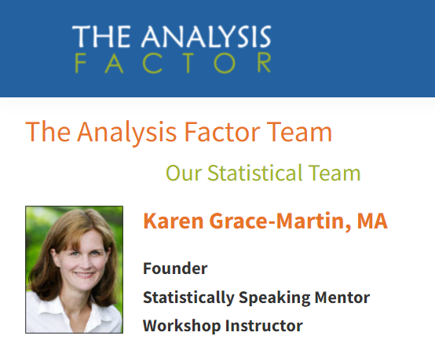
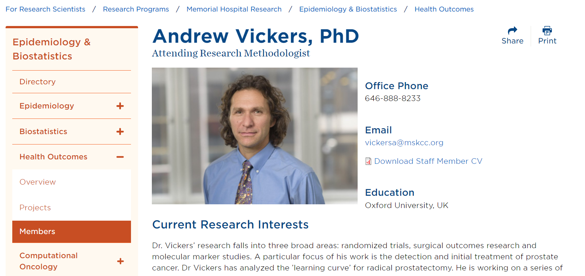
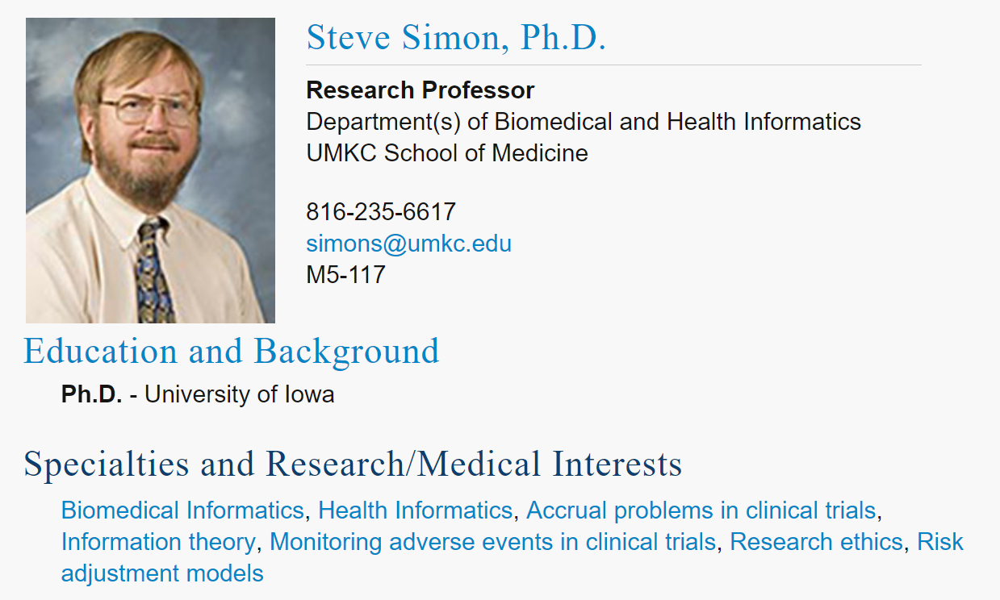

```{r echo=FALSE}
source("prelims.R", echo=FALSE)
```

### Your only goal: stand out as the best

+ There is no second best in grantsmanship
+ Quiz: who was the first person to fly solo across the Atlantic Ocean?
  + Who was the second person?
  + Who was the third person?
+ Never apologize, never settle
+ If you have to make a mistake, make a loud mistake

<div class="notes">

When you write a research grant, your singular goal is to stand out as the best. You have the best idea, the best research design, the best team, and the best environment. You want the reviewers to think of your work as the best use of their funds. If anything comes across as second best, you will not get funded. 

This puts you in a difficult spot. How can you compete against world-class scientists? How can UMKC stack up against elite research environments like Harvard and Cal-Tech?

The answer comes from a quiz I heard in a class on grant-writing. Who was the first person to fly solo across the Atlantic Ocean? Most people know the answer: Charles Lindbergh. But do you know who the second person to fly solo across the Atlantic Ocean was? Most people don't. It was Clarance Duncan Chamberlin.

But then, you might ask who the third person was. It was Amelia Earhart. She was memorable not as the third person to fly solo across the Atlantic, but as the first woman.

This is your secret. You can't compete head up with the best in the broad category of research, but you can redefine the problem more narrowly. You are the best in this particular niche of research.

If there is anything I've tried to emphasize this class it is that there is not a hierarchy of research with one type of research at the top and others beneath it. All research approaches have their place. The constraints of the research environment will make one type of research to rise to the top and it won't be the same type of research each time. 

The case-control design is the best choice because it offers the most efficient way to study rare outcomes. A focus group is the best choice because it provides a rich set of responses and allows one participant to build on and expand on the ideas of another participant. A retrospective review of electronic health records is the best choice because it characterizes the provision of medical care in a real world setting.

Don't say that you have to settle or compromise. And most of all don't apologize. SAying that you are using observational data because you can't afford the cost of a randomized trial is the kiss of death.

In college, I dated piano major for several years. I decided to learn how to play piano, not because I thought I was good, but because it gave us something to share. Her suggestion to me was that if you're going to make a mistake, make a loud mistake. I never really was able to do this, and my efforts were weak and tentative. You can't be timid about playing the piano, and that lesson applies elsewhere as well.

I've mentioned this before, but if you are deviating from what is widely considered the norm in research, you need to be bold and explicit about this deviation. Don't try to minimize the deviation by talking only briefly about it. Explain why you feel your deviation is the one that makes the most sense in the circumstances. The reviewers may disagree with your choice, and brand your research approach as flawed. That's their prerogative. But if they think that you are unaware of the problems with your choice, they will brand your research as naive, and that is much worse. 

So be up front about your choices, especially the controversial ones.

</div>

### Research grant process

+ Read the solicitation and guidelines
+ Build a research team
+ Submit a letter of intent, if asked
+ Prepare a draft proposal
+ Get internal reviewers and administrative approval
+ Submit proposal and wait

<div class="notes">

Every research grant is different, but here are the general steps that most grants follow.

</div>

### Read the solicitation and guidelines

+ Solicitation
  + BAA, RFA, RFP, others
  + List of what you can/cannot propose
  + Allowable expenses
  + Deadline
+ Guidelines
  + Proposal length
  + Proposal structure
+ Talk to someone at the granting agency

<div class="notes">

I'm going to describe the granting process from the perspective of the National Institutes of Health. There are other governmental agencies that distribute grant money for research, such as the Department of Defense and the National Science Foundation. Grants are also available from private organizations, such as the Bill and Melinda Gates Foundation and the American Heart Association. 

Almost all grant opportunities are described in some type of solicitation. It may be called a Broad Agency Announcement (BAA), Request for Applications (RFA), or Request for Proposals (RFP). These are the NIH terms, but other granting agencies will probably use different acronyms.

The solicitation will provide a list of what you can propose. It is sometimes very specific, but at times it is open ended with examples but allows for other options.

The important thing, however, is that you must, must, must pay attention to what you cannot do. If you can't run a clinical trial, don't propose a clinical trial.

Also look at the list of allowable expenses. Can you use the money for travel? Can you use it for the purchase of computer equipment?

Also note the deadline. You should start work on a grant two or three months prior to the deadline.

If you have the opportunity to talk to someone at the granting agency, please take advantage of this very early in the process. It might be a one-on-one discussion or participation in a webinar. 

Pitch your idea to see if it is a good fit for what type of research the agency is looking for. Take copious notes and use these as you develop your grant.

In my experience, the people that you get to talk to are very helpful. Their job is to help people write great proposals. My encounters with them have always been very helpful.

</div>

### Break #1

+ What have you learned
  + Stand out as the best
  + General process of writing a grant
  + Reading the solicitation
+ What's coming next
  + Building a research team

### Build a research team

+ "No man is an island" John Donne
+ Find researchers with the skills you lack
  + Brag about them
  + Brag about yourself

<div class="notes">

I want to start with the famous quote by John Donne: no man is an island. You could also say that no researcher is an island. Many centuries ago, there were great scientists who could do it all by themselves: Benjamin Franklin, Isaac Newton, Marie Curie. Times have changed and science has become so diverse that no one person can do it all.

So your job as the grant writer is to build a team, with each person providing specialized skills that you lack.

Your job in the grant is to brag about your team. Don't be shy here. Your team is the best and is the most capable of conducting this research.

Don't forget to brag about yourself. Even if you are relatively new to research, you have some training in classes like this one and you also have job experiences related to the work you are proposing. Let the reviewers know about this. Don't make up stuff, of course, but do put in anything you can think about yourself that makes you look special.

</div>

### Build a research team, patient accrual model (1/2)

+ Accrual = how fast you can recruit patients
+ Criticized on software development angle
  + Failure to mention my expertise
  + Failure to recruit other experts
  

<div class="notes">

A few years ago, I proposed a research grant that proposed, among other things, to develop some software to help researchers plan their accrual rates. Accrual is the speed at which you expect to recruit patients into your clinical trial. Accrual is the flip side of sample size calculation. It make no sense to propose a sample size of 500 patients if it would take two decades to find that many volunteers.

The grant was not funded, and when I got feedback, one major deficiency was that no one on the research team was familiar with software development. So this provided me with two lessons. 

First, I did not brag enough about how much I know about software development. Now I am not an expert in software development, but I am not a total novice either. But I didn't describe my skills in this area. So remember to always brag about yourself.

Second, I knew some experts in software development through my work with the Kansas City R Users Group. In particular, I knew someone who was an expert in testing user interfaces. So I talked to him and said, described the grant, and asked for his help when I prepared a resubmission. I did not end up resubmitting because of competing time commitments, but the lesson still holds.

</div>

### Build a research team, patient accrual model (2/2)



<div class="notes">

Actually, I did get praise for including a researcher, Russ Lenth, who was the pre-eminent expert on sample size calculation. As I mentioned, accrual is the neglected partner of sample size calculation, and Dr. Lenth provided a level of technical expertise that the reviewers noted and commented on favorably.

Let me share a second story. This one was about another unsuccessful grant. Again, one thing I did well was to develop a strong research team.

There was a call for developing training modules for biomedical researchers. Right up my alley, I thought to myself. Now I need to be careful because there are a lot of people who are far better at developing courses than I am. But I do provide some unique skills that set me apart. In particular, I am very good at finding interesting datasets that can be used as exercises or teaching examples.

There has been a lot of interest recently in data sharing. There is an increasing push for researchers to include their datasets along with any peer reviewed publication. There are privacy concerns, of course, with many datasets. Even so, there are ways to protect patient privacy and still share the data.

So I wanted to propose a series of training videos on the issues associated with data sharing--issues like documentation, which are often overlooked. Now part of my job was to assemble a research team.

One of the first steps was to involve an expert in curriculum development. 

Mike Abel

</div>

### Build a research team, peer-reviewed datasets (1/6)



<div class="notes">

Let me share a second story. This one was about another unsuccessful grant. Again, one thing I did well was to develop a strong research team.

There was a call for developing training modules for biomedical researchers. Right up my alley, I thought to myself. Now I need to be careful because there are a lot of people who are far better at developing courses than I am. But I do provide some unique skills that set me apart. In particular, I am very good at finding interesting datasets that can be used as exercises or teaching examples.

There has been a lot of interest recently in data sharing. There is an increasing push for researchers to include their datasets along with any peer reviewed publication. There are privacy concerns, of course, with many datasets. Even so, there are ways to protect patient privacy and still share the data.

So I wanted to propose a series of training videos on the issues associated with data sharing--issues like documentation, which are often overlooked. Now part of my job was to assemble a research team.

One of the first steps was to involve an expert in curriculum development. 

Here is  what I wrote about her (I won't read the whole thing, but you can view the speaker notes if you like):

Angellar Manguvo, PhD, is an Instructional Design Specialist in the UMKC School of Medicine’s (SOM) Office of Assessment and Quality Improvement. Her primary focus in this position is to apply expertise in curriculum design, curriculum management, assessment, program evaluation, and faculty development. Dr. Manguvo plays a key role in continuous quality improvement monitoring for accreditation compliance. She helps in formulating key initiatives to track and monitor identified areas of focus, SOM’s strategic plan goals, as well as some selected standards and elements as part of compliance monitoring and the SOM's commitment to quality improvement. Dr. Manguvo also serves as the assessment co-coordinator for the SOM where she oversees the assessment of student learning outcomes for the MD and Health Professions in Education (HPRE) programs in the SOM. She has published journal articles related to assessment and evaluation of learning initiatives.

Dr. Manguvo is also an Associate Teaching Professor in the HPRE program where she teaches a graduate course: Program Evaluation in Health Professions in Education. The course is designed to equip students with conceptual, theoretical, and methodological tools necessary to develop, implement, and evaluate services, policies, products, and intervention programs in health care and health professions education through a systematic use of empirical information. 

Dr. Manguvo also teaches two research methods courses at the UMKC’s School of Education as an adjunct instructor, which aim to equip students with a basic understanding of types of research designs, methodological approaches, and data analysis procedures. 


</div>

### Build a research team, peer-reviewed datasets (2/6)



<div class="notes">

The second step was to identify someone who could provide an evaluation of the curriculum.

Here is what I wrote about Michael Abel (again, I will only summarize briefly on the video, but the full text is available in the speaker notes).

Michael Abel, Ph.D., will lead the evaluation team at the UMKC Institute for Human Development (UMKC IHD). Dr. Abel is the UMKC IHD Associate Director. He leads applied research and evaluation initiatives to advance knowledge that will enhance people’s lives and the effectiveness of communities to support all their citizens. His background is in early childhood education, child development, quality and systems development, and early childhood leadership. He is a PI for Missouri’s federally-funded Preschool Development Grant through the Department of Elementary and Secondary Education and recently completed an initiative to develop a career pathways framework for the state’s early childhood workforce. Dr. Abel oversees projects in areas such as urban equity initiatives, health and aging, traumatic brain injury, and home visiting for mothers in vulnerable situations, including the evaluation of the TIES Program and the Kansas City Healthy Start Initiative of Nurture KC. His research interests include organizational equity, leadership development, pedagogical leadership, family engagement, behavioral health, and systems capacity building with an emphasis on vulnerable populations. He is co-author of Building on Whole Leadership: Energizing and Strengthening your Early Childhood Program (Gryphon House).

</div>

### Build a research team, peer-reviewed datasets (3/6)



<div class="notes">

THe third step was to recruit a librarian. I actually ended up with two librarians.

</div>

### Build a research team, peer-reviewed datasets (4/6)



<div class="notes">

Here is the second librarian. I only wrote briefly about these two, and I probably should have said more.

Scott Curtis and Marie Thompson will produce training materials on rigorous and reproducible search strategies and serve as resources during the pilot studies and in the courses that will utilize the training materials. Both are professional librarians at UMKC. They have produced research guides for students, staff, and faculty at UMKC. These cover a wide range of topics, including medical databases, coronavirus information, geographical information systems, and historical census data for Kansas City.

</div>

### Build a research team, peer-reviewed datasets (5/6)



<div class="notes">

I also developed an external panel of reviewers. The first is Karen Grace-Martin. I know her well because she offers a wide range of online instruction classes in Statistics. I provide some of this for her, but she has a whole bunch of other experts as well. She has a good sense of what works and doesn't work for online instruction, so she was an easy choice.

</div>

### Build a research team, peer-reviewed datasets (6/6)



<div class="notes">

The second choice for the external panel of reviewers was a bit of a long shot. One of the classic references on data sharing was written by Andrew Vickers. I had never met him, and he had no idea who I was. But I took a shot in the dark and asked if I could include his name in the grant I was writing as one of the external reviewers. He very graciously said yes. To be honest, it was probably an easy yes for him, as he gets a small piece of a research study with almost no effort on his part. But including such a prominent name in my research study greatly enhances my credibility.

The lesson here is that you should reach out to prominent researchers, even if you don't know them. It costs you very little time and you might get a big name to be part of your research.

</div>

### Don't forget to brag about yourself




<div class="notes">

I was the PI on the grant, so I had to say nice things about myself. Here's what I wrote (again, I will not read all of this for the video):

Steve Simon, Ph.D. will develop much of the training materials, run the pilot studies of the materials, and test them in his Clinical Research Methodology class. Dr. Simon is a Professor in the Department of Biomedical and Health Informatics. He has authored or co-authored over 100 publications including four which have won major awards. He is the author of a massive website and blog (www.pmean.com, blog.pmean.com) with over 1,700 pages on Statistics, Research Ethics, and Evidence-Based Medicine.

Dr. Simon is a passionate advocate of the use of real world data sets. Every class that he teaches is jam packed with data sets that come from peer-reviewed publications. The search for these data sets, however, has always frustratingly slow and inefficient due to limited search tools and poor documentation. He has a vested interest in documenting these difficulties and advocating for improvements.

Dr. Simon is a popular and highly sought after teacher. He has provided short courses at regional, national, and international conferences for researchers in Alternative Medicine (2012 and 2014), Andrology (1996, 2007, 2009, and 2010), drug development (2006, 2007), Library Science (2012 and 2014), and Pediatrics (2004, 2005, 2006, 2007, 2009, 2010, and 2013). The greatest testament to the value and quality of his work is the repeat invitations that he gets from these conferences.

Dr. Simon has extensive experience with remote teaching. He has provided numerous seminars for The Analysis Factor, all conducted via GoToMeeting. He developed a popular multi-week training course on survival analysis using the same platform. All of the classes he teaches at the University of Missouri-Kansas City are run as asynchronous online courses. Three of the online classes were brand new, developed or co-developed from scratch.

Dr. Simon has successfully mentored hundreds of beginning researchers, not just through his teaching but also through his consulting work. Although he has cut back sharply on consulting recently, he routinely met with many researchers at UMKC and at his previous job at Children’s Mercy Hospital. A typical year would involve meetings with 60 separate research teams. While some of these teams included seasoned researchers who did not need mentoring, many others had little or no experience with the research process. Dr. Simon co-authored 80 peer reviewed publications during a two decade span at these two jobs, almost all of them related to his consulting work. He has provided informal guidance on many many more publications beyond these 80.

Finally, Dr. Simon has already written and tested much of the material to be developed for this training module on sharing data. These materials are not part of a single course but are scattered across multiple courses. Dr. Simon includes videos on data dictionaries and program documentation in his courses on R, SAS, and SQL. He discusses data management at great length in his Clinical Research Methodology class. He has provided guest lectures on data sharing to another faculty member’s course, Responsible Conduct of Research. While the material does need to be consolidated, all the pieces are already sitting out there waiting to be assembled.

</div>

### Break #2

+ What have you learned
  + Building a research team
+ What's coming next
  + Letter of intent
  + Draft proposal


### Submit a letter of intent, if asked

+ Very brief description
+ Does not constitute a commitment
+ Courtesy to the granting agency
  + Estimate number of proposals
  + Identify special review expertise needed

<div class="notes">

The granting agency may request that you send a letter of intent. This is due typically a month or two prior to the grant deadline. It's a short document, often no more than one or two pages. Just outline the type of research that you plan to do in very general terms.

A letter of intent does not constitute a commitment on your part. You can back out after submitting a letter of intent with no penalty. For many grants that ask for a letter of intent, failure to submit one does not prevent you from writing a full detailed application.

When an agency asks for a letter of intent, it is typically for one of two reasons. They may wish to get a rough estimate the number of proposals that might come in. Or they might want to make sure that the review panel includes experts who are familiar with the general scientific and medical areas that you and others will propose.

</div>

### Prepare a draft proposal

+ Aims/objectives
+ Literature review
+ Methods section
+ Preliminary data
  + Proof of your capabilities
  + Not always available
+ Strengths of the research team/environment
+ Other sections
+ Make proposal easy to read
  
<div class="notes">


Broadly speaking, you already know the bulk of what is needed for a research grant. There are other sections that you need to prepare and I want to cover them in some level of detail.

</div>

### Prepare a draft proposal, aims/objectives

+ Objectives
  + Lead and final paragraph
  + Broad picture of entire proposal
+ Aims
  + Individual pieces
  + Typically 3 to 5.
  + Not dependent

<div class="notes">

Different granting agencies have different terminology, but most want a description of the research objectives. This is the big picture. This is your lead paragraph and is restated in your final paragraph.

Then you break down your proposal into individual pieces. These are sometimes called specific aims, but follow the language and terminology in the solicitation and/or the granting agency's website.

You want to avoid aims that are dependent on each other. If the results of one aim are different than what you expected, you need to be able to proceed logically to the other aims in spite of this. You might include contingency plans here to avoid reaching a dead end halfway through your grant proposal.

</div>

### Preparing a draft proposal, objectives and aims example

+ Objective: Four week curriculum on data sharing
+ Aim 1.Develop and pilot test training materials.
+ Aim 2. Deploy and evaluate materials in two different research methods classes.
+ Aim 3. Make all resources available publicly.

<div class="notes">

Here is the first sentence describing the objective:

Our long term goal is to enhance the scientific rigor, reproducibility, and responsible conduct of biomedical data science research through a four week curriculum on data sharing that you can use in a stand-alone one credit hour class or incorporate into an existing course on research ethics or methodology. 

Here is the first sentence of the paragraph describing aim #1:

The research team will develop training resources covering four major areas: the mandate for data sharing, privacy concerns, data documentation standards, and reproducible search strategies. 

Here is the first sentence of the paragraph describing aim #2:

The training resources will be deployed in existing classes on research methodology taught by the principal investigator and a co-investigator. 

Here is the first sentence of the paragraph describing aim #3:

All the Powerpoint slides, speaker notes, handouts, exercises, and grading rubrics will be developed using RMarkdown and stored on a github site. 

</div>

### Prepare a draft proposal, literature review and methods

+ Already covered in this class
+ Adhere to page limits

<div class="notes">

Broadly speaking, you already know the bulk of what is needed for a research grant. You summarize what is already known and the propose methods to add to what we know.


</div>

### Prepare a draft proposal, preliminary data

+ Proof of your capabilities
+ Does not have to be complete
+ Not always required

<div class="notes">

A key element in most grants is discussion of preliminary data. Preliminary data is data that you yourself have collected. It isn't data that addresses your proposed research. Otherwise you wouldn't need money--the work is already done. Preliminary data is data that shows that you have been an active participant in this research area. It demonstrates that you have proven yourself capable of doing research along the same lines of what you propose in your methods section.

You would summarize your preliminary data the same way that you summarize other people's work with two exceptions. First, you spend a lot more time and discuss your own work in a lot more detail. Second, you include everything that you have done that is relevant to the grant. It doesn't need to be published and you can share partial information on a study that is ongoing.

Some grants require you to have preliminary data. If you don't have it, you will get a tepid review. Other grants do not require preliminary data. Even when the grant solicitations or guidelines states that preliminary data is not needed, it does help to present it when you have it.  

</div>

### Prepare a draft proposal, strengths of the team/environment

+ Strengths of the team
  + Always list credentials
  + Prior research experience
+ Strengths of the environment
  
+ There is no second best in grantsmanship
+ Quiz: who was the first person to fly solo across the Atlantic Ocean?
  + Who was the second person?
  + Who was the third person?

<div class="notes">

You also need to convince the reviewers about the strength of the research team and the research environment.

You need to be bold here. You have the best idea, the best team, and the best environment. No agency wants to fund second best research.

This puts you in a difficult spot. How can you compete against world-class scientists? How can UMKC stack up against elite research environments like Harvard and Cal-Tech?

The answer comes from a quiz I heard in a class on grant-writing. Who was the first person to fly solo across the Atlantic Ocean? Most people know the answer: Charles Lindbergh. But do you know who the second person to fly solo across the Atlantic Ocean was? Most people don't. It was Clarance Duncan Chamberlin.

But then, you might ask who the third person was. It was Amelia Earhart. She was memorable not as the third person to fly solo across the Atlantic, but as the first woman.

This is your secret. You can't compete head up with the best in the broad category of research, but you can redefine the problem more narrowly. You are the best in this particular niche of research.

I've already talked about the strengths of the team, and in particular, your strength as the principal investigator. But you also need to talk about the research environment.

</div>

### Prepare a draft proposal, budget

+ Salaries
+ Supplies
+ Travel
+ Publication costs
+ Indirect funds

<div class="notes">

Every grant proposal is different, but your budget will probably include most of the following.

If you are writing the grant, you get to see how much everyone is paid. This is a juicy little tidbit, but you won't blurt out salary figures at the next office party. Researchers are paid either by a percentage of their effort or at an hourly rate. Make sure that you include fringe benefits in your calculation.

Some grants do not support salary for the principal investigator, so don't ask for it if it is not allowed.

The Office of Research Support can provide information on salaries and fringe benefits.

Supplies could be a variety of things, and I can't offer more specifics here.

Travel is often needed to conduct the research, but don't forget about travel to present your results at research conferences. Again, some grants do not support travel, so don't ask for it if it is not allowed.

You should consider publishing any results from this grant in an open source journal. Most granting agencies are supportive of open source publishing, as it increases the visibility of the work they are funding. Be sure to include the costs of publishing in an open source journal as part of your budget.

Some granting agencies offer support for the infrastructure at a research organization. This includes certain services, such as library support, that would be difficult to budget directly. This infrastructure support is called indirect funds and is often a percentage surcharge on top of the total grant amount.

In most cases where indirect funds are allowed, these are funds over and beyond the budget limit. If the grant has a limit of \$200,000 and the indrect rate is 26%, then your budget including indirects would be \$200,000 + \$52,000. 

In some cases, the granting agency will put a cap (say 10%) on the amount of indirect funds that you can ask for. Other agencies will not allow you to include indirect funds in your budget. Read the solicitation carefully and talk with ORS.


</div>

### Prepare a draft proposal, other requirements

+ Varies greatly, read the solicitation
  + Use a checklist
+ Some examples of other requirements
  + Inclusion of women and minorities
  + Data sharing plan
  + Community participation
+ Respect any exclusions

<div class="notes">

While I have tried to outline the major components of a research grant, these do vary considerably from one granting agency to another and even can vary for different solicitations within the same agency.

Read and re-read the solicitation. Identify the key elements in the solicitation and develop a checklist. If you fail to include a required section in your grant, it will fail and fail miserably.

I hesitate to mention what some of the additional requirements are but there are three that I have seen.

The first is a plan to insure adequate participation of women and minorities. There are some obvious exceptions, of course, but in general many agencies will demand specifics about the approaches you will take to get fair and representative participation from women and/or minorities and/or other underserved populations.

Second, many proposals ask that you specify a plan for how you will share any data produced by this grant. Again, there are obvious exceptions, but you should be explicit about any factors that would prevent sharing of research data.

Third, many solicitations will ask for evidence that you have involved the community in the research planning, analysis, and dissemination of data. We covered this earlier on the section on Community Based Participatory Research.

A final point worth noting here is that any solicitation for grant proposals will list exclusions--things that the granting agency will not fund. Respect this list, and do not propose anything that is off limits.

One thing I learned in a class on grant writing is that you need to put yourself in the shoes of a reviewer. They have a huge stack of proposals to review and a limited amount of time to do the reviews. It is only human nature that they want to look for shortcuts. One of the easiest things for the reviewer to do is to find an exclusion that you have ignored. If they find it, they don't have to do any further work on your proposal. So don't give them an easy out. Make sure that you comply with each and every exclusion in the solicitation.

</div>

### Make the proposal easy to read

+ Respect guidelines
  + Page limits
  + Page margins
  + Font size
+ Use headings, white space liberally
+ Use **bold** (not _underline_) for emphasis
+ Include tabular summaries, graphs

<div class="notes">

The people who review grants are almost always volunteers, and you should make it easy for them to read your proposal. 

Most solicitations or guidelines on the granting agency's website will include limits and these are strictly enforced. Do not exceed the page limits. In particular, do not try to sneak in extra stuff in an appendix that belongs in the grant itself to try to bypass the page limits.

It's okay to have one or two fewer pages than the requirement, but anything more than that and you should ask yourself if there are important features of your grant that you are failing to document adequately.

Use the margins specified in the grant. It's okay to have bigger margins, but anything smaller than the requirement will get your grant kicked out before review.

The same applies for font size. I would encourage you to use a slightly larger font size (12 point instead of 11 point), if you still end up fitting within the page limits.

Within the grant, use white space liberally. Put a blank line between each paragraph and before and after any headings.

Headings are very helpful because they allow the reviewer to quickly jump to a section that they feel needs to be read a second time.

It is easy for reviewers to miss an important point, so use bold text in places to make sure the really important stuff is not overlooked. Many grant writers use underline to emphasize certain points, but I think it crowds the text and makes it harder to read.

Include tabular summaries and graphs in your proposal. You want to avoid a sea of words that makes the proposal look dense.

</div>

### Example of whitespace


<div class="notes">

Here's a thumbnail of three pages from a grant I wrote. Don't try to read the text. I want you to focus on the layout. 

It is not the best example of white space but notice how the tables on the second and third pages break up the flow of the text. Also notice the number of blank lines throughout.

Microsoft Word uses color for headings and titles. Normally, I would not recommend the use of different color in text. It can look gimicky. But the choices here are not too bad.

</div>

### Break #3

+ What have you learned
  + Letter of intent
  + Draft proposal
+ What's coming next
  + Internal reviewers and administrative approval
  + Submit and wait
  
### Get internal reviewers and administrative approval

+ Internal reviews
  + Your research team
  + Your supervisor
  + Colleagues
  + Outsiders
+ Administrative approval
  + The University is the official applicant, not you
  + Respect internal deadlines

<div class="notes">

While you are talking regularly with your research team about their particular efforts on the grant, they need to see the entire grant at some point so they can see how their work fits in with the overall plan. It's just common courtesy, and your team has a vested interest in improving the proposal.

You also should be talking regularly with your supervisor, as preparation of a research grant is very time consuming and can impinge on other duties and responsibilities of your position. Again, make sure that your supervisor sees the entire grant at some stage.

You should enlist some of your colleagues to review your grant. Give them adequate time, at least a couple of weeks. It's also a good idea to recruit outsiders. These could be people who are expert researchers, but in an area different than the one you are proposing. Sometimes experts in a field have a collective blind spot that is easier for someone outside your area of expertise to notice. Outsiders can and should involve community members, patient advocacy groups, or others who view things from the perspective of the research volunteers.

There are several important administrative approvals that are required for any grant submitted as part of your work at UMKC. These are important and the almost certainly will apply for any future positions that you might hold outside of UMKC. The University is officially the one making an application for funding. They are the ones who get the money and distribute it to you and your research team. 

Never forget that UMKC is making a commitment of their resources in exchange for the money that they will receive, so they have an obligation to insure that this is done properly. There may be legal issues that need to be resolved as well. UMKC has an Office for Research Support (ORS) and other places have similar administrative offices. REad their website carefully and make sure that you talk early and often with them about your grant. 

</div>

### Submit proposal and wait

+ Electronic submission
  + Note name, size, and format requirements
+ Regularly monitor process
  + Respond promptly to any requests for more information

<div class="notes">

Typically, submission of the grants are done electronically. You will fill out several electronic forms, upload some forms, and press a button to submit. For larger grants, the final button may be pushed by the ORS.

There may be requirements for the names you choose for the files you upload. There also might be size restrictions. If the site asks for a particular format, such as PDF, make sure you have prepared the documents in that format.

Once you are done, pat yourself on the back for all your hard work. Next you have to sit back and wait. You may or may not receive notifications of when your grant proposal has met certain hurdles, or you may have to check in regularly with the electronic system that you used to submit your proposal.

Don't be a nag, but if there are delays beyond the expected timelines in the grant solicitation, you can try contacting someone at the granting agency.

Most importantly, respond promptly to any requests for additional information. The agency may give you an opportunity to address any technical deficiencies in your proposal, but this would usually be something big like a form that was completely missing. The other reason that the granting agency might want more information is when the grant has passed through some hurdles and looks more promising enough to require more paperwork. This doesn't guarantee anything, but most of these requests are hopeful signs.

</div>

### Summary

+ What have you learned
  + Your only goal: Stand out as the best
  + Structure of the draft proposal
  + Internal reviewers and administrative approval

