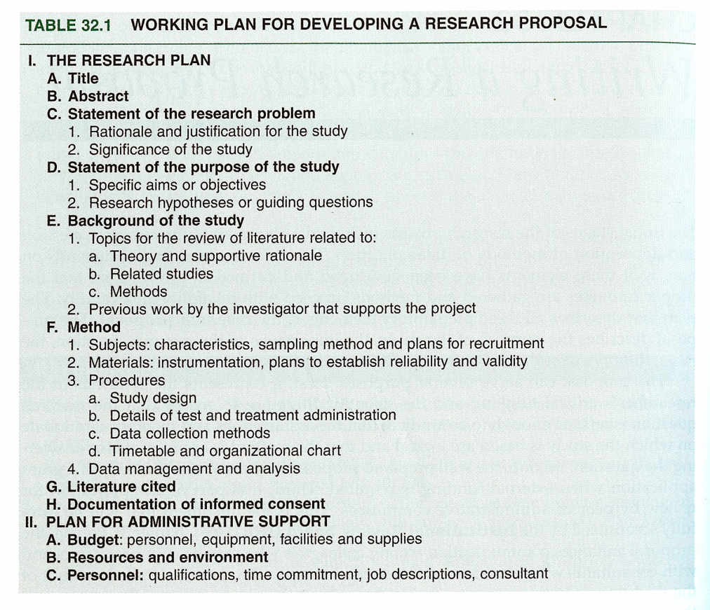
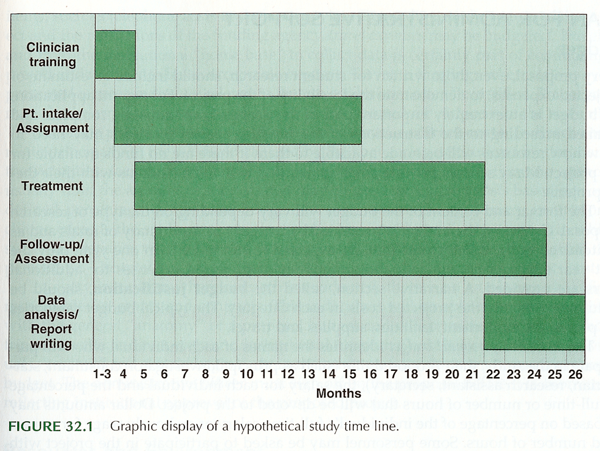
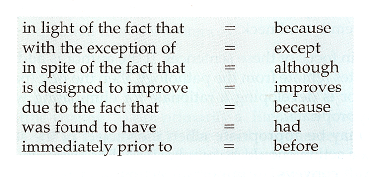
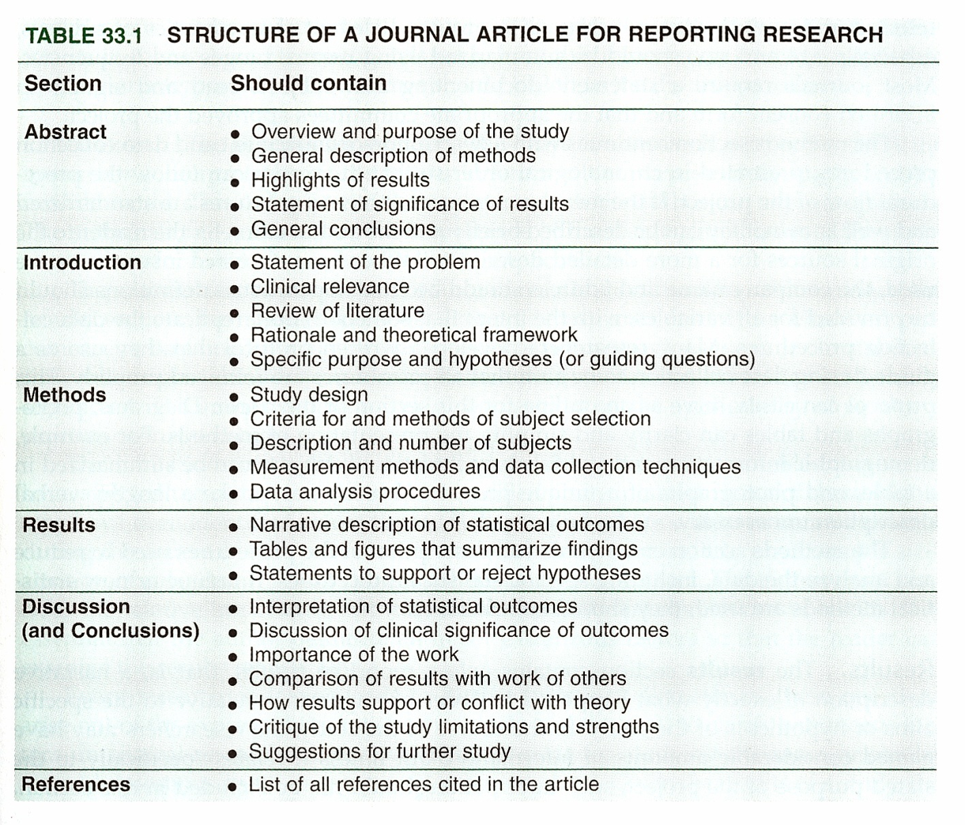
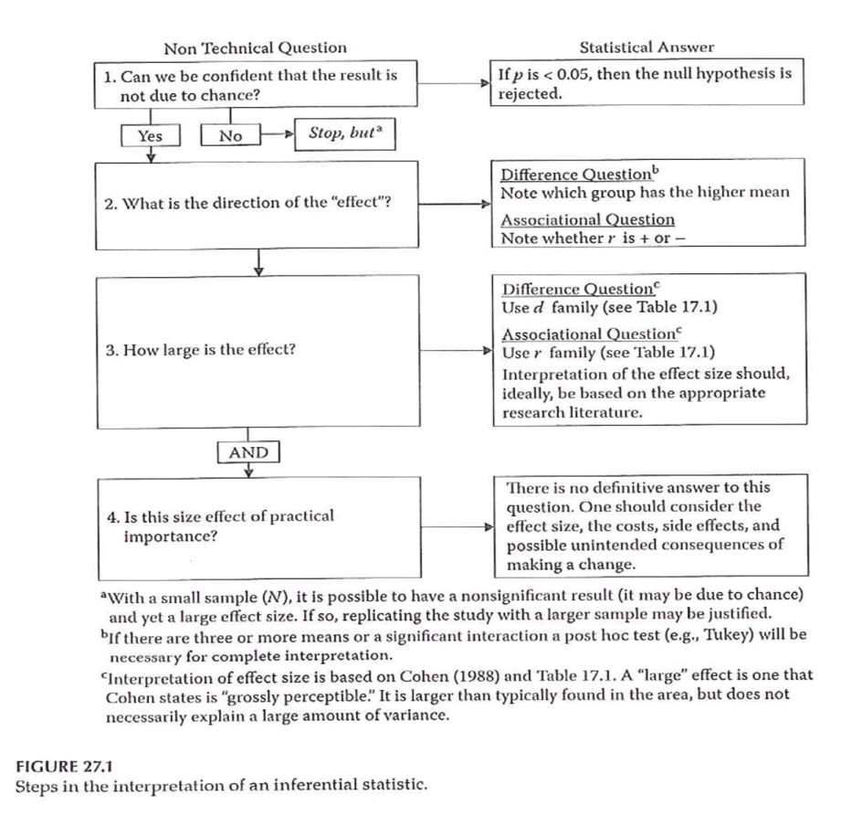
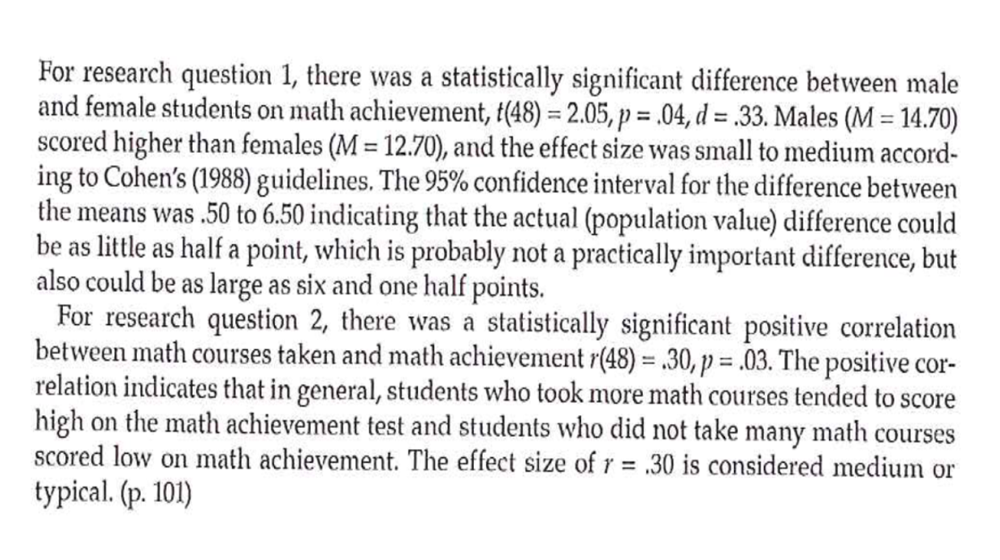
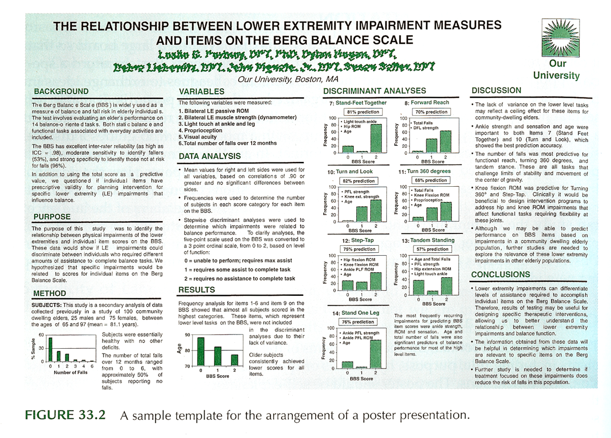
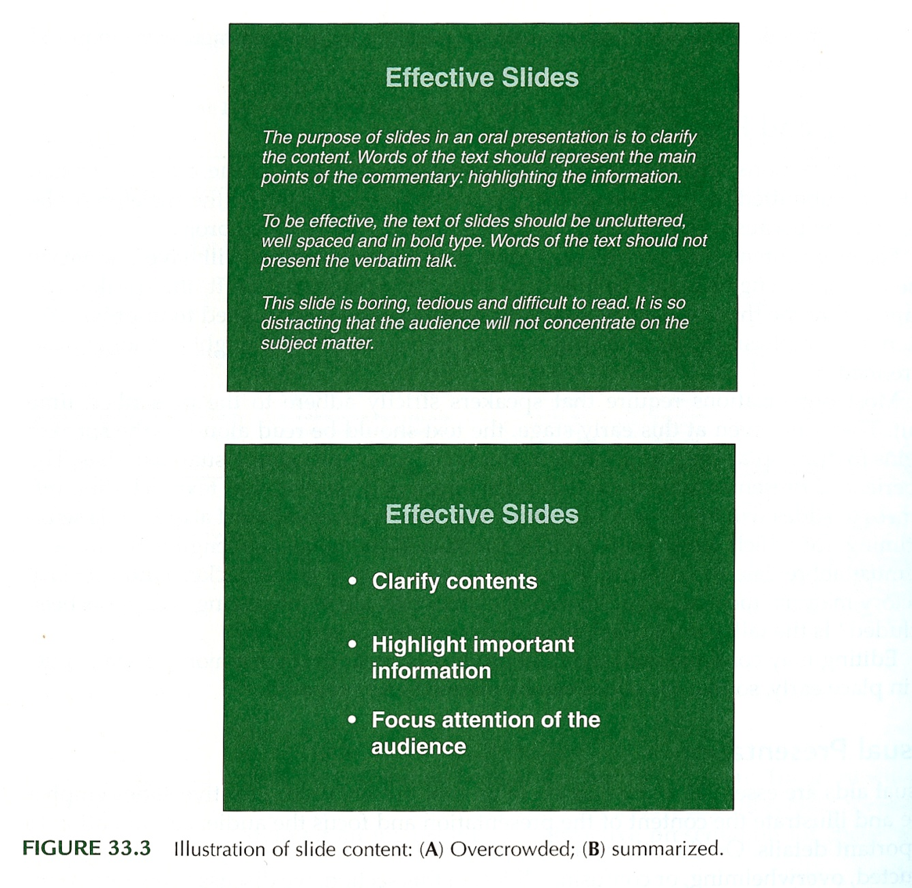

```{r echo=FALSE}
source("prelims.R", echo=FALSE)
```

***
`r read_text("objectives14")`

<div class="notes">


</div>

***
`r read_text("readings14")`

<div class="notes">


</div>

***
### Research Proposal 



<div class="notes">

+ Portney & Watkins, 2009

</div>

***
### Research Proposal 

+ Components
	+ Title
	+ Abstract
	+ Body of proposal
		+ Statement of the problem
	+ Purpose, Hypotheses, and Specific Aims
	+ Background

<div class="notes">


</div>

***
### Research Proposal 

+ Components
	+ Methods
		+ Subjects
		+ Materials
		+ Procedures
		+ Data Analysis
		+ References
	+ Informed consent plans

<div class="notes">


</div>

***
### Research Proposal 



<div class="notes">

+ Portney & Watkins, 2009

</div>

***
### Research Proposal 

+ Examples of proposal material
	+ Timeline
	+ Protocol Schedule
	+ Measures

<div class="notes">


</div>

***
### Research Proposal 

+ Administrative Support
	+ Budget - #s and justification
	+ Resources and environment
	+ Personnel
+ Proposal presentation style
	+ Format – rules and suggestions

<div class="notes">


</div>

***
### Research Proposal 

+ Examples – Other funding mechanisms
	+ National Science Foundation
	+ CDC
	+ Other government agencies
	+ Foundations
	+ Internal funding mechanisms

<div class="notes">


</div>

***
### Writing Style 

+ Proposal – “forward-looking document”
	+ Tense
		+ Statement of problem (present tense)
		+ Background (past tense)
		+ Method (future tense)
	+ Format – varies
	+ Tone
		+ Positive, persuasive, scholarly

<div class="notes">


</div>

***
### Writing Style 

+ Report – “exercise in organization and clarity of expression”
	+ Specifics
		+ People first
		+ Active vs passive voice
		+ Simplicity of language

<div class="notes">


</div>

### Writing Style



<div class="notes">


</div>

***
### Reporting Clinical Research 

+ Journal article
	+ Selecting journal
	+ Preparing the submission
		+ Structure and content (P & W, Table 33.1)

<div class="notes">


</div>

***
### Reporting Clinical Research 



<div class="notes">

.footnote[Portney & Watkins, 2009]

</div>

***
### Reporting Clinical Research 

+ Journal article
	+ Preparing the submission
		+ Structure and content (Table 33.1)
		+ Tables and graphs
	+ Publishing thesis and/or dissertation

<div class="notes">


</div>

***
### Reporting Clinical Research 



<div class="notes">


</div>

***
### Reporting Clinical Research 



<div class="notes">


</div>

***
### Reporting Clinical Research 

+ Poster presentation
	+ Content and layout
	+ Materials

<div class="notes">


</div>

***
### Reporting Clinical Research 



<div class="notes">

+ Portney & Watkins, 2009

</div>

***
### Reporting Clinical Research 

+ Oral presentation
	+ Planning and preparation
	+ Visual presentation
		+ Types of slides
		+ Limiting words
		+ Contents of slides
		+ Graphics
		+ Backgrounds and colors
	+ Rehearsal

<div class="notes">


</div>

***
### Reporting Clinical Research 



<div class="notes">

+ Portney & Watkins, 2009

</div>

***
### Final Projects 

+ Paper (up to 200 pts)
+ Class Presentation (up to 40 pts)
+ Poster (up to 10 pts)
+ Due dates
	+ Presentation & Poster – last day of class
		+ Section 0002 – Thursday, May 3, 2018
	+ Paper – Finals week
		+ Section 0002 – Tuesday , May 10, 2018

<div class="notes">


</div>

***
### Final Projects 

+ Format – Refer to the grading rubric and information in the Syllabus for web sites with relevant information
+ Presentation –
	+ Research conference style – Presentation then discussion
	+ Time: 10-min presentation
	+ Structure: Objectives, Background, Methods, Planned analyses, Implications
	+ Prepare “slides” for visual support

<div class="notes">


</div>

***
### Final Projects 

+ Poster –
	+ Overlap between poster material and presentation visual material
	+ Submit poster material as a PowerPoint file (.ppt or .pptx)
	+ Due on the day of presentations

<div class="notes">


</div>

***
### Final Projects 

+ Written Research Proposal
	+ Turn in through Turnitin link on the course Blackboard site by 5pm on the due date
	+ Structure – Refer to the grading rubric; truncated version of the five-chapter thesis format
		+ Introduction to the problem (Chapter 1)
		+ Review of the literature (Chapter 2)
		+ Description of methodology (Chapter 3)
		+ Proposed implications of the study
		+ References

<div class="notes">


</div>

***
### Final Projects 

+ Written Research Proposal
	+ Title –
		+ First chance to get reader’s attention
		+ Brief, but descriptive
	+ Abstract –
		+ Next chance to get reader’s attention
		+ Publication - May be the only part of the article read by most
		+ Proposal – needs to present a summary of the proposed study

<div class="notes">


</div>

***
### Final Projects 

+ Written Research Proposal
	+ Introduction –  (approx. 1-2 pages)
		+ Introduce the topic / Frame the problem – convince reader that there is a significant issue/concern that needs to be addressed.  “Critical need”  “So what?”
		+ How your proposed project will address the “critical need”
		+ Aims / goals / objectives of proposed study
		+ Expectations / Impact of findings

<div class="notes">


</div>

***
### Final Projects 

+ Written Research Proposal
	+ Review of the Literature –
		+ Organized to support what you want to do
		+ NOT an annotated bibliography
		+ Represents your understanding of the relevant literature
		+ Provides background to justify your proposed study
		+ Final section  -
			+ Gaps in the literature – what needs to be done
			+ How your proposed study will address those gaps
			+ Describe your research hypotheses / questions

<div class="notes">


</div>

***
### Final Projects 

+ Written Research Proposal
	+ Review of the Literature –
		+ What a literature review is NOT –
			+ Annotated bibliography
		+ Must represent your own words and thoughts –
			+ Reminder of what constitutes plagiarism

<div class="notes">


</div>

***
### Final Projects 

+ Written Research Proposal
	+ Methods
		+ Study design –
			+ Description of the overall study design - how you are going to do your study
		+ Sample –
			+ Description of who is being studied
			+ Where did they come from?
			+ Sampling method
			+ Inclusion and exclusion criteria
			+ Power analysis information could be included here

<div class="notes">


</div>

***
### Final Projects 

+ Written Research Proposal
	+ Methods
		+ Measures –
			+ Describe all the measures that will be obtained/used in the study
			+ If using established scales/measures, provide reference and general description of values that will be obtained
			+ If using measures developed for the study, provide more detail
				+ Will there be pilot testing of the measure?
			+ Organize information about measures –
				+ Outcome measures
				+ Independent variables
				+ Other measures

<div class="notes">


</div>

***
### Final Projects 

+ Written Research Proposal
	+ Methods
		+ Procedures –
			+ Description of how the study will be conducted
			+ How participants recruited and enrolled
			+ Consenting process
			+ Random assignment described if appropriate
			+ Timing information
				+ Length of intervention
				+ Timing of measurements
				+ Length of follow-up
			+ Description of groups / interventions
			+ Compensation / payment if appropriate

<div class="notes">


</div>

***
### Final Projects 

+ Written Research Proposal
	+ Methods
		+ Statistical analysis
			+ Data management and quality checks
			+ Descriptive analysis
			+ Analyses to test hypotheses / questions
			+ Description of analyses should clearly relate to each hypothesis / question
	+ Implications of your study
		+ What will be the impact of your study?
		+ What could be the next step after this study?

<div class="notes">


</div>

***
### Assignment 

+ Work on your final projects –
	+ Oral presentation
	+ Poster material
	+ Written proposal

***
`r read_text("hw14", fri[14])`

<div class="notes">


</div>

***
`r read_text("discussion14", fri[14])`

<div class="notes">


</div>

***

### Additional slides