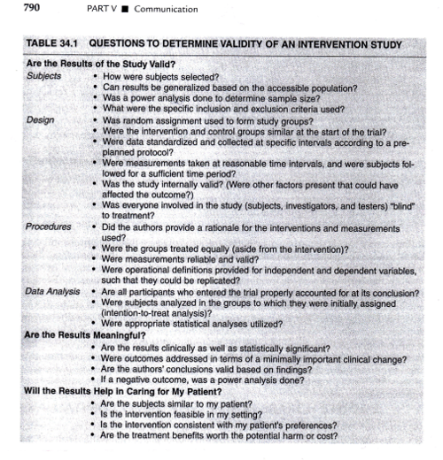

```{r echo=FALSE}
source("prelims.R", echo=FALSE)
```

***
`r read_text("objectives15")`

<div class="notes">


</div>

***
`r read_text("readings15")`

<div class="notes">


</div>

***
### Evaluating Research Reports 

+ Journal quality
+ Evaluating components
	+ What is the study about
	+ Are the results of the study valid?
	+ Are the results meaningful?
	+ What does it all mean and how does it contribute to what you want to do?

<div class="notes">


</div>

***
### Evaluating Research Reports 



<div class="notes">

+ Portney & Watkins, 2009

</div>

***
### Systematic Review / Meta Analysis 

+ Systematic Reviews
	+ What are they?
	+ What purpose do they serve?
	+ What does the “ systematic ” refer to?
	+ How does a systematic review differ from a traditional review?
	+ What does “ meta analysis ” refer to?
	+ How does it relate to “ systematic review ” ?
	+ P&W, Fig 16.1

<div class="notes">


</div>

***
### Systematic Review / Meta Analysis 

+ How to go about doing a systematic review
	+ Planning process – Asking the question
		+ Start with well-defined question/purpose statement
		+ If review of intervention, specify: treatment, outcome measures, and population characteristics
		+ If review of prognosis, specify: prognostic factors and outcomes of interest
		+ Can also be done for qualitative studies/outcomes

<div class="notes">


</div>

***
### Systematic Review / Meta Analysis 

+ How to go about doing a systematic review
	+ Selection criteria
		+ What makes up the “ subjects ” in a systematic review?
		+ Specify inclusion and exclusion criteria
			+ Criteria could be based on various things (e.g., types of studies, participant characteristics, interventions, outcomes)
		+ Types of studies – what kind of studies to include -  published only; RCT only?
			+ What is the level of published evidence?
				+ Cochrane Collaboration – RCT
				+ AHRQ – nonrandomized studies

<div class="notes">


</div>

***
### Systematic Review / Meta Analysis 

+ Levels of evidence (Table 16.1 handout / Table 26.1 textbook)
	+ Highest level of evidence
		+ Intervention vs Prognosis vs Diagnosis
	+ Subcategories
		+ Systematic reviews vs individual studies
	+ Categories can be identified as – (minus)
		+ Weaker evidence
			+ Wider confidence intervals
			+ Inconsistent findings
		+ Overall grade

<div class="notes">


</div>

***
### Systematic Review / Meta Analysis 

+ Levels of evidence – Based on:
	+ Quantitative vs Qualitative Evidence
	+ Internal Validity vs External Validity
	+ Multiple Studies vs Single Study
	+ Large Sample Size vs Small Sample Size

<div class="notes">


</div>

***
### Systematic Review / Meta Analysis 

+ Levels of evidence – Problems:
	+ Focus on design rather than results
		+ Significance of results
		+ Direction of differences / relationship
		+ Effect size
		+ Practical importance
	+ Special populations
	+ Special applications – education / community

<div class="notes">


</div>

***
### Systematic Review / Meta Analysis 

+ Types of participants
+ Types of interventions
	+ and comparison treatment
	+ Define “ intervention ” in a way that allows a reasonable selection of studies to include
+ Types of outcome measures
	+ Usually have a specific outcome measure all studies have in common; other outcomes may vary

<div class="notes">


</div>

***
### Systematic Review / Meta Analysis 

+ Search strategy
	+ Goal – get a comprehensive list of relevant reports/publications
	+ Where to look?
	+ What search terms to use?
	+ Limitations? (e.g., language)
	+ Report specifics of search process
	+ Build on previous reviews

<div class="notes">


</div>

***
### Systematic Review / Meta Analysis 

+ Search strategy
	+ “ Grey literature ” – how this can impact findings of reviews
	+ Conducting the search –
		+ Include all relevant
		+ Exclude all irrelevant
			+ Document what was excluded and why
	+ Publication bias – value in looking for unpublished sources

<div class="notes">


</div>

***
### Systematic Review / Meta Analysis 

+ Evaluating methodologic quality
	+ Process – usually involves 2 independent reviewers
		+ Assess content;
		+ Rate quality and applicability
	+ Data extraction form (Fig 16.2)

<div class="notes">


</div>

***
### Systematic Review / Meta Analysis 

+ Evaluating methodologic quality
	+ Types of study bias related to internal validity
		+ Selection bias – how comparison groups are formed
			+ Random assignment
		+ Performance bias – differences in the provision of care to experimental and control groups
			+ Blinding procedures
		+ Attrition bias – differential loss of participants between groups
			+ Intention to treat analysis
		+ Detection bias – outcome assessment differs across groups

<div class="notes">


</div>

***
### Systematic Review / Meta Analysis 

+ Evaluating methodologic quality
	+ May use evaluation of study validity as part of the selection criteria of which studies to include
	+ Rating scales – describe criteria and methods used
		+ Jadad Scale (Table 16.2) –randomization, blinding, and attrition
		+ PEDro Scale (Table 16.3) – randomization, blinding, attrition, design, and statistics
		+ QUADAS Scale (Table 16.4) – used for studies of diagnostic test accuracy

<div class="notes">


</div>

***
### Systematic Review / Meta Analysis 

+ Evaluating methodologic quality
	+ Presentation of methodologic quality (Table 16.5)
		+ Show scores for each criterion and total
	+ Data synthesis – determine if and how studies can be synthesized
		+ Degree of heterogeneity/homogeneity?
		+ How consistent are findings? (ex. Table 16.6)
			+ What can affect findings? Sample size, choice of measures, sample characteristics

<div class="notes">


</div>

***
### Systematic Review / Meta Analysis 

+ Evaluating methodologic quality
	+ Discussion & conclusions
		+ Integrate the findings
		+ State the level of knowledge
		+ Recommend future studies

<div class="notes">


</div>

***
### Systematic Review / Meta Analysis 

+ Meta-analysis
	+ Extension of systematic review
		+ Incorporates statistical combination of study findings
		+ Can be done for reviews of
			+ Clinical trials
			+ Evaluation of diagnostic tests
			+ Epidemiologic studies

<div class="notes">


</div>

***
### Systematic Review / Meta Analysis 

+ Meta-analysis
	+ Necessary criteria for meta-analysis vs systematic review –
		+ Studies meet homogeneity criteria
	+ Major advantages for meta-analysis
		+ Increase power
		+ Improve estimates of effect size
		+ Resolve uncertainty when conflicting results occur
		+ Improve generalizability of findings

<div class="notes">


</div>

***
### Systematic Review / Meta Analysis 

+ Meta-analysis
	+ Necessary criteria for meta-analysis vs systematic review –
		+ Evaluate heterogeneity of the treatment effect across the studies in the review
		+ Heterogeneity due to –
			+ Random effect due to chance differences
			+ Study samples drawn from truly different populations
		+ Heterogeneity statistic – most often chi-square
			+ Nonsignificant – there is a common treatment effect across the studies; observed differences represent chance differences

<div class="notes">


</div>

***
### Systematic Review / Meta Analysis 

+ Meta-analysis
	+ Effect size – estimate of the magnitude of difference between groups or the effect of the intervention
		+ Continuous measure – means or correlations
		+ Dichotomous measure – relative risk or odds ratios
	+ Combine estimates from individual studies to reflect overall effect size of the independent variable (e.g., intervention)

<div class="notes">


</div>

***
### Systematic Review / Meta Analysis 

+ Meta-analysis
	+ Effect size index
		+ Created for the data in each study so studies can be compared and combined
		+ Based on
			+ Means (quantitative variables)
			+ Proportions / frequencies (categorical data)
			+ Correlation values (measures of association)

<div class="notes">


</div>

***
### Systematic Review / Meta Analysis 

+ Meta-analysis
	+ Weighting effect size
		+ Combine effect size for each study to form common effect size estimate
		+ Calculation adjustments – used to weight the contributions of each study

<div class="notes">


</div>

***
### Systematic Review / Meta Analysis 

+ Meta-analysis
	+ Reporting meta-analysis results
		+ Forest plot (Table 16.7)
		+ Sensitivity analysis – would the conclusion be different if the method of analysis was changed; if key assumptions or decisions differed?
			+ Systematic review key assumptions – include criteria for inclusion & exclusion of studies
			+ Meta-analysis key assumptions – reanalyze using different statistical approaches
			+ If findings remain consistent – strengthens conclusions
			+ If findings change – interpret with caution

<div class="notes">


</div>

***
### Systematic Review / Meta Analysis 

+ Appraisal of systematic reviews and meta-analyses
	+ Need to critically appraise
		+ Are they valid in their presentation of findings?
	+ Checklist for critical appraisal (Table 16.8)
		+ Are the results of the study valid?
		+ What are the results?
		+ Will the results help me in caring for my patients?

<div class="notes">


</div>

***
### Literature Reviews 

+ Reviewing the literature
	+ What is known
	+ What questions remain
	+ Evaluating research reports
		+ Journal quality
		+ What is the study about?
		+ Are the results of the study valid?
		+ Are the results meaningful?
		+ What does it all mean and how does it contribute to what you want to do?

<div class="notes">


</div>

***
### Evaluating Research Validity 

+ Evaluation of the quality of the design and analysis of a study
+ GM&L framework –
	+ designed to be used with both experimental and non-experimental research
+ Assess research validity
	+ Series of continua
+ Emphasis on methods and results

<div class="notes">


</div>

***
### Evaluating Research Validity 

+ GM&L framework –
	+ 19 questions
	+ 8 rating scales
+ 19 questions - 3 main groups
	+ Key aspects of the design and methods (1 – 8)
	+ Evaluative ratings (9 – 16)
	+ General evaluation questions (17 – 19)
+ “… merit or worth of the study as a whole…”

<div class="notes">


</div>

***
### Evaluating Research Validity 

+ GM&L framework document
	+ Design and methods
		+ Variables and measurement levels
		+ RH/RQ, Approach, & Design
		+ Measurement reliability & validity

<div class="notes">


</div>

***
### Evaluating Research Validity 

+ GM&L fram ework document
	+ 4 dimensions of research validity
		+ Overall measurement reliability and statistics
		+ Internal validity
		+ Overall measurement validity and constructs
		+ External validity
	+ General evaluation issues
		+ Peer review
		+ Theoretical importance / practical relevance
		+ Interpretation

<div class="notes">


</div>

***
### Ioannidis Article 

+ Purpose – evaluate the replication of clinical research studies with highest citation impact
+ Method
+ Classification of original studies
	+ Negative
	+ Unchallenged
	+ Contradicted
	+ Initially stronger effects
	+ Replicated effects

<div class="notes">


</div>

***
### Ioannidis Article 

+ Findings –
	+ N = 49
		+ Negative – n = 4
	+ Efficacy claims – n = 45
		+ 39 – RCT
		+ 4 – Prospective cohorts
		+ 2 – Case series

<div class="notes">


</div>

***
### Ioannidis Article 

+ Findings –
	+ Efficacy claims – n = 45
		+ 20/45 (44%) – replicated
		+ 11/45 (24%) – unchallenged
		+ 7/45 (16%) – contradicted
		+ 7/45 (16%) – initially stronger effects

<div class="notes">


</div>

***
### Ioannidis Article 

+ Findings –
	+ Nonrandomized studies – n = 6
		+ 5/6 (83%) – contradicted or initially stronger
	+ Randomized studies – n = 39
		+ 9/39 (23%) – contradicted or initially stronger
		+ Study characteristics – 9 vs 30
			+ Sample size – p = .009 (smaller)
			+ Publication date – p = .06 (older)
			+ Citations per year – p = .07 (fewer citations per year)

<div class="notes">


</div>

***
### Assignment 

+ Work on poster material and presentation 
+ Oral Presentation & Poster – Last week of classes
	+ Section 0002 – Thursday, May 3, 2018
+ Final written proposal – Finals week
	+ Section 0002 - Tuesday, May 8, 2018

<div class="notes">


</div>

***
`r read_text("hw15", fri[15])`

<div class="notes">


</div>

***
`r read_text("discussion15", fri[15])`

<div class="notes">


</div>

***

### Additional slides