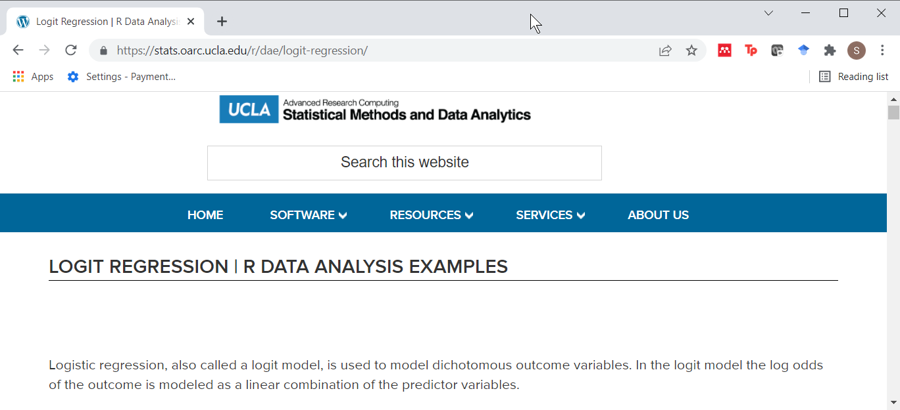
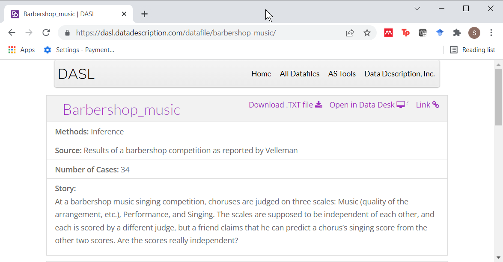
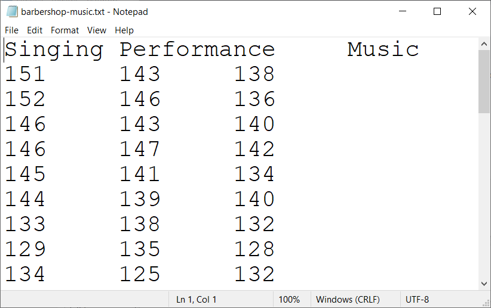
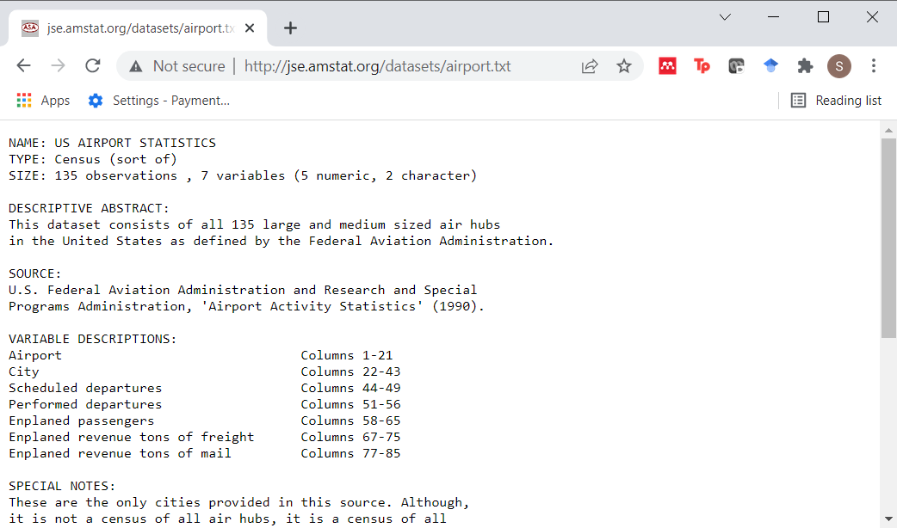
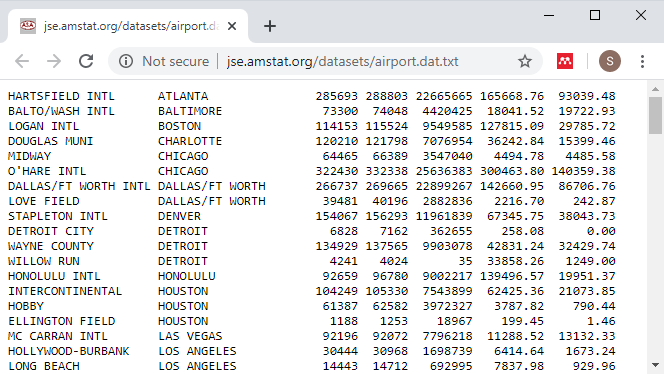
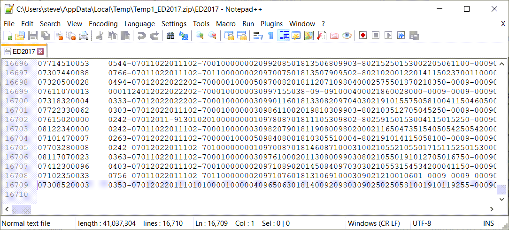

### Text files (1/2)

+ Advantages
  + Easy import into many programs
  + Review using notepad
+ Disadvantages
  + Bigger size
  + Slower to import

<div class="notes">

One of the most important skills you will learn in this class is how to read data from text files. Text files are commonly used for data storage because they are easily imported into a variety of different programs. You can often peek at a text file using a simple program like Notepad in order to get a quick feel for what the data looks like.

Text files are popular because just about any program out there can read a text file. You can import a non-text format, one that has special binary characters, but this often limits the types of programs that can read the data. So people who want to make their data widely available will almost store that data in a text file.

Text files do usually take more room than other formats. As cheap as storage is becoming, this may not be that serious a problem. You also need more computing time and power, but again this less of a problem as computers get faster and more powerful.

</div>

### Text files (2/2)

+ Wide range of formats
  + Delimited
  + Fixed width
+ First row for variable names
  + Optional but recommended
+ Always look for a data dictionary

<div class="notes">

Text files come in a variety of format. A delimited file uses a special character, often a comma, to designate where one data value ends and the next one begins. In contrast, a fixed width file requires every variable to occupy a particular column or columns.

Many text files include the names of the variables in the first row of text. This is not required, but it is strongly recommended. I will talk about at least one example where you don't have the names of the variables in the first line of text.

Not every data set that you find is going to have a data dictionary but always look for it, because often that will give you some helpful advice. It will make it easier for you to read the data into a program like R. 

</div>

### Preliminary code

```{r setup}
suppressMessages(
  suppressWarnings(
    library(tidyverse)))
options(width=45)
R.version.string
Sys.Date()
```

<div class="notes">

We are loading the tidyverse packages again. The options command sets a width that works well with PowerPoint, but I do not recommend it for your homework which will create an html document that you then convert to pdf format.

The version and date should be part of any R program.

</div>

### Read in comma separated values

+ Type the following into notepad.

```{r csv, echo=FALSE, comment=""}
tx <- read_lines("../data/simple.csv")
cat(tx, sep="\n")
```

+ Save it
  + in the data directory
  + filename: simple.csv

<div class="notes">

In notepad or another text editor, type in the following
values.

x,y

1,4

2,8

3,12

4,16

and save the file using the name simple.csv. Note the directory that you are saving it in. Ideally, it should be in a folder named "data".


</div>

### the read_csv function 

```{r read-csv}
fn <- "../data/simple.csv"
raw_data <- read_csv(fn,
  col_types="nn")
```

<div class="notes">

I want to show you how to read data using the readr library. The readr library is part of the tidyverse, and effort by Hadley Wickham and others to modernize the R language. 

Comma separated files are so common that R has several dedicated functions for reading them. There is read.csv, which is part of the base R package, and read_csv, which is part of the readr library.

The readr package has several arguments that make your life easier, but the most important, when you are beginning is the col_types argument. if you specify col_types="nn", that tells R to expect numbers (rather than strings or dates) for all of the columns that you input. You'll see in just a bit how to change this if some of your data is strings.

</div>

### Display the comma separated data

```{r display-csv}
raw_data
```

<div class="notes">

This program reads in the data and displays it. You see the X values one, two, three, four. The Y values: four eight, twelve, and sixteen.

Okay, not too exciting. It's a small data set. You will likely work with some more interesting data sets, but I wanted to show you how this works from a very basic purpose perspective. 

</div>

### Break #1

+ What have you learned
  + Advantages and disadvantages of text files
  + How to read in a comma separated value file
+ What's next?
  + Reading space delimited files
  

### Space delimited files

+ Type the following into notepad.

```{r space-delimited, echo=FALSE, comment=""}
tx <- read_lines("../data/simple.txt")
cat(tx, sep="\n")
```

+ Save it
  + in the data directory
  + filename: simple.txt

<div class="notes">

Comma separated values are one of the most common formats you will encounter, but it is not the only format out there.

Now try something different. Type in the same data, but use a spaces between each number rather than a comma. Notice that there are sometimes a single blank between two numbers and sometimes two blanks. This is commonly done with some text files so that the data is easier to read.

We're going to give the file we create a different name. Instead of simple.CSV, we are going to call it simple.txt.

</div>

### Using the read_delim function

```{r txt}
fn <- "../data/simple.txt"
raw_data <- read_delim(fn, 
  delim=" ",
  col_types="nn")
```

<div class="notes">

Here is how you would use read_delim to read this file. The argument delim=" " tells R to look for exactly one blank between two numbers.

</div>

### Display space-delimted data

```{r display-space}
raw_data
```

<div class="notes">

The data has been read in correctly.

</div>

### Break #2

+ What have you learned
  + Reading space delimited files
+ What's next?
  + Reading tab delimited files  


### Tab delimited files

+ Use the tab key instead of the space bar.

```{r tab, echo=FALSE, comment=""}
tx <- read_lines("../data/simple.tsv")
cat(tx, sep="\n")
```

+ Save as simple.tsv

<div class="notes">

Tabs are little bit different and you might want to listen to the live video where I show how the tab key works.

Type the following into notepad and what appears to be multiple blanks, I want you to press the tab key, but only once.

</div>

### Using the read_tsv function

```{r tsv}
fn <- "../data/simple.tsv"
raw_data <- read_tsv(fn, 
  col_types="nn")
```

<div class="notes">

The read_tsv function works when you have a tab character as the delimiter. It uses the same arguments as the read_csv function.

</div>

### Display tab-delimited data

```{r display-tab}
raw_data
```

<div class="notes">

The data has been read in correctly.

</div>

### Break #3

+ What have you learned
  + Reading tab delimited files  
+ What's next?
  + Anything can be a delimiter

### Anything can be a delimiter

+ Type the following into notepad

```{r anything, echo=FALSE, comment=""}
tx <- read_lines("../data/tilde.txt")
cat(tx, sep="\n")
```

+ Save as tilde.txt

<div class="notes">

Type in the same data, but using the tilde (~) as a separator (e.g., 1~4). Save the file as tilde.txt.

Here is how you would use read_delim to read this file.

</div>

### Using the read_delim function with delim="~"

```{r tilde}
fn <- "../data/tilde.txt"
raw_data <- read_delim(fn,
  delim="~",
  col_types="nn")
```

<div class="notes">

The data reads in just fine. Why would you use a tilde as a delimiter? Sometimes your data itself includes delimiters like spaces and commas, and then you might want to choose an obscure out of the way symbol to serve as a delimiter.

Another obscure character that is sometimes used as a delimiter is the veritical bar (|).

</div>

### Display tilde-delimted data

```{r display-tilde}
raw_data
```

<div class="notes">

The data has been read in correctly.

</div>

### Break #4

+ What have you learned
  + Anything can be a delimiter
+ What's next?
  + Reading fixed width files

### Reading fixed width format files

+ Type the following into notepad
  + Space between the 1 and 4
  + Space between the 2 and 8
  + No space between the 3 and 12
  + No space between the 4 and 16

```{r fixed, echo=FALSE, comment=""}
tx <- read_lines("../data/fixed.txt")
cat(tx, sep="\n")
```

+ Save as fixed.txt


<div class="notes">

Here's another variation.

Sometimes you will get a file with no delimiters to save space. This requires that each variable takes up a fixed number of columns and that information is often specified in a separate file.

Create a fixed width file in notepad with the following lines.

1 4

2 8

312

416

and store it as fixed.txt.

Okay, I deliberately did not put the variable names as the first line.

Fixed width files often do not include the variable names in the file itself.

</div>

### The read_fwf function 

```{r read_fwf}
fn <- "../data/fixed.txt"
raw_data <- read_fwf(fn, 
  fwf_cols(1, 2),
  col_types="nn")
```

<div class="notes">

Use the read.fwf (fwf stands for fixed width format) function to read this data.

</div>

### Display the fixed-width data

```{r disaply-fwf}
raw_data
```

<div class="notes">

R does know what to name the variables so it decides to use the default name V1 for the first variable in V2 for the second variable. I do not recommend that you do this if you're creating a file, and if someone else did this, shame, shame on them.

</div>

### Changing names from the default

```{r names}
names(raw_data) <- c("x", "y")
raw_data
```

<div class="notes">

When this happens, add more descriptive names than X1 and x2 as quickly as possible.

Now I have to confess that x and y are not any more descriptive than x1 and x2, but you get the idea.

</div>

### Break #5

+ What have you learned
  + Reading fixed width files
+ What's next?
  + Multiple blanks in a text file
  + Reading character data

### A special case

+ Type the following into notepad
  + Three spaces between the 1 and 4
  + Three spaces between the 2 and 8
  + Two spaces between the 3 and 12
  + Two spaces between the 4 and 16

```{r white-space, echo=FALSE, comment=""}
tx <- read_lines("../data/white-space.txt")
cat(tx, sep="\n")
```

+ Save as white-space.txt


<div class="notes">

Here's a special case of fixed width format.

Sometimes a fixed width file will include enough blanks so that each data value is separated from any other data value. This requires more room, but it makes the data file easier to read.
Create a fixed width file in notepad with the following lines.

1   4

2   8

3  12

4  16

and store it as white-space.txt.

</div>

### White-space delimited files

```{r read_table}
fn <- "../data/white-space.txt"
raw_data <- read_table(fn,
  col_names=c("x", "y"),                     
  col_types="nn")
```

<div class="notes">

The read_table function will use "white space" as a delimiter. White space is defined as one or more blanks or tabs or even a mix of spaces and tabs.

Note you can also use col_names=FALSE here.

Now, you could also use read_fwf for this dataset.

</div>

### Display the white-space data

```{r disaply-white-space}
raw_data
```

<div class="notes">

The data has been read in properly.

</div>

### Reading character data

+ Also know as
  + string data, or
  + alphanumeric data
+ Character data is data composed of 
  + letters, or
  + a mix of letters, symbols, and numbers
+ Easier in R than in SAS

<div class="notes">

Character data is data that is composed entirely of the letters A-Z upper case and a-z lower case. So a person's name (Steve) is character data. You can also mix in numbers. So a person's address (1600 Pennsylvania Avenue) is character data. A phone number is character data because it might include parentheses or dashes.

R can handle character data more easily than SAS. Often you do not have to do anything and R will figure things out for you. In SAS you ALWAYS have to designate character data. When the lengths of the character data vary, you have to be careful. When the length of the characters is greater than 8, you have to be especially careful.

R can handle varying lengths easily and characters of length greater than 8 easily.

</div>

### Potential problems

+ Values=1, 2, 3 or more
+ Embedded blanks (Steve Simon)
+ Delimiters (Simon, Steve)
+ Recommendation, use quotes
  + "1", "2", "3 or more"
  + "Steve Simon"
  + "Simon, Steve"

<div class="notes">

There still are some issues, such as when the data is mostly numeric, and only sometimes character. An example would be data that has the values 1 (a number), 2 (also a number), and 3 or more (character data).

Embedded blanks are sometimes a problem (Steve space Simon) as are character data that include commonly used delimiters like a comma (simon, comma Steve).

The best thing to do, if there is any potential problems is to enclose your data in quotes.

</div>

### String data

+ Type the following into notepad.

```{r string-data, echo=FALSE, comment=""}
tx <- read_lines("../data/string.csv")
cat(tx, sep="\n")
```

+ Save it
  + in the data directory
  + filename: string.csv

<div class="notes">

</div>

### Using string data

```{r string}
fn <- "../data/string.csv"
raw_data <- 
  read_csv(fn, 
  col_types="ccn")
```

<div class="notes">

</div>

### Display string data

```{r display-string-data}
raw_data
```

<div class="notes">

The data has been read in correctly.

</div>

### Break #6

+ What have you learned
  + Multiple blanks in a text file
  + Reading character data
+ What's next?
  + Advanced options when reading
  + Writing text files

### Advanced options when reading

+ col_select=
+ na=
+ name_repair=
+ skip=

<div class="notes">

There are some nice options that I won't show in this video, but they are still worth noting.

You can use the col_select argument to read in only some of the columns of data. 

Use the na argument to designate codes for missing values. By default, R looks for NA or a width of zero. But sometimes, other symbols, such as an asterisk or a dot may represent missing values.

You can use the name_repair argument to suggest how to handle names that are duplicates or which violate the rules in R for variable names.

You can use the skip argument to ignore a certain number of rows before reading data.

</div>

### Writing text files

+ Similar structure to read functions
  + write_csv
  + write_delim
  + write_tsv

<div class="notes">

If you want to write a text file, you can use the write_csv, write_delim, or write_tsv functions. Look up the help files on these functions. We'll create a small data frame and store it in a comma delimited and tab delimited format.

</div>

### Writing text files 

```{r write-text}
raw_data <- data.frame(
  x=c(1, 2, 3, 4), 
  y=c(4, 8, 12, 16))
fn <- "../results/output_data.txt"
write_csv(raw_data, fn)
```

<div class="notes">

Open these files in notepad to see what they look like.

</div>

### Writing text files

```{r output1, echo=FALSE}
tx <- read_lines(fn)
cat(tx, sep="\n")
```

<div class="notes">

If you opened up the data in notepad or some other program, you would see a space delimited file. You can change the delimiter, among other things

</div>

### Break #7

+ What have you learned
  + Advanced options when reading
  + Writing text files
+ What's next?
  + Some real world examples


### Example #1, binary.csv



<div class="notes">

Let's look at some real world examples. The first one comes from one of the pages at the UCLA site on data analysis examples.

</div>

### Example #1, the data

```{r ex1, echo=FALSE}
fn <- "../data/binary.csv"
tx <- read_lines(fn)
cat(tx[1:6], sep="\n")
```

<div class="notes">

Peeking at the first six lines of data, you can see clearly that it is uses comma delimiter and the first row of data contains the variable names.

</div>


### Example #1, the data dictionary

+ No formal data dictionary, but here is a description
  + "This dataset has a binary response (outcome, dependent) variable called admit. There are three predictor variables: gre, gpa and rank. We will treat the variables gre and gpa as continuous. The variable rank takes on the values 1 through 4. Institutions with a rank of 1 have the highest prestige, while those with a rank of 4 have the lowest."

<div class="notes">

There is no formal data dictionary, which is a shame, but you can find a brief description on a second page where this data set is used.

</div>

### Example #1, the code

```{r read-binary}
fn <- "../data/binary.csv"
raw_data <- read_csv(fn,
  col_types="nnnn")
```

<div class="notes">

Choose the read_csv function and specify four numeric variables.

</div>


### Example #1, the output

```{r display-binary}
raw_data
```

<div class="notes">

The read.csv file does a fine job here.

</div>

### Example #2, barbershop-music.txt


### Example #2, the data file



<div class="notes">

This is a second dataset. Looking at it in notepad, it looks like it is a tab delimited file. But you need to fix the file. The first two lines accidentally got stuck together.

</div>

### Example #2, the data file, fixed



<div class="notes">

This is what the fixed file looks like. Normally, I discouraging modifying the data before you input it into R, but here a quick fix makes sense.

</div>

### Example #2, the data dictionary

+ No data dictionary
  + Brief description: "At a barbershop music singing competition, choruses are judged on three scales: Music (quality of the arrangement, etc.), Performance, and Singing."

<div class="notes">

There is no formal data dictionary, but the website does offer a brief description.

</div>

### Example #2, the code

```{r read-tsa-3}
fn <- "../data/barbershop-music.txt"
raw_data <- read_tsv(fn,
  col_types="nnn")
```

<div class="notes">

The read_tsv function works well here.

</div>

### Example #2, the output

```{r display-example-2}
raw_data
```

<div class="notes">

The data appears to have been read in nicely.

</div>

### Example #3, airport.txt



<div class="notes">

The third example comes from the Journal of Statistics Education website.

</div>

### Example #3, the data file



<div class="notes">

This is a third data set. Notice that there are no variable names at the top of the file.

</div>

### Example #3, the data dictionary

+ Here is an excerpt from the data dictionary.

```{}
VARIABLE DESCRIPTIONS:
Airport                          Columns 1-21
City                             Columns 22-43 
Scheduled departures             Columns 44-49 
```

<div class="notes">

This dataset has a very nice data dictionary. From the description, you can tell that it is a fixed width format.

</div>

### Example #3, the code

```{r airport}
fn <- "../data/airport.txt"
raw_data <- read_fwf(fn, 
  fwf_cols(21, 22, 6, 7, 9, 10, 10),
  col_types="ccnnnnn")
```

<div class="notes">

You have to do a bit of math here. If the first variable ends in column 21 and the second variable ends in column 43, then the number of columns for the second variable is 43-21.

</div>

### Example #3, the output

```{r airport-print}
raw_data
```

### Links for examples 1-3

Data file links

1. https://stats.idre.ucla.edu/stat/data/binary.csv
2. https://dasl.datadescription.com/download/data/3061
3. http://jse.amstat.org/datasets/airport.dat.txt

Data dictionary links

1. https://stats.idre.ucla.edu/r/dae/logit-regression/
2. https://dasl.datadescription.com/datafile/barbershop-music/
3. http://jse.amstat.org/datasets/airport.txt

### Break #8

+ What have you learned
  + Some real world examples
+ What's next?
  + Some general advice

### Should I download before reading?
+ Read directly from website
  + Convenient
  + Updates incorporated at each run
+ Download then read
  + Downloaded file doesn't disappear
  + Avoid repeated long downloads
  + Work even when Internet connection is down
  
<div class="notes">

R gives you the option of reading a file on your computer or reading it from a website. For small datasets that you only use once (such as for your homework assignments), it doesn't matter. For larger files and repeated data analyses, there are some advantages to reading directly from the website and some advantages to downloading the file to your computer. 

Reading directly from the website is convenient. You don't have to figure out where to store your downloaded file. If the website updates the file on a regular basis, reading directly always insures that you have the most current data.

If you download the file and then read it, you provide yourself with some insurance against the website disappearing. If the download takes a long time, then you only have to endure that delay once. Finally, a downloaded file allows you to work when an Internet connection is not available, such as during a plane flight (though many airlines will now let you connect while in the air).

</div>

### Disadvantages of fixed width formatting?
+ Confusing
  + What is 312? 
    + 3, 1, and 2?
    + 31 and 2?
    + 3 and 12?
    + 312?
+ More work
+ Prone to errors

<div class="notes">

When you have no delimiters, it is easy to get confused. The third line, for example, of our simple data file is "312". That could be three numbers: 3, 1, and 2. It could be two numbers: 31 and 2? Or maybe 3 and 12? Or it could be a single number: 312. In a small dataset, you won't get confused, but you might with a larger dataset.

It's also more work because you have to specify the number of columns that each variable uses. That's not trivial for a large file.

The fixed width format is also more prone to errors. If you get the columns wrong, you might truncate some of your data.

</div>

### Example where fixed width formatting is needed.



<div class="notes">

Here's practical example where you really might need fixed width formatting. This is data from Emergency Department visits in a CDC survey. There are over 16,000 rows, which is bad enough. But each row (except the last one) has over 2,400 columns. These columns contain information for over 900 variables.

If you were to use delimiters in this file, you'd have to add 900 commas or 900 tabs or 900 spaces or 900 tildes to each and every line. That works out to be 1.4 million commas across the entire file. That's a substantial increase to the size of an already very large and unwieldy file.

</div>

### No data dictionary?
+ Peek at file
  + Same number of delimiters on each line
+ Tabs versus multiple blanks are hard to distinguish
  + Tab delimited?
  + Space delimited?
  + Fixed width format?
  + http://www.pmean.com/12/pesky.html

<div class="notes">

Many files that you find on the Internet are missing any documentation or the documentation fails to help you figure out what approach to use to import the data. If that's the case, don't despair. There are several common sense things you can try.

First, peek at the file and see if there are any obvious delimiters. It's important that you have the exact same number of delimiters on each line of data. If you think the comma is the delimiter, then if there are five commas on one line, then every line should have five commas. The exception would be delimiters found inside quotes.

Tabs versus multiple blanks are hard to distinguish. This sometimes means that you will have difficulty telling whether to use a tab delimited file, a space delimited file, or a fixed width file. I have a web page that talks about this in detail. 

</div>

### No data dictionary?
+ Experiment
  + Read warnings carefully
+ If needed, edit the file manually
  + Simple edits of one or two offending lines
  + Global search and replace
    + Change tabs to blanks
    + Change multiple blanks to single blank

<div class="notes">

There's nothing wrong with experimenting. Just pick one approach and try it. If you get an error message or the data is garbled, try a different approach. If you get warnings rather than errors, things may be okay, but look carefully at the warning message and double your vigilance efforts before you start analysis.

If all else fails, go in and edit the file manually. This helps if there are just a couple of rows in the file that are causing you heartburn. Usually the error or warning message will give you enough of a hint that you locate the offending lines. If there are problems on every line or almost every line, then sometimes a global search and replace works well.

</div>

### Troubleshooting

+ Multiple data read in as single variable.
+ Lots of missing values

### Summary
+ read.csv for comma delimited files
+ read.table for other delimiters
  + Beware the tab
+ read.fwf for fixed width files
+ write with write.csv, write.table

<div class="notes">

Read data from text files is an important survival skill in R. Use the read.csv function for comma-delimited files. This is the most common format for text files.

Use read.table for other delimiters. Watch out for tab delimited files.

Use read.fwf for fixed width files.

If you need to write text files, the write.csv and write.table functions provide options similar to the two read functions.

</div>
