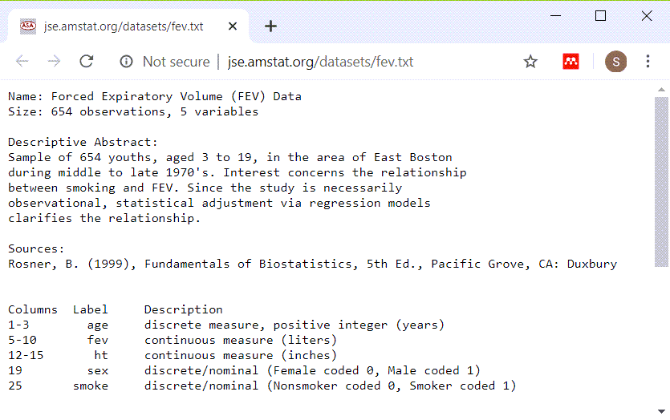

### Setup

```{r setup, echo=FALSE}
knitr::opts_chunk$set(echo=TRUE)
options(width=45)
``` 

<div class="notes">

Here are some options that I set to make the Powerpoint slides look nice.

</div>

### Introduction

This Powerpoint presentation was created using an R Markdown file.

```{r r-version-and-current-date}
R.version.string
Sys.Date()
```

<div class="notes">

Like the earlier presentations, this Powerpoint file was created using Rmarkdown.

</div>

### Some simple hypothesis tests
+ t.test
+ regression
+ ANOVA

<div class="notes">

I want to illustrate some simple hypothesis tests that you can run in R.

</div>

### FEV data
+ FEV dataset
  + http://www.amstat.org/publications/jse/datasets/fev.dat.txt
+ FEV data dictionary
  + http://ww2.amstat.org/publications/jse/datasets/fev.txt

<div class="notes">

I will illustrate these tests using a publicly available data set looks at pulmonary function in a group of children. The acronym FEV stands for Forced Expiratory Volume and represents how air you can blow out of your lungs.

</div>

### FEV data dictionary



<div class="notes">

This dataset has 654 rows and 5 variables: age (in years), fev (in liters), height (in inches), sex, and smoking status. Both sex and smoking status are categorical and use number codes. 

</div>

### Peek at FEV dataset


<div class="notes">

This is a listing of the first few rows. It could be a tab delimited file or a fixed width file. If you look carefully at the data, you will see that there are blanks and no tabs. So this is a file that you can read in most easily using a fixed width format.

</div>

### read in the FEV data set

```{r read_fev}
fn <- "http://www.amstat.org/publications/jse/datasets/fev.dat.txt"
fev <- read.fwf(file=fn, widths=c(3, 7, 5, 4, 6), header=FALSE, stringsAsFactors=FALSE)
names(fev) <- c("age","fev","ht","sex","smoke")
head(fev)
```

<div class="notes">

If you count carefully, you will see that the first three columns represent the first variable, you need seven more columns for the second variable, and so forth. Print out the first few lines of data to be sure.

</div>

### Display the bottom of FEV data

```{r fev-tail}
tail(fev)
```

<div class="notes">

It's always good to view the last few lines of data as well.

</div>

### t-tests

+ Does average fev differ between smokers and non-smokers?
  + Use the t.test function
  + First, calculate univariate statistics
  + Second, draw boxplots
  + Only then use t.test
  
<div class="notes">

The first question of interest is whether lung function, as measured by FEV, is different between smokers and non-smokers. Before you run any tests, you should look at some univariate statistics and draw a boxplot. Only after that, should you consider running a t-test.

</div>

### Descriptive statistics for fev

```{r fev-statistics}
mean(fev$fev)
sd(fev$fev)
range(fev$fev)
```

<div class="notes">

For the continous variables, fev, calculate the mean, standard deviation, and range. I am not a medical expert, but I can calculate these values and ask an expert in Pulmonology if these are reasonable values.

</div>

### Descriptive statistics for age

```{r age-statistics}
mean(fev$age)
sd(fev$age)
range(fev$age)
```

<div class="notes">

Do the same for age. Notice that we are working with a pediatric population.

</div>

### Descriptive statistics for ht

```{r ht-statistics}
mean(fev$ht)
sd(fev$ht)
range(fev$ht)
```

<div class="notes">

Finally, get the descriptive statistics on height. The units of measure are inches and all the values seem reasonable for a pediatric population.

</div>

### Descriptive statistics for smoker

```{r smoker-statistics}
fev$smoke_factor <- factor(
  fev$smoke, 
  levels=0:1,
  labels=c("nonsmoker", "smoker"))
table(fev$smoke_factor)
```

<div class="notes">

Get counts for your categorical variables. Notice that most of the patients are non-smokers.

</div>

### Descriptive statistics for sex

```{r sex-statistics}
fev$sex_factor <- factor(
  fev$sex, 
  levels=0:1,
  labels=c("female", "male"))
table(fev$sex_factor)
```

<div class="notes">

Also get counts for sex. There are roughly the same number of boys and girls.

</div>


### Boxplot 

```{r boxplot-1}
library(ggplot2)
plot1 <- ggplot(fev, aes(x=smoke_factor, y=fev)) +
  geom_boxplot()
ggsave("../images/smoke-by-fev.png", plot1, width=4, height=4)

```

<div class="notes">

There are several graphical displays that are worth considering as a preliminary to running a t-test. I like using boxplots. Here is the code to draw a boxplot.

</div>


### Boxplot


<div class="notes">

Here is what the boxplot looks like. Notice that smokers tend to have higher FEV values, which is surprising.

</div>

### t-test

```{r t-test}
smoke_test <- t.test(
  fev~smoke_factor,
  data=fev,
  alternative="two.sided",
  paired=FALSE,
  var.equal=TRUE,
  conf.level=0.99)
names(smoke_test)
```

<div class="notes">

Here is the code to run a t-test. The t.test function produces an object with all the details that you need. The var.equal option produces the traditional t-test, but you also have an option to produce a test that does not assume equal variances. This is known as the Welch test and it uses the Satterthwaite approximation to the degrees of freedom.

</div>

### t-test

```{r t-test-print}
print(smoke_test)
```

<div class="notes">

While the list is organized in a certain order, the print function will recognize this list as a particular object and apply a special print method to make the output more readable and interpretable.

</div>

### t-test

```{r peek1}
print.default(smoke_test[1:3])
```

<div class="notes">

You can list the list as it is stored by R using the print.default function.

</div>

### t-test

```{r peek2}
print.default(smoke_test[4:6])
```

<div class="notes">

Here are some more pieces of the list.

</div>

### t-test

```{r peek3}
print.default(smoke_test[7:10])
```

<div class="notes">

Here is the last bit.

</div>

### t-test

```{r str1}
round(smoke_test$conf.int, 2)
rounded_p_value <- round(smoke_test$p.value, 4)
ifelse(
  rounded_p_value==0, 
    "<0.0001", 
    rounded_p_value)
```

<div class="notes">

You can pull individual items out of the list and manipulate them. I strongly encourage the use of rounding when presenting these results. I do not like rounding the p-value down to zero, however, and would report this p-value instead as 0.0001.

</div>

### Two factor ANOVA

+ Effect of sex, smoking, and the interaction on FEV.
+ First, do a crosstabulation

<div class="notes">

If you want to look at two factos that influence FEV, you need a more complex model. There are several that work here, but I want to illustrate two factor analysis of variance.

</div>

### Two factor ANOVA

```{r anova}
sex_and_smoke_anova <- aov(fev~sex_factor*smoke_factor, data=fev)
names(sex_and_smoke_anova)
```

<div class="notes">

I want to illustrate the aov function, but the help file includes the warning that interpretation is difficult for unbalanced data.

</div>

### Two factor ANOVA

```{r print-aov}
print(sex_and_smoke_anova)
```

<div class="notes">

The print function produces a nice output, though the last bit of it does not fit on this slide.

</div>

### Two factor ANOVA

```{r summary-aov}
summary(sex_and_smoke_anova)
```

<div class="notes">

The summary function provides a different set of output.

</div>

### Difference in proportions

+ Test of two independent proportions
  + Frequently called a chi-squared test.
+ Run crosstabs first
  + Treatment/exposure variable as the rows
  + Outcome variable as the columns
  + Calculate row percentages.
  
<div class="notes">

Now let's look at the comparison of two independent proportions. This is often called a chi-squared test, but I dislike that terminology, because chi-squared test could refer to a lot of other tests as well.

Before you run this test, look at crosstabs. There are different ways of organizing the crosstabs, but I like to orient mine with the intervention or exposure variable as the rows. And then I like to calculate row percentages. Row percentages are percentages that add up to 100% within each row.

</div>

### Difference in proportions

```{r crosstabs}
ctable <- table(fev$sex_factor, fev$smoke_factor)
ctable
prop.table(ctable, margin=1)
```

<div class="notes">

Here is the code to produce a crosstabulation looking first at counts and then at row percentage.

</div>

### Difference in proportions

```{r diff_code}
diff_in_proportions <- 
  prop.test(
    table(fev$sex, fev$smoke), 
    correct=FALSE)
names(diff_in_proportions)
```

<div class="notes">

The prop.test function computes a test statistic for comparing the difference in two propo
rtions. In this case, we are looking at the difference in proportion of smokers among male and female patients.

Notice that the names are the same as the object produced by the t.test function, except there is no standard error listed.

</div>

### Difference in proportions

```{r print_diff}
print(diff_in_proportions)
```

<div class="notes">

If you print this object, you will get nicely documented output for this test.

</div>

### Difference in proportions

```{r peek4}
print.default(diff_in_proportions[1:3])
```

<div class="notes">

Here's a peek at the actual values stored by R. It all does not fit easily on one slide, so I am splitting it up into pieces.

</div>

### Difference in proportions

```{r peek5}
print.default(diff_in_proportions[4:6])
```

<div class="notes">

Here is the second part of the list.

</div>

### Difference in proportions

```{r peek6}
print.default(diff_in_proportions[7:9])
```

<div class="notes">

Here is the rest of the list.

</div>

### Difference in proportions

```{r}
names(diff_in_proportions)
rounded_p_value <- round(diff_in_proportions$p.value, 4)
ifelse(
  rounded_p_value==0, 
    "<0.0001", 
    rounded_p_value)
```

<div class="notes">

As before, you can pull out individual parts of the list and manipulate them.

</div>

### Simple linear regression

+ Use the lm function
+ First graph your data!

<div class="notes">

If you want to run a linear regression model, use the lm function. But first, graph your data!

</div>

### Simple linear regression

```{r scatterplot}
age_by_fev_plot <- ggplot(fev, aes(age, fev)) +
  geom_point()
ggsave(age_by_fev_plot, filename="../images/age_by_fev_plot.png")
```

### Simple linear regression


<div class="notes">

The graph shows a few issues with unequal variances, but this is not too serious a problem. There is a trend for older patients to have larger FEV values, which is what we expected.

</div>

### Simple linear regression

```{r}
age_regression <- lm(fev~age, data=fev)
names(age_regression)
```

<div class="notes">

The lm function creates an object of type lm. It is a list like everything else we've seen so far.

</div>

### Simple linear regression

```{r print-regression}
print(age_regression)
```

### Simple linear regression

```{r summary-regression}
summary(age_regression)
```

### The broom package to the rescue!

+ Chaos among statistical functions
  + Different names
  + Inconsistent order
  + Unwieldy size and shape
+ Broom package
  + Uses reasonably consistent names
  + Stored in data frame rather than a list

<div class="notes">

R has evolved over time and different authors have developed different approaches. This has led to chaos. The objects created by these statistical functions have different names, an inconsistent ordering, and an unwieldy size and shape.

The broom package seeks to create order from this chaos. It uses reasonably consistent names across the various statistical functions and stores results in a data frame. The rectangular format of the data frame makes things easier to work with. 

The variety of statistical models make it impossible to make things perfectly consistent, but the broom package does come close.

</div>

### broom for lm

```{r tidy-lm, eval=FALSE}
library(broom)
library(knitr)
tidy_age_regression <- tidy(age_regression)
kable(tidy_age_regression)
```

<div class="notes">

Here is the code for using broom for the simple linear regression. The kable function makes the table fit better on a PowerPoint slide.

</div>

```{r tidy-lm, echo=FALSE}
```

<div class="notes">

The output is organized nicely. You should use some rounding here, but the table is close to what you might use in a research publication.

</div>

### broom for the two factor anova

```{r tidy-anova, eval=FALSE}
tidy_sex_and_smoke_anova <- tidy(sex_and_smoke_anova)
kable(tidy_sex_and_smoke_anova)
```

<div class="notes">

Here is the code for using broom for the two factor anova.

</div>

### broom for the two factor anova

```{r tidy-anova, echo=FALSE}
```

<div class="notes">

Here are the results of broom for the two factor anova

</div>

### broom for the test of two independent proportions

```{r tidy-proportions, eval=FALSE}
tidy_diff_in_proportions <- tidy(diff_in_proportions)
kable(tidy_diff_in_proportions)
```

<div class="notes">

Here is the code for the test of two independent proportions.

</div>

### broom for the test of two independent proportions

```{r tidy-proportions, echo=FALSE}
```

<div class="notes">

Here are the results of broom for the test of two independent proportions.

</div>

### broom for the t-test

```{r tidy-t-test, eval=FALSE}
tidy_smoke_test <- tidy(smoke_test)
kable(tidy_smoke_test)
```

<div class="notes">

Here is the code for using broom for the two-sample t-test

</div>

### broom for the t-test

```{r tidy-t-test, echo=FALSE}
```

<div class="notes">

Here are the results of broom for the two-sample t-test

</div>

```{r save-image, echo=FALSE}
save.image("../data/slides07.RData")
```
