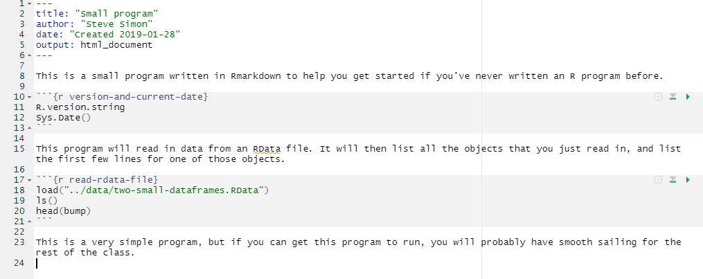
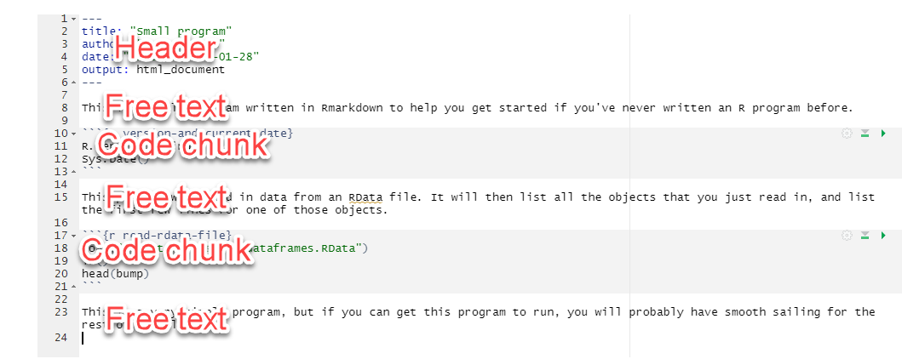

## Special note

+ This PowerPoint slide show was created using R.
  + Not complicated 
  + But beyond scope of this class
+ Source
  + https://github.com/pmean/introduction-to-r/tree/master/part1/src
+ A second resource
  + http://blog.pmean.com/powerpoint-with-r-markdown/
  
<div class="notes">

Okay. Let's get started.

If you are viewing this PowerPoint presentation, I need to point out that it was developed using R. The process is not very complicated, but it is beyond the scope of this class. 

If you are curious, you can look at the code that I used to develop this
PowerPoint presentation. Or you can watch a short video on how this works.

But don't feel obligated to look at it. You will not be responsible for any of this in an introductory class.

It may seem a bit weird to have an R program that creates a PowerPoint presentation that talks about a different R program, but it works well for me.

</div>

## Installing R (https://cran.r-project.org/)


<div class="notes">

Here is the main page for CRAN. CRAN stands for the Comprehensive R Archive Network. This is where you can download a Linux, Mac, or Windows version of R. Ignore the source code. That is only needed for very advanced applications.

</div>

## Installing RStudio (https://rstudio.com/)


<div class="notes">

The other thing, a very strong recommendation, is that you should install a package called R Studio. I'll probably talk more about R Studio in a separate handout or video.

Basically it's an integrated development environment that makes it very easy to work with the R programming language. Click on the products link.

</div>

## Installing RStudio (https://rstudio.com/)


<div class="notes">

The product you're looking for is called RStudio. Not RStudio Server or any of the other products. These other products cost a fair amount of money. For a professional organization, they offer a wide range of advanced features. But we don't need any of those advanced features for this class. So don't bother with those other products.

</div>

## Installing R and R Studio

+ R is required
+ RStudio is strongly recommended
+ Do not delay in getting this software installed
+ Find me if you have ANY problems

<div class="notes">

It should be very easy to install R and RStudio on your computer, but don't wait. Sometimes installations can get hung up and you won't be able to make any progress in this class without first getting the software installed.

If you have any problems at all with installation, see me right away. Computers are either our best friend or our worst enemy. It seems like the latter is especially true when you are installing new software.

</div>

## Recommended directory structure


<div class="notes">

Here is the directory structure that I use. You do not have to follow this structure, but it is recommended, not by me, but by the expert programmers at a group known as Software Carpentry. I'll elaborate in greater detail about this later, but wanted to mention it now. If you are relatively new to programming, you want to start off using good programming practices. A standardized directory structure helps a lot with this especially if you are working with others.

</div>

## "A place for everything, everything in its place"

+ data
  + raw/intermediate data files
+ doc
  + documentation
+ images
  + graphs
+ results
  + program output
+ src
  + program code
  
<div class="notes">

The quote at the top of the slide is an organizational principle espoused by Benjamin Franklin. If you've seen my office, you'll know that I am probably the last person to lecture you on organization. But I have found that a standardized directory structure has made my life a lot easier.

The data folder contains any raw data files. It's also where I put intermediate files, files that I create and save for later re-use. Some people put intermediate files in the results folder, and that's a fine alternative. Just be sure to be consistent about it.

The doc folder contains any documentation associated with the work. The IRB approved protocol, if I have one, will go here. If I am working with someone and they send me a paper that helps describe the type of data analysis they want, I put it in this folder. I also print key emails from the other team members to pdf format and store them here as well.

If my programs produce any graphs, I will store them in the images folder. I use screenshots of various web pages a lot in my work and I put those here as well.

I usually store program output in the results folder, but not always, for reasons I don't want to get into.

The program code goes in the src folder.

This directory structure has an extra folder, and that's always okay. This folder, modules, contains some of the information on homework assignments, quizzes, and so forth.

I adopted the structure about four years ago. I do not do a lot of collaborative research but I do find myself frequently revisiting a project six months or year down the road. Having a common directory structure means that I can very quickly and rapidly identify the stuff that was done before and the stuff that needs to change for the new work.

I would strongly encourage you to set up a directory structure like this one.

</div>

## Anatomy of a small R program, overview



<div class="notes">

This is a full listing of a small program written in Rmarkdown. The font is too small to read. Don't worry, I just wanted you to see the full picture. I'll look at small pieces of this program using a readable font size.

</div>

## Anatomy of a small R program, header

```{r echo=FALSE, comment=""}
suppressMessages(suppressWarnings(library(stringr)))
tx <- readLines("p01-small-program.Rmd", warn=FALSE)
header_lines <- str_which(tx, "---")
backtick_lines <- str_which(tx, "``")
eof_line <- length(tx)
beg_line <- header_lines[1]
end_line <- header_lines[2]

cat(paste0(tx[beg_line:end_line], collapse="\n"))
```

<div class="notes">

All right, The first thing we have is the header. The header uses a structure called YAML (Y-A-M-L). YAML is a special type of up format that is used by lots of programmers. The header provides a bit of information about the about the program. The default option when you start up a new R Markdown file is to list, the title, author, date, and output format.

I find the word "date" by itself ambiguous, so I add the word "Created" to distinguish the creation date from the last modified date. It is not easy to track the last modified date in RStudio.

R Markdown has options for creating web pages (html documents). You can also produce Word documents and PDF documents. I should warn you that creating PDF documents directly is a bit tricky. You need to have a program called LaTeX (pronounced lay-tech) installed first.

You can also produce Powerpoint files, which this is an example of.

The default is HTML and that's a pretty good format. Quite honestly, I've got a lot of mileage out of HTML

</div>

## Anatomy of a small program, free text comments

```{r echo=FALSE, comment=""}
beg_line <- end_line+1
end_line <- backtick_lines[1]-1
cat(paste0(tx[beg_line:end_line], collapse="\n"))
```

<div class="notes">

Here's a brief sentence written as open text. You will be required to provide open text comments on all your homework assignments. Often just a single sentence will do, but do get in the practice of interspersing open text comments throughout your code.

</div>

## Anatomy of a small program, code chunk

```{r echo=FALSE, comment=""}
beg_line <- end_line+1
end_line <- backtick_lines[2]
cat(paste0(tx[beg_line:end_line], collapse="\n"))
```

<div class="notes">

in R Markdown, sections of R code are delineated with three backticks. The backtick is a leftward slanting single quote mark. For most keyboards, you will find the backtick key on the top row, just to the left of the "1" key.

The beginning of a chunk of R code has three backticks, followed by a left curly bracket, the letter "r" and then an optional name. End with a right curly bracket.

This program chunk includes two lines of code.

R.version.string displays the version of R that you are running. You should try to use a version of R at 4.0 or higher. This would only be an issue if you've been using R for more than a couple of years and have been lazy about upgrades. If you downloaded R at the beginning of this semester, you will have a version of R beyond 4.0.

The second line of code, Sys.Date(), displays the current date. Sometimes knowing when a program was run can help you decide if you need to run the program again (perhaps because the data has changed, or you are using a new version of R).

After this you see three more backticks, which tells R Markdown that the chunk of code has ended.

I recommend that you try to avoid long stretches of R code. Break it up into segments of no more than 20 lines of code, and often less than this is better. Working with your program in chunks and interspersing free text comments liberally makes it easier to maintain your code.

</div>

## Anatomy of a small program, second set of free text comments

+ Rmarkdown code

```{r echo=FALSE, comment=""}
beg_line <- end_line+1
end_line <- backtick_lines[3]-1
cat(paste0(tx[beg_line:end_line], collapse="\n"))
```

<div class="notes">

Here's another brief comment. Note that you write an R Markdown a bit differently than most other programs. Most other programs place the comments inside of special delimiters. In SAS, for example, you start a comment with a slash and an asterisk and end it with an asterisk and a slash.

In R Markdown, the comments are not delimited. The code is delimited by three consecutive backticks.

</div>

## Anatomy of a small program, second code chunk

+ Rmarkdown code

```{r echo=FALSE, comment=""}
beg_line <- end_line+1
end_line <- backtick_lines[4]
cat(paste0(tx[beg_line:end_line], collapse="\n"))
```

<div class="notes">

Here's some more R code. I named the chunk "read-rdata-file". The load function reads information from a file named ../data.two-small-dataframes.RData.

I have to apologize here because Powerpoint splits the load function onto two consecutive lines, making it a bit harder to read.

The second line of code is the ls function. Just ls with a left and a right parenthesis. This function lists everything that you have either loaded or created within R. In this case, it is just the information that we got from the two-small-dataframes.RData file.

There are two objects, bump and fat. These are actually dataframes, the standard way that R stores data. If you look on my github site, you will find data dictionaries for these two dataframes.

The head function lists the first few lines of ant object in R. In this case, it will show the first six lines of the dataframe bump.

</div>

## Anatomy of a small program, third set of free text comments

+ Rmarkdown code

```{r echo=FALSE, comment=""}
beg_line <- end_line+1
end_line <- eof_line
cat(paste0(tx[beg_line:end_line], collapse="\n"))
```

<div class="notes">

After the second chunk of R code, I add a couple of extra comments.

It's very simple program but if you can get this program to run, you probably have smooth sailing for the rest of the class. I really believe that installing the software is often tricky. Getting the first program to run is often tricky. But once you get those going then you keep on modifying. Just make tiny changes to the programs you already have. It will either work or there will be an obvious error that you can fix.

The problem is getting the first program will run. Once you get one program that works, the rest is downhill.

I need to emphasize here very strongly if you're having problems. Come and see me right away. Drop me an email. Try to visit. I do not have official office hours, but I will make appointments at any reasonable time for people to come and talk. 

</div>

## Anatomy of a small program, review



<div class="notes">

Here is the full program again. You can see that it starts with a header, and alternates between free text and R code.

I like this structure a lot because it allows you to liberally comment your code. Comments are easy. I'm not the best at using good programming practices, but the one thing I am rabid about is I try to put in a lot of documentation. It takes time, but usually pays off.

</div>

## Program output, overview


<div class="notes">

Here is the full output. The fonts are too small to read, so let's zoom in again on individual pieces.

</div>

## Program output, header


<div class="notes">

This is the header. It displays the title, author, and date from the code header.

</div>

## Program output, free text


<div class="notes">

This is first set of free text. Rmarkdown will reflow the text, if needed, to fit inside the margins.

</div>

## Program output, code chunk


<div class="notes">

This is the first code chunk. By default, Rmarkdown will display the individual commands in a gray box, followed by the output in a white box. Whoops! This is an old version of R and the program was run over a year ago!

Actually, I left this in to make a point about why you want to track the version number and the date that the output was created. 

</div>

## Program output, more free text


<div class="notes">

This is second set of free text.

</div>

## Program output, second code chunk


<div class="notes">

This is the second code chunk. It displays the title, author, and date from the code header.

</div>

## Program output, last set of free text


<div class="notes">

This is last set of free text.

</div>

## Review

+ In this video, you saw
  + Installation pages for R, RStudio
  + Anatomy of a small program
  + Output from the small program
+ Review Canvas for the work assigned to this module

<div class="notes">

This is a very basic start. You saw the web pages where you install R and RStudio from. Then you saw the pieces of a small program written in Rmarkdown, as well as the output.

Take a look at Canvas, please, to see the work that you need to do for this module.

</div>
