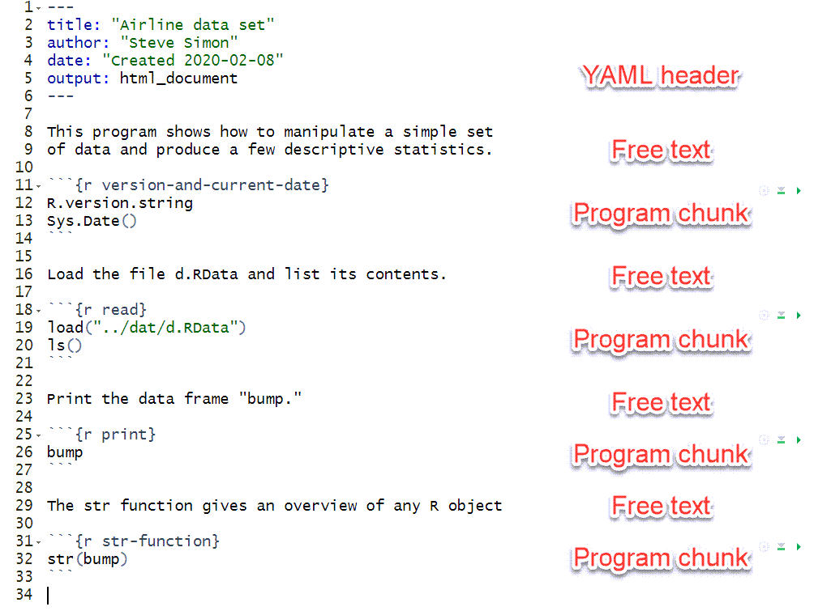
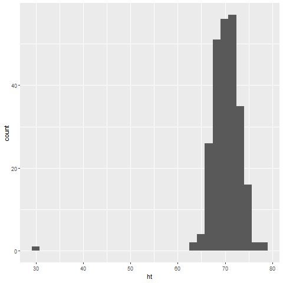
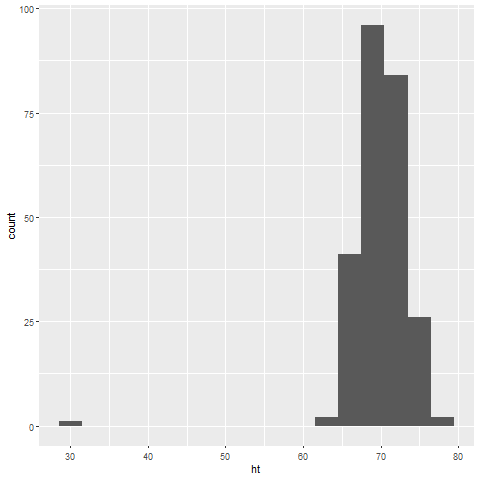
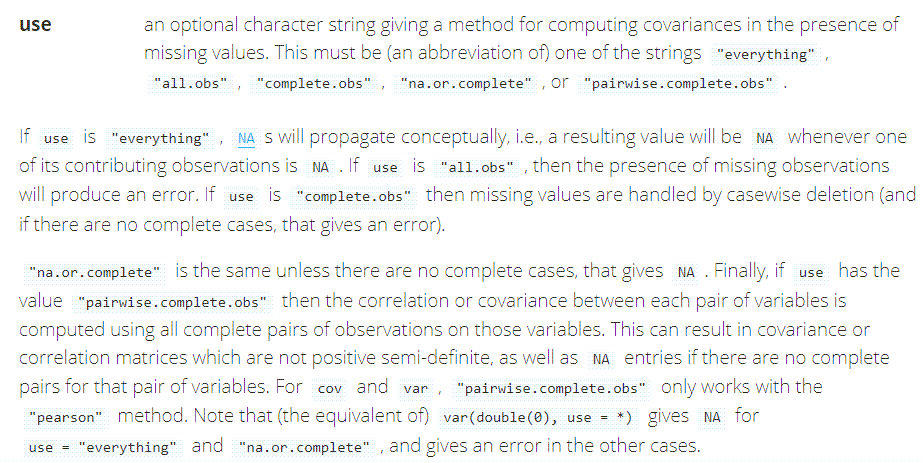
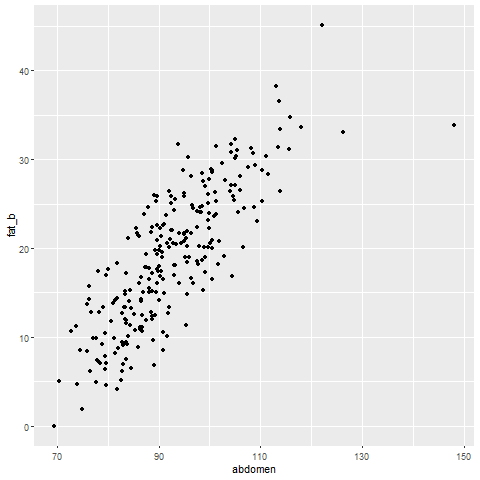
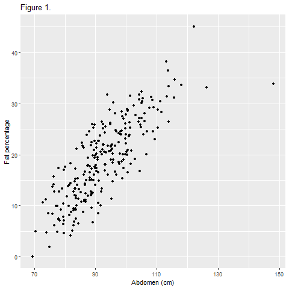
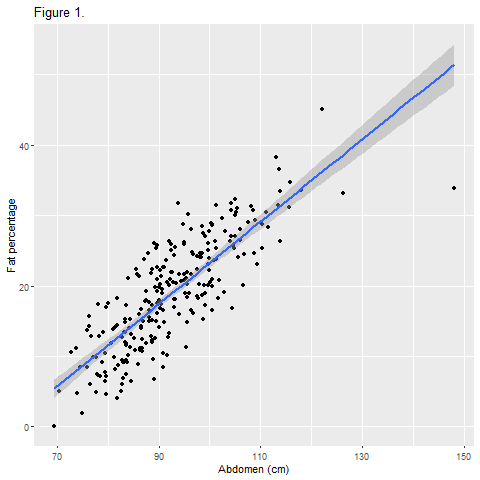

### The tidyverse library

```{r}
library(tidyverse)
```

<div class="notes">

The tidyverse package is a collection of several different packages which provide enhancements to the R programming language. These libraries share a common programming philosophy. There are several dozen libraries in  total, but only a core set of libraries are loaded with the library(tidyverse) function. Other tidyverse packages must be loaded separately.

I recommend that you use the tidyverse library for all your programs in this class. Here are some of the libraries in core set of libraries.

</div>

### dplyr


<div class="notes">

dplyr provides a set of functions for data manipulation.

</div>

### ggplot2


<div class="notes">

While R has some excellent graphics capabilities built in, they are somewhat difficult to use. The ggplot2 library simplifies the process of graphing by separating the parts of a graph into different layers. It is based on a conceptual framework developed by Leland Wilkinson in his book, The Grammar of Graphics.

</div>

### magrittr


<div class="notes">

magrittr provides a pipe operator. The concept of the pipe was developed first in Unix systems almost 50 years ago. The pipe operator (percent-greater than-percent) takes input from the left side of the operator and feeds it to a function listed on the right side of the operator. Pipes can be chained together. They make your code simpler and more readable.

We may or may not cover pipes in this class.

</div>

### readr


<div class="notes">

While R has many functions for reading text data, they are slow for very large files. The readr library reads text files much faster, offers some enhancements, and provides a simpler syntax.

</div>

### stringr


<div class="notes">

stringr simplifies the manipulation of string or text data.

</div>


### tibble


<div class="notes">

R has a variety of internal storage formats: arrays, lists, matrices, and data frames. We will focus mostly on data frames in this class. The tibble package offers an internal storage format, a tibble, that is very similar to a data frame, but it offers some extra features for convenience and simplicity.

</div>

### tidyr


<div class="notes">

tidyr provides a series of functions that help with data manipulation, especially for longitudinal data.

</div>

### Other packages in the tidyverse

+ In the core package
  + forcats
  + purr
+ Outside the core package
  + broom
  + lubridate
  + readxl
  + many others
  
<div class="notes">

Two other packages in the tidyverse core, forcats and purr, are for advanced applications.

Outside of the core package, some of the packages that I like are broom (which simplifies and standardizes the output from different data analysis functions)  lubridate (which simplifies the manipulaton of dates), and readxl (which reads Microsoft Excel files). There are quite a few others.

</div>

### Load tidyverse quietly

```{r, echo=FALSE}
suppressMessages(suppressWarnings(library(tidyverse)))
suppressMessages(suppressWarnings(library(yaml)))
options(width=45)
```

<div class="notes">

Because tidyverse provides so many diagnostic messages and warnings, I have used the suppressMessages and suppressWarnings functions to avoid this in my programs. For this program, I need two more things. I need the yaml package to simplify the presentation of information from the data dictionary. I also cut the line width down to 45 characters. This is rather extreme, but it is necessary when you are producing PowerPoint documents.

</div>

```{r}
tx <- readLines("p01-small-program.Rmd")
dashes <- str_which(tx, fixed("---"))
backticks <- str_which(tx, "```")
```

### General structure of Rmarkdown



<div class="notes">

Recall the general structure of an Rmarkdown file. It starts with a header, in a simple format known as YAML. Then you alternate between free text commentary and chunks of R programming statements. The chunks are surrounded by lines with three backticks and the opening set of three backticks is followed by the programming language (R) and an optional label for the chunk.

</div>


### Documentation

```{r version-and-current-date}
R.version.string
Sys.Date()
```

<div class="notes">

You should always print out the version of R that you are using and the date that the program was run. This is one of the documentation practices that you should get in the habit of using.

</div>

### Break #1
+ What have you learned
  + Rmarkdown structure
+ What is coming next
  + Printing a data frame
  + Printing pieces of a data frame

### Reading existing data

```{r load}
load("../data/module02-datasets.RData")
ls()
```

<div class="notes">

After loading data, use the ls function to review what information was loaded.

</div>

### From airline-data-dictionary.yaml

`r read_yaml("../data/airline-data-dictionary.yaml")$description`

<div class="notes">

The first dataset that we will use in this video is "bump."

Here is the first paragraph from the data dictionary.

</div>

### Displaying data

```{r display}
bump
```

<div class="notes">

R has a print function, but if you just list the name of a data frame, it will, by default, display itself.

</div>

### Showing the structure

```{r str}
str(bump)
```

<div class="notes">

The "str" function provides a description of "bump." It is a data frame. A data frame is a rectangular grid of data. The data values in a single column of data has to be consistent: either a set of numbers, a set of dates, a set of character strings, etc. But the type of data in one column can differ from the next column.

Data frames are the workhorse of R. There are other ways of storing data: lists, arrays, vectors. But most of the data you will analyze in R will be stored in a data frame.

</div>

### Displaying a single value

```{r single-value}
bump[1, 1]
bump[12, 5]
```

<div class="notes">

You can display individual data points by specifying the row and column inside square brackets.

</div>

### Displaying a single row

```{r single-row}
bump[1, ]
bump[12, ]
```

<div class="notes">

You can display an entire row by specifying it and leaving the column entry blank.

</div>


### Displaying a single column (1/2)

```{r echo=FALSE}
options(width=40)
```

```{r single-column-1}
bump[ , 1]
```

<div class="notes">

You can display an entire column similarly.

</div>

### Displaying a single column (2/2)

```{r single-column-2}
bump[ , 5]
```

<div class="notes">

There is an important difference in the display here. When you display a single column, it will fit more than one data point in the same row to save space. This may seem trivial and but once in a while it is not. The distinction may come up later in this class.

</div>

### Using column names

```{r column-names}
bump$airline
```

<div class="notes">

Each column has a name and you can use that name instead of the column number.

</div>

### Displaying multiple rows or columns

```{r multiple-1}
bump[1:5, ]
```

<div class="notes">

The code "1:5" means 1, 2, 3, 4, 5.

</div>

### Displaying multiple rows or columns

```{r multiple-2}
bump[ , c(2,4)]
```

<div class="notes">

The "c" function allows you to select values that are not in a perfect sequence.

</div>

### Skipping a row or column

```{r skipping}
bump[ , -1]
```

<div class="notes">

A negative number means that you want to exclude that row or column. In this example, the -1 allows you to print everything except the airline name.

</div>

### The head function

```{r echo=FALSE}
options(width=50)
```

```{r head}
head(bump)
```

<div class="notes">

The "head" function displays the first five rows of data.

</div>

### The tail function

```{r tail}
tail(bump)
```

<div class="notes">

The "tail" function displays the last five rows of data. If there is a problem with a data set, it often shows up more obviously at the bottom of a data frame than the top.

</div>

### Break #2
+ What have you learned
  + Printing a data frame
  + Printing pieces of a data frame
+ What is coming next
  + Definitions of categorical and continuous data
  + The "fat" data set
  + Outliers and missing values

### Some definitions

+ Categorical = small number of possible values
+ Examples
  + Sex (Male or Female),
  + Race/ethnicity (Caucasian, African American, Hispanic, etc.),
  + Cancer stage (I, II, III, or IV),
  + Birth delivery type (Vaginal, C-section). 

<div class="notes">

A **categorical variable** is a variable that can only take on a small number of values. Each value is usually associated with a particular category.

</div>

### Some definitions
+ Continuous variable = large number of possible values
+ Examples of continuous variables are
  + Birth weight in grams,
  + Gestational age,
  + Fasting LDL level.

<div class="notes">

A **continuous variable** is a variable that can take on a large number of possible values, potentially any value in some interval.

There are some variables that are on the boundary between categorical and continuous, but it is not worth quibbling about here. 

The point to remember is that the types of graphs that you use and the types of statistics that you compute are dependent on many things, but first and foremost on whether the variables are categorical, continuous, or a mixture.

Today, you will see examples involving mostly continuous variables.

</div>

### From fat-data-dictionary.yaml

`r read_yaml("../data/fat-data-dictionary.yaml")$description`

<div class="notes">

Here is the first paragraph from the data dictionary.

</div>

### First few lines of data

```{r echo=FALSE}
options(width=40)
```

```{r first-few-lines}
head(fd, 2)
```

<div class="notes">

Here are the first few lines of the data set.

</div>

### Some simple rules for data frames
+ Rectangular grid
+ Different types across columns
+ Single type within a column
+ Alternative ways to store data
  + Vector
  + Matrix
  + Array
  + List
  
<div class="notes">

R has many of the features of an object-oriented language, but it is not a true object-oriented programming language. There are a variety of objects in R like vectors, lists, matrices, and arrays, that are useful for storing, manipulating, and analyzing research data. We will spend most of this class using a particular object, the data frame.

The object, fd, that you just created with the read.table function is a data frame. Data frames are rectangular grids of data. Each column in the data frame has the same length. A data frame can store data of various types (numeric, character, and dates are the most common types of data). The data within a column has to have the same type, but the different columns can have different data types.

There are times when the rectangular grid of a data frame is too restrictive for your data, and R has other ways of storing this data (most notably, lists), but you will find that for most data analyses, a data frame will work just fine.

The head function shows the first few rows of the data set and the tail function shows the last few rows of the data set.

Always get in the habit of checking out the very bottom of your data frame. It's a common location for glitches.

</div>

### Variable names
+ Short but descriptive
+ Mix of letters and numbers
  + Must start with a letter
  + Avoid most symbols
+ No blanks
  + CamelCase
  + dot.delimited.names
  + underscore_delimited_names

<div class="notes">

This data set did not have a header, a line at the very top of the file that lists variable names. R uses the default names V1, V2, etc. As a general rule, you should use brief (but descriptive) names for every variable in your data set. The names should be around 8 characters long. Longer variable names make your typing tedious and much shorter variable names makes your code terse and cryptic.

You should avoid special symbols in your variable names especially symbols that are likely to cause confusion (the dash symbol, for example, which is also the symbol for subtraction). You should also avoid blanks. These rules are pretty much universal across most statistical software packages. If you violate these rules, you will find out that, at a minimum, you will always have to surround your variable name by quotes to avoid problems.

There are times when you'd like to have a blank in your variable name and you can use two special symbols that you can use in R (and most other statistical pacakges), the underscore symbol (above the minus key on most keyboards) and the dot (period). These symbols create some artificial spacing that mimics the blanks. Another approach is "CamelCase" which is the mixture of upper and lower case within a variable name with each uppercase designating the beginning of a new "word".

</div>

### Unusual data value

```{r summary-of-ht}
summary(fd$ht)
```

<div class="notes">

There is an unusual data value, which you might not notice right away, but one of the heights is 29.5 inches. We'll talk in more detail about the summary function later, but right now I wanted to show you function because if you have an outlier in your data, you are most likely to discover it by using the summary function.

A height this small is not totally out of the realm of possibility. See, for example, 

--> http://en.wikipedia.org/wiki/List_of_shortest_people

You can use the which function to identify the row with this unusual value for further investigation. Note the use of the double equals sign and how you display a single row of a data frame.

</div>

### Which function

```{r which}
short_row <- which(fd$ht==29.5)
short_row
fd[short_row, ]
```

<div class="notes">

The other values look quite normal. You have to make a careful choice here. One possibility is to do nothing. If you leave the abnormal height in your data set, it may distort some of your graphs and skew some of your statistics. Still, it is often BETTER than some of the alternatives.

</div>

### Remove the outlier

```{r remove}
fd1 <- fd[-short_row, ]
summary(fd1$ht)
```

<div class="notes">

A second choice is to remove the entire row from the data frame. The - means everything EXCEPT that row.

</div>

### Set to missing

```{r missing}
fd2 <- fd
fd2[short_row,"ht"] <- NA
summary(fd2$ht)
```

<div class="notes">

A third possibility is to designate the abnormal value as missing. In R, a missing value is represented by NA.

Notice that the summary function for the ht variable notes that one of the values is missing. You should watch these missing values obsessively. This can get a bit tricky. 

There is no one method that is preferred in this setting. If you encounter an unusual value, you should discuss it with your research team, investigate the original data sources, if possible, and review any procedures for handling unusual data values that might be specified in your research protocol.

Your data set may arrive with missing values in it already. Data might be designated as missing for a variety of reasons (lab result lost, value below the limit of detection, patient refused to answer this question) and how you handle missing values is way beyond the scope of this class. Just remember to tread cautiously around missing values as they are a minefield.

Notice that I store the revised data sets with the row removed and with the 29.5 replaced by a missing value in different data frames. This is good programming practice. If you ever have to make a destructive change to your data set (a change that wipes out one or more values or a change that is difficult to undo), it is good form to store the new results in a fresh spot. That way, if you get cold feet, you can easily backtrack.

We'll use the data set with the 29.5 changed to a missing value for all of the remaining analyses of this data set.

</div>

### Break #3
+ What have you learned
  + Definitions of categorical and continuous data
  + The "fat" data set
  + Outliers and missing values
+ What is coming next
  + Tracking missing values
  + Histograms

### You cannot test missingness directly

```{r tracking-missing-1}
which(fd2$ht==NA)
```

<div class="notes">

Logic involving missing values is tricky. If you checking for equality and one of the things in the comparison is missing, then the result is neither TRUE, not FALSE, but rather missing.

Fair enough, but R takes it a bit further, and if both sides when you are checking for equality are missing, then they might both be 5 is they weren't missing or maybe one might be 5 and the other one 10. So it might be TRUE or it might be FALSE, so we're better off calling the logical result as missing.

This is called a three valued logic system and it has advantages and disadvantages. I won't get into any technical details, except to say that you should never make assumptions. Check what you do when you are working with missing values to make sure that the three valued logic system doesn't produce results that you didn't expect.

</div>

### Use is.na to test missingness

```{r tracking-missing-2}
which(is.na(fd2$ht))
```

<div class="notes">

The short term solution to the above problem is to use a special function, is.na.

The summary function will trap and remove missing values, but most other functions in R will, by default, report a result as missing if any values going into that function are missing. The philosophy in R, I suppose, is that you need to actively select an approach for handling missing values rather than relying on a lazy default.

R is also erring on the side of caution most of the time. You may not be aware that there are missing values lurking in your data, and R is going to go out of its way to remind you, unless you tell it otherwise.

This is different from SAS and SPSS, where the default options choose perfectly reasonable approaches, but approaches that don't raise concern about missingness to the degree that R does.

</div>

```{r mean-sd-1}
mean(fd2$ht)
sd(fd2$ht)
```

<div class="notes">

Read the help file for these functions (enter ?mean or ?sd at the command prompt).

Look carefully and note that the na.rm option allows you to compute the statistic after missing values are removed.

</div>

### na.rm

```{r mean-sd-2}
mean(fd2$ht,na.rm=TRUE)
sd(fd2$ht,na.rm=TRUE)
```

<div class="notes">

For univariate functions, there are only two realistic ways to handle missing values, but for bivariate and multivariate function, there are a multitude of approaches, such as pairwise deletion, listwise deletion, last observation carried forward, single imputation, and multiple imputation. There is a lot of controversy over various methods for handling missing values.

</div>

### Histogram

```{r histogram01}
library(ggplot2)
histogram_default <- ggplot(fd2, aes(x=ht)) + 
  geom_histogram(fill="white", color="black")
png("../images/histogram01.png")
histogram_default
dev.off()
```

<div class="notes">

A histogram is useful for displaying a continuous variable graphically.

Always start with the default option, but don't settle for it.

</div>

### Histogram



<div class="notes">

Here is what the graph looks like.

</div>

```{r histogram02}
histogram_enhanced <- ggplot(fd2, aes(x=ht)) + 
  geom_histogram(
    fill="white", color="black", 
    binwidth=3, na.rm=TRUE) +
  xlab("Height in inches") +
  scale_x_continuous(
    breaks=c(63, 66, 69, 72, 75, 78), 
    labels=c("62-64", "65-67", "68-70",
             "71-73", "74-76", "77-79"))
png("../images/histogram02.png")
histogram_enhanced
dev.off()
```

<div class="notes">

I like to have the border color of the bars and the fill color of the bars to be different. It took a bit of trial and error to get the binwidth, breaks, and labels to work properly.

</div>

### Histogram



<div class="notes">

Here is what the graph looks like.

</div>

### Break #4
+ What have you learned
  + Tracking missing values
  + Histograms
+ What is coming next
  + Correlations
  + Scatterplots

<div class="notes">

### Correlation coefficients

+ Correlation
  + Always between -1 and 1
  + Strong positive if > 0.7
  + Strong negative if < -0.7
  + Weak positive if between 0.3 and 0.7
  + Weak negative if between -0.3 and -0.7
  + No relationship if between -0.3 and 0.3
  

<div class="notes">

The correlation coefficient is a single number between -1 and +1 that quantifies the strength and direction of a relationship between two continuous variables. As a rough rule of thumb, a correlation larger than +0.7 indicates a strong positive association and a correlation smaller than -0.7 indicates a strong negative association. A correlation between +0.3 and +0.7 (-0.3 and -0.7) indicates a weak positive (negative) association. A correlation between -0.3 and +0.3 indicates little or no association.

Don't take these rules too literally. You're not trying to make definitive statements about your data set. You are just trying to get comfortable with some general patterns that occur in your data set. A complex and definitive statistical analysis will almost certainly not agree with at least some of the preliminary correlations noted here.

</div>

### Correlation coefficient

```{r corr-1}
cor(fd2$fat_b,fd2$age)
```

<div class="notes">

You can get a matrix of correlations for every possible pair of variables. This command becomes a bit more complicated if there are some categorical variables in your data set, as you need to exclude these prior to calculating the correlation matrix. Since you are just trying to get a general feel for your data, a bit of rounding will help you. Also, you should remove the case number before calculating the correlation matrix.

</div>

### Correlation matrix 

```{r corr-2}
correlation_matrix <- cor(fd2[ ,-1])
dim(correlation_matrix)
correlation_matrix[1:8, 1:2]
```

<div class="notes">

Notice that the -1 in fd2 omits the first column, which is the case number, a variable that should not be incorporated in any statistical analyses.

I don't want to display the full correlation matrix because it would go off the margins of the slide. But looking at just the first eight rows and two columns, you can see something interesting. R does not know how to compute a correlation coefficient when there are missing values.

</div>

### Excerpt from the help file



<div class="notes">

This is two excerpts from the help file. The documentation is quite confusing, but that is because the options here are quite confusing. The two interesting options are casewise deletion (complete.obs) and pairwise deletion (pairwise.complete.obs). For the former, the row with missing values is tossed out for every correlation calculation, so that each and every correlation uses 251 rows of data rather than 252. For the latter, most correlations use all 252 rows of data, but any correlation involving height uses only 251 rows of data.

Which choice is best is beyond the scope of this class.

</div>

### Correlation with pairwise deletion

```{r corr-4}
correlation_matrix <- cor(fd2[ ,-1], use="pairwise")
dim(correlation_matrix)
correlation_matrix[1:8, 1:2]
```

<div class="notes">

Here is what the correlation matrix looks like with pairwise deletion. Notice that you can abbreviate "pairwise-complete-obs" to just "pairwise". Actually, any abbreviation that is not ambiguous would work, so you could say "pair" or even just "p" here since none of the other choices for the use option begins with the letter "p."

</div>

### Rounding a correlation matrix

```{r rounding}
round(100*correlation_matrix[9:18, 1:2])
```

<div class="notes">

Rounding the correlations makes them easier to read. Here is a different part of the correlation matrix, showing the circumference measurements versus the fat measurements. The interesting pattern is that the strongest correlations are measurements near the middle (abdomen, chest, hip) and the correlation goes down as you move to the extremities. The lowest correlations are at the forearm, wrist, and ankle.

</div>

### Another interesting set of correlations 

```{r corr-3}
leg.measures <- c("hip","thigh","knee","ankle")
arm.measures <- c("biceps","forearm","wrist")
round(100*cor(fd2[,leg.measures],fd2[,arm.measures]))
```

<div class="notes">

Here is another interesting set of correlations.

We created a few new objects, so you might want to save things here before proceeding to the next section.

The best graphical way to display a relationship between two continuous variables is a scatterplot.

</div>

### Scatterplot

```{r scatterplot01}
scatterplot_default <- ggplot(fd2,
    aes(x=abdomen, y=fat_b)) +
  geom_point()
png(filename="../images/scatterplot01.png")
scatterplot_default
dev.off()
```

<div class="notes">

A simple and commonly used graphical approach to showing a relationship between two continuous variables is a scatterplot.

</div>

### Scaterrplot



<div class="notes">

There are lots of options available to customize your graph. Here are just a few. The xlab and ylab arguments in the plot function control what is displayed on the horizontal (x) and vertical (y) axes. The pch argument control what is used as the plotting character.

</div>

### Change from the defaults

```{r scatterplot02}
scatterplot_enhanced <- scatterplot_default +
  xlab("Abdomen circumference in inches") +
  ylab("Percentage of body fat") +
  ggtitle("Figure 1. My brilliant graph.")
png(file="../images/scatterplot02.png")
scatterplot_enhanced
dev.off()
```

<div class="notes">

Here are some adaptations, including better labels.

</div>

### Scatterplot02



<div class="notes">

Here is what the graph looks like.

</div>

### Adding trend lines

```{r scatterplot03}
scatterplot_smoothed <- scatterplot_enhanced +
  geom_smooth()
png("../images/scatterplot03.png")
scatterplot_smoothed
dev.off()
```

<div class="notes">

Here's the code to produce a smooth curve on top of the data points.

</div>

### Adding trend lines



<div class="notes">

Here is what the graph looks like.

</div>

### Break #5
+ What have you learned
  + Correlations
  + Scatterplots
+ What is coming next
  + Description of sleep data

### From the sleep data dictionary

`r read_yaml("../data/sleep-data-dictionary.yaml")$description`

<div class="notes">

There is another data set on sleep in mammals.

There's a technicality here in that the last few variables are categorical, but for the purposes of this class, you can treat them as if they were continuous.

</div>

### A quick peek at the data 

```{r read-sleep, echo=FALSE}
head(sleep, 2)
```

<div class="notes">

Here are the first two rows of data.

</div>
