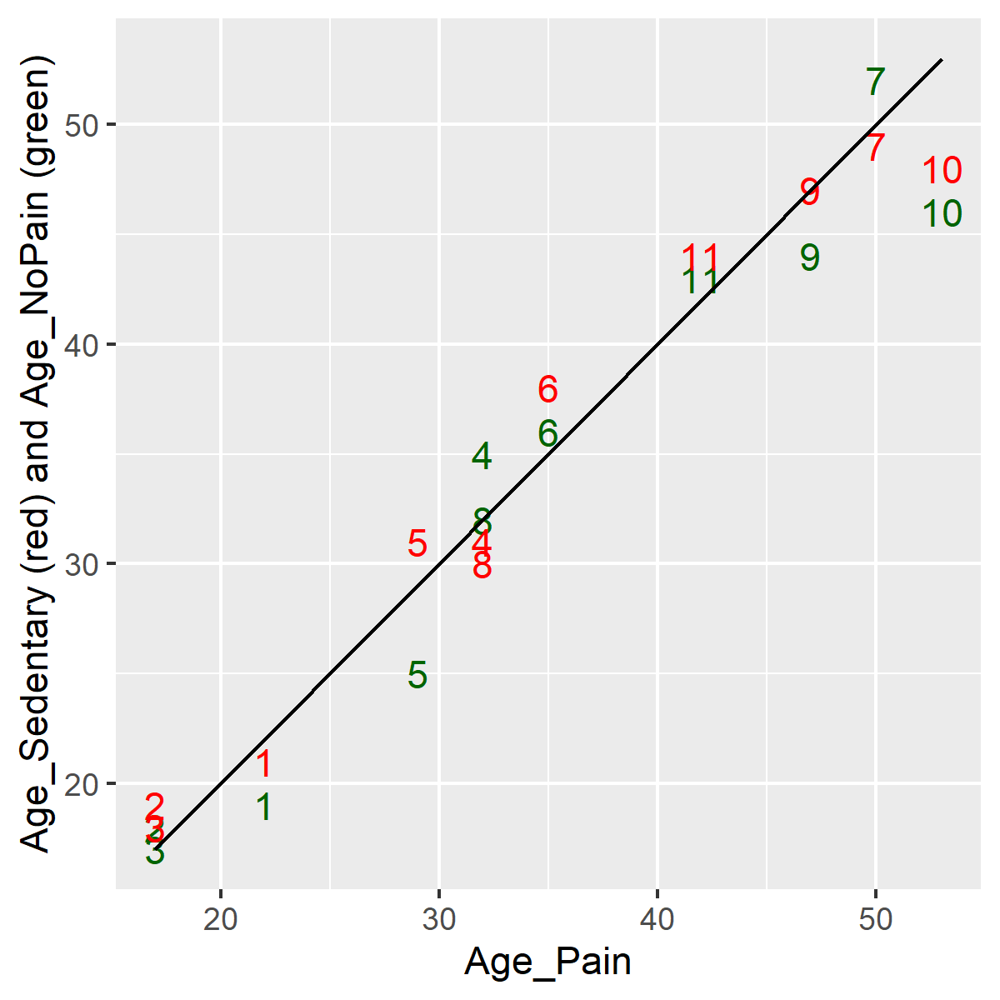

```{r setup, echo=FALSE}
knitr::opts_chunk$set(echo=TRUE, error=FALSE)
options(width=40)
``` 

### Introduction

```{r r-version-and-current-date}
suppressMessages(
  suppressWarnings(
    library(tidyverse)))
R.version.string
Sys.Date()
```

<div class="notes">

This Powerpoint presentation was created using an R Markdown file. This slide shows the version of R that I used and when it was last modified.

</div>

### What is longitudinal data
+ Definition
  + Measurements taken at different times
+ Closely related datasets
  + Crossover
  + Pre-test/post-test
  + Repeated measures
  + Split plot
  
<div class="notes">

I'm going to use the term "longitudinal" data to designate data sets where a patient is measured at multiple different time points. This encompasses certain other data sets, such as from a crossover, pre-test/post-test, repeated measures, and split plot.

Don't worry about the technical distinctions among these terms. The important thing to know for now is that longitudinal data represents one of the biggest challenges in data management and we will spend most of this section discussing these challenges.

</div>

### Two formats for longitudinal data
+ Short and fat format
  + Many columns
  + Not so many rows
+ Tall and thin format
  + Not so many columns
  + Many rows
  
<div class="notes">

Longitudinal data usually come in one of two specific formats. The first is the short and fat format and the second is the tall and thin format.

</div>

### Example: effect of surface and vision on balance
+ Repeated measures experiment
  + Vision has 3 levels
    + Eyes open, eyes closed, dome
  + Surface has 2 levels
    + Normal or foam
  + Two replications of each format
  + There are 3*2*2=12 measurements
  + Look here for more details
    + www.statsci.org/data/oz/ctsib.html

<div class="notes">

Normally, you can only find a dataset stored in one of the two formats, but I did find an example of the same dataset being stored in both formats.

</div>

### Short and fat example


<div class="notes">

The short and fat format has one row per patient and each successive patient encounter is strung out horizontally.

</div>

### Tall and thin example


<div class="notes">

The tall and thin format has one row per patient encounter and therefore multiple rows per patient.

</div>

### Which format is better?

+ Short and fat advantages:
  + easy to compute change scores
  + easy to examine correlations over time
  + easy to insure consistency of demographic data
+ Short and fat disadvantages:
  + hard to read because of the excessive need to scroll left and right

<div class="notes">

Both formats have advantages and disadvantages, and you need to know how to create a longitudinal file in either format and how to transform from one format to another.

The short and fat format makes it easy to compute change scores, the difference between a later measurementn and an earlier one. Correlations are also easier.

Because the short and fat format stretches each visits data out to the right, you end up doing a lot of left/right scrolling with this type of file. 

</div>

### Which format is better?

+ Tall and thin advantages:
  + easy to plot longitudinal trends
  + less need for missing value codes
  + easy to read because most scrolling is up and down

+ Tall and thin disadvantages
  + hard to maintain consistency of demographic variables

<div class="notes">

While some statistical tasks are easier with the short and fat format, the one that is usually easier with the tall and thin format is plotting.

If a subject misses a visit, the short and fat visit format makes you put in missing value codes for all the data that was not collected at that time. A tall and thin format is easier because you just leave out the row that corresponds to the missing visit.

The problem with this format is in the repetition that occurs. If you have demographic variables like gender and race, those are listed on each row. This allows an opportunity for mischief, where a patient can have a different gender on different rows.

</div>

### Break #1

+ What have you learned
  + Two formats for longitudinal data
+ What is coming next
  + Converting to tall and thin format
  
<div class="notes">

I want to keep these videos short, so let's stop here.

</div>

### Energy dataset (short and fat format)

+ Completely randomized block design
  + Blocks are subjects (8 total)
  + Treatment are exercise
    + Running, walking, cycling
  + There are 3*2*2=12 measurements
  + Look here for more details
    + www.statsci.org/data/general/energy.html

<div class="notes">

Here's another interesting data set that you can work with. It comes in a short and fat format.

</div>

### Energy dataset (short and fat format)


### Energy dataset (short and fat format)


### Import energy dataset (short and fat format)

```{r read-energy}
fi <- "../data/energy.txt"
en <- read_table(fi, col_types="nnnn")
```

### Energy dataset, glimpse

```{r glimpse-energy}
glimpse(en)
```

<div class="notes">

Here is the structure of this dataset. It doesn't look that fat, but it strings out three separate measurements on each patient across three columns. 

You can convert this to a tall and thin format by stacking the running, walking, and cycling values in a single column. You'll need a new variable to remind you whether the value you are converting comes from the first patient, second patient, etc.

This is important to remember. For the short and fat datasets, with one row per subject, you do not need to record a patient identification number. But with the tall and thin format, with multiple rows per patient, if you don't have an identification number, you won't be able to know which rows belong together under a single patient.

</div>

### Converting to tall and thin, code

```{r energy-longer}
en_tall <- 
  pivot_longer(en, 
    c(Running, 
      Walking, 
      Cycling), 
    names_to="activity", 
    values_to="energy")
```

<div class="notes">

The pivot_longer function creates two new variables. The "names_to" variable is the name of the column where the data value came from and "values_to" is the data value itself. Any variable or variables left out of the list are treated like an identifier for a particular row.

</div>

### Converting to tall and thin, output

```{r energy-longer-display}
glimpse(en_tall)
```

<div class="notes">

Here is the tall and thin format. Notice that there are 24 rows now, 3 for each of the 8 subjects. All the energy measurements are now in a single column.

</div>

### Lineplot

```{r lineplot}
activity_lineplot <- ggplot(en_tall, 
  aes(x=activity, 
      y=energy, 
      group=Subject)) +
    geom_line()
ggsave(
  "../images/activity-by-energy.png", 
  activity_lineplot, width=4, height=4)
```

<div class="notes">

One possible graph that could not have done in the short and fat format is a lineplot. The group parameter in the aes function tells R that separate lines are defined for each subject.

</div>

### Lineplot


<div class="notes">

Here is the graph. Notice the inverted V shape for each line. This shows that running uses the most energy for any individual subject.

</div>

### Earthquake dataset

+ Longitudinal study of stress
  + Study started two weeks prior to major earthquake (Week0)
  + Researchers added extra stress measurments
    + Week3, Week6, Week9, Week12
  + There are 26 subjects
  + There are 5*26=130 measurements

<div class="notes">

Here is a dataset stored in the short and fat format. This dataset will serve as a second example of how to convert from a short and fat format to a tall and thin format.

For more information, see www.statsci.org/data/general/lomaprie.txt

</div>

### Earthquake dataset


<div class="notes">

Here is the data dictionary

</div>

### Earthquake dataset


<div class="notes">

This is clearly a tab delimited file. All of the fields are left justified.

</div>

### Read in the earthquake data

```{r read-earthquake}
fn <- "../data/quake.txt"
qu <- read_table(fn, col_types="nnnnn")
```

### Check structure of the earthquake data

```{r check-earhtquake}
glimpse(qu)
```

<div class="notes">

There are measurements at weeks 0, 3, 6, 9, and 12.

</div>

### Convert to tall and thin format

```{r quake-longer}
qu$id <- 1:25
qu_tall <- pivot_longer(qu, 
  contains("Week"),
  names_to="time",
  values_to="depression")
```

<div class="notes">

Suggestion: create an id variable with values 1:25 before you convert the format. It is not needed for the boxplots that I draw later, but if you do anything more complex with this data, you need to know which data in the tall and thin format comes from the first row of the original data set, from the second row, etc.

The names of the columns Week0, Week3, etc. will be stored in a new column, Week, and the values in a new column, depression.

</div>

### Display new structure

```{r quake-longer-structure}
glimpse(qu_tall)
```

<div class="notes">

Here is the structore of the tall and thin format.

</div>

### Boxplot

```{r boxplots}
depression_boxplot01 <- 
  ggplot(
      qu_tall, 
      aes(x=time, y=depression)) +
    geom_boxplot()
ggsave(
  "../images/time-by-depression01.png", 
  depression_boxplot01, width=4, height=4)
```

<div class="notes">

Notice how R orders the weeks. From a strict alphabetical perspective, week12 is between week0 and week3. Here's a fix.

</div>

### Boxplot


<div class="notes">

Here is the plot. The order of the weeks is not correct, because week12 appears between week0 and week3. 

There are several ways to fix this.

</div>

### Boxplot

```{r recode-time}
qu_tall$time <- case_when(
  qu_tall$time=="Week0"~"week00",
  qu_tall$time=="Week3"~"week03",
  qu_tall$time=="Week6"~"week06",
  qu_tall$time=="Week9"~"week09",
  qu_tall$time=="Week12"~"week12")
```

### Re-drawn boxplot

```{r redrawn}
depression_boxplot02 <- 
  ggplot(qu_tall, 
    aes(x=time, y=depression)) +
  geom_boxplot()
ggsave("../images/time-by-depression02.png", 
  depression_boxplot02, width=4, height=4)
```

<div class="notes">

An easy way to fix this is to use two numeric digits, even for weeks that have only a single digit.

</div>

### Boxplot


<div class="notes">

Here are the boxplots in the proper order. There are changes in depression levels across time, but these changes are small.

</div>

### Break #2

+ What have you learned
  + Converting to tall and thin format
+ What is coming next
  + Converting to short and fat format
  
<div class="notes">

I want to keep these videos short, so let's stop here.

</div>

### Backpain dataset

+ Matched case-control study
  + Study of 11 runners with back pain
  + Two control groups
    + Runners without pain, Sedentary volunteers
    + Matched by age, height, weight
  + Outcome variables
    + Flexibility and length of various muscle groups
  + Also collected covariates
    + Type of running, number of years running
  + Our focus: quality of matching
  + There are 3*11=33 measurements

<div class="notes">

Now let's read in a tall and thin format and convert it to a
short and wide format.

For more information about this dataset, see http://www.statsci.org/data/oz/backpain.html

</div>

### Backpain overview


<div class="notes">

Here is the data dictionary for the backpain dataset.

</div> 

### Backpain dataset


<div class="notes">

No question here. This is a comma separated value dataset.

</div>

### Reading in the backpain dataset

```{r read-backpain}
fn <- "../data/backpain.csv"
pain <- read_csv(fn, col_types="ncnnn")
```

### Display

```{r structure-backpain}
glimpse(pain)
```

<div class="notes">


</div>

### Converting to short and fat

```{r spread-pain}
pain_fat <- pivot_wider(pain,
  id_cols=Match,
  names_from=Group,
  values_from=c(Age, Height, Weight))
```

### Display new structure

```{r structure-wider-pain}
glimpse(pain_fat)
```

<div class="notes">

The spread function takes a single column of data and spreads it across multiple columns. The first argument is the dataframe that you want to transform. The second argument gives the categorical variable that identifies which new column a particular value goes into. The third argument provides the values that in the original data set sit in a single column and that we now want to spread across multiple columns.

</div>

### Remaining variables

```{r remaining}
names(pain_fat)[7:10]
```


### Backpain plot code (1 of 3)

```{r agreement-1}
age_range <- range(c(
  pain_fat$Age_Pain, 
  pain_fat$Age_NoPain, 
  pain_fat$Age_Sedentary))
```

### Backpain plot code (2 of 3)

```{r agreement-2}
agreement_age <- ggplot(pain_fat, 
  aes(x=Age_Pain, 
      y=Age_NoPain, 
      label=Match)) +
    geom_text(color="darkgreen") +
    geom_text(aes(y=Age_Sedentary), color="red") + 
    ylab("Age_Sedentary (red) and Age_NoPain (green)" )
```

### Backpain plot code (3 of 3)

```{r agreement-3}
agreement_age <-
  agreement_age + 
    expand_limits(
      x=age_range, 
      y=age_range) +
    geom_segment(
      x=age_range[1], 
      y=age_range[1], 
      xend=age_range[2], 
      yend=age_range[2])
ggsave(
  "../images/agreement_age.png",
  agreement_age, width=4, height=4)
```

<div class="notes">

This code shows the agreement between the ages of the patients in the NoPain group and the patients in the Pain group.

</div>

### Plots of agreement



<div class="notes">

The agreement is quite good. There is a bit less agreement for older subjects.

</div>


### Break #2

+ What have you learned
  + Converting to short and fat format
+ What is coming next
  + Separating into time constant/time varying tables
  
<div class="notes">

I want to keep these videos short, so let's stop here.

</div>

### One last recommendation
+ Both formats have problems
  + Tall and thin: repetition of demographic information
  + Short and fat: poor handling of missing value
+ Ideal solution: normalization
  + Put time constant data in first table
  + Put time varying data in second table
  

### Balance data set: Short and fat format


<div class="notes">

Here is the short and fat format again. It has one row per patient and each successive patient encounter is strung out horizontally.

</div>

### Tall and thin example


<div class="notes">

Here is the tall and thin format again. It has one row per patient encounter and therefore multiple rows per patient.

</div>

### Read balance in short and fat structure

```{r time-constant}
fn <- "../data/balance1.txt"
short_and_fat_data <- read_tsv(fn, col_types="ncnnnnnnnnnnnnnnnnnn")
```

### Display balance short and fat structure

```{r display-balance-1}
glimpse(short_and_fat_data)
```

### Additional variables

```{r balance-1-additional}
names(short_and_fat_data)[7:17]
```

### Create time constant data

```{r creat-time-constant}
time_constant_list <- 
  c("Subject", "Sex", "Age", "Height", "Weight")
time_constant_data <- 
  short_and_fat_data[ , time_constant_list]
```

### Structure of time constant data

```{r time-constant-structure}
glimpse(time_constant_data)
```

<div class="notes">

The time constant variables are sex, age, height, and weight. You must keep the subject id in this dataset as well because you will need it to link with the time variable data.

</div>

### Read balance in tall and thin format

```{r read-balance-2}
fn <- "../data/balance2.txt"
tall_and_thin_data <- 
  read_table(fn, col_types="ncnnnccn")
```

### Balance data, tall and thing structure

```{r balance-structure-2}
glimpse(tall_and_thin_data)
```

### Additional variables

```{r balance-2-additional}
names(tall_and_thin_data)[7:8]
```

### Create time varying table

```{r create-time-variable}
time_variable_list <- 
  c("Subject", "Surface", "Vision", "CTSIB")
time_variable_data <- 
  tall_and_thin_data[ , time_variable_list]
```

### Display structure of time varying table

```{r structure-time-varying}
glimpse(time_variable_data)
```

<div class="notes">

Pull the time variable data from the tall and thin format.

Update the time constant table only once. Update the time varying table each time you get information at a new patient visit.

Note that this is what you should do before the data is collected. If the data is already collected by someone else, then you have to live with the limitations of whatever format they chose.

</div>

### Summary
+ Two formats
  + Short and fat
  + Tall and thin
+ pivot_longer
  + converts to tall and thin
+ pivot_wider
  + converts to short and fat
+ Alternative approach
  + Time constant table
  + Time variable table
  
<div class="notes">

We've covered a lot in these videos. There are two formats for longitudinal data. The short and fat format has one row per patient and strings out the data far to the right. The tall and thin format has one row per time point and strings out the data far down.

Use the gather function in the tidyr library to convert from a short and fat format into a tall and thin format. Use the spread function to convert from a tall and thin format to a short and fat format.

From a data management approach, you should consider a database term called normalization. In a longitudinal setting, this simply means putting your time constant data (usually the demographic variables) in a table using the short and fat format (one row per patient). Then put your time varying data in a different table using the tall and thin format (one row per time point).

</div>
