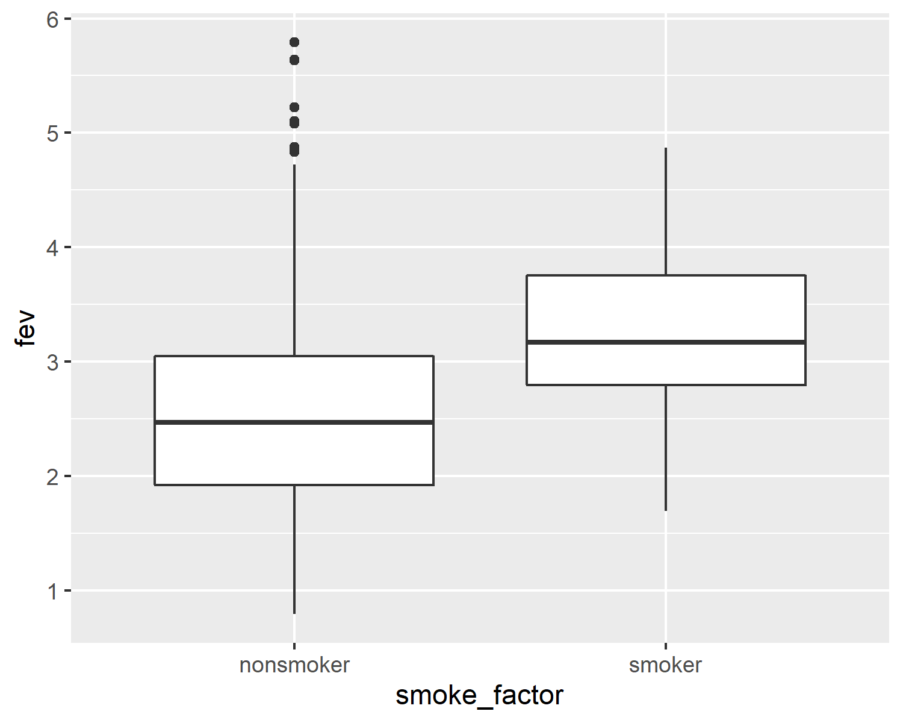

```{r setup, echo=FALSE}
knitr::opts_chunk$set(echo=TRUE)
``` 

<div class="notes"></div>

### Introduction

This Powerpoint presentation was created using an R Markdown file.

```{r r-version-and-current-date}
R.version.string
Sys.Date()
```

<div class="notes">

Like the earlier presentations, this Powerpoint file was created using Rmarkdown.

</div>

### Some simple hypothesis tests
+ t.test
+ regression
+ ANOVA

### FEV data
+ FEV dataset
  + http://www.amstat.org/publications/jse/datasets/fev.dat.txt
+ FEV data dictionary
  + http://ww2.amstat.org/publications/jse/datasets/fev.txt

<div class="notes">

The first data set looks at pumonary function in a group of children. The acronym FEV stands for Forced Expiratory Volume and represents how air you can blow out of your lungs.

</div>

### FEV data dictionary


<div class="notes">

This dataset has 654 rows and 5 variables: age (in years), fev (in liters), height (in inches), sex, and smoking status. Both sex and smoking status are categorical and use number codes. 

</div>

### Peek at FEV dataset


<div class="notes">

This is a listing of the first few rows. It could be a tab delimited file or a fixed width file. If you look carefully at the data, you will see that there are blanks and no tabs. So this is a file that you can read in most easily using a fixed width format.

</div>

### read in the FEV data set

```{r read_fev}
fn <- "http://www.amstat.org/publications/jse/datasets/fev.dat.txt"
fev <- read.fwf(file=fn, widths=c(3, 7, 5, 4, 6), header=FALSE, stringsAsFactors=FALSE)
names(fev) <- c("age","fev","ht","sex","smoke")
head(fev)
```

<div class="notes">

If you count carefully, you will see that the first three columns represent the first variable, you need seven more columns for the second variable, and so forth. Print out the first few lines of data to be sure.

</div>

### Display the bottom of FEV data

```{r fev-tail}
tail(fev)
```

<div class="notes">

It's always good to view the last few lines of data as well.

</div>

### t-tests

+ Does average fev differ between smokers and non-smokers?
  + Use the t.test function
  + First, calculate univariate statistics
  + Second, draw boxplots
  + Only then use t.test
  
<div class="notes">


</div>

### Descriptive statistics for fev

```{r fev-statistics}
mean(fev$fev)
sd(fev$fev)
range(fev$fev)
```

### Descriptive statistics for smoker

```{r smoker-statistics}
fev$smoke_factor <- factor(
  fev$smoke, 
  levels=0:1,
  labels=c("nonsmoker", "smoker"))
table(fev$smoke_factor)
```

### Boxplot 

```{r boxplot-1}
library(ggplot2)
plot1 <- ggplot(fev, aes(x=smoke_factor, y=fev)) +
  geom_boxplot()
ggsave("../images/smoke-by-fev.png", plot1, width=4, height=4)

```


### Boxplot




### t-test

```{r t-test}
smoke_test <- t.test(
  fev~smoke_factor,
  data=fev,
  alternative="two.sided",
  paired=FALSE,
  var.equal=TRUE,
  conf.level=0.99)
```

### t-test

```{r t-test-print}
smoke_test
```

### t-test

```{r str1}
str(smoke_test[1:5])
```

### t-test

```{r str2}
str(smoke_test[6:10])
```

### t-test

```{r tidy}
library(broom)
smoke_test_data <- tidy(smoke_test)
str(smoke_test_data)
```

### t-test

```{r conf-int}
library(knitr)
kable(round(smoke_test_data[ , c("conf.low", "conf.high")], 2))
```


### Difference in proportions

```{r}
prop.test(table(fev$sex, fev$smoke))
```

### Another set of t-tests

```{r}
t.test(fev$age~fev$smoke_factor)
```

### Another set of t-tests

```{r}
t.test(fev$ht~fev$smoke_factor)
```

```{r save-image, echo=FALSE}
save.image("../data/slides07.RData")
```
